# A2A, AP2, ACP: The Agentic Commerce Protocol Stack

## What Problem Are We Solving?

AI agents can now reason and use tools (via MCP). They can pay for services (via x402). But two critical gaps remain:

1. **Agent-to-agent communication**: How does a travel agent delegate hotel booking to a hotel agent? MCP connects agents to tools, not to each other.
2. **Trusted commerce**: When an agent buys something on your behalf, who proves you authorized it? Who's liable if it goes wrong? x402 handles micropayments but has no authorization framework.

Google's A2A and AP2, plus OpenAI/Stripe's ACP, fill these gaps. Together with MCP and x402, they form a complete protocol stack.

## The Full Stack

```
┌─────────────────────────────────────────────────────┐
│                    IDENTITY / TRUST                  │
│              ERC-8004 (onchain reputation)            │
├─────────────────────────────────────────────────────┤
│                     PAYMENTS                         │
│  ┌──────────┐  ┌──────────┐  ┌──────────────────┐  │
│  │   x402    │  │   AP2    │  │      ACP         │  │
│  │ Crypto    │  │ Fiat +   │  │ Chat commerce    │  │
│  │ micro-    │  │ crypto   │  │ (Stripe tokens)  │  │
│  │ payments  │  │ mandates │  │                  │  │
│  └──────────┘  └──────────┘  └──────────────────┘  │
├─────────────────────────────────────────────────────┤
│                  COORDINATION                        │
│              A2A (Agent-to-Agent)                     │
│         Task delegation, discovery, streaming        │
├─────────────────────────────────────────────────────┤
│                   TOOL ACCESS                        │
│              MCP (Model Context Protocol)             │
│         Agent ↔ APIs, databases, tools               │
└─────────────────────────────────────────────────────┘
```

| Layer | Protocol | Owner | What It Does |
|-------|----------|-------|-------------|
| Tool Access | **MCP** | Anthropic | Agent connects to tools/APIs (vertical) |
| Coordination | **A2A** | Google (150+ partners) | Agent delegates tasks to other agents (horizontal) |
| Payment (crypto) | **x402** | Coinbase/Cloudflare | HTTP-native stablecoin micropayments |
| Payment (mandates) | **AP2** | Google (60+ partners) | Cryptographic authorization + multi-rail payments |
| Payment (commerce) | **ACP** | OpenAI/Stripe | Chat-based checkout with shared payment tokens |
| Identity | **ERC-8004** | Community | Onchain agent reputation and staking |

**Key insight**: These are layers, not competitors. MCP without A2A = isolated agents. A2A without AP2 = agents that talk but can't pay. x402 without AP2 = payments without accountability.

## A2A: Agent-to-Agent Protocol

### What It Is

A2A is an open protocol for **agent-to-agent communication**. Think HTTP, but for agents talking to agents instead of browsers talking to servers.

Core design principle: **opaque agents**. An agent doesn't need to expose its internals (memory, tools, reasoning chain) to collaborate. It just advertises capabilities and accepts tasks.

### Architecture

```
Client Agent                                Remote Agent
    │                                           │
    │── GET /.well-known/agent-card.json ──────>│
    │<── Agent Card (capabilities, skills) ─────│
    │                                           │
    │── tasks/send (JSON-RPC) ────────────────->│
    │<── Task { status: "working" } ────────────│
    │                                           │
    │── tasks/sendSubscribe (SSE stream) ──────>│
    │<── TaskStatusUpdate ──────────────────────│
    │<── TaskArtifactUpdate ────────────────────│
    │<── Task { status: "completed" } ──────────│
```

### Key Concepts

**Agent Card** (`/.well-known/agent-card.json`): A JSON document — the agent's business card. Contains identity, skills, supported modalities, authentication requirements, and service endpoint.

```json
{
  "name": "Hotel Booking Agent",
  "description": "Books hotels, manages reservations",
  "url": "https://hotel-agent.example.com",
  "capabilities": {
    "streaming": true,
    "pushNotifications": true
  },
  "skills": [
    {
      "id": "book-hotel",
      "name": "Book Hotel",
      "description": "Search and book hotel rooms"
    }
  ],
  "securitySchemes": { "oauth2": { "..." } }
}
```

**Task Lifecycle**: Unit of work with state machine progression.

```
submitted → working → completed
                   → failed
                   → canceled
            working → input-required → working (resumes)
```

**Messages**: Bidirectional communication during task execution. Supports text, files, structured data, forms.

**Artifacts**: Deliverables produced by the remote agent — documents, images, data, any tangible output.

### Transport

- JSON-RPC 2.0 over HTTPS
- Three modes: sync request/response, SSE streaming, async push notifications (webhooks)
- Auth: API keys, OAuth2, OpenID Connect, mTLS
- Works through existing API gateways and enterprise SSO

### What A2A Solves That MCP Doesn't

| Dimension | MCP | A2A |
|-----------|-----|-----|
| Interaction | Agent → Tool (invoke function) | Agent → Agent (delegate task) |
| State | Stateless tool calls | Stateful long-running tasks |
| Opacity | Tool internals exposed via schema | Agent internals hidden |
| Modality | Structured inputs/outputs | Text, files, forms, audio, video |
| Discovery | Manual tool configuration | Agent Card auto-discovery |
| Multi-turn | Single request/response | Ongoing dialogue with state |

**The auto repair analogy**: MCP = mechanic using a diagnostic scanner (tool). A2A = shop manager delegating the job to the mechanic (agent).

## AP2: Agent Payments Protocol

### What It Is

AP2 is Google's open protocol for **agent-initiated payments with cryptographic accountability**. The core innovation: **mandates** — cryptographically signed proof of user authorization that creates a non-repudiable audit trail.

AP2 solves three problems no other protocol addresses:
1. **Authorization**: Proving the user actually approved this purchase
2. **Authenticity**: Proving the agent's request matches the user's real intent
3. **Accountability**: Determining who's liable when things go wrong

### The Mandate System

Three types of cryptographic credentials:

#### Cart Mandate (Human Present)

User is watching. They see the cart, approve it, and sign with their device.

```json
{
  "id": "cart_abc123",
  "total": { "currency": "USD", "value": 238.00 },
  "items": [
    { "sku": "TICKET-001", "qty": 2, "price": 119.00 }
  ],
  "merchant_signature": "sig_merchant_xyz",
  "user_signature": "sig_user_device_key",
  "payment_method_token": "tok_visa_4242",
  "timestamp": "2026-02-19T10:30:00Z"
}
```

Cryptographically signed by both the user (hardware-backed key) and the merchant. Non-repudiable proof: "I approved this exact cart at this exact price."

#### Intent Mandate (Human NOT Present)

User delegates a future purchase: "Buy concert tickets the moment they go on sale, under $120 each."

```json
{
  "natural_language_description": "Buy 2 concert tickets under $120 each",
  "required_refundability": true,
  "intent_expiry": "2026-03-01T00:00:00Z",
  "max_total": { "currency": "USD", "value": 240.00 },
  "user_cart_confirmation_required": false,
  "user_device_signature": "sig_device_key_abc"
}
```

The agent acts within these bounds. If it exceeds them, the mandate signature proves the agent violated authorization.

#### Payment Mandate (For Payment Networks)

Signals to Visa/Mastercard/issuers: "This transaction was initiated by an AI agent" + human-present vs. not-present flag. Enables risk assessment without exposing PCI data.

### Roles Architecture

```
┌──────────┐         ┌──────────────┐         ┌──────────────┐
│   User    │────────>│  Shopping     │────A2A──>│   Merchant   │
│           │ intent  │  Agent (SA)   │         │  Endpoint    │
└──────────┘         └──────┬───────┘         └──────┬───────┘
                            │                         │
                     ┌──────▼───────┐         ┌──────▼───────┐
                     │ Credentials   │         │  Merchant    │
                     │ Provider (CP) │         │  Payment     │
                     │ (wallet, card │         │  Processor   │
                     │  tokenization)│         │  (MPP)       │
                     └──────┬───────┘         └──────┬───────┘
                            │                         │
                            └─────────────────────────┘
                                      │
                               ┌──────▼───────┐
                               │  Network /    │
                               │  Issuer       │
                               │  (Visa, etc.) │
                               └──────────────┘
```

Six roles with strict separation of concerns:

| Role | Sees | Never Sees |
|------|------|-----------|
| Shopping Agent | Products, prices, cart | Payment credentials, PCI data |
| Credentials Provider | Tokenized payment methods | Shopping context, merchant internals |
| Merchant | Cart mandate, signed authorization | Raw card numbers |
| Payment Processor | Payment mandate, transaction data | User's full shopping history |

**Critical**: The shopping agent NEVER touches raw payment credentials. It gets tokenized payment methods exclusively. This is the key architectural constraint.

### Payment Flow (Human Present)

1. User tells agent: "Buy those shoes"
2. Agent negotiates cart with merchant via A2A
3. Merchant cryptographically signs cart (confirms price + availability)
4. Credentials Provider provides tokenized payment options
5. User reviews cart in **trusted UI** (not the agent's UI)
6. User approves via device authentication → signed Cart Mandate
7. Agent submits Payment Mandate + attestation to Credentials Provider
8. Payment processed through traditional rails (Visa/Mastercard) OR x402
9. Issuer receives AI-presence signals for risk assessment
10. 3D Secure challenge routes to user if needed
11. Success → fulfillment

### Payment Flow (Human NOT Present)

1. User signs Intent Mandate: "Buy X when condition Y, max $Z"
2. Agent monitors for condition
3. When triggered: agent executes within mandate bounds
4. Merchant may force user confirmation if uncertain
5. Cart Mandate created → payment flows same as human-present

### How AP2 Connects to x402

AP2 is **payment-rail agnostic**. V0.1 supports "pull" payments (cards). Future versions add "push" payments — including x402 stablecoins.

The integration pattern:

```
AP2 Mandate (authorization layer)
    │
    ├── Traditional rails: Visa/Mastercard/PayPal
    ├── Real-time bank transfers
    └── x402 stablecoin settlement ← here
```

AP2 provides the **trust and accountability** (who authorized what). x402 provides the **settlement** (instant on-chain payment). Together:
- AP2 Intent Mandate sets spending limits and rules
- x402 handles the actual micropayment per API call
- AP2 Payment Mandate creates audit trail for each transaction
- x402 settles on Base/Solana

There's even an official demo repo: `google-agentic-commerce/a2a-x402`.

## ACP: Agentic Commerce Protocol

### What It Is

OpenAI and Stripe's protocol for **chat-based commerce**. Powers "Instant Checkout in ChatGPT" — buy from Shopify/Etsy directly in chat.

### Architecture

Simpler than AP2 — four actors, not six:

| Actor | Role |
|-------|------|
| Buyer | Discovers products via AI, authorizes payment |
| AI Agent | Shows products, collects payment intent, manages checkout |
| Business | Receives checkout requests, fulfills orders |
| Payment Provider | Issues Shared Payment Token, processes charges |

### Core Flow

```
Buyer → "I want blue sneakers" → Agent
Agent → Create Checkout (SKU) → Merchant ACP endpoint
Merchant → Cart + pricing → Agent → Buyer reviews
Buyer → "Buy it" → Agent
Agent → Shared Payment Token → Merchant
Merchant → Complete Checkout (via Stripe) → Confirmation
```

**Shared Payment Token**: Stripe's key innovation. A scoped, time-limited, usage-capped token that lets the merchant charge without seeing raw card data. Programmatically controlled, permissioned, logged.

### ACP Endpoints

| Endpoint | Purpose |
|----------|---------|
| Create Checkout | Agent sends SKU, gets cart/pricing |
| Complete Checkout | Agent submits payment token, merchant charges |
| Cancel Checkout | Release reserved inventory |

### ACP vs AP2

| Dimension | ACP | AP2 |
|-----------|-----|-----|
| Focus | Consumer checkout UX | Enterprise accountability |
| Complexity | Simple (4 actors) | Complex (6 roles + mandates) |
| Auth model | Shared Payment Token | Cryptographic mandates |
| Payment rails | Stripe-first (delegated PSP) | Rail-agnostic (cards + crypto + bank) |
| Dispute model | Standard Stripe disputes | Mandate-based crypto evidence |
| Live today? | Yes (ChatGPT Instant Checkout) | V0.1 (human-present cards only) |
| Partners | OpenAI, Stripe, Shopify, Etsy | Google, Mastercard, PayPal, 60+ |
| Philosophy | "Make checkout invisible" | "Make transactions provable" |

**Honest take**: ACP is **shipping in production** and works today. AP2 is **architecturally more rigorous** but mostly still V0.1. Choose by time horizon: ACP for now, AP2 for enterprise-grade future.

## How Everything Fits Together

### The Agentic Commerce Stack

```mermaid
flowchart TD
    A["👤 User: Find me flights to Tokyo under $800, book the best one"] --> B["1. MCP — query calendar, check budget"]
    B --> C["2. A2A — delegate to Flight Search Agent"]
    C --> D["3. MCP — Flight Agent calls airline APIs"]
    D --> E["4. A2A — artifacts return options"]
    E --> F["5. Personal Agent selects best option"]
    F --> G{"Payment routing"}
    G -->|"crypto"| H["x402 on-chain settlement"]
    G -->|"fiat"| I["AP2 → Visa/Mastercard"]
    H --> J["9. Confirmation flows back via A2A ✅"]
    I --> J

    style A fill:#e3f2fd
    style G fill:#fff3e0
    style J fill:#e8f5e9
```



> Every step has: cryptographic proof · audit trail · spending limits · human can be asked at any point

### Protocol Interaction Matrix

| Scenario | MCP | A2A | AP2 | ACP | x402 |
|----------|-----|-----|-----|-----|------|
| Agent uses a database | **yes** | - | - | - | - |
| Agent delegates task to another agent | - | **yes** | - | - | - |
| Agent buys something (consumer) | - | - | - | **yes** | - |
| Agent buys something (enterprise) | - | **yes** | **yes** | - | - |
| Agent pays for API call | - | - | - | - | **yes** |
| Agent-to-agent paid service | - | **yes** | optional | - | **yes** |
| Dispute resolution needed | - | - | **yes** | Stripe | - |
| Multi-agent workflow | **yes** | **yes** | **yes** | - | **yes** |

### The "Mullet Economy"

**Front (B2C)**: Consumers interact with agents that use ACP (ChatGPT checkout) or AP2 (Google Shopping). Familiar payment rails: Visa, Mastercard, PayPal. Regulated, insured, chargeback-protected.

**Back (B2B/M2M)**: Agents pay each other for API access, data, compute via x402. Instant stablecoin settlement. No accounts needed. Machine-speed, machine-volume.

AP2 bridges both worlds: it can authorize fiat payments (front) AND x402 stablecoin payments (back) with the same mandate system.

## Tradeoffs and Problems

### A2A Issues

| Problem | Severity | Detail |
|---------|----------|--------|
| Discovery fragmentation | High | Agent Cards on well-known URIs work for public agents; enterprise discovery needs registries that don't exist yet |
| Auth complexity | High | OAuth2/mTLS between agents from different orgs is non-trivial to configure |
| No economic layer | Medium | A2A has no concept of payment — needs AP2/x402 on top |
| Google dominance | Medium | 150+ partners, but Google controls the spec. Same Web3 centralization pattern? |
| Streaming overhead | Low | SSE for real-time but adds complexity vs. simple request/response |

### AP2 Issues

| Problem | Severity | Detail |
|---------|----------|--------|
| V0.1 only | Critical | Only human-present card payments work today. Autonomous + crypto = "planned" |
| Mandate UX | High | Users must sign cryptographic mandates. Current UX for this is terrible |
| 6-role complexity | High | Cart Mandate → Credentials Provider → Payment Mandate → Processor → Network. Many integration points |
| Allowlist bootstrapping | High | Short-term trust via manual curation. Doesn't scale |
| No micropayment story | Medium | AP2 mandates are heavyweight for $0.001 API calls. x402 is better here |

### ACP Issues

| Problem | Severity | Detail |
|---------|----------|--------|
| Stripe lock-in | High | "Open standard" but Shared Payment Token = Stripe-first. Others can implement delegated PSP spec, but Stripe is the reference |
| Consumer-only | High | No enterprise audit trail, no cryptographic mandates |
| ChatGPT-centric | Medium | Powers Instant Checkout in ChatGPT. Other agents need to build their own UX |
| Limited payment rails | Medium | Credit/debit cards via Stripe. No bank transfers, no crypto (yet) |

### The Meta-Problem: Too Many Standards

```
MCP + A2A + AP2 + ACP + x402 + ERC-8004 = 6 protocols
```

For a single commerce transaction, an agent might need: MCP (tools) → A2A (delegation) → AP2 (authorization) → x402 (settlement). That's 4 protocol layers. Integration complexity is real.

The XKCD "standards" problem applies: each protocol claims to be "the one open standard," but together they create a combinatorial integration burden.

## Alternatives

| Approach | What | Trade-off |
|----------|------|-----------|
| Just use Stripe | Payment Links + existing checkout | No agent autonomy, but works everywhere today |
| Just use MCP + x402 | Skip A2A/AP2 entirely | Simpler, but no agent delegation or accountability |
| Platform lock-in | Apple Pay, Google Pay | Battle-tested, but agents can't use them autonomously |
| Custom agent protocols | Build your own | Full control, zero interoperability |
| Wait and see | Let standards shake out | Reasonable. Most of this is V0.1 or beta |

## Steal These Patterns

| Pattern | What | Why It Matters |
|---------|------|----------------|
| Agent Card discovery | `/.well-known/agent-card.json` | Standard agent capability advertisement — use this even without A2A |
| Task state machine | submitted → working → input-required → completed | Clean lifecycle model for any long-running agent interaction |
| Mandate system | Cryptographic proof of user authorization | Accountability for any autonomous agent action, not just payments |
| Role separation | Agent ≠ payment handler ≠ credential store | Never let the LLM see raw credentials. Architectural constraint |
| Shared Payment Token | Scoped, time-limited, usage-capped | Safe delegation of payment authority — applicable beyond ACP |
| Payment rail abstraction | AP2 mandate → multiple settlement methods | Decouple authorization from settlement — AP2 mandate can route to x402 OR Visa |
| Push notifications | Webhooks for async task updates | Better than polling for multi-agent workflows |

## Timeline and Maturity

| Protocol | Status | Production Ready? |
|----------|--------|-------------------|
| MCP | Stable, widely adopted | Yes |
| A2A | V0.2+, 150+ partners | Yes (basic), evolving |
| x402 | V2, 100M+ payments | Yes |
| ACP | Beta, versioned spec | Yes (ChatGPT checkout) |
| AP2 | V0.1, 60+ partners | Partial (human-present cards only) |
| ERC-8004 | Draft | No |

## Latest Updates (2026)

### A2A v0.3: gRPC, Signed Agent Cards, and Enterprise Adoption

Google released A2A Protocol v0.3 with three significant additions: **gRPC transport support**, **signed Agent Cards**, and **expanded Python SDK** integrated with Google's Agent Development Kit (ADK). gRPC support means agents can now communicate via high-performance RPC in addition to JSON-RPC over HTTPS — critical for latency-sensitive enterprise deployments. Signed Agent Cards allow cryptographic verification of an agent's identity before establishing communication, addressing the authentication gap in earlier versions. The ecosystem has crossed **150+ partner organizations** spanning every major hyperscaler.

### Microsoft Goes All-In on A2A

Microsoft committed to full A2A support in both **Azure AI Foundry** and **Copilot Studio**. Enterprise customers can now build multi-agent workflows that span partner tools and production infrastructure, with Copilot Studio agents able to invoke external agents hosted outside Microsoft. AWS followed suit with native A2A support in **Amazon Bedrock AgentCore Runtime**. This cross-cloud adoption effectively makes A2A the de facto standard for agent-to-agent communication — no longer just a Google project.

### Google Launches Universal Commerce Protocol (UCP)

In January 2026, Google and Shopify co-launched the **Universal Commerce Protocol (UCP)** — an open-source standard that sits above the existing protocol stack. UCP standardizes the full commerce journey (discovery, consideration, purchase, order management) through a single abstraction layer. It is explicitly designed to be **compatible with AP2, A2A, and MCP**, providing flexible integration via REST, MCP, AP2, or A2A transports. Over 20 partners endorsed the launch, including Shopify, Etsy, Wayfair, Target, and Walmart. Native checkout on Google surfaces (AI Mode in Search, Gemini) is rolling out, meaning Shopify merchants can sell directly inside AI conversations.

### ACP Ships in Production: ChatGPT Instant Checkout

On February 16, 2026, OpenAI launched **"Buy it in ChatGPT"** — Instant Checkout powered by ACP. U.S. ChatGPT Plus, Pro, and Free users can now purchase from Etsy sellers directly in chat, with **1 million+ Shopify merchants** (Glossier, SKIMS, Spanx, Vuori) in the onboarding pipeline. With 800-900 million weekly active users and ~50 million shopping queries/day, ChatGPT became the largest AI-native commerce channel overnight. The ACP spec has iterated rapidly through four versions: initial release (2025-09-29), fulfillment enhancements (2025-12-12), capability negotiation (2026-01-16), and extensions/discounts/payment handlers (2026-01-30). Shopify merchants pay a 4% fee on ChatGPT Checkout sales.

### AP2 Expands to Stablecoins and Real-Time Bank Transfers

AP2 now explicitly supports **stablecoins and real-time bank transfers** in addition to credit/debit cards. Google collaborated with Coinbase to create the **A2A x402 extension** for web3 payments. The protocol maintains its core mandate system (Cart, Intent, Payment) but the payment rail options have broadened significantly. The 60+ partner ecosystem now includes Adyen, American Express, Ant International, Coinbase, Etsy, Intuit, JCB, Mastercard, Mysten Labs, PayPal, Revolut, Salesforce, ServiceNow, UnionPay International, and Worldpay.

### UCP vs ACP: Google and OpenAI's Competing Commerce Visions

The protocol landscape now has a clearer competitive split. **Google's stack** (UCP + AP2 + A2A) aims to be the universal commerce layer across all AI surfaces — Google Search AI Mode, Gemini, and third-party agents. **OpenAI's stack** (ACP + Stripe) focuses on ChatGPT as the primary commerce channel with a simpler integration model. The key difference: UCP is transport-agnostic and works across multiple agent protocols, while ACP is tightly coupled to ChatGPT's checkout UX. For merchants, the practical question is whether to integrate with UCP (broader reach, more complex) or ACP (simpler, ChatGPT-only for now) — or both.

### Updated Maturity Assessment

| Protocol | Status (Feb 2026) | Production Ready? |
|----------|-------------------|-------------------|
| MCP | Stable, Azure GA support | Yes |
| A2A | V0.3, gRPC + signed cards, AWS/Azure/GCP | Yes |
| x402 | V2, 100M+ payments | Yes |
| ACP | V4 (2026-01-30), ChatGPT Checkout live | Yes |
| AP2 | V0.1+, stablecoin support added | Partial (expanding) |
| UCP | V1, launched Jan 2026 | Yes (Google surfaces) |
| ERC-8004 | Draft | No |

## Bottom Line

**What's real today**: MCP (tools) + x402 (micropayments) + ACP (consumer checkout) work in production. A2A is functional for basic agent delegation.

**What's coming**: AP2 autonomous mandates, AP2 + x402 integration, ACP expanding beyond ChatGPT.

**The honest assessment**: We have too many protocols and not enough production implementations. The stack *makes sense architecturally* — each layer solves a real problem. But the integration complexity is high, and most of it is V0.1.

**What to build**: If you're building agents today, use MCP + x402 for tool access and micropayments. Add A2A if you need multi-agent delegation. Watch AP2 but don't build on it until V1.x. Use ACP if you're doing consumer commerce on ChatGPT.

**The $5T question**: McKinsey projects $3-5T in agentic transaction volume by 2030. Whether these specific protocols win, or get consolidated/replaced, the *patterns* they establish (mandate-based authorization, payment-rail abstraction, agent discovery, role separation) will persist. Learn the patterns, not just the APIs.

## References

### A2A (Agent-to-Agent Protocol)

- [A2A Official Spec](https://a2a-protocol.org/latest/specification/) — Full protocol specification: Agent Cards, tasks, JSON-RPC, streaming
- [A2A and MCP Comparison — Official](https://a2a-protocol.org/latest/topics/a2a-and-mcp/) — How A2A complements MCP
- [Announcing A2A — Google Developers Blog](https://developers.googleblog.com/en/a2a-a-new-era-of-agent-interoperability/) — Original announcement
- [A2A Protocol Upgrade — Google Cloud Blog](https://cloud.google.com/blog/products/ai-machine-learning/agent2agent-protocol-is-getting-an-upgrade) — V0.2+ changes
- [a2aproject/A2A — GitHub](https://github.com/a2aproject/A2A) — Reference implementation (Python, Go, JS, Java, .NET)
- [What Is A2A? — IBM](https://www.ibm.com/think/topics/agent2agent-protocol) — Enterprise perspective
- [A2A Protocol Architecture — Cybage](https://www.cybage.com/blog/mastering-google-s-a2a-protocol-the-complete-guide-to-agent-to-agent-communication) — Implementation guide
- [Agent Discovery — A2A Docs](https://a2a-protocol.org/latest/topics/agent-discovery/) — Agent Card discovery patterns
- [A2A on AWS Bedrock](https://docs.aws.amazon.com/bedrock-agentcore/latest/devguide/runtime-a2a-protocol-contract.html) — AWS implementation
- [A2A v0.3 Spec](https://a2a-protocol.org/v0.3.0/specification/) — Version 0.3 specification with gRPC support
- [A2A gRPC Native Transport — gRPConf India](https://tldrecap.tech/posts/2025/grpconf-india/grpc-agent-mesh/) — gRPC as native transport for A2A and MCP
- [Google Upgrades A2A with gRPC — InfoWorld](https://www.infoworld.com/article/4032776/google-upgrades-agent2agent-protocol-with-grpc-and-enterprise-grade-security.html) — V0.3 enterprise security upgrades
- [Microsoft Adopts A2A — Microsoft Cloud Blog](https://www.microsoft.com/en-us/microsoft-cloud/blog/2025/05/07/empowering-multi-agent-apps-with-the-open-agent2agent-a2a-protocol/) — Azure AI Foundry + Copilot Studio integration
- [AWS A2A in Bedrock AgentCore](https://aws.amazon.com/blogs/machine-learning/introducing-agent-to-agent-protocol-support-in-amazon-bedrock-agentcore-runtime/) — AWS native A2A support

### AP2 (Agent Payments Protocol)

- [AP2 Official Site](https://ap2-protocol.org/) — Protocol documentation
- [AP2 Specification](https://ap2-protocol.org/specification/) — Full spec: roles, mandates, payment flows
- [AP2 and x402 — Official](https://ap2-protocol.org/topics/ap2-and-x402/) — How AP2 and x402 integrate
- [Announcing AP2 — Google Cloud Blog](https://cloud.google.com/blog/products/ai-machine-learning/announcing-agents-to-payments-ap2-protocol) — Original announcement
- [google-agentic-commerce/AP2 — GitHub](https://github.com/google-agentic-commerce/AP2) — Specification source
- [google-agentic-commerce/a2a-x402 — GitHub](https://github.com/google-agentic-commerce/a2a-x402/) — A2A + x402 integration demo
- [AP2 Illustrated Guide](https://arthurchiao.art/blog/ap2-illustrated-guide/) — Visual walkthrough
- [AP2 Builder Guide — Colin McNamara](https://colinmcnamara.com/blog/understanding-a2a-ap2-protocols-builder-guide) — Practical implementation guide with code
- [AP2 and Crypto Payments — Bitwage](https://bitwage.com/en-us/blog/agent-payments-protocol-ap2-and-crypto-payments) — Crypto integration perspective
- [AP2 Lightspark Vision](https://www.lightspark.com/news/insights/agent-payments-protocol) — Lightning network perspective

### ACP (Agentic Commerce Protocol)

- [ACP Official — OpenAI](https://developers.openai.com/commerce/) — Developer portal
- [ACP Getting Started — OpenAI](https://developers.openai.com/commerce/guides/get-started/) — Implementation guide
- [ACP Specification — Stripe](https://docs.stripe.com/agentic-commerce/protocol/specification) — Checkout endpoint specification
- [Developing ACP — Stripe Blog](https://stripe.com/blog/developing-an-open-standard-for-agentic-commerce) — Stripe's perspective
- [ACP GitHub](https://github.com/agentic-commerce-protocol/agentic-commerce-protocol) — Open-source spec (Apache 2.0)
- [agenticcommerce.dev](https://www.agenticcommerce.dev/) — Community site
- [ChatGPT Instant Checkout Retailer Guide — Ekamoira](https://www.ekamoira.com/blog/chatgpt-instant-checkout-agentic-commerce-protocol-2026) — Merchant implementation
- [Buy it in ChatGPT — OpenAI](https://openai.com/index/buy-it-in-chatgpt/) — Instant Checkout launch announcement
- [Shopify x OpenAI Commerce](https://www.shopify.com/news/shopify-open-ai-commerce) — Shopify ChatGPT integration
- [OpenAI Expands Agentic Commerce — Digital Commerce 360](https://www.digitalcommerce360.com/2026/02/16/openai-expands-agentic-commerce-push/) — Feb 2026 expansion coverage
- [Shopify 4% Fee on ChatGPT Sales — PYMNTS](https://www.pymnts.com/news/ecommerce/2026/shopify-merchants-to-pay-4percent-fee-on-sales-made-through-chatgpt-checkout/) — Merchant fee structure

### UCP (Universal Commerce Protocol)

- [UCP Official Site](https://ucp.dev/) — Protocol documentation
- [UCP Under the Hood — Google Developers Blog](https://developers.googleblog.com/under-the-hood-universal-commerce-protocol-ucp/) — Technical deep dive
- [Google UCP Developer Guide](https://developers.google.com/merchant/ucp) — Merchant integration guide
- [Building UCP — Shopify Engineering](https://shopify.engineering/ucp) — Shopify's engineering perspective
- [Google Announces UCP — TechCrunch](https://techcrunch.com/2026/01/11/google-announces-a-new-protocol-to-facilitate-commerce-using-ai-agents/) — Launch coverage
- [Google UCP Powers Agentic Shopping — InfoQ](https://www.infoq.com/news/2026/01/google-ucp/) — Technical analysis
- [Shopify Agentic Commerce Platform](https://www.shopify.com/news/ai-commerce-at-scale) — Shopify's agentic commerce vision
- [Google Agentic Commerce Tools — Google Blog](https://blog.google/products/ads-commerce/agentic-commerce-ai-tools-protocol-retailers-platforms/) — Retailer tools and protocols

### Protocol Comparisons

- [MCP, A2A, AP2, ACP, x402 & ERC-8004 — PayRam](https://payram.com/blog/mcp-a2a-ap2-acp-x402-erc-8004) — Full 6-protocol stack comparison
- [Top 6 Agent-Native Rails — MarkTechPost](https://www.marktechpost.com/2025/11/14/comparing-the-top-6-agent-native-rails-for-the-agentic-internet-mcp-a2a-ap2-acp-x402-and-kite/) — MCP, A2A, AP2, ACP, x402, Kite comparison
- [Agentic Payments: ACP, AP2, x402 — Orium](https://orium.com/blog/agentic-payments-acp-ap2-x402) — Payment protocol comparison
- [AP2 vs ACP — Grid Dynamics](https://www.griddynamics.com/blog/agentic-payments) — Enterprise analysis
- [A2A, MCP, AP2 Stack — Medium](https://medium.com/@leomofthings/a2a-mcp-and-ap2-the-protocol-stack-powering-agentic-ai-commerce-ca2eed7ba079) — Stack architecture
- [x402 vs AP2 Comparative Study — Medium](https://medium.com/@gwrx2005/ai-agents-and-autonomous-payments-a-comparative-study-of-x402-and-ap2-protocols-e71b572d9838) — Head-to-head analysis
- [MCP vs A2A — Composio](https://composio.dev/blog/mcp-vs-a2a-everything-you-need-to-know) — Detailed comparison
- [MCP vs A2A — Auth0](https://auth0.com/blog/mcp-vs-a2a/) — Security-focused comparison
- [MCP, ACP, A2A — WorkOS](https://workos.com/guide/understanding-mcp-acp-a2a) — Enterprise guide
- [OpenAI ACP vs Google UCP — Checkout.com](https://www.checkout.com/blog/openai-acp-google-ucp-difference) — ACP vs UCP comparison

### Industry Context

- [AP2 Analysis — Everest Group](https://www.everestgrp.com/googles-agent-payments-protocol-ap2-a-new-chapter-in-agentic-commerce-blog/) — Analyst perspective
- [AP2 Impact on Shopping — Loeb & Loeb](https://quicktakes.loeb.com/post/102lq21/the-rise-of-agentic-commerce-what-googles-ap2-protocol-means-for-shopping-and-m) — Legal/marketing perspective
- [MultiversX Agentic Commerce Stack](https://multiversx.com/blog/the-multiversx-universal-agentic-commerce-stack) — Blockchain platform implementation
- [A2A Purchasing Concierge — Google Codelabs](https://codelabs.developers.google.com/intro-a2a-purchasing-concierge) — Hands-on tutorial
- [Sundar Pichai NRF 2026 Remarks — Google Blog](https://blog.google/company-news/inside-google/message-ceo/nrf-2026-remarks/) — Google CEO on agentic commerce vision
- [Agentic Frameworks 2026: What Works in Production — Zircon](https://zircon.tech/blog/agentic-frameworks-in-2026-what-actually-works-in-production/) — Production readiness assessment
