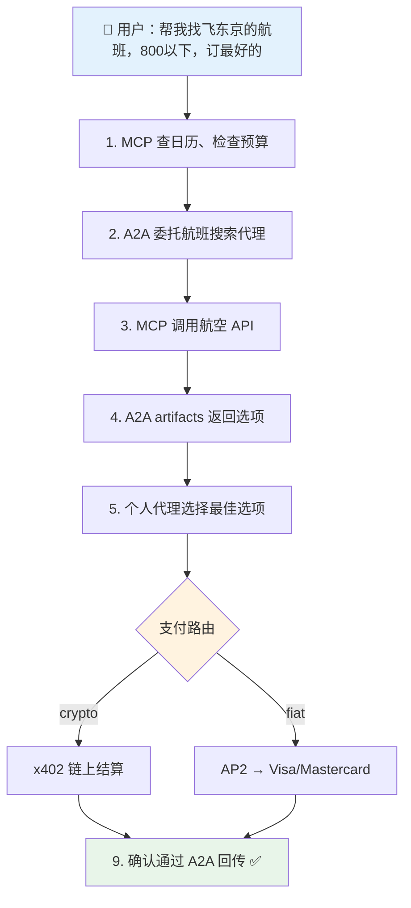

# A2A、AP2、ACP：代理商务协议栈

## 解决什么问题？

AI 代理现在能推理和使用工具（通过 MCP），能为服务付费（通过 x402）。但还有两个关键缺口：

1. **代理间通信**：旅行代理怎么把酒店预订委托给酒店代理？MCP 连接代理和工具，不是代理和代理。
2. **可信商务**：代理代你买东西时，谁证明你授权了？出了问题谁负责？x402 处理微支付但没有授权框架。

Google 的 A2A 和 AP2，加上 OpenAI/Stripe 的 ACP，填补这些缺口。和 MCP、x402 一起组成完整的协议栈。

## 完整协议栈

```
┌─────────────────────────────────────────────────────┐
│                    身份 / 信任                        │
│              ERC-8004（链上声誉）                      │
├─────────────────────────────────────────────────────┤
│                      支付                            │
│  ┌──────────┐  ┌──────────┐  ┌──────────────────┐  │
│  │   x402    │  │   AP2    │  │      ACP         │  │
│  │ 加密微    │  │ 法币 +   │  │ 聊天商务          │  │
│  │ 支付      │  │ 加密     │  │ (Stripe 令牌)    │  │
│  │           │  │ 授权令   │  │                  │  │
│  └──────────┘  └──────────┘  └──────────────────┘  │
├─────────────────────────────────────────────────────┤
│                     协调                             │
│              A2A（代理间协议）                         │
│         任务委托、发现、流式传输                        │
├─────────────────────────────────────────────────────┤
│                    工具访问                           │
│              MCP（模型上下文协议）                      │
│         代理 ↔ API、数据库、工具                       │
└─────────────────────────────────────────────────────┘
```

| 层 | 协议 | 所有者 | 作用 |
|----|------|--------|------|
| 工具访问 | **MCP** | Anthropic | 代理连接工具/API（纵向） |
| 协调 | **A2A** | Google（150+ 合作伙伴） | 代理委托任务给其他代理（横向） |
| 支付（加密） | **x402** | Coinbase/Cloudflare | HTTP 原生稳定币微支付 |
| 支付（授权令） | **AP2** | Google（60+ 合作伙伴） | 加密授权 + 多轨道支付 |
| 支付（商务） | **ACP** | OpenAI/Stripe | 基于聊天的结账 + 共享支付令牌 |
| 身份 | **ERC-8004** | 社区 | 链上代理声誉和质押 |

**关键洞察**：这些是层，不是竞争者。没有 A2A 的 MCP = 孤立的代理。没有 AP2 的 A2A = 能说话但不能付钱的代理。没有 AP2 的 x402 = 没有问责的支付。

## A2A：代理间协议

### 是什么

A2A 是**代理间通信**的开放协议。想象 HTTP，但是代理和代理之间，而不是浏览器和服务器之间。

核心设计原则：**不透明代理**。代理不需要暴露内部（记忆、工具、推理链）来协作。只需发布能力并接受任务。

### 架构

```
客户端代理                                  远程代理
    │                                           │
    │── GET /.well-known/agent-card.json ──────>│
    │<── Agent Card（能力、技能）─────────────────│
    │                                           │
    │── tasks/send (JSON-RPC) ────────────────->│
    │<── Task { status: "working" } ────────────│
    │                                           │
    │── tasks/sendSubscribe (SSE 流) ──────────>│
    │<── TaskStatusUpdate ──────────────────────│
    │<── TaskArtifactUpdate ────────────────────│
    │<── Task { status: "completed" } ──────────│
```

### 核心概念

**Agent Card**（`/.well-known/agent-card.json`）：JSON 文档 — 代理的名片。包含身份、技能、支持的模态、认证要求和服务端点。

```json
{
  "name": "Hotel Booking Agent",
  "description": "Books hotels, manages reservations",
  "url": "https://hotel-agent.example.com",
  "capabilities": { "streaming": true, "pushNotifications": true },
  "skills": [
    { "id": "book-hotel", "name": "Book Hotel", "description": "Search and book hotel rooms" }
  ],
  "securitySchemes": { "oauth2": { "..." } }
}
```

**Task 生命周期**：工作单元，状态机推进。

```
submitted → working → completed
                   → failed
                   → canceled
            working → input-required → working（恢复）
```

**Messages**：任务执行期间的双向通信。支持文本、文件、结构化数据、表单。

**Artifacts**：远程代理产出的交付物 — 文档、图片、数据。

### 传输

- JSON-RPC 2.0 over HTTPS
- 三种模式：同步请求/响应、SSE 流式、异步推送通知（webhooks）
- 认证：API keys、OAuth2、OpenID Connect、mTLS
- 兼容现有 API 网关和企业 SSO

### A2A 解决了 MCP 不能解决的什么

| 维度 | MCP | A2A |
|------|-----|-----|
| 交互 | 代理 → 工具（调用函数） | 代理 → 代理（委托任务） |
| 状态 | 无状态工具调用 | 有状态长期运行任务 |
| 不透明性 | 工具内部通过 schema 暴露 | 代理内部隐藏 |
| 模态 | 结构化输入/输出 | 文本、文件、表单、音频、视频 |
| 发现 | 手动工具配置 | Agent Card 自动发现 |
| 多轮 | 单次请求/响应 | 持续对话 + 状态 |

**汽车修理厂类比**：MCP = 技师使用诊断扫描仪（工具）。A2A = 店长把任务分派给技师（代理）。

## AP2：代理支付协议

### 是什么

Google 的**带加密问责的代理支付**开放协议。核心创新：**授权令（Mandates）** — 加密签名的用户授权证明，创建不可否认的审计轨迹。

AP2 解决了其他协议都不解决的三个问题：
1. **授权**：证明用户确实批准了这次购买
2. **真实性**：证明代理的请求匹配用户的真实意图
3. **问责**：出了问题确定谁负责

### 授权令系统

三种加密凭证：

#### Cart Mandate（人在场）

用户在看着。他们看到购物车，批准，用设备签名。

```json
{
  "id": "cart_abc123",
  "total": { "currency": "USD", "value": 238.00 },
  "items": [{ "sku": "TICKET-001", "qty": 2, "price": 119.00 }],
  "merchant_signature": "sig_merchant_xyz",
  "user_signature": "sig_user_device_key",
  "payment_method_token": "tok_visa_4242",
  "timestamp": "2026-02-19T10:30:00Z"
}
```

用户（硬件密钥）和商家都加密签名。不可否认的证明。

#### Intent Mandate（人不在场）

用户委托未来购买："票一上线就买，每张不超过 $120。"

```json
{
  "natural_language_description": "Buy 2 concert tickets under $120 each",
  "required_refundability": true,
  "intent_expiry": "2026-03-01T00:00:00Z",
  "max_total": { "currency": "USD", "value": 240.00 },
  "user_cart_confirmation_required": false,
  "user_device_signature": "sig_device_key_abc"
}
```

代理在这些边界内行动。如果超出，授权令签名证明代理违反了授权。

#### Payment Mandate（给支付网络的）

向 Visa/Mastercard/发卡行发信号："这笔交易由 AI 代理发起" + 人在场/不在场标志。

### 角色架构

```
┌──────────┐         ┌──────────────┐         ┌──────────────┐
│   用户    │────────>│  购物代理      │────A2A──>│   商家端点    │
│           │ 意图    │  (SA)         │         │              │
└──────────┘         └──────┬───────┘         └──────┬───────┘
                            │                         │
                     ┌──────▼───────┐         ┌──────▼───────┐
                     │ 凭证提供者    │         │  商家支付     │
                     │ (CP)         │         │  处理器       │
                     │ 钱包、卡片   │         │  (MPP)       │
                     │ 令牌化       │         │              │
                     └──────┬───────┘         └──────┬───────┘
                            │                         │
                            └─────────────────────────┘
                                      │
                               ┌──────▼───────┐
                               │  网络/发卡行   │
                               │  (Visa 等)    │
                               └──────────────┘
```

六个角色严格分离职责：

| 角色 | 能看到 | 永远看不到 |
|------|--------|-----------|
| 购物代理 | 产品、价格、购物车 | 支付凭证、PCI 数据 |
| 凭证提供者 | 令牌化的支付方式 | 购物上下文 |
| 商家 | Cart mandate、签名授权 | 原始卡号 |
| 支付处理器 | Payment mandate、交易数据 | 用户完整购物历史 |

**关键**：购物代理永远接触不到原始支付凭证。只拿到令牌化的支付方式。这是核心架构约束。

### AP2 和 x402 怎么连接

AP2 是**支付轨道无关的**。V0.1 支持 "pull" 支付（卡）。未来版本加 "push" 支付 — 包括 x402 稳定币。

```
AP2 Mandate（授权层）
    │
    ├── 传统轨道：Visa/Mastercard/PayPal
    ├── 实时银行转账
    └── x402 稳定币结算 ← 这里
```

AP2 提供**信任和问责**（谁授权了什么）。x402 提供**结算**（即时链上支付）。一起用：
- AP2 Intent Mandate 设定消费限额和规则
- x402 处理每次 API 调用的微支付
- AP2 Payment Mandate 为每笔交易创建审计轨迹
- x402 在 Base/Solana 上结算

Google 有官方 demo 仓库：`google-agentic-commerce/a2a-x402`。

## ACP：代理商务协议

### 是什么

OpenAI 和 Stripe 的**聊天商务**协议。驱动 "ChatGPT Instant Checkout" — 在聊天中直接从 Shopify/Etsy 购买。

### 架构

比 AP2 简单 — 四个角色，不是六个：

| 角色 | 职责 |
|------|------|
| 买家 | 通过 AI 发现产品，授权支付 |
| AI 代理 | 展示产品、收集支付意图、管理结账 |
| 商家 | 接收结账请求，履行订单 |
| 支付提供者 | 发行共享支付令牌，处理收费 |

### 核心流程

```
买家 → "我想要蓝色运动鞋" → 代理
代理 → Create Checkout (SKU) → 商家 ACP 端点
商家 → 购物车 + 定价 → 代理 → 买家审核
买家 → "买吧" → 代理
代理 → 共享支付令牌 → 商家
商家 → Complete Checkout (via Stripe) → 确认
```

**Shared Payment Token**：Stripe 的关键创新。限定范围、限时、限量的令牌，让商家收费但看不到原始卡数据。

### ACP vs AP2

| 维度 | ACP | AP2 |
|------|-----|-----|
| 焦点 | 消费者结账 UX | 企业问责 |
| 复杂度 | 简单（4 角色） | 复杂（6 角色 + 授权令） |
| 认证模型 | 共享支付令牌 | 加密授权令 |
| 支付轨道 | Stripe 优先 | 轨道无关（卡 + 加密 + 银行） |
| 争议模型 | 标准 Stripe 争议 | 基于授权令的加密证据 |
| 今天能用？ | 是（ChatGPT Instant Checkout） | V0.1（仅人在场的卡支付） |
| 合作伙伴 | OpenAI、Stripe、Shopify、Etsy | Google、Mastercard、PayPal、60+ |
| 理念 | "让结账隐形" | "让交易可证明" |

**诚实评价**：ACP **已在生产中运行**，今天就能用。AP2 **架构更严谨** 但大部分还是 V0.1。按时间线选：现在用 ACP，企业级未来用 AP2。

## 所有东西怎么组合

### 代理商务完整流程



> 每一步都有：加密证明 · 审计轨迹 · 消费限额 · 随时可以问人类

### 协议交互矩阵

| 场景 | MCP | A2A | AP2 | ACP | x402 |
|------|-----|-----|-----|-----|------|
| 代理用数据库 | **是** | - | - | - | - |
| 代理委托任务给另一个代理 | - | **是** | - | - | - |
| 代理买东西（消费者） | - | - | - | **是** | - |
| 代理买东西（企业） | - | **是** | **是** | - | - |
| 代理为 API 调用付费 | - | - | - | - | **是** |
| 代理间付费服务 | - | **是** | 可选 | - | **是** |
| 需要争议解决 | - | - | **是** | Stripe | - |
| 多代理工作流 | **是** | **是** | **是** | - | **是** |

### "鲻鱼经济"

**前端（B2C）**：消费者和代理交互，用 ACP（ChatGPT 结账）或 AP2（Google Shopping）。熟悉的支付轨道：Visa、Mastercard、PayPal。受监管、有保险、有退款保护。

**后端（B2B/M2M）**：代理互相为 API 访问、数据、算力通过 x402 付费。即时稳定币结算。无需账户。机器速度、机器量级。

AP2 桥接两个世界：它可以用同一套授权令系统授权法币支付（前端）和 x402 稳定币支付（后端）。

## 权衡与问题

### A2A 问题

| 问题 | 严重性 | 详情 |
|------|--------|------|
| 发现碎片化 | 高 | Agent Card 的 well-known URI 适合公开代理；企业发现需要尚不存在的注册中心 |
| 认证复杂性 | 高 | 不同组织的代理间 OAuth2/mTLS 配置不简单 |
| 无经济层 | 中 | A2A 没有支付概念 — 需要 AP2/x402 叠加 |
| Google 主导 | 中 | 150+ 合作伙伴，但 Google 控制规范。Web3 中心化模式重演？ |

### AP2 问题

| 问题 | 严重性 | 详情 |
|------|--------|------|
| 仅 V0.1 | 致命 | 只有人在场的卡支付能用。自主 + 加密 = "计划中" |
| 授权令 UX | 高 | 用户必须签加密授权令。目前这个 UX 很糟糕 |
| 6 角色复杂度 | 高 | Cart Mandate → CP → Payment Mandate → 处理器 → 网络。集成点太多 |
| 白名单引导 | 高 | 短期信任靠手动白名单。无法扩展 |
| 无微支付方案 | 中 | AP2 授权令对 $0.001 的 API 调用太重。x402 更适合 |

### ACP 问题

| 问题 | 严重性 | 详情 |
|------|--------|------|
| Stripe 锁定 | 高 | "开放标准" 但共享支付令牌 = Stripe 优先 |
| 仅消费者 | 高 | 无企业审计轨迹，无加密授权令 |
| ChatGPT 中心 | 中 | 驱动 ChatGPT Instant Checkout。其他代理需自建 UX |
| 支付轨道有限 | 中 | 通过 Stripe 的信用卡/借记卡。无银行转账、无加密（暂时） |

### 元问题：标准太多

```
MCP + A2A + AP2 + ACP + x402 + ERC-8004 = 6 个协议
```

一次商务交易可能需要：MCP（工具）→ A2A（委托）→ AP2（授权）→ x402（结算）。4 层协议。集成复杂度是真的。

## 可偷的模式

| 模式 | 内容 | 为什么重要 |
|------|------|-----------|
| Agent Card 发现 | `/.well-known/agent-card.json` | 标准代理能力广告 — 即使不用 A2A 也有用 |
| Task 状态机 | submitted → working → input-required → completed | 任何长期运行代理交互的清洁生命周期模型 |
| 授权令系统 | 用户授权的加密证明 | 任何自主代理行动的问责，不只是支付 |
| 角色分离 | 代理 ≠ 支付处理 ≠ 凭证存储 | 永远不让 LLM 看到原始凭证 |
| 共享支付令牌 | 限范围、限时、限量 | 支付权限的安全委托 |
| 支付轨道抽象 | AP2 授权令 → 多种结算方式 | 将授权和结算解耦 |

## 时间线与成熟度

| 协议 | 状态 | 生产就绪？ |
|------|------|-----------|
| MCP | 稳定，广泛采用 | 是 |
| A2A | V0.2+，150+ 合作伙伴 | 是（基础），持续演进 |
| x402 | V2，1 亿+ 支付 | 是 |
| ACP | Beta，有版本化规范 | 是（ChatGPT 结账） |
| AP2 | V0.1，60+ 合作伙伴 | 部分（仅人在场卡支付） |
| ERC-8004 | 草案 | 否 |

## 最新动态 (2026)

### A2A v0.3：gRPC、签名 Agent Card 与企业采用

Google 发布 A2A 协议 v0.3，新增三项重要功能：**gRPC 传输支持**、**签名 Agent Card** 和**扩展的 Python SDK**（集成 Google Agent Development Kit / ADK）。gRPC 支持意味着代理现在可以通过高性能 RPC 通信，不仅限于 JSON-RPC over HTTPS — 对延迟敏感的企业部署至关重要。签名 Agent Card 允许在建立通信前对代理身份进行加密验证，解决了早期版本的认证缺口。生态系统已扩展到**超过 150 个合作组织**，覆盖所有主要云服务商。

### 微软全面接入 A2A

微软承诺在 **Azure AI Foundry** 和 **Copilot Studio** 中全面支持 A2A。企业客户现在可以构建跨合作伙伴工具和生产基础设施的多代理工作流，Copilot Studio 代理能够调用托管在微软之外的外部代理。AWS 紧随其后，在 **Amazon Bedrock AgentCore Runtime** 中原生支持 A2A。这种跨云采用实际上使 A2A 成为代理间通信的事实标准 — 不再只是 Google 的项目。

### Google 推出通用商务协议（UCP）

2026 年 1 月，Google 和 Shopify 联合推出**通用商务协议（UCP）** — 一个位于现有协议栈之上的开源标准。UCP 通过单一抽象层标准化完整的商务旅程（发现、考虑、购买、订单管理）。它明确设计为**兼容 AP2、A2A 和 MCP**，通过 REST、MCP、AP2 或 A2A 传输提供灵活集成。超过 20 个合作伙伴支持了发布，包括 Shopify、Etsy、Wayfair、Target 和 Walmart。Google 界面上的原生结账（搜索 AI 模式、Gemini）正在推出，这意味着 Shopify 商家可以直接在 AI 对话中销售。

### ACP 上线生产：ChatGPT Instant Checkout

2026 年 2 月 16 日，OpenAI 推出 **"Buy it in ChatGPT"** — 由 ACP 驱动的即时结账。美国 ChatGPT Plus、Pro 和 Free 用户现在可以直接在聊天中从 Etsy 卖家购买，**超过 100 万 Shopify 商家**（Glossier、SKIMS、Spanx、Vuori）正在接入流程中。凭借每周 8-9 亿活跃用户和每天约 5000 万购物查询，ChatGPT 一夜之间成为最大的 AI 原生商务渠道。ACP 规范快速迭代了四个版本：初始发布（2025-09-29）、履行增强（2025-12-12）、能力协商（2026-01-16）、扩展/折扣/支付处理器（2026-01-30）。Shopify 商家为 ChatGPT Checkout 销售支付 4% 费用。

### AP2 扩展到稳定币和实时银行转账

AP2 现在明确支持**稳定币和实时银行转账**，不仅限于信用卡/借记卡。Google 与 Coinbase 合作创建了用于 web3 支付的 **A2A x402 扩展**。协议保持核心授权令系统（Cart、Intent、Payment），但支付轨道选项大幅扩展。60+ 合作伙伴生态现在包括 Adyen、American Express、Ant International、Coinbase、Etsy、Intuit、JCB、Mastercard、Mysten Labs、PayPal、Revolut、Salesforce、ServiceNow、UnionPay International 和 Worldpay。

### UCP vs ACP：Google 和 OpenAI 的商务愿景之争

协议格局现在有了更清晰的竞争分野。**Google 的协议栈**（UCP + AP2 + A2A）旨在成为跨所有 AI 界面的通用商务层 — Google 搜索 AI 模式、Gemini 和第三方代理。**OpenAI 的协议栈**（ACP + Stripe）专注于 ChatGPT 作为主要商务渠道，采用更简单的集成模型。关键区别：UCP 传输无关，跨多个代理协议工作；ACP 与 ChatGPT 结账 UX 紧密耦合。对商家来说，实际问题是整合 UCP（覆盖更广、更复杂）还是 ACP（更简单、目前仅限 ChatGPT）— 或者两者都做。

### 更新后的成熟度评估

| 协议 | 状态（2026 年 2 月） | 生产就绪？ |
|------|---------------------|-----------|
| MCP | 稳定，Azure GA 支持 | 是 |
| A2A | V0.3，gRPC + 签名卡，AWS/Azure/GCP | 是 |
| x402 | V2，1 亿+ 支付 | 是 |
| ACP | V4（2026-01-30），ChatGPT Checkout 上线 | 是 |
| AP2 | V0.1+，新增稳定币支持 | 部分（扩展中） |
| UCP | V1，2026 年 1 月推出 | 是（Google 界面） |
| ERC-8004 | 草案 | 否 |

## 结论

**今天真实可用的**：MCP（工具）+ x402（微支付）+ ACP（消费者结账）在生产中运行。A2A 基本代理委托可用。

**即将到来的**：AP2 自主授权令、AP2 + x402 集成、ACP 扩展到 ChatGPT 之外。

**诚实评估**：我们有太多协议，生产实现不够多。协议栈*在架构上合理* — 每层解决真实问题。但集成复杂度高，大部分还是 V0.1。

**应该构建的**：如果你今天在构建代理，用 MCP + x402 处理工具访问和微支付。需要多代理委托就加 A2A。观望 AP2 但别在 V1.x 之前押注。做消费者商务就在 ChatGPT 上用 ACP。

**$5T 问题**：McKinsey 预测 2030 年代理交易量 $3-5T。不管这些特定协议是赢还是被整合/替换，它们建立的*模式*（基于授权令的授权、支付轨道抽象、代理发现、角色分离）会持续下去。学模式，不只学 API。

## References

### A2A（代理间协议）

- [A2A Official Spec](https://a2a-protocol.org/latest/specification/) — 完整协议规范：Agent Cards、任务、JSON-RPC、流式传输
- [A2A and MCP Comparison — Official](https://a2a-protocol.org/latest/topics/a2a-and-mcp/) — A2A 如何补充 MCP
- [Announcing A2A — Google Developers Blog](https://developers.googleblog.com/en/a2a-a-new-era-of-agent-interoperability/) — 原始公告
- [A2A Protocol Upgrade — Google Cloud Blog](https://cloud.google.com/blog/products/ai-machine-learning/agent2agent-protocol-is-getting-an-upgrade) — V0.2+ 变更
- [a2aproject/A2A — GitHub](https://github.com/a2aproject/A2A) — 参考实现（Python、Go、JS、Java、.NET）
- [What Is A2A? — IBM](https://www.ibm.com/think/topics/agent2agent-protocol) — 企业视角
- [A2A Protocol Architecture — Cybage](https://www.cybage.com/blog/mastering-google-s-a2a-protocol-the-complete-guide-to-agent-to-agent-communication) — 实现指南
- [Agent Discovery — A2A Docs](https://a2a-protocol.org/latest/topics/agent-discovery/) — Agent Card 发现模式
- [A2A on AWS Bedrock](https://docs.aws.amazon.com/bedrock-agentcore/latest/devguide/runtime-a2a-protocol-contract.html) — AWS 实现
- [A2A v0.3 Spec](https://a2a-protocol.org/v0.3.0/specification/) — V0.3 规范，含 gRPC 支持
- [A2A gRPC Native Transport — gRPConf India](https://tldrecap.tech/posts/2025/grpconf-india/grpc-agent-mesh/) — gRPC 作为 A2A 和 MCP 的原生传输
- [Google Upgrades A2A with gRPC — InfoWorld](https://www.infoworld.com/article/4032776/google-upgrades-agent2agent-protocol-with-grpc-and-enterprise-grade-security.html) — V0.3 企业安全升级
- [Microsoft Adopts A2A — Microsoft Cloud Blog](https://www.microsoft.com/en-us/microsoft-cloud/blog/2025/05/07/empowering-multi-agent-apps-with-the-open-agent2agent-a2a-protocol/) — Azure AI Foundry + Copilot Studio 集成
- [AWS A2A in Bedrock AgentCore](https://aws.amazon.com/blogs/machine-learning/introducing-agent-to-agent-protocol-support-in-amazon-bedrock-agentcore-runtime/) — AWS 原生 A2A 支持

### AP2（代理支付协议）

- [AP2 Official Site](https://ap2-protocol.org/) — 协议文档
- [AP2 Specification](https://ap2-protocol.org/specification/) — 完整规范：角色、授权令、支付流程
- [AP2 and x402 — Official](https://ap2-protocol.org/topics/ap2-and-x402/) — AP2 和 x402 如何集成
- [Announcing AP2 — Google Cloud Blog](https://cloud.google.com/blog/products/ai-machine-learning/announcing-agents-to-payments-ap2-protocol) — 原始公告
- [google-agentic-commerce/AP2 — GitHub](https://github.com/google-agentic-commerce/AP2) — 规范源码
- [google-agentic-commerce/a2a-x402 — GitHub](https://github.com/google-agentic-commerce/a2a-x402/) — A2A + x402 集成演示
- [AP2 Illustrated Guide](https://arthurchiao.art/blog/ap2-illustrated-guide/) — 可视化指南
- [AP2 Builder Guide — Colin McNamara](https://colinmcnamara.com/blog/understanding-a2a-ap2-protocols-builder-guide) — 实用实现指南含代码
- [AP2 and Crypto Payments — Bitwage](https://bitwage.com/en-us/blog/agent-payments-protocol-ap2-and-crypto-payments) — 加密支付集成视角
- [AP2 Lightspark Vision](https://www.lightspark.com/news/insights/agent-payments-protocol) — 闪电网络视角

### ACP（代理商务协议）

- [ACP Official — OpenAI](https://developers.openai.com/commerce/) — 开发者门户
- [ACP Getting Started — OpenAI](https://developers.openai.com/commerce/guides/get-started/) — 实现指南
- [ACP Specification — Stripe](https://docs.stripe.com/agentic-commerce/protocol/specification) — 结账端点规范
- [Developing ACP — Stripe Blog](https://stripe.com/blog/developing-an-open-standard-for-agentic-commerce) — Stripe 的视角
- [ACP GitHub](https://github.com/agentic-commerce-protocol/agentic-commerce-protocol) — 开源规范（Apache 2.0）
- [agenticcommerce.dev](https://www.agenticcommerce.dev/) — 社区站点
- [ChatGPT Instant Checkout Retailer Guide — Ekamoira](https://www.ekamoira.com/blog/chatgpt-instant-checkout-agentic-commerce-protocol-2026) — 商家实现指南
- [Buy it in ChatGPT — OpenAI](https://openai.com/index/buy-it-in-chatgpt/) — Instant Checkout 发布公告
- [Shopify x OpenAI Commerce](https://www.shopify.com/news/shopify-open-ai-commerce) — Shopify ChatGPT 集成
- [OpenAI Expands Agentic Commerce — Digital Commerce 360](https://www.digitalcommerce360.com/2026/02/16/openai-expands-agentic-commerce-push/) — 2026 年 2 月扩展报道
- [Shopify 4% Fee on ChatGPT Sales — PYMNTS](https://www.pymnts.com/news/ecommerce/2026/shopify-merchants-to-pay-4percent-fee-on-sales-made-through-chatgpt-checkout/) — 商家费用结构

### UCP（通用商务协议）

- [UCP Official Site](https://ucp.dev/) — 协议文档
- [UCP Under the Hood — Google Developers Blog](https://developers.googleblog.com/under-the-hood-universal-commerce-protocol-ucp/) — 技术深度解析
- [Google UCP Developer Guide](https://developers.google.com/merchant/ucp) — 商家集成指南
- [Building UCP — Shopify Engineering](https://shopify.engineering/ucp) — Shopify 工程视角
- [Google Announces UCP — TechCrunch](https://techcrunch.com/2026/01/11/google-announces-a-new-protocol-to-facilitate-commerce-using-ai-agents/) — 发布报道
- [Google UCP Powers Agentic Shopping — InfoQ](https://www.infoq.com/news/2026/01/google-ucp/) — 技术分析
- [Shopify Agentic Commerce Platform](https://www.shopify.com/news/ai-commerce-at-scale) — Shopify 代理商务愿景
- [Google Agentic Commerce Tools — Google Blog](https://blog.google/products/ads-commerce/agentic-commerce-ai-tools-protocol-retailers-platforms/) — 零售商工具和协议

### 协议比较

- [MCP, A2A, AP2, ACP, x402 & ERC-8004 — PayRam](https://payram.com/blog/mcp-a2a-ap2-acp-x402-erc-8004) — 完整 6 协议栈比较
- [Top 6 Agent-Native Rails — MarkTechPost](https://www.marktechpost.com/2025/11/14/comparing-the-top-6-agent-native-rails-for-the-agentic-internet-mcp-a2a-ap2-acp-x402-and-kite/) — MCP、A2A、AP2、ACP、x402、Kite 比较
- [Agentic Payments: ACP, AP2, x402 — Orium](https://orium.com/blog/agentic-payments-acp-ap2-x402) — 支付协议比较
- [AP2 vs ACP — Grid Dynamics](https://www.griddynamics.com/blog/agentic-payments) — 企业分析
- [A2A, MCP, AP2 Stack — Medium](https://medium.com/@leomofthings/a2a-mcp-and-ap2-the-protocol-stack-powering-agentic-ai-commerce-ca2eed7ba079) — 协议栈架构
- [x402 vs AP2 Comparative Study — Medium](https://medium.com/@gwrx2005/ai-agents-and-autonomous-payments-a-comparative-study-of-x402-and-ap2-protocols-e71b572d9838) — 正面比较分析
- [MCP vs A2A — Composio](https://composio.dev/blog/mcp-vs-a2a-everything-you-need-to-know) — 详细比较
- [MCP vs A2A — Auth0](https://auth0.com/blog/mcp-vs-a2a/) — 安全聚焦比较
- [MCP, ACP, A2A — WorkOS](https://workos.com/guide/understanding-mcp-acp-a2a) — 企业指南
- [OpenAI ACP vs Google UCP — Checkout.com](https://www.checkout.com/blog/openai-acp-google-ucp-difference) — ACP vs UCP 比较

### 行业背景

- [AP2 Analysis — Everest Group](https://www.everestgrp.com/googles-agent-payments-protocol-ap2-a-new-chapter-in-agentic-commerce-blog/) — 分析师视角
- [AP2 Impact on Shopping — Loeb & Loeb](https://quicktakes.loeb.com/post/102lq21/the-rise-of-agentic-commerce-what-googles-ap2-protocol-means-for-shopping-and-m) — 法律/营销视角
- [MultiversX Agentic Commerce Stack](https://multiversx.com/blog/the-multiversx-universal-agentic-commerce-stack) — 区块链平台实现
- [A2A Purchasing Concierge — Google Codelabs](https://codelabs.developers.google.com/intro-a2a-purchasing-concierge) — 实操教程
- [Sundar Pichai NRF 2026 Remarks — Google Blog](https://blog.google/company-news/inside-google/message-ceo/nrf-2026-remarks/) — Google CEO 代理商务愿景
- [Agentic Frameworks 2026: What Works in Production — Zircon](https://zircon.tech/blog/agentic-frameworks-in-2026-what-actually-works-in-production/) — 生产就绪评估
