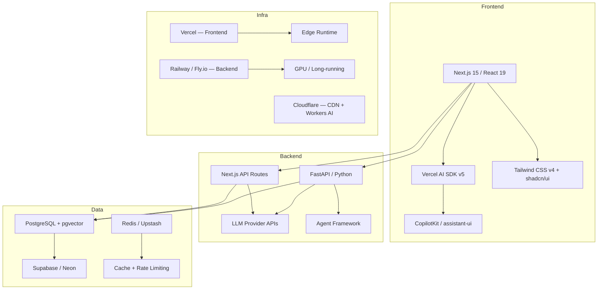
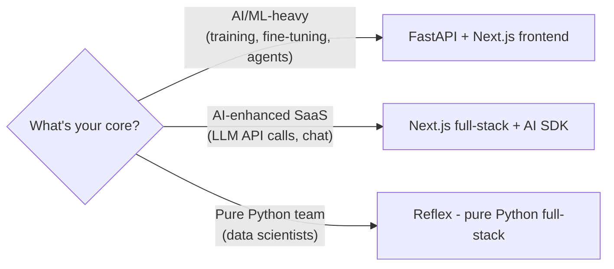
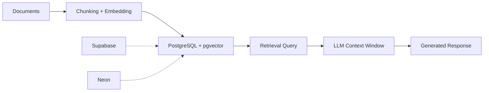
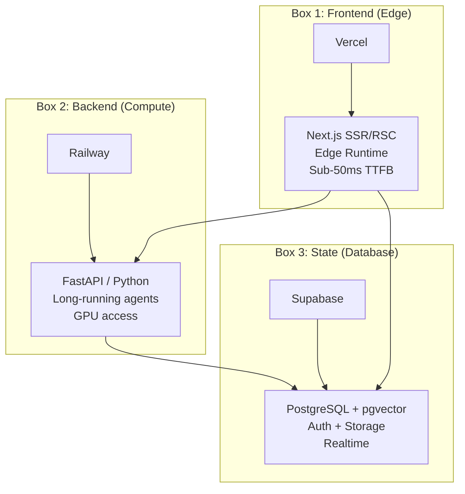

# AI Startup Full-Stack Tech Stack 2026: The Complete Selection Guide

## What

A comprehensive analysis of every layer of the technology stack needed to build an AI-first startup in 2026 — from frontend frameworks to deployment infrastructure, from LLM integration to agent orchestration.

## Why This Matters

2026 is the inflection point. The "AI wrapper" era is over. AI startups now need:
- **Streaming-first UIs** — users expect real-time token streaming, not loading spinners
- **Agent orchestration** — single-shot LLM calls are table stakes; multi-agent workflows are the differentiator
- **AI-native databases** — vector search is no longer optional, it's a column type in Postgres
- **Edge deployment** — latency kills AI UX; edge computing is mandatory

The wrong tech stack in 2026 means 3-6 months of migration debt. The right one means shipping in weeks.

---

## The Stack at a Glance



---

## Layer 1: Frontend

### The Winner: Next.js 15 + React 19

Next.js dominates AI startup frontends in 2026. Not because it's trendy — because it solves real AI-specific problems:

| Feature | Why It Matters for AI |
|---------|----------------------|
| React Server Components | Stream LLM responses server-side, reduce client JS bundle |
| Server Actions | Direct server mutations without API boilerplate |
| App Router + Streaming | Native `Suspense` boundaries for progressive AI response rendering |
| Edge Runtime | Sub-50ms TTFB for AI interfaces globally |
| API Routes | Lightweight backend endpoints for LLM proxying |

**React 19 specifics that matter:**
- `use()` hook — read async resources (LLM responses) directly in render
- Server Components — zero client-side JS for non-interactive parts
- Actions — form submissions that call server functions, perfect for AI chat inputs

### Alternatives Comparison

| Framework | Best For | AI Suitability | Ecosystem |
|-----------|----------|---------------|-----------|
| **Next.js 15** | Full-stack AI apps | Excellent — AI SDK, RSC streaming | Massive |
| **Remix** | Form-heavy, web-standard apps | Good — SSR, but no AI SDK | Growing |
| **SvelteKit** | Performance-critical SPAs | Decent — AI SDK v5 support added | Smaller |
| **Nuxt 4** | Vue ecosystem | Decent — AI SDK v5 support added | Moderate |
| **Astro** | Content-heavy sites | Poor — not designed for dynamic AI UIs | Niche |

**Verdict:** Unless you have strong Vue/Svelte expertise on the team, Next.js is the default. The AI SDK integration alone saves weeks of streaming infrastructure work.

### UI Layer: Tailwind CSS v4 + shadcn/ui

This combination is the 2026 consensus for AI startups:

- **Tailwind v4** — CSS-first config, native cascade layers, Lightning CSS engine (100x faster builds)
- **shadcn/ui** — copy-paste components, full ownership, no dependency lock-in
- **Why not Material UI / Ant Design?** — too opinionated, harder for AI code generators to work with. Tailwind classes are the lingua franca of AI coding tools (Cursor, v0, Bolt all generate Tailwind natively)

### AI-Specific Frontend: Generative UI

The 2026 frontier — AI agents that render UI components, not just text:

| Library | What It Does | Stars | Maturity |
|---------|-------------|-------|----------|
| **CopilotKit** | In-app AI copilots, Generative UI, AG-UI protocol | 28K+ | Production |
| **assistant-ui** | Chat UI components, tool rendering, streaming | 5K+ | Production |
| **Vercel AI SDK v5** | `streamUI()` — stream React components from server | Core SDK | Production |
| **Thesys/Crayon** | Rapid Generative UI prototyping | Newer | Early |

**CopilotKit** is the frontrunner — it provides:
- `<CopilotChat>` — drop-in chat with tool call rendering
- `useCopilotAction()` — let agents trigger frontend actions
- AG-UI protocol — agent-to-UI communication standard
- Works with LangGraph, CrewAI, OpenAI Agents SDK backends

---

## Layer 2: Backend

### Decision Matrix: Python vs TypeScript

This is the most important backend decision for an AI startup:

| Factor | Python (FastAPI) | TypeScript (Next.js API / NestJS) |
|--------|-----------------|-----------------------------------|
| **ML/AI ecosystem** | Dominant — PyTorch, HuggingFace, LangChain, all Python-first | Catching up — AI SDK, LangChain.js exist |
| **LLM integration** | Native — every provider has a Python SDK | Good — AI SDK unifies 25+ providers |
| **Performance** | Async FastAPI ≈ Node.js for I/O | Slightly faster for pure API serving |
| **Hiring** | Larger ML talent pool | Larger full-stack talent pool |
| **Full-stack simplicity** | Separate frontend needed | Monorepo with Next.js |
| **Agent frameworks** | LangGraph, CrewAI, AutoGen — all Python-first | LangGraph.js exists but lags |
| **Fine-tuning / training** | Required — Python only | Not possible |

### Recommendation by Startup Type



### Path A: FastAPI (Python Backend)

**When:** Your product's core value is in AI/ML, you need agent orchestration, or you plan to fine-tune models.

```
FastAPI 0.115+
├── Pydantic v2 — data validation + serialization (2-5x faster than v1)
├── async/await — native async for LLM API calls
├── Dependency Injection — clean service layer
├── Auto-docs — Swagger UI out of the box
└── Streaming — StreamingResponse for SSE
```

FastAPI is the fastest-growing Python backend framework in 2026. Key advantages:
- Built on Starlette (ASGI) — handles thousands of concurrent LLM requests
- Pydantic v2 — Rust-powered validation, 5x faster than v1
- First-class async — `await openai.chat.completions.create()` without blocking
- Auto OpenAPI docs — your LLM integration API is self-documenting

### Path B: Next.js Full-Stack (TypeScript)

**When:** You're building an AI-enhanced SaaS where the AI is a feature, not the product. Or when you want maximum shipping speed with a small team.

```
Next.js 15 (App Router)
├── API Routes → /api/chat/route.ts (AI SDK streamText)
├── Server Actions → direct DB mutations
├── RSC → stream AI responses as React components
└── Middleware → auth, rate limiting at edge
```

The **Vercel AI SDK v5** is the key enabler:
- `streamText()` / `streamObject()` / `streamUI()` — unified streaming primitives
- 25+ provider adapters (OpenAI, Anthropic, Google, Mistral, Groq...)
- `useChat()` hook — complete chat state management in one hook
- Type-safe tool calling — define tools with Zod schemas, get typed results
- Framework-agnostic — React, Vue, Svelte, Angular all supported

### Path C: Reflex (Pure Python Full-Stack)

**When:** Your team is all Python (data scientists/ML engineers), and you need internal tools or dashboards without hiring frontend devs.

- Write frontend + backend in pure Python
- Compiles to React + FastAPI under the hood
- 60+ built-in components
- Reflex Cloud for deployment
- Tradeoff: less control over frontend, smaller ecosystem

---

## Layer 3: AI / LLM Integration

### LLM Provider Selection

| Provider | Best Model (Feb 2026) | Strength | Pricing (input/output per 1M tokens) |
|----------|----------------------|----------|---------------------------------------|
| **Anthropic** | Claude Opus 4.6 | SWE-bench #1 (80.8%), best coding | $15 / $75 |
| **OpenAI** | GPT-5.3-Codex | Terminal-bench #1, speed | $10 / $30 |
| **Google** | Gemini 2.5 Pro | 1M context, multimodal | $1.25 / $10 |
| **Groq** | Llama 3.3 70B | Speed — 800+ tok/s | $0.59 / $0.79 |
| **Mistral** | Large 2 | European compliance, open-weight | $2 / $6 |

**2026 consensus:** Don't lock into one provider. Use Vercel AI SDK or LiteLLM as an abstraction layer, swap models per use case.

### Agent Orchestration Frameworks

This is where 2026 diverges sharply from 2025. Single LLM calls are commoditized — agent systems are the differentiator:

| Framework | Language | Best For | Production Readiness |
|-----------|----------|----------|---------------------|
| **LangGraph** | Python/JS | Complex stateful workflows, cycles | High — 47M+ PyPI downloads |
| **OpenAI Agents SDK** | Python | Simple agent chains, lowest friction | High — native tool calling |
| **CrewAI** | Python | Multi-agent collaboration | Medium — fast-growing |
| **AutoGen** | Python | Research, multi-agent debates | Medium — Microsoft-backed |
| **Anthropic Agent SDK** | Python | Claude-native orchestration | Emerging |
| **Vercel AI SDK** | TypeScript | Frontend-integrated agents | High — streamUI + tools |

**LangGraph** is the production standard for complex agent systems:
- Graph-based state machines with cycles
- Built-in persistence (checkpointing)
- Human-in-the-loop patterns
- LangSmith observability
- Lowest latency + token usage in benchmarks

**But:** For simple use cases (single agent + tools), the OpenAI Agents SDK or Vercel AI SDK is simpler and sufficient.

### RAG Architecture

Every AI startup needs retrieval-augmented generation. The 2026 stack:



**Key 2026 shift:** Dedicated vector databases (Pinecone, Weaviate, Qdrant) are losing ground to PostgreSQL + pgvector. Why?
- One database for everything (relational + vector)
- Supabase/Neon offer pgvector out of the box
- pgvector performance is now within 10-20% of dedicated solutions
- HNSW indexing supports millions of vectors
- Simpler ops — no separate vector DB to manage

**When you DO need a dedicated vector DB:** >10M vectors, sub-10ms latency requirements, or specialized features (hybrid search, multi-tenancy).

---

## Layer 4: Database & State

### The Default: PostgreSQL (via Supabase or Neon)

PostgreSQL is the undisputed database for AI startups in 2026:

| Feature | Supabase | Neon |
|---------|----------|------|
| **Core** | Postgres + Auth + Storage + Realtime + Edge Functions | Serverless Postgres with branching |
| **pgvector** | Built-in, optimized | Built-in |
| **Auth** | Built-in (email, OAuth, magic link) | BYO (Clerk, etc.) |
| **Realtime** | WebSocket subscriptions | Not built-in |
| **Edge Functions** | Deno-based | Not included |
| **Pricing** | Free tier (500MB), $25/mo Pro | Free tier (512MB), $19/mo Scale |
| **AI Integration** | pgvector + AI toolkit + embedding generation | pgvector |
| **Valuation** | $5B (2026), $70M ARR, 4M developers | $1B+ |
| **Best For** | Full BaaS replacement (Firebase alternative) | Serverless Postgres with git-like branching |

**Supabase is the 2026 default for AI startups** because it eliminates 3-4 separate services:
- Database → Postgres
- Auth → Supabase Auth (replaces Clerk/Auth0 for many cases)
- File Storage → Supabase Storage (replaces S3)
- Realtime → WebSocket subscriptions
- Vector Search → pgvector (replaces Pinecone)
- Edge Functions → Deno runtime (replaces some serverless needs)

### Cache Layer

| Service | Best For | Pricing |
|---------|----------|---------|
| **Upstash Redis** | Rate limiting, caching, session store | Free tier, $0.2/100K commands |
| **Vercel KV** | Same, but tighter Vercel integration | Based on Upstash |
| **Cloudflare KV** | Global edge cache | Free tier included |

---

## Layer 5: Auth & Payments

### Authentication

| Solution | Best For | Pricing | AI Features |
|----------|----------|---------|-------------|
| **Clerk** | Best DX, pre-built components | Free <10K MAU, $25/mo+ | Clerk Skills for AI agents |
| **Supabase Auth** | Already using Supabase | Included | Basic |
| **Better Auth** | Self-hosted, open-source | Free | None |
| **Auth.js (NextAuth)** | DIY, maximum control | Free | None |

**2026 trend:** Clerk dominates the "just works" auth space. Supabase Auth is "good enough" if you're already on Supabase. Better Auth is rising fast for teams that want self-hosted.

### Payments

| Solution | Best For | Fee |
|----------|----------|-----|
| **Stripe** | Everything — subscriptions, usage-based, one-time | 2.9% + $0.30 |
| **Stripe + ACP** | AI agent commerce (ChatGPT Instant Checkout) | 2.9% + 4% OpenAI |
| **Lemon Squeezy** | Digital products, simpler than Stripe | 5% + $0.50 |
| **Polar** | Open-source monetization | 4% |

**Stripe remains the only serious choice** for AI SaaS in 2026. Usage-based billing (per API call, per token) is the dominant pricing model for AI products, and Stripe's metered billing handles this natively.

---

## Layer 6: Deployment & Infrastructure

### The Three-Box Model

2026 consensus: split your deployment into three concerns:



### Platform Comparison

| Platform | Best For | Pricing | Limits |
|----------|----------|---------|--------|
| **Vercel** | Next.js frontend, AI SDK streaming | Free tier, $20/mo Pro | 4GB memory, 800s execution |
| **Railway** | Python backends, long-running agents, Docker | $5/mo + usage | No GPU yet |
| **Fly.io** | Global edge containers, WebSockets | $0/mo hobby, usage-based | GPU available |
| **Render** | Simple Docker deploys | Free tier, $7/mo+ | No GPU |
| **Cloudflare** | Edge compute, Workers AI, CDN | Free tier generous | Workers: 128MB memory |
| **Modal** | GPU workloads, ML inference | Pay-per-use | GPU-focused |
| **Replicate** | Model hosting, serverless GPU | Pay-per-prediction | Model serving only |

### Recommended Deployment by Startup Stage

| Stage | Frontend | Backend | Database | Cost/mo |
|-------|----------|---------|----------|---------|
| **MVP (0-100 users)** | Vercel Free | Vercel API Routes | Supabase Free | $0-20 |
| **Growth (100-10K)** | Vercel Pro | Railway | Supabase Pro | $50-200 |
| **Scale (10K+)** | Vercel Enterprise | Railway / AWS | Supabase / RDS | $500+ |

---

## Layer 7: AI-Assisted Development (Meta-Layer)

### Vibe Coding Tools

The tools you use to BUILD your AI startup are themselves AI-powered:

| Tool | Best For | Price | Strength |
|------|----------|-------|----------|
| **Cursor** | Day-to-day coding in existing codebase | $20/mo Pro | Codebase context, multi-file edits |
| **Claude Code** | Complex architecture, multi-agent teams | $200/mo (Max) | Deep reasoning, Agent Teams |
| **Codex CLI** | Parallel execution, CI automation | API pricing | 10-20 agents in parallel |
| **v0** | React/Next.js component generation | Free tier | shadcn/ui native output |
| **Bolt.new** | Full-stack scaffolding, debugging | $20/mo | Full-stack context awareness |
| **Lovable** | Non-technical founder prototyping | $20/mo | Best visual output quality |

**2026 optimal workflow:**
1. **Lovable / v0** → rapid prototyping and design validation
2. **Cursor** → daily development with codebase context
3. **Claude Code** → complex features, multi-file refactoring
4. **Codex** → parallel task execution, CI integration

---

## Recommended Stacks by Scenario

### Scenario 1: AI SaaS (ChatGPT-like product)

> Building a chat-based AI product (customer support bot, writing assistant, code helper)

```
Frontend:  Next.js 15 + Tailwind v4 + shadcn/ui + AI SDK v5 useChat()
Backend:   Next.js API Routes (simple) OR FastAPI (complex agents)
AI:        Vercel AI SDK + multi-provider (Claude/GPT/Gemini)
Database:  Supabase (Postgres + pgvector + Auth)
Auth:      Supabase Auth OR Clerk
Payments:  Stripe (usage-based metered billing)
Deploy:    Vercel (frontend) + Railway (if separate backend)
```

### Scenario 2: AI Agent Platform

> Building a multi-agent system (autonomous workflows, agent marketplace)

```
Frontend:  Next.js 15 + CopilotKit + AG-UI protocol
Backend:   FastAPI + LangGraph (agent orchestration)
AI:        LangGraph + LangSmith (observability)
Database:  Supabase (state) + Redis/Upstash (agent message queues)
Auth:      Clerk (user) + API keys (agents)
Payments:  Stripe + x402 (agent-to-agent payments)
Deploy:    Vercel (frontend) + Railway (agents) + Modal (GPU inference)
```

### Scenario 3: AI-Enhanced Vertical SaaS

> Adding AI to an existing vertical (legal, healthcare, finance)

```
Frontend:  Next.js 15 + Tailwind + domain-specific components
Backend:   FastAPI + RAG pipeline
AI:        LangChain/LlamaIndex + fine-tuned model
Database:  Supabase (Postgres + pgvector for RAG)
Auth:      Clerk (SSO for enterprise)
Payments:  Stripe (seat-based + usage-based hybrid)
Deploy:    Vercel + Railway + Replicate (model hosting)
```

### Scenario 4: Pure Python Team (Data Science Background)

> ML engineers building a product without frontend expertise

```
Frontend:  Reflex (pure Python → compiles to React)
Backend:   Reflex (compiles to FastAPI)
AI:        Native Python (LangGraph, HuggingFace, PyTorch)
Database:  Supabase or Neon (pgvector)
Auth:      Supabase Auth
Payments:  Stripe
Deploy:    Reflex Cloud or Railway
```

---

## The Non-Obvious Insights

### 1. "AI SDK > Raw API Calls" Is Now Consensus

In 2025, many teams called OpenAI/Anthropic APIs directly. In 2026, abstraction layers are mandatory:
- **Vercel AI SDK** — if your frontend is TypeScript
- **LiteLLM** — if your backend is Python and you want provider-agnostic routing
- **LangChain** — if you need agent chains, not just completions

Direct API calls = vendor lock-in + reimplementing streaming/retry/fallback logic.

### 2. Supabase Is Eating Multiple Categories

Supabase at $5B valuation is replacing 4-5 separate services for most AI startups. The "unbundled" approach (separate auth + DB + storage + vector DB + realtime) is losing to "bundled Postgres-for-everything."

### 3. Agent Frameworks Are the New Backend Frameworks

The 2024 question was "Django or Express?" The 2026 question is "LangGraph or CrewAI?" Agent orchestration is becoming the core backend concern for AI products.

### 4. Edge Deployment Is AI-Specific

AI UIs feel sluggish because of compounding latencies: user → edge → origin → LLM API → origin → edge → user. Edge deployment (Vercel Edge, Cloudflare Workers) cuts 2 hops, reducing perceived latency by 40-60%.

### 5. Vibe Coding Changed the Hiring Equation

A 2-person team with Cursor + Claude Code + v0 ships as fast as a 5-person team in 2024. This changes startup economics: hire fewer, better engineers and invest in AI tooling subscriptions.

### 6. PostgreSQL Won the Vector DB War

The dedicated vector database market (Pinecone raised $100M, Weaviate raised $50M) is being commoditized by pgvector. For 90% of AI startups, a pgvector column in your existing Postgres is sufficient. Only invest in dedicated vector DBs if you're building search infrastructure.

---

## What to Avoid

| Anti-Pattern | Why It Fails |
|-------------|-------------|
| **Building your own auth** | 3-6 months wasted. Use Clerk or Supabase Auth |
| **Dedicated vector DB at MVP stage** | Over-engineering. pgvector handles 99% of cases |
| **Monolithic Python backend for everything** | Frontend team blocked. Use Next.js for frontend, FastAPI for AI-specific backend |
| **Locking into one LLM provider** | Models change every 3 months. Use abstraction layers |
| **Kubernetes at seed stage** | Railway/Vercel handles your scale. K8s is for Series B problems |
| **Custom streaming implementation** | AI SDK v5 solves this. Don't reinvent SSE plumbing |
| **Ignoring agent frameworks** | Single LLM calls are commoditized. Agent orchestration is the moat |

---

## References

- [The React + AI Stack for 2026 — Builder.io](https://www.builder.io/blog/react-ai-stack-2026)
- [AI SDK 5 — Vercel](https://vercel.com/blog/ai-sdk-5)
- [Top 10 Full Stack Frameworks in 2026 — Nucamp](https://www.nucamp.co/blog/top-10-full-stack-frameworks-in-2026-next.js-remix-nuxt-sveltekit-and-more)
- [Python FastAPI vs Node.js for Startups 2026 — Medium](https://medium.com/@ahmadabdulmannan/python-fastapi-vs-node-js-which-backend-wins-for-startups-in-2026-2b1f6830c870)
- [Best Backend Frameworks 2026 — Index.dev](https://www.index.dev/blog/best-backend-frameworks-ranked)
- [AI Tech Stack for Startups 2026 — Index.dev](https://www.index.dev/blog/ai-startup-tech-stack)
- [Supabase in 2026: Relational AI Guide — Textify](https://textify.ai/supabase-relational-ai-2026-guide/)
- [Why AI Startups Choose PostgreSQL — Medium](https://medium.com/@takafumi.endo/why-ai-startups-choose-postgresql-supabase-neon-pgvector-7d1e1383b3dd)
- [Vercel vs Railway vs Render: AI Deployment 2026 — Athenic](https://getathenic.com/blog/vercel-vs-railway-vs-render-ai-deployment)
- [Deploying Full Stack Apps in 2026 — Nucamp](https://www.nucamp.co/blog/deploying-full-stack-apps-in-2026-vercel-netlify-railway-and-cloud-options)
- [AI Agent Frameworks Compared 2026 — Turing](https://www.turing.com/resources/ai-agent-frameworks)
- [Agent Orchestration 2026: LangGraph, CrewAI & AutoGen — Iterathon](https://iterathon.tech/blog/ai-agent-orchestration-frameworks-2026)
- [Choosing Your AI Orchestration Stack 2026 — The New Stack](https://thenewstack.io/choosing-your-ai-orchestration-stack-for-2026/)
- [LangChain vs Vercel AI SDK vs OpenAI SDK 2026 — Strapi](https://strapi.io/blog/langchain-vs-vercel-ai-sdk-vs-openai-sdk-comparison-guide)
- [CopilotKit — Developer Guide to Generative UI 2026](https://www.copilotkit.ai/blog/the-developer-s-guide-to-generative-ui-in-2026)
- [Complete Guide to Generative UI Frameworks 2026 — Medium](https://medium.com/@akshaychame2/the-complete-guide-to-generative-ui-frameworks-in-2026-fde71c4fa8cc)
- [Best Vibe Coding Tools 2026 — VibeCoding.app](https://vibecoding.app/blog/best-vibe-coding-tools)
- [v0 vs Bolt vs Lovable 2026 — FreeAcademy](https://freeacademy.ai/blog/v0-vs-bolt-vs-lovable-ai-app-builders-comparison-2026)
- [Railway $100M to Challenge AWS — VentureBeat](https://venturebeat.com/infrastructure/railway-secures-usd100-million-to-challenge-aws-with-ai-native-cloud-infrastructure)
- [Supabase $100M Enterprise AI — AIM](https://aimmediahouse.com/ai-startups/supabase-raises-100-million-to-power-enterprise-ai-databases)
- [Six Data Predictions 2026: RAG, Vector DBs — VentureBeat](https://venturebeat.com/data/six-data-shifts-that-will-shape-enterprise-ai-in-2026)
- [2026 Tech Stack Predictions — YUV.AI](https://yuv.ai/blog/my-2026-tech-stack-predictions)
- [Top 7 Enterprise AI App Builders 2026 — Reflex](https://reflex.dev/blog/2025-12-17-top-7-enterprise-ai-app-builders-2026/)
