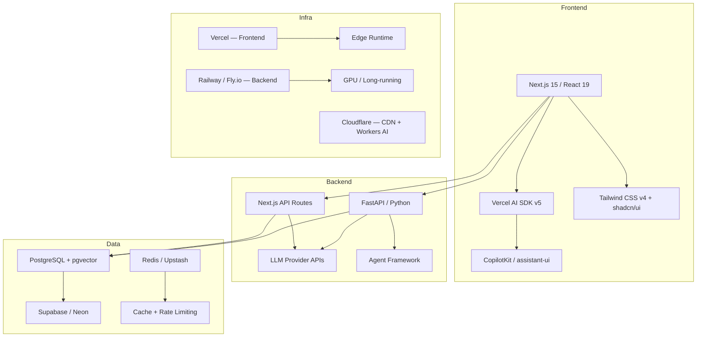
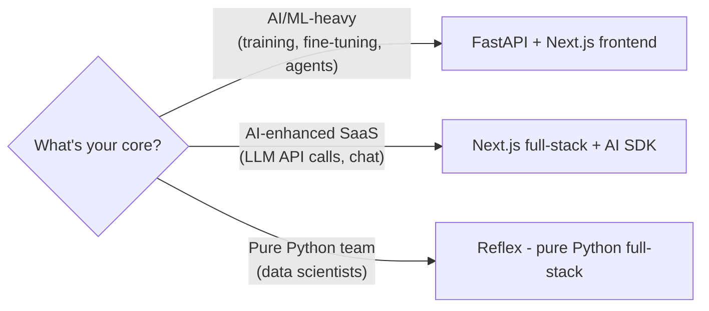
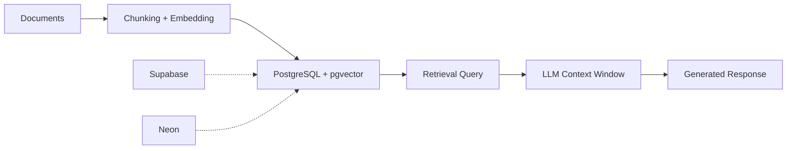
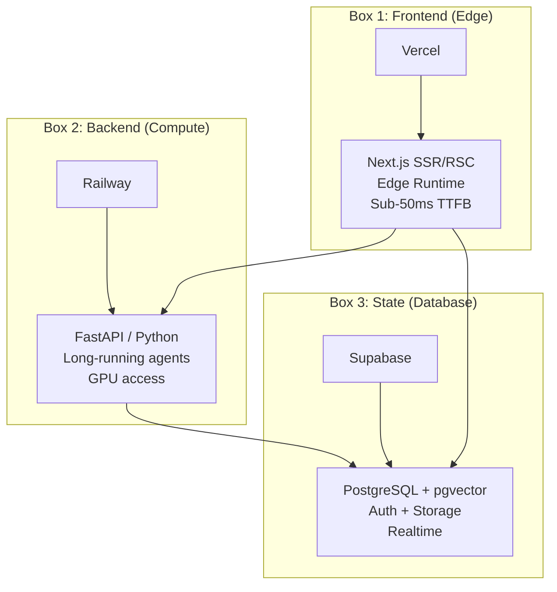

# AI 新創公司全端技術棧 2026：完整選型指南

## What

全面分析 2026 年建構 AI-first 新創公司所需技術棧的每一層 —— 從前端框架到部署基礎設施，從 LLM 整合到 Agent 編排。

## 為什麼這很重要

2026 年是轉折點。「AI wrapper」時代已經結束。AI 新創公司現在需要：
- **串流優先的 UI** —— 使用者期待即時 token 串流，而不是載入轉圈圈
- **Agent 編排** —— 單次 LLM 呼叫已是基本配備；多 Agent 工作流才是差異化關鍵
- **AI 原生資料庫** —— 向量搜尋不再是可選項，它已經是 Postgres 中的一個欄位類型
- **邊緣部署** —— 延遲會毀掉 AI 使用者體驗；邊緣運算是強制要求

2026 年選錯技術棧意味著 3-6 個月的遷移技術債。選對了則意味著幾週內就能上線。

---

## 技術棧一覽



---

## 第一層：前端

### 贏家：Next.js 15 + React 19

Next.js 在 2026 年主宰了 AI 新創公司的前端。不是因為它時髦 —— 而是因為它解決了真正的 AI 特定問題：

| 功能 | 為什麼對 AI 重要 |
|---------|----------------------|
| React Server Components | 在伺服器端串流 LLM 回應，減少客戶端 JS bundle |
| Server Actions | 無需 API 樣板程式碼即可直接執行伺服器端變更 |
| App Router + Streaming | 原生 `Suspense` 邊界，實現漸進式 AI 回應渲染 |
| Edge Runtime | 全球 AI 介面 sub-50ms TTFB |
| API Routes | 輕量級後端端點，用於 LLM 代理轉發 |

**React 19 重要的特性：**
- `use()` hook —— 在渲染中直接讀取非同步資源（LLM 回應）
- Server Components —— 非互動部分零客戶端 JS
- Actions —— 呼叫伺服器函數的表單提交，完美適配 AI 聊天輸入

### 替代方案比較

| 框架 | 最適合 | AI 適用性 | 生態系 |
|-----------|----------|---------------|-----------|
| **Next.js 15** | 全端 AI 應用 | 優秀 —— AI SDK、RSC 串流 | 龐大 |
| **Remix** | 表單密集、Web 標準應用 | 良好 —— SSR，但無 AI SDK | 成長中 |
| **SvelteKit** | 效能關鍵的 SPA | 尚可 —— 已新增 AI SDK v5 支援 | 較小 |
| **Nuxt 4** | Vue 生態系 | 尚可 —— 已新增 AI SDK v5 支援 | 中等 |
| **Astro** | 內容密集型網站 | 不佳 —— 非為動態 AI UI 設計 | 小眾 |

**結論：** 除非團隊有深厚的 Vue/Svelte 專長，否則 Next.js 就是預設選擇。光是 AI SDK 整合就能省下數週的串流基礎設施開發工作。

### UI 層：Tailwind CSS v4 + shadcn/ui

這個組合是 2026 年 AI 新創公司的共識：

- **Tailwind v4** —— CSS-first 配置、原生 cascade layers、Lightning CSS 引擎（建構速度快 100 倍）
- **shadcn/ui** —— 複製貼上元件，完全擁有所有權，無依賴鎖定
- **為什麼不用 Material UI / Ant Design？** —— 太有主見，AI 程式碼生成器更難處理。Tailwind class 是 AI 程式碼工具的通用語言（Cursor、v0、Bolt 都原生生成 Tailwind）

### AI 專用前端：Generative UI

2026 年的前沿 —— AI Agent 渲染 UI 元件，而不僅僅是文字：

| 函式庫 | 功能 | Stars | 成熟度 |
|---------|-------------|-------|----------|
| **CopilotKit** | 應用內 AI 副駕駛、Generative UI、AG-UI 協定 | 28K+ | 生產就緒 |
| **assistant-ui** | 聊天 UI 元件、工具渲染、串流 | 5K+ | 生產就緒 |
| **Vercel AI SDK v5** | `streamUI()` —— 從伺服器串流 React 元件 | Core SDK | 生產就緒 |
| **Thesys/Crayon** | 快速 Generative UI 原型設計 | 較新 | 早期 |

**CopilotKit** 是領跑者 —— 它提供：
- `<CopilotChat>` —— 即插即用的聊天，支援工具呼叫渲染
- `useCopilotAction()` —— 讓 Agent 觸發前端動作
- AG-UI 協定 —— Agent 到 UI 的通訊標準
- 相容 LangGraph、CrewAI、OpenAI Agents SDK 後端

---

## 第二層：後端

### 決策矩陣：Python vs TypeScript

這是 AI 新創公司最重要的後端決策：

| 因素 | Python (FastAPI) | TypeScript (Next.js API / NestJS) |
|--------|-----------------|-----------------------------------|
| **ML/AI 生態系** | 主導地位 —— PyTorch、HuggingFace、LangChain 都是 Python 優先 | 正在追趕 —— AI SDK、LangChain.js 存在 |
| **LLM 整合** | 原生 —— 每個供應商都有 Python SDK | 良好 —— AI SDK 統一 25+ 個供應商 |
| **效能** | 非同步 FastAPI 在 I/O 方面 ≈ Node.js | 純 API 服務略快 |
| **招聘** | 更大的 ML 人才庫 | 更大的全端人才庫 |
| **全端簡潔性** | 需要獨立前端 | 與 Next.js 的 monorepo |
| **Agent 框架** | LangGraph、CrewAI、AutoGen —— 都是 Python 優先 | LangGraph.js 存在但落後 |
| **微調 / 訓練** | 必須 —— 僅限 Python | 不可能 |

### 依新創類型推薦



### 路徑 A：FastAPI（Python 後端）

**適用場景：** 你的產品核心價值在 AI/ML，你需要 Agent 編排，或者你計劃微調模型。

```
FastAPI 0.115+
├── Pydantic v2 — data validation + serialization (2-5x faster than v1)
├── async/await — native async for LLM API calls
├── Dependency Injection — clean service layer
├── Auto-docs — Swagger UI out of the box
└── Streaming — StreamingResponse for SSE
```

FastAPI 是 2026 年成長最快的 Python 後端框架。關鍵優勢：
- 建構在 Starlette (ASGI) 上 —— 處理數千個並行 LLM 請求
- Pydantic v2 —— Rust 驅動的驗證，比 v1 快 5 倍
- 一級非同步支援 —— `await openai.chat.completions.create()` 不會阻塞
- 自動 OpenAPI 文件 —— 你的 LLM 整合 API 自帶文件

### 路徑 B：Next.js 全端（TypeScript）

**適用場景：** 你正在建構一個 AI 增強型 SaaS，AI 是功能而非產品本身。或者你想要用小團隊達到最大交付速度。

```
Next.js 15 (App Router)
├── API Routes → /api/chat/route.ts (AI SDK streamText)
├── Server Actions → direct DB mutations
├── RSC → stream AI responses as React components
└── Middleware → auth, rate limiting at edge
```

**Vercel AI SDK v5** 是關鍵推動者：
- `streamText()` / `streamObject()` / `streamUI()` —— 統一的串流基礎元件
- 25+ 個供應商適配器（OpenAI、Anthropic、Google、Mistral、Groq...）
- `useChat()` hook —— 一個 hook 搞定完整聊天狀態管理
- 型別安全的工具呼叫 —— 用 Zod schema 定義工具，取得型別化結果
- 框架無關 —— React、Vue、Svelte、Angular 全部支援

### 路徑 C：Reflex（純 Python 全端）

**適用場景：** 你的團隊全是 Python（資料科學家 / ML 工程師），需要建構內部工具或儀表板，不想另外招前端開發者。

- 用純 Python 編寫前端 + 後端
- 底層編譯為 React + FastAPI
- 60+ 個內建元件
- Reflex Cloud 用於部署
- 取捨：前端控制力較低，生態系較小

---

## 第三層：AI / LLM 整合

### LLM 供應商選擇

| 供應商 | 最佳模型（2026 年 2 月） | 強項 | 定價（每百萬 token 輸入/輸出） |
|----------|----------------------|----------|---------------------------------------|
| **Anthropic** | Claude Opus 4.6 | SWE-bench 第一（80.8%），最佳程式碼能力 | $15 / $75 |
| **OpenAI** | GPT-5.3-Codex | Terminal-bench 第一，速度 | $10 / $30 |
| **Google** | Gemini 2.5 Pro | 100 萬上下文，多模態 | $1.25 / $10 |
| **Groq** | Llama 3.3 70B | 速度 —— 800+ tok/s | $0.59 / $0.79 |
| **Mistral** | Large 2 | 歐洲合規，開放權重 | $2 / $6 |

**2026 年共識：** 不要鎖定單一供應商。使用 Vercel AI SDK 或 LiteLLM 作為抽象層，根據使用場景切換模型。

### Agent 編排框架

這是 2026 年與 2025 年的顯著分歧之處。單次 LLM 呼叫已經商品化 —— Agent 系統才是差異化關鍵：

| 框架 | 語言 | 最適合 | 生產就緒程度 |
|-----------|----------|----------|---------------------|
| **LangGraph** | Python/JS | 複雜的有狀態工作流、循環 | 高 —— 4700 萬+ PyPI 下載 |
| **OpenAI Agents SDK** | Python | 簡單 Agent 鏈、最低摩擦 | 高 —— 原生工具呼叫 |
| **CrewAI** | Python | 多 Agent 協作 | 中 —— 快速成長中 |
| **AutoGen** | Python | 研究、多 Agent 辯論 | 中 —— Microsoft 支持 |
| **Anthropic Agent SDK** | Python | Claude 原生編排 | 新興 |
| **Vercel AI SDK** | TypeScript | 前端整合的 Agent | 高 —— streamUI + tools |

**LangGraph** 是複雜 Agent 系統的生產標準：
- 基於圖的狀態機，支援循環
- 內建持久化（checkpointing）
- 人機協作模式
- LangSmith 可觀測性
- 基準測試中延遲最低 + token 用量最少

**但是：** 對於簡單使用場景（單個 Agent + 工具），OpenAI Agents SDK 或 Vercel AI SDK 更簡單且足夠用。

### RAG 架構

每個 AI 新創公司都需要檢索增強生成。2026 年的技術棧：



**2026 年關鍵轉變：** 專用向量資料庫（Pinecone、Weaviate、Qdrant）正在被 PostgreSQL + pgvector 蠶食。為什麼？
- 一個資料庫搞定一切（關聯式 + 向量）
- Supabase/Neon 開箱即用 pgvector
- pgvector 效能現在與專用方案僅差 10-20%
- HNSW 索引支援數百萬個向量
- 更簡單的維運 —— 不需要管理額外的向量資料庫

**什麼時候你確實需要專用向量資料庫：** >1000 萬個向量、sub-10ms 延遲需求、或需要特殊功能（混合搜尋、多租戶）。

---

## 第四層：資料庫與狀態

### 預設選擇：PostgreSQL（透過 Supabase 或 Neon）

PostgreSQL 是 2026 年 AI 新創公司無可爭議的資料庫選擇：

| 功能 | Supabase | Neon |
|---------|----------|------|
| **核心** | Postgres + Auth + Storage + Realtime + Edge Functions | Serverless Postgres，支援分支 |
| **pgvector** | 內建，已最佳化 | 內建 |
| **Auth** | 內建（email、OAuth、magic link） | 自備（Clerk 等） |
| **Realtime** | WebSocket 訂閱 | 未內建 |
| **Edge Functions** | 基於 Deno | 不包含 |
| **定價** | 免費方案（500MB），$25/月 Pro | 免費方案（512MB），$19/月 Scale |
| **AI 整合** | pgvector + AI toolkit + embedding 生成 | pgvector |
| **估值** | $5B（2026），$70M ARR，400 萬開發者 | $1B+ |
| **最適合** | 完整 BaaS 替代方案（Firebase 替代品） | Serverless Postgres，支援 git-like 分支 |

**Supabase 是 2026 年 AI 新創公司的預設選擇**，因為它取代了 3-4 個獨立服務：
- 資料庫 → Postgres
- 認證 → Supabase Auth（許多場景下取代 Clerk/Auth0）
- 檔案儲存 → Supabase Storage（取代 S3）
- 即時通訊 → WebSocket 訂閱
- 向量搜尋 → pgvector（取代 Pinecone）
- Edge Functions → Deno runtime（取代部分 serverless 需求）

### 快取層

| 服務 | 最適合 | 定價 |
|---------|----------|---------|
| **Upstash Redis** | 限速、快取、session store | 免費方案，$0.2/10 萬次指令 |
| **Vercel KV** | 同上，但與 Vercel 整合更緊密 | 基於 Upstash |
| **Cloudflare KV** | 全球邊緣快取 | 含免費方案 |

---

## 第五層：認證與支付

### 認證

| 方案 | 最適合 | 定價 | AI 功能 |
|----------|----------|---------|-------------|
| **Clerk** | 最佳 DX，預建元件 | <10K MAU 免費，$25/月+ | Clerk Skills for AI agents |
| **Supabase Auth** | 已在使用 Supabase | 已包含 | 基本 |
| **Better Auth** | 自託管，開源 | 免費 | 無 |
| **Auth.js (NextAuth)** | DIY，最大控制權 | 免費 | 無 |

**2026 年趨勢：** Clerk 主導「開箱即用」的認證空間。如果你已經在用 Supabase，Supabase Auth「夠用了」。Better Auth 對於想要自託管的團隊正在快速崛起。

### 支付

| 方案 | 最適合 | 費用 |
|----------|----------|-----|
| **Stripe** | 萬能 —— 訂閱、按量計費、一次性付款 | 2.9% + $0.30 |
| **Stripe + ACP** | AI Agent 商務（ChatGPT Instant Checkout） | 2.9% + 4% OpenAI |
| **Lemon Squeezy** | 數位產品，比 Stripe 簡單 | 5% + $0.50 |
| **Polar** | 開源變現 | 4% |

**Stripe 仍然是 2026 年 AI SaaS 唯一認真的選擇。** 按用量計費（每次 API 呼叫、每個 token）是 AI 產品的主流定價模式，Stripe 的 metered billing 原生支援這一點。

---

## 第六層：部署與基礎設施

### 三盒模型

2026 年共識：將你的部署拆分為三個關注點：



### 平台比較

| 平台 | 最適合 | 定價 | 限制 |
|----------|----------|---------|--------|
| **Vercel** | Next.js 前端、AI SDK 串流 | 免費方案，$20/月 Pro | 4GB 記憶體，800 秒執行時間 |
| **Railway** | Python 後端、長時間運行的 Agent、Docker | $5/月 + 用量 | 尚無 GPU |
| **Fly.io** | 全球邊緣容器、WebSockets | $0/月 hobby，按用量計費 | 有 GPU |
| **Render** | 簡單 Docker 部署 | 免費方案，$7/月+ | 無 GPU |
| **Cloudflare** | 邊緣運算、Workers AI、CDN | 免費方案慷慨 | Workers：128MB 記憶體 |
| **Modal** | GPU 工作負載、ML 推論 | 按用量付費 | 聚焦 GPU |
| **Replicate** | 模型託管、serverless GPU | 按預測付費 | 僅模型服務 |

### 依新創階段推薦的部署方案

| 階段 | 前端 | 後端 | 資料庫 | 月費 |
|-------|----------|---------|----------|---------|
| **MVP（0-100 使用者）** | Vercel Free | Vercel API Routes | Supabase Free | $0-20 |
| **成長期（100-10K）** | Vercel Pro | Railway | Supabase Pro | $50-200 |
| **規模化（10K+）** | Vercel Enterprise | Railway / AWS | Supabase / RDS | $500+ |

---

## 第七層：AI 輔助開發（Meta 層）

### Vibe Coding 工具

你用來建構 AI 新創公司的工具本身就是 AI 驅動的：

| 工具 | 最適合 | 價格 | 強項 |
|------|----------|-------|----------|
| **Cursor** | 在現有程式碼庫中日常編碼 | $20/月 Pro | 程式碼庫上下文、多檔案編輯 |
| **Claude Code** | 複雜架構、多 Agent 團隊 | $200/月（Max） | 深度推理、Agent Teams |
| **Codex CLI** | 平行執行、CI 自動化 | API 定價 | 10-20 個 Agent 平行運行 |
| **v0** | React/Next.js 元件生成 | 免費方案 | 原生 shadcn/ui 輸出 |
| **Bolt.new** | 全端腳手架、除錯 | $20/月 | 全端上下文感知 |
| **Lovable** | 非技術創辦人原型設計 | $20/月 | 最佳視覺輸出品質 |

**2026 年最佳工作流：**
1. **Lovable / v0** → 快速原型設計和設計驗證
2. **Cursor** → 帶程式碼庫上下文的日常開發
3. **Claude Code** → 複雜功能、多檔案重構
4. **Codex** → 平行任務執行、CI 整合

---

## 依場景推薦的技術棧

### 場景 1：AI SaaS（類 ChatGPT 產品）

> 建構基於聊天的 AI 產品（客服機器人、寫作助手、程式碼助手）

```
Frontend:  Next.js 15 + Tailwind v4 + shadcn/ui + AI SDK v5 useChat()
Backend:   Next.js API Routes (simple) OR FastAPI (complex agents)
AI:        Vercel AI SDK + multi-provider (Claude/GPT/Gemini)
Database:  Supabase (Postgres + pgvector + Auth)
Auth:      Supabase Auth OR Clerk
Payments:  Stripe (usage-based metered billing)
Deploy:    Vercel (frontend) + Railway (if separate backend)
```

### 場景 2：AI Agent 平台

> 建構多 Agent 系統（自主工作流、Agent 市集）

```
Frontend:  Next.js 15 + CopilotKit + AG-UI protocol
Backend:   FastAPI + LangGraph (agent orchestration)
AI:        LangGraph + LangSmith (observability)
Database:  Supabase (state) + Redis/Upstash (agent message queues)
Auth:      Clerk (user) + API keys (agents)
Payments:  Stripe + x402 (agent-to-agent payments)
Deploy:    Vercel (frontend) + Railway (agents) + Modal (GPU inference)
```

### 場景 3：AI 增強型垂直 SaaS

> 為現有垂直領域（法律、醫療、金融）添加 AI

```
Frontend:  Next.js 15 + Tailwind + domain-specific components
Backend:   FastAPI + RAG pipeline
AI:        LangChain/LlamaIndex + fine-tuned model
Database:  Supabase (Postgres + pgvector for RAG)
Auth:      Clerk (SSO for enterprise)
Payments:  Stripe (seat-based + usage-based hybrid)
Deploy:    Vercel + Railway + Replicate (model hosting)
```

### 場景 4：純 Python 團隊（資料科學背景）

> ML 工程師在沒有前端專長的情況下建構產品

```
Frontend:  Reflex (pure Python → compiles to React)
Backend:   Reflex (compiles to FastAPI)
AI:        Native Python (LangGraph, HuggingFace, PyTorch)
Database:  Supabase or Neon (pgvector)
Auth:      Supabase Auth
Payments:  Stripe
Deploy:    Reflex Cloud or Railway
```

---

## 非顯而易見的洞察

### 1. 「AI SDK > 直接 API 呼叫」現在是共識

在 2025 年，許多團隊直接呼叫 OpenAI/Anthropic API。在 2026 年，抽象層是必需的：
- **Vercel AI SDK** —— 如果你的前端是 TypeScript
- **LiteLLM** —— 如果你的後端是 Python 且想要供應商無關的路由
- **LangChain** —— 如果你需要 Agent 鏈，而不僅僅是 completions

直接 API 呼叫 = 供應商鎖定 + 重新實作串流/重試/降級邏輯。

### 2. Supabase 正在吞噬多個品類

估值 $5B 的 Supabase 正在為大多數 AI 新創公司取代 4-5 個獨立服務。「拆分式」方法（獨立的 auth + DB + storage + vector DB + realtime）正在輸給「捆綁式 Postgres 一站式解決」。

### 3. Agent 框架是新的後端框架

2024 年的問題是「Django 還是 Express？」2026 年的問題是「LangGraph 還是 CrewAI？」Agent 編排正在成為 AI 產品的核心後端關注點。

### 4. 邊緣部署是 AI 特有的需求

AI UI 感覺遲鈍是因為延遲疊加：用戶 → 邊緣 → 源站 → LLM API → 源站 → 邊緣 → 用戶。邊緣部署（Vercel Edge、Cloudflare Workers）減少 2 個跳轉，將感知延遲降低 40-60%。

### 5. Vibe Coding 改變了招聘方程式

一個 2 人團隊配備 Cursor + Claude Code + v0，交付速度等同於 2024 年的 5 人團隊。這改變了新創公司的經濟模型：招更少但更優秀的工程師，投資 AI 工具訂閱。

### 6. PostgreSQL 贏得了向量資料庫之戰

專用向量資料庫市場（Pinecone 融資 $1 億、Weaviate 融資 $5000 萬）正被 pgvector 商品化。對於 90% 的 AI 新創公司，在現有 Postgres 中加一個 pgvector 欄位就夠了。只有在你建構搜尋基礎設施時才需要投資專用向量資料庫。

---

## 應該避免的事

| 反模式 | 為什麼會失敗 |
|-------------|-------------|
| **自己建構認證** | 浪費 3-6 個月。用 Clerk 或 Supabase Auth |
| **MVP 階段就用專用向量資料庫** | 過度工程。pgvector 處理 99% 的場景 |
| **用單體 Python 後端處理一切** | 前端團隊被阻塞。前端用 Next.js，AI 專用後端用 FastAPI |
| **鎖定單一 LLM 供應商** | 模型每 3 個月就變。用抽象層 |
| **種子輪就上 Kubernetes** | Railway/Vercel 能承載你的規模。K8s 是 B 輪的問題 |
| **自行實作串流** | AI SDK v5 解決了這個問題。不要重新發明 SSE 管道 |
| **忽略 Agent 框架** | 單次 LLM 呼叫已商品化。Agent 編排才是護城河 |

---

## References

- [The React + AI Stack for 2026 — Builder.io](https://www.builder.io/blog/react-ai-stack-2026)
- [AI SDK 5 — Vercel](https://vercel.com/blog/ai-sdk-5)
- [Top 10 Full Stack Frameworks in 2026 — Nucamp](https://www.nucamp.co/blog/top-10-full-stack-frameworks-in-2026-next.js-remix-nuxt-sveltekit-and-more)
- [Python FastAPI vs Node.js for Startups 2026 — Medium](https://medium.com/@ahmadabdulmannan/python-fastapi-vs-node-js-which-backend-wins-for-startups-in-2026-2b1f6830c870)
- [Best Backend Frameworks 2026 — Index.dev](https://www.index.dev/blog/best-backend-frameworks-ranked)
- [AI Tech Stack for Startups 2026 — Index.dev](https://www.index.dev/blog/ai-startup-tech-stack)
- [Supabase in 2026: Relational AI Guide — Textify](https://textify.ai/supabase-relational-ai-2026-guide/)
- [Why AI Startups Choose PostgreSQL — Medium](https://medium.com/@takafumi.endo/why-ai-startups-choose-postgresql-supabase-neon-pgvector-7d1e1383b3dd)
- [Vercel vs Railway vs Render: AI Deployment 2026 — Athenic](https://getathenic.com/blog/vercel-vs-railway-vs-render-ai-deployment)
- [Deploying Full Stack Apps in 2026 — Nucamp](https://www.nucamp.co/blog/deploying-full-stack-apps-in-2026-vercel-netlify-railway-and-cloud-options)
- [AI Agent Frameworks Compared 2026 — Turing](https://www.turing.com/resources/ai-agent-frameworks)
- [Agent Orchestration 2026: LangGraph, CrewAI & AutoGen — Iterathon](https://iterathon.tech/blog/ai-agent-orchestration-frameworks-2026)
- [Choosing Your AI Orchestration Stack 2026 — The New Stack](https://thenewstack.io/choosing-your-ai-orchestration-stack-for-2026/)
- [LangChain vs Vercel AI SDK vs OpenAI SDK 2026 — Strapi](https://strapi.io/blog/langchain-vs-vercel-ai-sdk-vs-openai-sdk-comparison-guide)
- [CopilotKit — Developer Guide to Generative UI 2026](https://www.copilotkit.ai/blog/the-developer-s-guide-to-generative-ui-in-2026)
- [Complete Guide to Generative UI Frameworks 2026 — Medium](https://medium.com/@akshaychame2/the-complete-guide-to-generative-ui-frameworks-in-2026-fde71c4fa8cc)
- [Best Vibe Coding Tools 2026 — VibeCoding.app](https://vibecoding.app/blog/best-vibe-coding-tools)
- [v0 vs Bolt vs Lovable 2026 — FreeAcademy](https://freeacademy.ai/blog/v0-vs-bolt-vs-lovable-ai-app-builders-comparison-2026)
- [Railway $100M to Challenge AWS — VentureBeat](https://venturebeat.com/infrastructure/railway-secures-usd100-million-to-challenge-aws-with-ai-native-cloud-infrastructure)
- [Supabase $100M Enterprise AI — AIM](https://aimmediahouse.com/ai-startups/supabase-raises-100-million-to-power-enterprise-ai-databases)
- [Six Data Predictions 2026: RAG, Vector DBs — VentureBeat](https://venturebeat.com/data/six-data-shifts-that-will-shape-enterprise-ai-in-2026)
- [2026 Tech Stack Predictions — YUV.AI](https://yuv.ai/blog/my-2026-tech-stack-predictions)
- [Top 7 Enterprise AI App Builders 2026 — Reflex](https://reflex.dev/blog/2025-12-17-top-7-enterprise-ai-app-builders-2026/)
