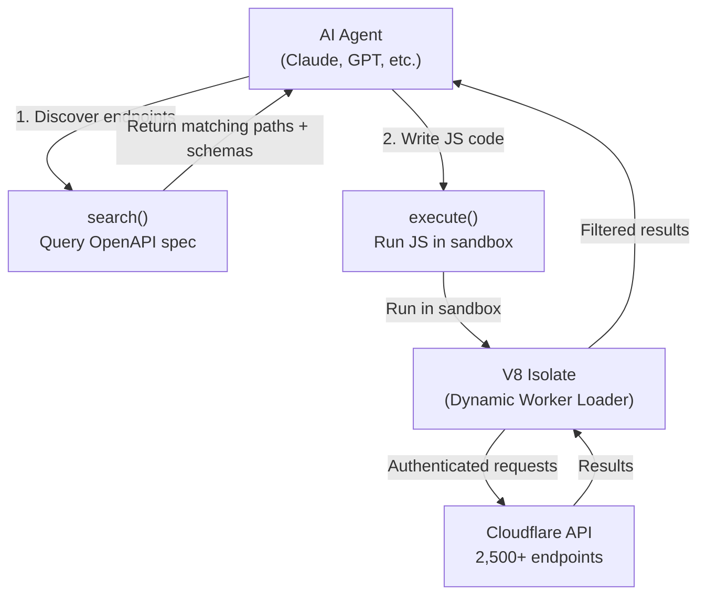

# Cloudflare Code Mode MCP: Give Agents an Entire API in 1,000 Tokens

## What They Built

Cloudflare released **Code Mode** — a pattern where AI agents write and execute code against an API's TypeScript SDK instead of calling MCP tools one-by-one. Their MCP server exposes the entire Cloudflare API (2,500+ endpoints) through just **two tools**: `search()` and `execute()`, consuming ~1,000 tokens instead of 1.17 million.

This is not just a Cloudflare-specific feature. It's an **architectural pattern** that any MCP server can adopt. Anthropic independently published the same pattern, and Block's Goose agent implements it as a wrapper extension.

## Why This Approach

### The Problem: Tool Bloat Kills Agent Performance

Traditional MCP servers describe every operation as a separate tool. Each tool definition (name, description, parameters, return types) gets injected into the LLM's system prompt. Scale this to a real API:

| Approach | Token Cost | % of 200K Context |
|----------|------------|-------------------|
| Traditional MCP (all tools) | 1,170,000 | 585% (impossible) |
| Filtered subset (100 tools) | ~50,000 | 25% |
| Code Mode (2 tools) | ~1,000 | 0.5% |

Real-world developer reports: Claude Code sessions start with 66,000 tokens consumed by MCP tool definitions alone before the user types anything. That's 33% of working memory gone.

### Why "Write Code" Beats "Call Tool"

LLMs are trained on millions of TypeScript/Python repos since 2012. They've seen far less synthetic tool-calling JSON. The key insight:

> "LLMs are better at writing code to call MCP than at calling MCP directly." — Cloudflare

Code Mode is also **non-deterministic → deterministic**: the LLM generates code that executes predictably, versus traditional patterns of LLMs coordinating other LLMs through tool calls.

## How It Works

### Architecture: Two Tools, Full API



### The Two Tools

**`search()`** — Agent writes JavaScript to query the OpenAPI spec:

```javascript
// Agent-generated code inside search()
return spec.paths.filter(p =>
  p.path.includes('/zones/') &&
  p.tags.includes('WAF')
);
```

The full OpenAPI spec (with pre-resolved `$refs`) lives server-side. Only matched results return to the agent.

**`execute()`** — Agent writes JavaScript to make authenticated API calls:

```javascript
// Agent-generated code inside execute()
const zones = await cloudflare.request('GET /zones', { query: { name: 'example.com' } });
const zoneId = zones.result[0].id;
const rulesets = await cloudflare.request('GET /zones/{zone_id}/rulesets', {
  params: { zone_id: zoneId }
});
return rulesets.result.filter(r => r.phase === 'ddos_l7');
```

### Sandbox Security (V8 Isolate)

Code runs in a **Dynamic Worker Loader** — a lightweight V8 isolate with:

- No filesystem access
- No environment variables (can't leak secrets via prompt injection)
- External `fetch()` disabled by default
- Outbound requests controllable via explicit handlers
- Millisecond startup, minimal memory (not a container)

API credentials are injected via RPC bindings — the agent's code calls `cloudflare.request()` but never sees the actual token.

### Practical Workflow: DDoS Protection

A real agent session protecting an origin:

1. **Search** — Find WAF/ruleset endpoints for zones
2. **Inspect** — Drill into schemas for `ddos_l7` phase
3. **Execute** — Chain 3 API calls in one execution: list rulesets → get current config → update sensitivity
4. **Total**: ~4 tool calls instead of 12+ traditional calls

## Three Implementations of the Same Pattern

| Implementation | Who | How It Works |
|---------------|-----|-------------|
| **Server-side Code Mode** | Cloudflare | MCP server exposes `search()` + `execute()`, runs code in Dynamic Worker Loader |
| **Client-side Code Mode** | Goose (Block) | MCP extension wraps other extensions, exposes `search_modules` + `read_module` + `execute_code` |
| **Filesystem-as-API** | Anthropic | MCP tools represented as `.ts` files in a directory tree, agent navigates and writes code |

Cloudflare's server-side approach is the most opinionated: fixed token cost regardless of API size, no client modifications needed, progressive discovery built in, and safe execution in a sandboxed isolate.

## How to Use It

### Setup with Any MCP Client

```json
{
  "mcpServers": {
    "cloudflare-api": {
      "url": "https://mcp.cloudflare.com/mcp"
    }
  }
}
```

OAuth flow handles auth automatically. Alternatively, use an API token:

```json
{
  "mcpServers": {
    "cloudflare-api": {
      "url": "https://mcp.cloudflare.com/mcp",
      "headers": {
        "Authorization": "Bearer YOUR_API_TOKEN"
      }
    }
  }
}
```

### Setup with Claude Code

```bash
claude mcp add --transport http cloudflare-api https://mcp.cloudflare.com/mcp
```

Then just talk to it naturally:
- "List all my Workers"
- "Create a KV namespace called 'my-cache'"
- "Add an A record for api.example.com pointing to 192.0.2.1"
- "Show me DDoS attack patterns on my zone in the last 24h"

### Build Your Own Code Mode MCP Server

Install the SDK:

```bash
npm install @cloudflare/codemode ai zod
```

Minimal implementation:

```typescript
import { createCodeTool } from '@cloudflare/codemode';
import { tool } from 'ai';
import { z } from 'zod';

const tools = {
  listUsers: tool({
    description: "List all users",
    inputSchema: z.object({ limit: z.number().optional() }),
    execute: async (input) => { /* your API call */ }
  })
};

const { system, tools: codeTools } = codemode({
  system: "You are a helpful assistant",
  tools,
  executor: new DynamicWorkerExecutor({
    loader: env.LOADER,
    timeout: 30000,
    globalOutbound: null  // block all external fetches
  })
});
```

Wrangler config:

```jsonc
// wrangler.jsonc
{
  "worker_loaders": [{ "binding": "LOADER" }],
  "compatibility_flags": ["nodejs_compat"]
}
```

### The Executor Interface

Custom sandbox implementations just need:

```typescript
type Executor = {
  execute(code: string, fns: Record<string, Function>): Promise<{
    result: unknown;
    error?: string;
    logs?: string[];
  }>;
};
```

## Tradeoffs

| Pro | Con |
|-----|-----|
| 99.9% token reduction for large APIs | Adds code generation latency |
| Progressive discovery (load what you need) | Agent must be good at writing code |
| Secure V8 sandbox (no secret leakage) | Dynamic Worker Loader API in closed beta |
| No client-side modifications | JavaScript-only execution (no Python) |
| Works with any MCP-compatible agent | Tool approval workflows not yet supported |
| Single-execution multi-call chains | TypeScript compiler bundling increases Worker size |

### When NOT to Use Code Mode

- **Simple APIs** (< 10 tools): Traditional MCP is fine, Code Mode adds overhead
- **Single-step operations**: Direct tool calls are faster for one-off actions
- **Non-code-capable models**: Smaller models may struggle to generate correct API calls

## Alternatives

| Approach | Token Cost | Discovery | Security | Client Changes |
|----------|-----------|-----------|----------|---------------|
| **Code Mode (server)** | ~1K fixed | Progressive | V8 sandbox | None |
| **Code Mode (client)** | ~1K fixed | Progressive | Varies | Extension needed |
| **Dynamic Tool Search** | Variable | On-demand | N/A | Client feature |
| **CLI-based MCP** | Low | Progressive | Process isolation | CLI wrapper |
| **Traditional MCP** | O(n) tools | All upfront | N/A | None |

Claude Code uses **Dynamic Tool Search** — runtime search for relevant tools among installed MCP servers. This avoids loading all tools upfront but still scales linearly with enabled tools.

## Steal

1. **The 2-tool pattern is universal**: Any large API can be wrapped in `search()` + `execute()`. You don't need Cloudflare's infra — the `Executor` interface is simple enough to implement with any sandboxed runtime.

2. **TypeScript > JSON for LLMs**: When building agent tools, present them as typed TypeScript interfaces with JSDoc, not JSON Schema. Models perform measurably better.

3. **Keep secrets in bindings**: Never pass API keys through the LLM context. Use RPC bindings or environment injection so agent-generated code calls `api.request()` without seeing credentials.

4. **Progressive discovery scales**: For any API with > 50 endpoints, let agents search → inspect → execute rather than loading everything upfront. The filesystem-as-API pattern (Anthropic) works without any special infrastructure.

5. **Composable MCP gateways**: Cloudflare's roadmap includes "MCP Server Portals" — unified gateways with shared auth across multiple MCP servers. This is the future: one auth flow, one Code Mode interface, many backend services.

## References

- [Code Mode: give agents an entire API in 1,000 tokens](https://blog.cloudflare.com/code-mode-mcp/) — Cloudflare blog, Feb 20, 2026
- [Code Mode: the better way to use MCP](https://blog.cloudflare.com/code-mode/) — Cloudflare blog, general Code Mode pattern
- [Code execution with MCP](https://www.anthropic.com/engineering/code-execution-with-mcp) — Anthropic engineering blog
- [Code Mode Doesn't Replace MCP](https://block.github.io/goose/blog/2025/12/21/code-mode-doesnt-replace-mcp/) — Goose / Block
- [Cloudflare MCP Server GitHub](https://github.com/cloudflare/mcp)
- [Codemode API Reference](https://developers.cloudflare.com/agents/api-reference/codemode/) — Cloudflare Agents docs
- [@cloudflare/codemode npm](https://community.cloudflare.com/t/agents-workers-cloudflare-codemode-v0-1-0-a-new-runtime-agnostic-modular-architecture/895160) — v0.1.0 announcement
- [MCP Code Mode context engineering analysis](https://medium.com/@amirkiarafiei/mcp-code-mode-context-engineering-for-efficient-tool-execution-in-llm-agents-c46e1ddf80ac)
