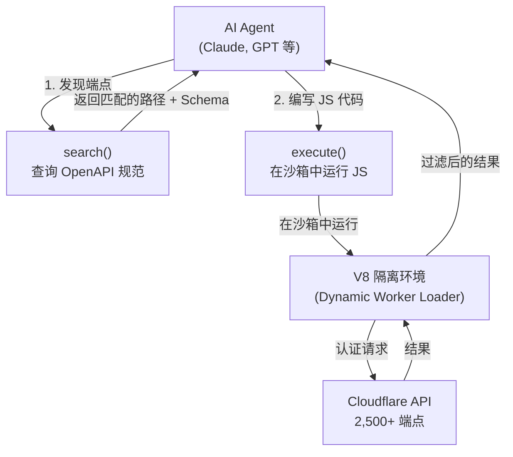

# Cloudflare Code Mode MCP：用 1,000 Token 给 Agent 一整个 API

## 他们做了什么

Cloudflare 发布了 **Code Mode** — 一种让 AI Agent 通过编写和执行 TypeScript 代码来调用 API SDK 的模式，取代逐一调用 MCP 工具。他们的 MCP 服务器通过仅 **两个工具**（`search()` 和 `execute()`）暴露了整个 Cloudflare API（2,500+ 端点），仅消耗 ~1,000 token，而非 117 万 token。

这不仅仅是 Cloudflare 专属功能，而是一种**通用架构模式**。Anthropic 独立发布了相同模式，Block 的 Goose Agent 也将其实现为包装扩展。

## 为什么采用这种方案

### 问题：工具膨胀摧毁 Agent 性能

传统 MCP 服务器将每个操作描述为单独的工具。每个工具定义（名称、描述、参数、返回类型）都注入到 LLM 的系统提示词中。扩展到真实 API 时：

| 方案 | Token 消耗 | 占 200K 上下文的比例 |
|------|-----------|-------------------|
| 传统 MCP（所有工具） | 1,170,000 | 585%（不可能） |
| 过滤子集（100 个工具） | ~50,000 | 25% |
| Code Mode（2 个工具） | ~1,000 | 0.5% |

实际开发者报告：Claude Code 会话在用户输入任何内容前，MCP 工具定义就已消耗 66,000 token — 33% 的工作内存就这样没了。

### 为什么"写代码"比"调工具"更好

LLM 从 2012 年起就在数百万 TypeScript/Python 仓库上训练过。它们见过的合成工具调用 JSON 要少得多。核心洞察：

> "LLM 写代码调用 MCP 比直接调用 MCP 更擅长。" — Cloudflare

Code Mode 也是 **非确定性 → 确定性**：LLM 生成可预测执行的代码，而非传统模式中 LLM 通过工具调用协调其他 LLM。

## 工作原理

### 架构：两个工具，完整 API



### 两个工具

**`search()`** — Agent 编写 JavaScript 查询 OpenAPI 规范：

```javascript
// Agent 在 search() 内生成的代码
return spec.paths.filter(p =>
  p.path.includes('/zones/') &&
  p.tags.includes('WAF')
);
```

完整的 OpenAPI 规范（预解析 `$refs`）保存在服务器端，只返回匹配结果。

**`execute()`** — Agent 编写 JavaScript 发起认证 API 请求：

```javascript
// Agent 在 execute() 内生成的代码
const zones = await cloudflare.request('GET /zones', { query: { name: 'example.com' } });
const zoneId = zones.result[0].id;
const rulesets = await cloudflare.request('GET /zones/{zone_id}/rulesets', {
  params: { zone_id: zoneId }
});
return rulesets.result.filter(r => r.phase === 'ddos_l7');
```

### 沙箱安全（V8 隔离环境）

代码运行在 **Dynamic Worker Loader** 中 — 一个轻量级 V8 隔离环境：

- 无文件系统访问
- 无环境变量（无法通过提示注入泄露密钥）
- 默认禁用外部 `fetch()`
- 可通过显式 handler 控制出站请求
- 毫秒级启动、最小内存占用（不是容器）

API 凭证通过 RPC binding 注入 — Agent 代码调用 `cloudflare.request()` 但永远看不到实际 token。

### 实际工作流：DDoS 防护

一个真实 Agent 保护源站的会话：

1. **搜索** — 查找 zone 相关的 WAF/规则集端点
2. **检查** — 深入查看 `ddos_l7` 阶段的 schema
3. **执行** — 一次执行中链式调用 3 个 API：列出规则集 → 获取当前配置 → 更新灵敏度
4. **总计**：~4 次工具调用，传统方式需要 12+ 次

## 同一模式的三种实现

| 实现方式 | 谁做的 | 工作原理 |
|---------|--------|---------|
| **服务端 Code Mode** | Cloudflare | MCP 服务器暴露 `search()` + `execute()`，代码运行在 Dynamic Worker Loader |
| **客户端 Code Mode** | Goose (Block) | MCP 扩展包装其他扩展，暴露 `search_modules` + `read_module` + `execute_code` |
| **文件系统即 API** | Anthropic | MCP 工具表示为目录树中的 `.ts` 文件，Agent 浏览并编写代码 |

Cloudflare 的服务端方案最具主见：无论 API 大小 token 消耗固定、不需要客户端修改、内置渐进式发现、在沙箱隔离环境中安全执行。

## 怎么用

### 任意 MCP 客户端配置

```json
{
  "mcpServers": {
    "cloudflare-api": {
      "url": "https://mcp.cloudflare.com/mcp"
    }
  }
}
```

OAuth 流程自动处理认证。也可以用 API token：

```json
{
  "mcpServers": {
    "cloudflare-api": {
      "url": "https://mcp.cloudflare.com/mcp",
      "headers": {
        "Authorization": "Bearer YOUR_API_TOKEN"
      }
    }
  }
}
```

### Claude Code 配置

```bash
claude mcp add --transport http cloudflare-api https://mcp.cloudflare.com/mcp
```

然后直接用自然语言：
- "列出我所有的 Workers"
- "创建一个叫 'my-cache' 的 KV namespace"
- "给 api.example.com 添加一条 A 记录指向 192.0.2.1"
- "展示过去 24 小时我的 zone 上的 DDoS 攻击模式"

### 构建自己的 Code Mode MCP 服务器

安装 SDK：

```bash
npm install @cloudflare/codemode ai zod
```

最小实现：

```typescript
import { createCodeTool } from '@cloudflare/codemode';
import { tool } from 'ai';
import { z } from 'zod';

const tools = {
  listUsers: tool({
    description: "List all users",
    inputSchema: z.object({ limit: z.number().optional() }),
    execute: async (input) => { /* your API call */ }
  })
};

const { system, tools: codeTools } = codemode({
  system: "You are a helpful assistant",
  tools,
  executor: new DynamicWorkerExecutor({
    loader: env.LOADER,
    timeout: 30000,
    globalOutbound: null  // 阻止所有外部请求
  })
});
```

Wrangler 配置：

```jsonc
// wrangler.jsonc
{
  "worker_loaders": [{ "binding": "LOADER" }],
  "compatibility_flags": ["nodejs_compat"]
}
```

### Executor 接口

自定义沙箱实现只需满足：

```typescript
type Executor = {
  execute(code: string, fns: Record<string, Function>): Promise<{
    result: unknown;
    error?: string;
    logs?: string[];
  }>;
};
```

## 权衡

| 优势 | 劣势 |
|------|------|
| 大型 API 节省 99.9% token | 增加代码生成延迟 |
| 渐进式发现（按需加载） | Agent 必须擅长写代码 |
| 安全 V8 沙箱（无密钥泄露） | Dynamic Worker Loader API 处于封闭测试 |
| 不需要客户端修改 | 仅支持 JavaScript（不支持 Python） |
| 兼容任何 MCP 客户端 | 工具审批工作流尚不支持 |
| 单次执行多调用链式操作 | TypeScript 编译器打包增加 Worker 体积 |

### 何时不该使用 Code Mode

- **简单 API**（< 10 个工具）：传统 MCP 就够了，Code Mode 反而增加开销
- **单步操作**：直接工具调用更快
- **代码能力弱的模型**：较小模型可能难以生成正确的 API 调用

## 替代方案

| 方案 | Token 消耗 | 发现方式 | 安全性 | 客户端改动 |
|------|-----------|---------|--------|-----------|
| **Code Mode（服务端）** | ~1K 固定 | 渐进式 | V8 沙箱 | 无 |
| **Code Mode（客户端）** | ~1K 固定 | 渐进式 | 视实现而定 | 需要扩展 |
| **动态工具搜索** | 可变 | 按需 | N/A | 需客户端功能 |
| **CLI 式 MCP** | 低 | 渐进式 | 进程隔离 | CLI 包装 |
| **传统 MCP** | O(n) 工具 | 全量前置 | N/A | 无 |

Claude Code 使用**动态工具搜索** — 运行时在已安装的 MCP 服务器中搜索相关工具。虽避免全量加载，但仍随启用工具数线性增长。

## 可直接复用的模式

1. **两工具模式是通用的**：任何大型 API 都可以用 `search()` + `execute()` 包装。不需要 Cloudflare 基础设施 — `Executor` 接口足够简单，可用任何沙箱运行时实现。

2. **TypeScript > JSON（对 LLM 而言）**：构建 Agent 工具时，用带 JSDoc 的 TypeScript 接口呈现，而非 JSON Schema。模型表现可衡量地更好。

3. **把密钥放在 binding 里**：永远不要通过 LLM 上下文传递 API 密钥。使用 RPC binding 或环境注入，让 Agent 生成的代码调用 `api.request()` 而看不到凭证。

4. **渐进式发现可扩展**：任何超过 50 个端点的 API，都应该让 Agent 搜索 → 检查 → 执行，而非全量前置加载。文件系统即 API 模式（Anthropic）不需要特殊基础设施就能运行。

5. **可组合的 MCP 网关**：Cloudflare 的路线图包含"MCP Server Portals" — 跨多个 MCP 服务器的统一网关，共享认证。这是未来方向：一次认证、一个 Code Mode 接口、多个后端服务。

## References

- [Code Mode: give agents an entire API in 1,000 tokens](https://blog.cloudflare.com/code-mode-mcp/) — Cloudflare 博客, 2026-02-20
- [Code Mode: the better way to use MCP](https://blog.cloudflare.com/code-mode/) — Cloudflare 博客, 通用 Code Mode 模式
- [Code execution with MCP](https://www.anthropic.com/engineering/code-execution-with-mcp) — Anthropic 工程博客
- [Code Mode Doesn't Replace MCP](https://block.github.io/goose/blog/2025/12/21/code-mode-doesnt-replace-mcp/) — Goose / Block
- [Cloudflare MCP Server GitHub](https://github.com/cloudflare/mcp)
- [Codemode API Reference](https://developers.cloudflare.com/agents/api-reference/codemode/) — Cloudflare Agents 文档
- [@cloudflare/codemode npm](https://community.cloudflare.com/t/agents-workers-cloudflare-codemode-v0-1-0-a-new-runtime-agnostic-modular-architecture/895160) — v0.1.0 公告
- [MCP Code Mode 上下文工程分析](https://medium.com/@amirkiarafiei/mcp-code-mode-context-engineering-for-efficient-tool-execution-in-llm-agents-c46e1ddf80ac)
