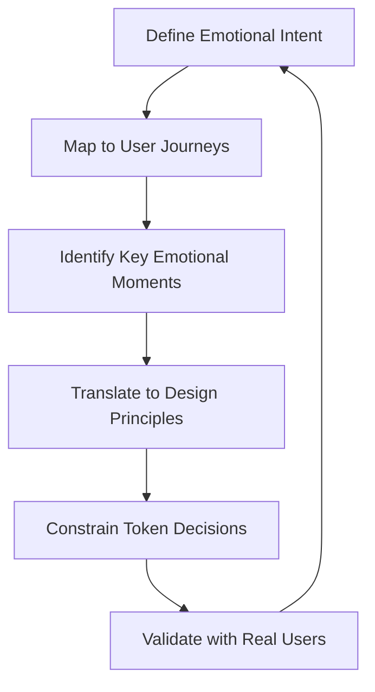
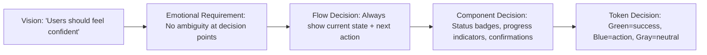
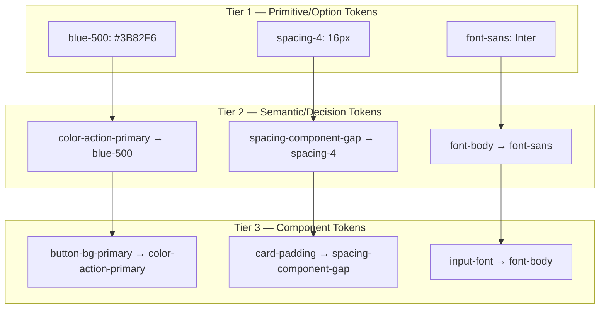
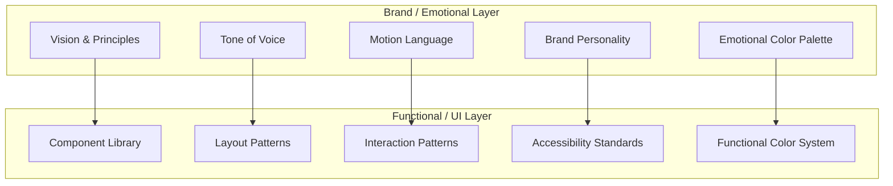
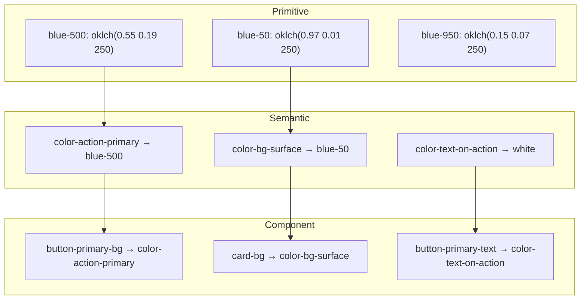
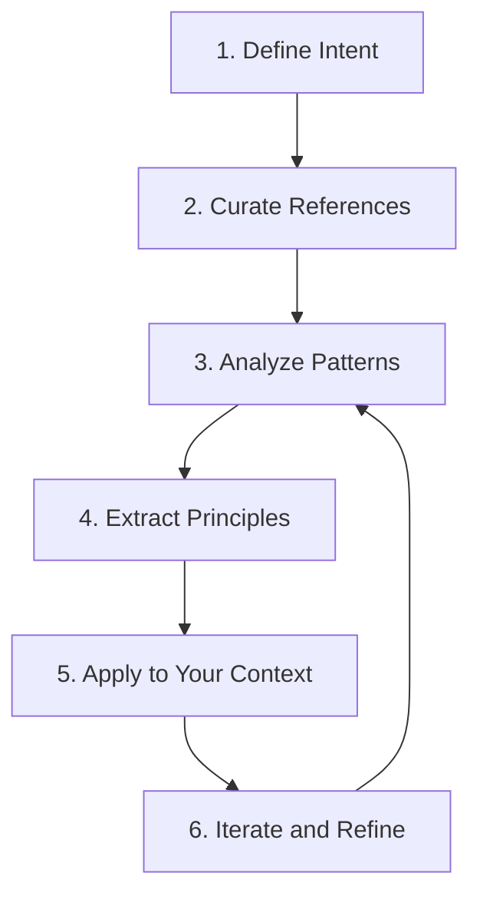

# Design System Methodology — Vision, Architecture, and Color Science

A comprehensive deep analysis of how top teams build design systems: from emotional vision to token architecture to color science. Covers vision-driven design, emotional journey mapping, token-based architecture, color system methodology (OKLCH/OKLAB), reference-driven workflows, and documentation frameworks.

---

## Table of Contents

1. [Vision-Driven Design Systems](#1-vision-driven-design-systems)
2. [Emotional Flow & User Journey Mapping](#2-emotional-flow--user-journey-mapping)
3. [Design System Architecture Patterns](#3-design-system-architecture-patterns)
4. [Color System Methodology](#4-color-system-methodology)
5. [Reference-Driven Design Workflow](#5-reference-driven-design-workflow)
6. [Design System as Template/Framework](#6-design-system-as-templateframework)
7. [Steal — Actionable Patterns](#7-steal--actionable-patterns)
8. [References](#references)

---

## 1. Vision-Driven Design Systems

### What "Vision" Means Before Building

Vision in design systems is not a mood board or a brand guideline — it is the answer to: **"How should people feel when they use this product?"** Top design teams define vision before selecting a single color or component. It is the emotional north star that constrains every subsequent decision.

### Emotional Resonance vs Functional Utility

This is the central tension in design system philosophy:

| Dimension | Emotional Resonance | Functional Utility |
|-----------|--------------------|--------------------|
| Question | "How does it feel?" | "Does it work?" |
| Measures | Delight, trust, identity, pride | Task completion, error rate, speed |
| Risk of over-indexing | Pretty but unusable | Works but forgettable |
| Design lever | Motion, color temperature, spacing rhythm, typography personality | Layout, hierarchy, input patterns, error handling |

The best products refuse to choose. They treat emotional resonance as a **multiplier** on functional utility, not a separate concern.

### Company Case Studies

#### Apple — Aesthetic Integrity

Apple's Human Interface Guidelines define a principle called **aesthetic integrity**: "not a measure of how beautiful an app is, but rather how well the appearance of the app integrates with its function." This is the clearest articulation of vision-as-integration.

Key practices:
- **"The only thing that really matters is how well your app satisfies the emotional and practical needs of the people you are designing for"** — Apple Design Resources
- Sound, haptics, and visuals work together for emotional responses, making products feel personal
- The term "human interface" (not "user interface") signals that the person is the center, not the system
- **Concentricity** (WWDC 2025): a geometric principle where shapes nest within each other by aligning radii and margins around a shared center, creating visual harmony at every scale
- New unified design system (WWDC 2025) spans all platforms with shared geometric foundations

#### Stripe — The Four Pillars of Quality

Katie Dill (Head of Design) built a quality assessment framework with four pillars:

```
Utility → Usability → Craft → Beauty
(Can you sit?)  (Comfortable?)  (Well-made?)  (Enjoyable?)
```

**Specific practices:**
- **Quality Assessment Checklist**: categories include utility, usability, craft, and beauty, covering copy, motion, load time, transitions
- **"Walk the Store"**: cross-functional teams (engineers, PMs, designers) experience products as users would, regularly reviewing the top 17 most important user journeys
- **Friction Logs**: systematic documentation of where users encounter friction — not a substitute for talking to users, but an addition
- **Essential Journeys Scorecard**: quarterly color-coded (red/orange/yellow/green) tracking of critical user flows
- **MVQP** (Minimum Viable Quality Product): "solves the user problem in a complete way, with a level of refinement that helps them use it effectively and build trust"
- **Measurable impact**: redesigned onboarding email with better typography, layout, imagery → **+20% product conversion**. Checkout improvements → **+10.5% activations and revenue**

Patrick Collison's statement: "I would be far less happy if Stripe was successful but not well-crafted and beautiful." Designers are positioned at Day One on every product.

#### Linear — Craft as Identity

Linear's [Method](https://linear.app/method) treats craft as the core differentiator:

- **"The quality of a product is driven by both the talent of its creators and how they feel while they're crafting it"** — craft is both process and outcome
- Finnish aesthetic influence: prizes craftsmanship, both as a process and as an end
- **"There is a lost art of building true quality software"** — Linear's mission is to restore it
- Community identity: "People who resonate with Linear's cultural beliefs don't just see it as a product — they feel a sense of identity and belonging that goes way beyond functionality"
- Three methodology pillars: **Direction** (clear goals, scope) → **Building** (momentum, detailed issues, user feedback, public building) → **Quality** (craft as emotional driver)
- Passion for craft is the most important thing they look for in new hires

#### Vercel — Purposeful Minimalism

Vercel's design philosophy is embodied in the Geist design system:

- **Geist font**: crafted specifically for developers and designers, embodying simplicity, minimalism, and speed
- Influenced by Swiss design movement — precision, clarity, function
- High x-height for legibility, short descenders, angular strokes on terminals
- Geist Sans (UI) + Geist Mono (code) = complete typographic system
- Default font in Next.js 15+ — the design system is the framework
- Open source — the system itself becomes infrastructure

### The Vision Definition Process



Top teams follow this cycle:
1. **Articulate the feeling** before any visual work (e.g., "confident", "effortless", "precise")
2. **Map where emotions matter most** in the user journey (onboarding, error states, success moments)
3. **Derive principles** that connect feeling to decision (e.g., "confidence = never ambiguous about what happened")
4. **Let principles constrain tokens** — color temperature, spacing rhythm, motion curves all flow from vision
5. **Validate** — walk the store, friction log, user testing

---

## 2. Emotional Flow & User Journey Mapping

### What Is an Emotional Journey Map?

An emotional journey map extends the standard experience/customer journey map by associating an **emotional status indicator** at each stage. Emotions are plotted as a single line across journey phases, literally signaling the emotional "ups" and "downs" — a contextual layer that tells you where the user is delighted versus frustrated.

### Components of an Emotional Journey Map

| Component | Description |
|-----------|-------------|
| **Phases** | Major stages of the experience (awareness → onboarding → daily use → power use) |
| **Actions** | What the user does at each phase |
| **Thoughts** | What the user is thinking (internal monologue) |
| **Emotions** | Feeling state plotted on a valence axis (positive ↔ negative) |
| **Touchpoints** | Where the user interacts with the product |
| **Pain Points** | Where emotions dip — friction, confusion, frustration |
| **Opportunities** | Where design intervention can shift emotions upward |

### How Vision Translates to Concrete User Flow

The connection between abstract vision and concrete flow works through **emotional anchoring**:



### Frameworks and Tools

**Nielsen Norman Group Journey Mapping 101:**
- Focus on one persona and one scenario per map
- Document actions, thoughts, feelings at each step
- Identify pain points and opportunities
- Keep it collaborative — journey maps are alignment tools, not deliverables

**Service Design Tools — Emotional Journey:**
- Plot emotional valence across timeline phases
- Use as overlay on existing customer journey maps
- Compare emotional trajectories of different user segments

**Practical Tools:**
- **Miro/FigJam**: visual journey mapping with mood labels, reaction icons, emoji states
- **Overflow**: user flow + emotional annotation
- **Experience mapping workshops**: cross-functional teams walk through flows together

### The Emotional UX Framework (2025)

Modern emotional UX design considers four dimensions:

1. **Visceral** — immediate aesthetic reaction (first impression, visual appeal)
2. **Behavioral** — usability emotions (satisfaction from easy task completion, frustration from friction)
3. **Reflective** — identity and meaning (pride in using the product, sense of belonging)
4. **Temporal** — how emotions change over time (novelty → familiarity → mastery)

**Key insight**: by 2025, 80% of customers value their experience with a company as much as its product. The emotional layer is what differentiates.

---

## 3. Design System Architecture Patterns

### The Three-Tier Token Architecture

The modern standard, detailed in [Martin Fowler's Design Token-Based UI Architecture](https://martinfowler.com/articles/design-token-based-ui-architecture.html):



#### Tier 1: Primitive/Option Tokens
- Define **what** styles can be used — raw values (color palettes, spacing scales, font families)
- Context-agnostic: `blue-500` has no meaning about where to use it
- Should be treated as **private/internal** — developers should not reference directly
- Also called: base tokens, core tokens, foundation tokens, reference tokens

#### Tier 2: Semantic/Decision Tokens
- Define **how** options should be applied contextually across the UI
- Carry meaning: `color-action-primary` tells you it's for primary actions
- Reference primitive tokens: `color-action-primary → blue-500`
- This is the **public API** of the design system
- Also called: alias tokens, system tokens

#### Tier 3: Component Tokens
- Define **where** styles are applied to specific UI elements
- Most granular: `button-bg-primary → color-action-primary`
- Optional for smaller systems — two-tier (primitive + semantic) works for many teams
- Recommended for large organizations with frequent design changes

#### Key Architectural Principles

**Hierarchical aliasing**: Component tokens → semantic tokens → primitive tokens. Changes cascade downward.

**Scope management**: Making primitive tokens private reduces file size, prevents developers from bypassing the semantic layer, and preserves design system integrity.

**Two-layer vs three-layer**:
- **Two-layer** (primitive + semantic): stable design decisions, smaller projects, moderate maintenance
- **Three-layer** (+ component): large organizations, frequent design evolution, clearer developer guidance

### Real-World Design System Architectures

#### Shopify Polaris

Polaris underwent a major architecture shift in 2025:
- **Web Components** (October 2025): replaced React-based components with framework-agnostic web components
- **Unified across surfaces**: Admin, Checkout, Customer Accounts, App Bridge all share the same components and props
- **Token architecture**: CSS custom properties + JSON export, encoding color, spacing, border radius, typography, motion
- **Key principle**: deterministic styling across web and native builds via platform-friendly token formats

#### GitHub Primer

Primer uses a three-tier color token system:
- **Base tokens**: lowest level, map directly to raw hex values. **Never use directly in code/design** — reference only
- **Functional tokens**: represent global UI patterns (text, borders, shadows, backgrounds). Most commonly used. Respect color modes by referencing base tokens
- **Component/Pattern tokens**: more specific, unique to particular use cases. Limited scope

**Dark mode architecture**: inverted neutral scales — light scale starts with white, dark scale starts with black. This inversion lets light and dark themes share many functional tokens without custom overrides.

**Naming convention**: `{purpose}-{role}-{modifier}` (e.g., `bgColor-default`, `borderColor-sponsors-emphasis`, `fgColor-muted`)

**Semantic color roles** (8 total): `accent`, `success`, `attention`, `danger`, `open`, `closed`, `done`, `sponsors` — each with muted/emphasis variants for background, border, and foreground.

**Neutral scale**: steps 0-13 with designated ranges:
- Steps 0-6: Backgrounds
- Steps 7-8: Borders and dividers
- Steps 9-10: Text and icons

#### Radix UI / Radix Colors

Radix uses a **12-step color scale** with each step designed for a specific use case:

| Step | Category | Use Case |
|------|----------|----------|
| 1 | Background | App background |
| 2 | Background | Subtle background (cards, sidebars, code blocks) |
| 3 | Component | Default state background |
| 4 | Component | Hover state |
| 5 | Component | Active/selected state |
| 6 | Border | Non-interactive elements (sidebars, separators) |
| 7 | Border | Interactive components |
| 8 | Border | Strong borders, focus rings |
| 9 | Solid | Purest step — highest chroma, least white/black mixing. Accent color. |
| 10 | Solid | Hover state for step 9 backgrounds |
| 11 | Text | Low-contrast text |
| 12 | Text | High-contrast text |

**Dark mode**: each scale has light + dark variants. Apply `dark` class to `<html>` or `<body>` and it "just works." Each scale also has **alpha variants** for blending into colored backgrounds.

**Key insight**: the 12-step system eliminates decision paralysis. Designers pick from a constrained set where every step has a defined purpose.

#### shadcn/ui

shadcn/ui uses a fundamentally different philosophy — **open code distribution** rather than a traditional component library:

- **Architecture**: headless UI components (behavior) + CSS variable theming (appearance). Design is separate from implementation
- **CSS variable convention**: `background` and `foreground` pairs for every color role
- **Theme switching**: components reference CSS variables, not specific values. Switching themes only requires updating the class on the root element — CSS variables cascade down, updating every component without React re-renders
- **Three core benefits**: maintainability (update variable definitions, not components), consistency (related elements share visual relationships), flexibility (new themes without touching components)

#### Figma Variables (2025-2026)

Figma's design system architecture has undergone a major evolution:
- **Extended collections**: multi-brand theming — a parent design system that can be extended with brand-specific overrides while staying synced with core changes
- **W3C Design Tokens spec 1.0**: native import/export support (November 2025)
- **Variable types**: color, number, string, boolean, plus composite/array (2025) and expression/conditional (2026 preview)
- **Three-layer architecture in Figma**: primitive collections → semantic collections → component collections

### The Dual-Layer Model: Brand/Emotional vs Functional/UI

Beyond token tiers, a higher-level architectural pattern is emerging:



**Why this separation matters** (from Teresa Alaniz, "Beyond Components"):
- Design systems without an emotional layer become "rigid, resented, or abandoned"
- With the emotional layer, they become "cultural glue" — reducing cognitive load while reinforcing creative freedom within clear boundaries
- Systems are evolving beyond logic into something that responds to "tone, pacing, emotion, and rhythm"
- For 2025-2026: motion has become intrinsic to brand identity — logos, typography, and graphic systems are now conceived with movement in mind

**Governance**: mature systems treat governance as a service touchpoint with transparent contribution models, clear review processes, and well-defined rules for breaking patterns.

---

## 4. Color System Methodology

### Building a Color System from Scratch

#### Step 1: Understand Your Color Categories

| Category | Purpose | Examples |
|----------|---------|---------|
| **Brand/Emotional** | Identity, personality, differentiation | Primary brand color, accent colors |
| **Functional/Semantic** | Communicate status and meaning | Success (green), Error (red), Warning (amber), Info (blue) |
| **Neutral** | Structure, hierarchy, text | Backgrounds, borders, text, shadows |

#### Step 2: Choose Your Color Space — OKLCH

**Why OKLCH over HSL/RGB:**

HSL has a fundamental structural problem: lightness is not perceptually uniform across hues. Blue and yellow at 50% HSL lightness look drastically different in perceived brightness. This makes systematic palette generation impossible.

OKLCH (Oklab Lightness, Chroma, Hue) solves this:

| Property | HSL Problem | OKLCH Solution |
|----------|-------------|----------------|
| **Lightness** | Not perceptually accurate across hues | Equal L values = equal perceived brightness |
| **Saturation/Chroma** | Same S% means different visual saturation per hue | Chroma accurately represents visual saturation |
| **Gradients** | Dead grey zones between certain hues | Smooth, natural transitions |
| **Palette generation** | Inconsistent visual steps | Equal numeric steps = equal visual differences |
| **Accessibility** | Hard to predict contrast from HSL values | Predictable contrast from L values |
| **Gamut** | Limited to sRGB | Supports P3 and beyond |
| **Readability** | `rgb(202, 0, 0)` means nothing | `oklch(0.55 0.22 27)` = "medium-light, vivid, red" |

**OKLCH components:**
- **L** (Lightness): 0 (black) to 1 (white) — perceptually uniform
- **C** (Chroma): 0 (gray) to ~0.4 (maximum saturation) — varies by hue
- **H** (Hue): 0-360 degrees on the color wheel

**Browser support**: 93%+ adoption (Chrome, Edge, Firefox, Safari). Part of CSS Color Level 4. Native app frameworks still catching up.

**Practical benefit for theming**: hold L constant for text roles while varying C and H for branding, without breaking legibility. Adjust L and C to switch light/dark/high-contrast modes without re-authoring entire palettes.

#### Step 3: Token Architecture for Color

Three-tier color token architecture:



#### Step 4: Generate Scales

Using OKLCH, generate a 10-11 step scale per hue:

```css
/* Tailwind v4 approach — OKLCH native */
--color-blue-50:  oklch(0.97 0.01 250);
--color-blue-100: oklch(0.93 0.03 250);
--color-blue-200: oklch(0.86 0.07 250);
--color-blue-300: oklch(0.76 0.12 250);
--color-blue-400: oklch(0.66 0.16 250);
--color-blue-500: oklch(0.55 0.19 250);  /* base */
--color-blue-600: oklch(0.47 0.17 250);
--color-blue-700: oklch(0.39 0.14 250);
--color-blue-800: oklch(0.31 0.11 250);
--color-blue-900: oklch(0.22 0.08 250);
--color-blue-950: oklch(0.15 0.05 250);
```

Key: keep hue constant, decrease lightness linearly, adjust chroma to peak at mid-range and taper at extremes (very light/dark colors naturally have less chroma).

### Dark Mode / Theme Switching Patterns

#### Pattern 1: Semantic Token Inversion (Recommended)

```css
:root {
  --color-bg-primary: var(--color-white);
  --color-text-primary: var(--color-gray-900);
  --color-border-default: var(--color-gray-200);
}

.dark {
  --color-bg-primary: var(--color-gray-950);
  --color-text-primary: var(--color-gray-50);
  --color-border-default: var(--color-gray-800);
}
```

Components reference semantic tokens only. Theme switching = updating CSS variables on the root element. No component-level changes needed.

#### Pattern 2: Media Query + Class Toggle

```css
/* System preference */
@media (prefers-color-scheme: dark) {
  :root { /* dark tokens */ }
}

/* Manual override */
[data-theme="dark"] { /* dark tokens */ }
```

#### Pattern 3: Inverted Neutral Scale (Primer approach)

Light scale: white → black (steps 0-13)
Dark scale: black → white (steps 0-13)

Same functional token names produce contextually appropriate values — many tokens need no override at all.

**Best practices:**
- Never mix hard-coded colors with tokens
- Centralize all theme decisions in a few files
- Components should never reference specific theme colors — only semantic tokens
- Test with high-contrast mode, not just light/dark

### Real-World Color Systems Compared

#### Tailwind CSS v4

- **Shifted to OKLCH** (from RGB) for wider P3 gamut and richer hues
- 22 color families, 11 steps each (50-950)
- Configuration moved from `tailwind.config.js` to CSS file directly
- Palette generators create scientifically balanced scales in OKLCH

#### Radix Colors

- 12-step scale with purpose-defined steps (see Section 3 table)
- Every scale tuned for fully accessible contrast ratios
- Step 9 = purest/highest chroma
- Light + dark + alpha variants for every scale
- ~30 color scales in Radix Themes

#### Open Props

- CSS custom properties as a complete design token system
- JIT compiler: only delivers properties actually used
- Theme-agnostic aliases: reference a custom property without worrying about light/dark — value adapts to context
- Single naming convention for the entire team
- Covers: colors, gradients, shadows, aspect ratios, typography, easings, animations, sizes, borders, z-indexes, media queries

#### Stripe — Accessible Color Systems

Stripe published their approach to [designing accessible color systems](https://stripe.com/blog/accessible-color-systems) — building color scales that maintain WCAG contrast ratios across all themes while preserving brand identity.

---

## 5. Reference-Driven Design Workflow

### How Top Designers Use References

The reference-driven workflow is how award-winning designers translate inspiration into original work. It is **not** copying — it is systematic learning from solved problems.

### The Process



#### 1. Define Intent
Before browsing Awwwards, ask: **"What exactly am I looking for?"** The more specific the intention, the faster you find what speaks to you. Categories: layout pattern, animation technique, color mood, interaction model, typography treatment.

#### 2. Curate References
**Primary sources:**
- [Awwwards](https://www.awwwards.com/) — cutting-edge web design, jury-reviewed. Collections can be private/public, shared with team, or used as moodboards
- [Dribbble](https://dribbble.com/) — UI exploration and visual direction
- [Mobbin](https://mobbin.com/) — mobile app patterns
- [Godly](https://godly.website/) — curated landing pages

**Key practice**: a well-structured moodboard saves enormous time during creation. Curate 20-30 references, then distill to 5-8 that share the feeling you're targeting.

#### 3. Analyze Patterns
Don't collect pretty designs — study them. For each reference, identify:
- What makes it feel the way it feels? (spacing, color temperature, motion)
- What pattern solves which UX problem?
- What technology makes it possible?

#### 4. Extract Principles (not pixels)
Turn observations into transferable principles:
- "Large whitespace between sections creates breathing room" (not "use 120px padding")
- "Staggered entrance animations create anticipation" (not "use 200ms delay")

### Animation Tools in the Workflow

#### GSAP (GreenSock)

- Powers animations on **12M+ websites**
- Acquired by Webflow (October 2024) — SplitText, Staggers, ScrollTrigger now free for all
- **Best for**: complex timelines, SVG animation, scroll-driven experiences, cross-browser consistency
- **ScrollTrigger**: links animation progress to scroll position
- **Key technique**: `quickTo` pre-creates animation functions for 60fps scroll-driven updates
- Smooth scrolling: combine with Lenis or Locomotive Scroll for synchronized animation

#### Motion (formerly Framer Motion)

- **Best for**: React-first declarative UI transitions, micro-interactions, gesture-driven animation
- Variants system for complex state-based animations
- Layout animations (automatic FLIP technique)
- `AnimatePresence` for exit animations

#### Combined Approach (Common in Awwwards Winners)

Use **Motion** for React component transitions and micro-interactions. Use **GSAP** for advanced timelines, scroll-driven sequences, and SVG artistry. Both in the same project.

**Awwwards-winning characteristics**: elevated micro-interactions, subtle parallax, expert use of space and typography, motion and storytelling while preserving usability.

#### Supporting Tools
- **Lenis**: smooth scrolling library
- **Codrops/Tympanus**: experimental techniques with tutorials
- **Three.js / WebGL**: 3D elements in web design
- **CSS Scroll-Driven Animations**: native CSS alternative for simpler cases

### Iterative Refinement Process

```
V0: Vision + references → rough layout
V1: Structure + spacing + typography hierarchy
V2: Color application + component styling
V3: Interaction + animation + micro-interactions
V4: Polish — transitions, loading states, edge cases
V5: Performance — optimize animations, lazy load, measure
```

Each version is tested against the original vision: **"Does it feel right?"**

---

## 6. Design System as Template/Framework

### What a Design System Document Should Contain

#### Brad Frost's Atomic Design

The five levels, from abstract to concrete:

| Level | Definition | Example |
|-------|-----------|---------|
| **Atoms** | Smallest functional units — can't break down further | Button, input, label, icon, color swatch |
| **Molecules** | Simple groups functioning as a unit (single responsibility) | Search form (label + input + button) |
| **Organisms** | Complex components composed of molecules/atoms | Header (logo + nav + search + user menu) |
| **Templates** | Page-level layouts defining content structure (skeleton) | Blog post template, dashboard layout |
| **Pages** | Specific template instances with real content | Actual blog post, real dashboard data |

**Key principles:**
- Operates **non-linearly** — it's a mental model, not sequential steps
- Enables context-shifting between component detail and whole-system assessment
- Content and structure are interdependent: structure influences content, content shapes structure
- The chemistry-inspired terminology creates intuitive understanding across organizations

**Brad Frost (2025)**: atomic design is more relevant now than when he first created it, continuing as a helpful model connecting design systems to their products.

#### Nathan Curtis's Framework

Nathan Curtis (EightShapes) treats the design system as a **product, not a project**:

**Planning phases:**
- **Discover**: inventory existing products (Parts, Products & People exercise), identify needs
- **Explore**: explore potential futures, multiple directions
- **Plan**: who will make what, by when
- **Align**: stakeholders with explorations and plans, generate awareness, foster agreement

**Feature delivery**: Discover → Design → Build → Document

**Critical insight**: "Documentation is focused on communicating not what to build, but instead what's built and how to use it." Documentation is a tool to use, not an afterthought.

**System types**: Curtis distinguishes between systems that serve different product/team configurations — solo products, multi-product, multi-team, multi-brand.

#### UXPin's 9-Step Documentation Guide

1. **Understand Your Audience** — structure documentation as a product for your team's consumption
2. **Outline Component Documentation Needs** — patterns, code snippets, colors, images, fonts, accessibility
3. **Create a Style Guide** — visual standards covering colors, logo usage, tone
4. **Develop Reusable Templates** — recyclable documentation templates save time and maintain consistency
5. **Establish Single Source of Truth** — universal agreement on design standards
6. **Include a Starter's Kit** — onboarding resources from beginner to advanced
7. **Collect Feedback** — accessible feedback mechanisms (not just GitHub)
8. **Distribute Responsibility** — share documentation work across team members
9. **Update Regularly** — continuous monitoring, maintenance, relevance

### Recommended Document Structure

Based on synthesis of all frameworks:

```
Design System Document
├── 1. Vision & Principles
│   ├── Emotional intent
│   ├── Design principles (3-5 max)
│   └── Brand personality attributes
├── 2. Foundations
│   ├── Color system (tokens, scales, semantic mapping)
│   ├── Typography (scale, hierarchy, font pairings)
│   ├── Spacing & layout (grid, spacing scale, breakpoints)
│   ├── Motion & animation (easing, duration, principles)
│   ├── Iconography (style, sizing, usage)
│   └── Elevation & shadows
├── 3. Components
│   ├── Per component:
│   │   ├── Description & purpose
│   │   ├── Anatomy (visual breakdown)
│   │   ├── Variants & states
│   │   ├── Usage guidelines (when, where, why)
│   │   ├── Accessibility (keyboard, screen reader, contrast)
│   │   ├── Code examples
│   │   └── Do's and Don'ts
│   └── Component status (stable/beta/deprecated)
├── 4. Patterns
│   ├── Common UI patterns (forms, navigation, data display)
│   ├── Page templates
│   └── Composition guidelines
├── 5. Content & Voice
│   ├── Tone of voice guidelines
│   ├── Writing patterns
│   └── Error message templates
├── 6. Accessibility
│   ├── Standards (WCAG level)
│   ├── Color contrast requirements
│   ├── Keyboard navigation
│   └── Screen reader guidelines
├── 7. Implementation
│   ├── Getting started / Quick start
│   ├── Installation
│   ├── Token usage guide
│   ├── Framework-specific guides
│   └── Migration guides
├── 8. Governance
│   ├── Contribution model
│   ├── Review process
│   ├── Versioning strategy
│   └── Deprecation policy
└── 9. Resources
    ├── Figma library link
    ├── Storybook / component playground
    ├── Changelog
    └── FAQ
```

**Best practices for structure:**
- Keep navigation shallow, label clearly, group by use case not just topic
- Different roles need different info — designers, developers, PMs all have unique needs
- Add details of where, when, and why for each component
- Explain how components combine to create user flows

---

## 7. Steal — Actionable Patterns

### Patterns to Directly Reuse

| Pattern | Source | Implementation |
|---------|--------|---------------|
| **Quality Pillars** | Stripe (Katie Dill) | Assess every feature against Utility → Usability → Craft → Beauty |
| **Walk the Store** | Stripe | Monthly cross-functional review of top 15-20 user journeys |
| **Friction Logs** | Stripe | Systematic documentation of friction points by using your own product |
| **Essential Journeys Scorecard** | Stripe | Quarterly color-coded tracking of critical flows |
| **12-Step Color Scale** | Radix | Purpose-defined steps (1-2 bg, 3-5 interactive, 6-8 border, 9-10 solid, 11-12 text) |
| **Inverted Neutral Scale** | Primer | Share functional tokens across light/dark by inverting the base scale |
| **OKLCH Palette Generation** | Tailwind v4 | Generate scales with perceptually uniform lightness steps |
| **CSS Variable Theming** | shadcn/ui | Components reference variables, theme switch = root class change, zero re-renders |
| **Open Code Distribution** | shadcn/ui | Ship source code, not packages. Users own and modify components |
| **Three-Tier Tokens** | Martin Fowler | Primitive (private) → Semantic (public API) → Component (granular) |
| **Craft as Identity** | Linear | Hire for craft passion, treat quality as the product's identity |
| **MVQP** | Stripe | Ship minimum viable **quality** — not minimum viable product |
| **Atomic Design** | Brad Frost | Atoms → Molecules → Organisms → Templates → Pages as mental model |
| **System as Product** | Nathan Curtis | Treat design system as a living product with roadmap and backlog |
| **Extended Collections** | Figma | Multi-brand theming that inherits from parent while allowing overrides |
| **Scroll-Driven Animation** | GSAP + Lenis | ScrollTrigger + quickTo for 60fps scroll-linked motion |

### Non-Obvious Insights

1. **Beauty has measurable ROI**: Stripe's email redesign → +20% conversion. This is not a soft metric.
2. **Two-tier tokens are fine for most teams**: three-tier adds overhead that only pays off at large scale with frequent changes.
3. **OKLCH makes dark mode trivial**: hold hue, adjust L and C — no need to hand-pick every dark mode color.
4. **Vision should be one sentence**: "Users should feel confident" is better than a 10-page brand document.
5. **The emotional layer prevents system abandonment**: without it, design systems feel like bureaucracy.
6. **Radix's 12 steps > Tailwind's 11 steps** for semantic clarity: every Radix step has a defined role.
7. **shadcn proved the library model is dead**: copy-paste source code > npm install for design systems.
8. **W3C Design Tokens spec 1.0 (2025)** is the standard — build on it now, future-proof for free.
9. **Figma Extended Collections (2025)** solve the multi-brand problem that design systems have struggled with for a decade.
10. **GSAP is free now** (post-Webflow acquisition) — the barrier to Awwwards-quality animation is zero.

---

## References

### Vision & Design Philosophy
- [Apple Human Interface Guidelines](https://developer.apple.com/design/human-interface-guidelines)
- [Apple WWDC 2025 — New Design System](https://developer.apple.com/videos/play/wwdc2025/356/)
- [The Essence of Apple Design: A Deep Dive into Human-Centered Innovation](https://encyclopedia.design/2025/02/03/the-essence-of-apple-design-a-deep-dive-into-human-centered-innovation/)
- [Linear Method — Practices for Building](https://linear.app/method)
- [Linear: Design is More Than Code](https://linear.app/now/design-is-more-than-code)
- [Linear: Craft](https://linear.app/now/craft)
- [Linear App Case Study — Eleken](https://www.eleken.co/blog-posts/linear-app-case-study)
- [Linear Spotlight — Sequoia Capital](https://sequoiacap.com/article/linear-spotlight/)
- [Geist Font — Vercel](https://vercel.com/font)
- [Geist Design System — Vercel](https://vercel.com/geist/introduction)
- [The Birth of Geist: A Typeface Crafted for the Web — Basement Studio](https://basement.studio/post/the-birth-of-geist-a-typeface-crafted-for-the-web/)

### Stripe Design Quality
- [Inside How Stripe Crafts Quality Products — Katie Dill](https://creatoreconomy.so/p/how-stripe-crafts-quality-products-katie-dill)
- [Building Beautiful Products with Stripe's Head of Design — Lenny's Podcast](https://www.lennysnewsletter.com/p/building-beautiful-products-with)
- [Craft and Beauty: The Business Value of Form in Function — Stripe Sessions 2024](https://stripe.com/gb/sessions/2024/craft-and-beauty-the-business-value-of-form-in-function)
- [Craft and Beauty: The ROI of Marrying Form and Function — Figma Blog](https://www.figma.com/blog/stripe-sessions-linear-figma/)
- [Designing Accessible Color Systems — Stripe Blog](https://stripe.com/blog/accessible-color-systems)
- [Inside Stripe's Engineering Culture — Pragmatic Engineer](https://newsletter.pragmaticengineer.com/p/stripe)

### Design Tokens & Architecture
- [Design Token-Based UI Architecture — Martin Fowler](https://martinfowler.com/articles/design-token-based-ui-architecture.html)
- [Design Tokens: The Foundation of UI Architecture — Feature-Sliced Design](https://feature-sliced.design/blog/design-tokens-architecture)
- [Design Tokens Explained — Contentful](https://www.contentful.com/blog/design-token-system/)
- [Developing Your Token Structure — Rangle](https://rangle.io/blog/developing-your-token-structure)
- [Design Tokens 2.0: The Ultimate Guide — Bootcamp](https://bootcamp.uxdesign.cc/design-tokens-2-0-the-ultimate-guide-32b4a047503)
- [Design Token System — SAP](https://www.sap.com/design-system/digital/foundations/tokens/design-tokens/)
- [W3C Design Tokens Color Module 2025.10](https://www.designtokens.org/tr/drafts/color/)

### Design Systems (Company-Specific)
- [Shopify Polaris — Unified and for the Web (2025)](https://www.shopify.com/partners/blog/polaris-unified-and-for-the-web)
- [Shopify Polaris Design System Deep Analysis — UpUply](https://www.upuply.com/blog/shopify-design-system)
- [Primer Design System — GitHub](https://primer.style/)
- [Primer UI Color System](https://primer.style/foundations/color/overview/)
- [Primer Primitives — GitHub](https://github.com/primer/primitives)
- [Radix Colors](https://www.radix-ui.com/colors)
- [Radix Color Scale — Understanding the Scale](https://www.radix-ui.com/colors/docs/palette-composition/understanding-the-scale)
- [shadcn/ui — Theming](https://ui.shadcn.com/docs/theming)
- [Architecture of shadcn/ui — DeepWiki](https://deepwiki.com/shadcn-ui/ui/2-architecture)
- [The Anatomy of shadcn/ui — Manupa](https://manupa.dev/blog/anatomy-of-shadcn-ui)

### Color Science
- [OKLCH in CSS: Why We Moved from RGB and HSL — Evil Martians](https://evilmartians.com/chronicles/oklch-in-css-why-quit-rgb-hsl)
- [OKLCH Explained for Designers — UX Collective](https://uxdesign.cc/oklch-explained-for-designers-dc6af4433611)
- [OKLCH — The Modern CSS Color Space for 2025](https://medium.com/@alexdev82/oklch-the-modern-css-color-space-you-should-be-using-in-2025-52dd1a4aa9d0)
- [About OKLCH — anxndsgn](https://www.anxndsgn.com/en/writing/oklch)
- [oklch() — MDN](https://developer.mozilla.org/en-US/docs/Web/CSS/color_value/oklch)
- [oklch() — CSS-Tricks](https://css-tricks.com/almanac/functions/o/oklch/)
- [Tailwind CSS v4 OKLCH Color Palette](https://tailwindcolor.com/)
- [Open Props — Sub-Atomic Styles](https://open-props.style/)
- [Open Props and Custom Properties as a System — CSS-Tricks](https://css-tricks.com/open-props-and-custom-properties-as-a-system/)
- [Supporting Color Contrast in Design Systems — Ethan Gardner](https://www.ethangardner.com/posts/supporting-color-contrast-accessibility/)

### Dark Mode & Theming
- [Dark Mode with Design Tokens in Tailwind CSS](https://www.richinfante.com/2024/10/21/tailwind-dark-mode-design-tokens-themes-css)
- [A Design Tokens Workflow Part 7: Light and Dark Mode — Always Twisted](https://www.alwaystwisted.com/articles/a-design-tokens-workflow-part-7)
- [Design Tokens Usage Guide — GitLab Pajamas](https://design.gitlab.com/product-foundations/design-tokens-using/)

### Emotional Design & Journey Mapping
- [Beyond Components: The Emotional Maturity of Design Systems — Teresa Alaniz](https://medium.com/design-bootcamp/beyond-components-the-emotional-maturity-of-design-systems-in-the-age-of-ai-13425ab50d80)
- [When Design Systems Learn to Feel — Amanda Hewett](https://amanda-hewett.medium.com/when-design-systems-learn-to-feel-ad3077e18b75)
- [Journey Mapping 101 — Nielsen Norman Group](https://www.nngroup.com/articles/journey-mapping-101/)
- [Emotional Journey — Service Design Tools](https://servicedesigntools.org/tools/emotional-journey)
- [Emotional Journey Map — Merck UX Strategy Kit](https://uxstrategykit.emd.design/methods/emotional-journey-map/)
- [Emotional UX in 2025 — Andrew Chornyy](https://medium.com/@andrew-chornyy/emotional-ux-in-2025-how-interface-design-affects-user-feelings-a362f6c91757)
- [Customer Experience Journey Mapping Guide — UXProsperar](https://www.uxprosperar.com/customer-experience-journey-mapping-guide/)

### Animation & Reference-Driven Design
- [Awwwards — Best GSAP Animation Websites](https://www.awwwards.com/websites/gsap/)
- [Award-Winning Animation Techniques for Websites — Bootcamp](https://medium.com/design-bootcamp/awwward-winning-animation-techniques-for-websites-cb7c6b5a86ff)
- [GSAP vs Framer Motion Comparison — Artekia](https://www.artekia.com/en/blog/gsap-vs-framer-motion)
- [Rebuild an Awwwards Landing Page — Olivier Larose](https://blog.olivierlarose.com/tutorials/awwwards-landing-page)
- [Building Scroll-Driven Animations with GSAP — Codrops](https://tympanus.net/codrops/2026/01/15/building-a-scroll-driven-dual-wave-text-animation-with-gsap/)
- [8 Must-Have Web Animation Tools — Framer Blog](https://www.framer.com/blog/web-animation-tools/)

### Documentation & Frameworks
- [Atomic Design Methodology — Brad Frost](https://atomicdesign.bradfrost.com/chapter-2/)
- [Designing Systems — Brad Frost](https://atomicdesign.bradfrost.com/chapter-1/)
- [Maintaining Design Systems — Brad Frost](https://atomicdesign.bradfrost.com/chapter-5/)
- [Design Tokens Course — Brad & Ian Frost](https://designtokenscourse.com)
- [Planning a Design System — Nathan Curtis Framework](https://uxplanet.org/planning-a-design-system-work-insights-from-nathan-curtiss-framework-902b27dc81c4)
- [Design System Features, Step-by-Step — Nathan Curtis](https://medium.com/eightshapes-llc/system-features-step-by-step-e69c90982630)
- [Principles of Design Systems — EightShapes](https://eightshapes.com/articles/principles-of-designing-systems/)
- [9 Steps to Document Your Design System — UXPin](https://www.uxpin.com/studio/blog/design-system-documentation-guide/)
- [Documentation That Drives Adoption — Figma Blog](https://www.figma.com/blog/design-systems-103-documentation-that-drives-adoption/)
- [The Design System Guide — Documentation](https://thedesignsystem.guide/documentation)
- [How to Build a Design System in Figma: 2026 Guide — Muzli](https://muz.li/blog/how-to-build-a-design-system-in-figma-a-practical-guide-2026/)

### Figma & Multi-Brand Systems
- [Schema 2025: Design Systems for a New Era — Figma Blog](https://www.figma.com/blog/schema-2025-design-systems-recap/)
- [Preparing for the Design Tokens Era: Multi-Brand Systems — Dmytro Hanin](https://medium.com/@dimiganin/preparing-for-the-design-tokens-era-multi-brand-systems-and-figmas-extended-collections-9fd35ccd06df)
- [Design System Mastery with Figma Variables: 2025/2026 Playbook — Design Systems Collective](https://www.designsystemscollective.com/design-system-mastery-with-figma-variables-the-2025-2026-best-practice-playbook-da0500ca0e66)
- [Design Tokens in Practice: Figma Variables to Production Code — Design Systems Collective](https://www.designsystemscollective.com/design-tokens-in-practice-from-figma-variables-to-production-code-fd40aeccd6f5)
- [Using Figma Variables for Multi-Brand Design Systems — Rangle](https://rangle.io/blog/using-figma-variables-to-build-a-multi-brand-design-system)

### Trends & Industry
- [UI and UX Design Trends for 2026 — Raw Studio](https://raw.studio/blog/ui-and-ux-design-trends-for-2026-what-founders-and-designers-need-to-know/)
- [7 Design Trends in 2026 That Actually Matter — think.design](https://think.design/blog/design-trends-2026-that-actually-matter/)
- [Why Emotional Web Design Is Making a Comeback in 2026 — Composite](https://www.composite.global/news/designing-for-delight)
- [Design Trends 2026: Building Flexible Brand Systems — Renderforest](https://www.renderforest.com/blog/design-trends-2026-brand-systems)
