# Discord AI Agent Swarms：架構深度分析

> 來源：[@jumperz](https://x.com/jumperz/status/2020305891430428767) — "I Built an AI Agent Swarm in Discord. It Works Better Than Anything I've Tried (Full Guide)"（2026年2月8日）

## 起源：@jumperz 的文章

JUMPERZ (@jumperz)，UX 設計師、@Rebirthstud_io 創始人，發佈了一篇關於使用 Discord 作為協調骨幹構建 AI agent swarm 的完整指南。核心洞察：**Discord 的現有基礎設施（channels、threads、reactions、webhooks）完美映射到多智能體協調原語** —— 無需從頭構建自定義編排系統。

這不是理論練習。這種方法產生的效果比專門構建的 agent 框架更好，因為 Discord 免費解決了多智能體系統中最難的問題：**可觀察性**（你可以看到 agents 對話）、**human-in-the-loop**（直接回覆 thread）、**持久上下文**（thread 歷史永不消失）。

### 補充案例：Zach Wills 的 20-Agent Swarm

[Zach Wills](https://zachwills.net/i-managed-a-swarm-of-20-ai-agents-for-a-week-here-are-the-8-rules-i-learned/) 用一週時間運行了 4-20 個並行 AI agent 流，產出約 800 次提交、100+ PR、一個完整的全棧分析平台，花費約 $6,000 Claude Code credits。他的 8 條 swarm 管理規則：

| 規則 | 核心洞察 |
|------|---------|
| **1. 對齊計劃** | 執行前與 AI 共同制定計劃。修復壞計劃比修復壞實現便宜。 |
| **2. 長時間運行 = 問題** | Agent 運行數小時意味著分解不充分。拆得更小。 |
| **3. 主動管理記憶** | 將進度檢查點寫入 markdown 文件、PR 評論、Linear tickets —— 不是 agent 歷史。 |
| **4. 使用子 agents** | 專業化的流水線：計劃 → 實現 → 測試。每個階段獲得全新上下文。 |
| **5. 信任自主循環** | 定義 test → code → test → verify。不要打斷成功的循環。 |
| **6. 自動化系統** | 自更新的 CLAUDE.md 捕獲學習成果。系統自我改進。 |
| **7. 果斷重啟** | 立即殺掉偏離軌道的 agents。5-10 分鐘重啟成本 << 在錯誤方向上花數小時。 |
| **8. 頻繁提交** | 頻繁 git commit = 激進重啟的安全網。 |

**關鍵指標**：人類最大持續編排時間 3 小時。每個 PR 約 $75。Hub-and-spoke 模型（無 agent 間通信 —— 全部通過人類編排者）。

---

## What: Discord 作為多智能體基礎設施

Discord 不僅僅是聊天平台——它是一個**現成的分佈式協調層**,用於 AI agent swarms。不需要構建自定義編排基礎設施(消息代理、儀表板、日誌系統),團隊正在利用 Discord 的現有原語:

- **Channels** → 任務隊列或 agent 專用工作空間
- **Threads** → 帶對話歷史的獨立工作項
- **Reactions** → 任務狀態指示器(👀 已認領, ✅ 完成, ❌ 失敗)
- **Webhooks** → 異步 agent 到 Discord 消息發送
- **Roles** → 權限邊界和 agent 能力
- **Voice/Text logs** → 內置可觀察性和審計日誌

這種模式的出現是因為 Discord 同時解決了三個難題:**human-in-the-loop 可觀察性**、**異步消息傳遞**和**持久對話上下文**。

## Why: 可觀察性-協調權衡

### 自定義編排的問題

構建多智能體系統時,你需要:

1. **消息隊列**(RabbitMQ, Redis, Kafka)用於 agent 通信
2. **數據庫**存儲任務狀態和對話歷史
3. **儀表板**監控 agent 活動
4. **日誌基礎設施**調試失敗的工作流
5. **權限系統**控制 agent 訪問
6. **人工干預界面**在 agents 失敗時介入

Discord **開箱即用**提供所有這些,外加:

- 小中型團隊**零基礎設施成本**
- **移動應用**隨時隨地監控 swarms
- **通知**當 agents 需要人工輸入時
- **搜索**跨所有 agent 對話
- **權限模型**已經過實戰測試
- **速率限制**內置於 API(50 req/sec 全局)

### Discord vs. 自定義編排

| 功能 | 自定義系統 | Discord |
|---------|--------------|---------|
| **消息持久化** | 自建數據庫 | 永久免費(threads) |
| **可觀察性** | 自定義儀表板 | 原生 UI + 移動端 |
| **人工干預** | 構建審批 UI | 直接回復 thread |
| **速率限制** | 實現隊列 | 內置(429 錯誤) |
| **異步通信** | Redis/RabbitMQ | Webhooks + API |
| **對話上下文** | Session 存儲 | Thread 歷史 |
| **錯誤重放** | 自定義工具 | 重新讀取消息 |
| **審計日誌** | 編寫日誌基礎設施 | 內置 Discord 日誌 |

**權衡**: 你犧牲控制權(無法調優 Discord 內部)來獲得**即時基礎設施**和**零運維**。

### 實際約束: Discord 何時適用

Discord 最適合:
- **內部工具**(非面向客戶的 bots)
- **開發/QA 工作流**(代碼審查 swarms、測試自動化)
- **研究團隊**(agent 實驗,實時可見性)
- **小中型規模**(< 100 agents, < 10k messages/day)

Discord **不理想**用於:
- 高吞吐量生產系統(速率限制成為瓶頸)
- 面向客戶的 agents(用戶不想加入 Discord)
- 實時延遲敏感任務(API 延遲 ~100-500ms)
- 大規模並行 swarms(50 req/sec 全局限制)

## How: 架構模式

### 模式 1: Channel-as-Queue

**概念**: 每個 Discord channel 代表一個任務隊列。Agents 監控 channels 並通過 reaction 認領工作。

```
#design-tasks          → Design agent 在這裡監聽
#code-review-queue     → Review agent 處理 PRs
#deployment-requests   → Deploy agent 處理發布
```

**實現(discord.py)**:
```python
import discord
from discord.ext import commands

bot = commands.Bot(command_prefix='!')

@bot.event
async def on_message(message):
    if message.channel.name == 'code-review-queue':
        if not message.author.bot:
            # Agent 通過 reaction 認領任務
            await message.add_reaction('👀')

            # 處理工作
            result = await review_code(message.content)

            # 更新狀態
            if result.success:
                await message.add_reaction('✅')
                await message.create_thread(name="Review Results")
                thread = message.channel.threads[-1]
                await thread.send(result.feedback)
            else:
                await message.add_reaction('❌')

bot.run(DISCORD_TOKEN)
```

**為何用 reactions**: 它們是原子的、對所有 agents 可見,不需要數據庫狀態。每個人都能看到誰認領了什麼。

### 模式 2: Thread-as-Work-Item

**概念**: 每個 Discord thread 代表一個帶完整對話歷史的工作單元。

**工作流**:
1. 用戶在 `#requests` channel 發布任務
2. Orchestrator agent 創建 thread
3. Specialist agents 加入 thread 貢獻
4. Thread 歷史 = 完整審計追蹤

```python
@bot.event
async def on_message(message):
    if message.channel.name == 'requests':
        # 為該任務創建專用 thread
        thread = await message.create_thread(
            name=f"Task: {message.content[:50]}",
            auto_archive_duration=1440  # 24 小時
        )

        # 分配專家 agents
        await thread.send("@research-agent please analyze requirements")
        await thread.send("@code-agent implement when research is done")
```

**Thread 優點**:
- **上下文隔離**: 每個任務有自己的對話
- **歷史保存**: 調試的完整決策追蹤
- **自動歸檔**: 舊 threads 自動消失
- **通知**: Agents 被 mention 時收到通知

### 模式 3: 基於 Webhook 的 Agent 通信

**概念**: Agents 通過 webhooks 發布更新,無需維護持久 bot 連接。

**為何用 webhooks**:
- **無狀態**: Agent 不需要保持連接
- **可擴展**: 無 WebSocket 連接開銷
- **簡單**: 只是帶 JSON payload 的 HTTP POST
- **命名身份**: 每個 agent 獲得自己的 webhook,帶自定義頭像/名稱

```python
import requests

WEBHOOK_URL = "https://discord.com/api/webhooks/..."

def agent_report_progress(task_id, status):
    payload = {
        "username": "Code-Gen-Agent",
        "avatar_url": "https://example.com/bot-avatar.png",
        "content": f"Task {task_id}: {status}",
        "embeds": [{
            "title": "Code Generation Complete",
            "color": 0x00ff00,
            "fields": [
                {"name": "Lines Changed", "value": "234"},
                {"name": "Tests Added", "value": "12"}
            ]
        }]
    }
    requests.post(WEBHOOK_URL, json=payload)
```

**權衡**: Webhooks 是只寫的。Agents 無法通過 webhooks 讀取 Discord 狀態(需要 bot API)。

### 模式 4: Model Context Protocol (MCP) + Discord

**概念**: 使用 Discord 作為 MCP-enabled AI agents 的 **human-in-the-loop 界面**。

**架構**(受 KOBA789/human-in-the-loop 啟發):

```mermaid
flowchart TD
    A["AI Agent (Claude, GPT-4)\n(MCP)"] -->|需要人工輸入| B["MCP Discord\nServer (Rust)"]
    B -->|創建 thread| C["Discord Channel\n(thread 生成)"]
    C -->|"@mention human"| D["Human 回復"]
    D -->|響應| E["Agent 繼續"]
```



**關鍵流程**:
1. Agent 調用 `ask_human` MCP 工具
2. Server 創建 Discord thread
3. Human 被 @mentioned,看到問題
4. Human 在 thread 中回復
5. MCP server 將答案返回給 agent
6. Thread 保存完整對話

**為何有效**: Agents 獲得人工監督**無需構建自定義 UI**。工程師已經在用 Discord。

### 模式 5: 基於共識的 Swarms

**概念**: 多個 agents 提出方案,Discord thread 成為投票/討論空間。

**示例工作流**:
```
用戶發布: "設計新認證系統"
  ├─ Thread 已創建
  ├─ Agent-A 提議: "OAuth2 with JWT"
  ├─ Agent-B 提議: "Passwordless WebAuthn"
  ├─ Agent-C 分析權衡
  └─ Human 選擇贏家,thread 顯示完整推理
```

**實現**:
```python
async def consensus_workflow(message):
    thread = await message.create_thread(name="Auth Design Consensus")

    # 並行 agent 提案
    proposal_a = await agent_a.propose(message.content)
    proposal_b = await agent_b.propose(message.content)

    await thread.send(f"**Agent A**: {proposal_a}")
    await thread.send(f"**Agent B**: {proposal_b}")

    # 分析 agent 比較
    analysis = await agent_c.compare(proposal_a, proposal_b)
    await thread.send(f"**Analysis**: {analysis}")

    # 等待人工投票(基於 reaction)
    msg = await thread.send("React 1️⃣ for A, 2️⃣ for B")
    await msg.add_reaction('1️⃣')
    await msg.add_reaction('2️⃣')
```

**為何用 Discord**: Thread 成為決策**永久記錄**。未來工程師可以搜索"auth design"並找到完整辯論。

## 工具與集成

### discord.py (Python)

**為何**: 最成熟的 Python Discord 庫,異步優先,文檔齊全。

```python
# 速率限制感知的消息隊列
import asyncio
from collections import deque

class RateLimitedAgent:
    def __init__(self):
        self.queue = deque()
        self.rate_limit = 40  # 保持在 50/sec 以下

    async def send_message(self, channel, content):
        self.queue.append((channel, content))

    async def process_queue(self):
        while True:
            if self.queue:
                channel, content = self.queue.popleft()
                await channel.send(content)
                await asyncio.sleep(1 / self.rate_limit)
            else:
                await asyncio.sleep(0.1)
```

**關鍵模式**: 始終排隊消息以避免達到速率限制(50 req/sec 全局,每個端點不同)。

### discord.js (JavaScript)

**為何**: 無服務器部署最快(Cloudflare Workers, Vercel)。

```javascript
const { Client, GatewayIntentBits } = require('discord.js');

const client = new Client({
  intents: [
    GatewayIntentBits.Guilds,
    GatewayIntentBits.GuildMessages,
    GatewayIntentBits.MessageContent
  ]
});

client.on('messageCreate', async (message) => {
  if (message.channel.name === 'agent-tasks') {
    // 為工作隔離生成 thread
    const thread = await message.startThread({
      name: `Task-${Date.now()}`,
      autoArchiveDuration: 60
    });

    await thread.send('Agent processing...');
  }
});
```

**內置速率限制**: discord.js 在達到限制時自動排隊請求。

### MCP Discord Servers

存在多種實現:

1. **KOBA789/human-in-the-loop** (Rust)
   - 純 MCP 工具: `ask_human`
   - 為問題創建 threads
   - 將人工答案返回給 agents

2. **OoriData/Discord-AI-Agent** (Python)
   - 帶 MCP 集成的完整 bot 框架
   - 可插拔 LLM 後端(OpenAI, Claude, Ollama)
   - 通過 PGVector 的記憶(PostgreSQL + embeddings)
   - 基於 Cog 架構(discord.py)

3. **netixc/mcp-discord** / **SaseQ/discord-mcp**
   - 將 Discord API 暴露為 MCP 工具
   - 讓 agents 調用 `send_message`, `list_channels` 等
   - 適用於任何 MCP 客戶端(Claude Desktop, Goose)

**權衡**: MCP 增加抽象開銷。對於簡單 bots,直接 discord.py 更快。

### 無狀態 Agents 的 Webhooks

**何時使用**:
- Agent 外部運行(Lambda, GitHub Actions)
- 不需要讀取 Discord 狀態
- 只發布狀態更新

```bash
curl -X POST https://discord.com/api/webhooks/ID/TOKEN \
  -H "Content-Type: application/json" \
  -d '{
    "username": "Deploy Bot",
    "content": "Production deploy complete ✅"
  }'
```

**限制**: 每個 webhook 每分鐘 30 條消息(可以每個 channel 創建多個 webhooks)。

## 任務分配模式

### 模式 A: 先到先得(基於 Reaction)

```python
@bot.event
async def on_message(message):
    if message.channel.name == 'task-pool':
        # 任何可用 agent 都可認領
        await message.add_reaction('📥')  # 表示"可認領"

@bot.event
async def on_reaction_add(reaction, user):
    if str(reaction.emoji) == '📥' and not user.bot:
        # 移除認領指示器
        await reaction.message.clear_reaction('📥')

        # Agent 特定工作指示器
        await reaction.message.add_reaction('👀')

        # 分配工作
        await assign_to_agent(reaction.message, user.name)
```

**為何**: 極其簡單。無數據庫。競爭條件自動解決(Discord API 是原子的)。

### 模式 B: 基於能力的路由(Agent Roles)

```python
AGENT_CAPABILITIES = {
    'python-agent': ['code', 'debug'],
    'design-agent': ['ui', 'mockup'],
    'deploy-agent': ['infra', 'k8s']
}

@bot.event
async def on_message(message):
    task_type = detect_task_type(message.content)

    # 通過 Discord roles 找到合格 agents
    channel = message.channel
    for member in channel.members:
        agent_name = member.display_name
        if task_type in AGENT_CAPABILITIES.get(agent_name, []):
            await message.channel.send(f"@{agent_name} task for you")
```

**Discord roles** = agent 能力。比維護外部配置更簡單。

### 模式 C: 基於隊列的負載均衡

**設置**: 每種 agent 類型有專用 channel。Orchestrator 分配工作。

```
#queue-python-tasks
#queue-design-tasks
#queue-deploy-tasks
```

```python
async def distribute_work(task):
    task_type = classify_task(task)
    queue_channel = bot.get_channel(QUEUES[task_type])

    # 發布到合適隊列
    msg = await queue_channel.send(task)

    # 負載最少的 agent 先認領
    # (agents 監控其隊列,空閒時認領)
```

**為何**: 自然背壓。如果隊列增長,人類立即看到(未讀消息)。

### 模式 D: 基於拍賣的分配

**概念**: Agents 根據當前負載競標任務。

```python
@bot.event
async def on_message(message):
    if message.channel.name == 'task-auction':
        # 廣播任務
        await message.channel.send("🔔 New task, bid with your score")

        # 收集競標(agents 用負載 % 回復)
        bids = []
        await asyncio.sleep(5)  # 等待競標

        async for msg in message.channel.history(limit=50):
            if msg.author.bot and msg.created_at > message.created_at:
                try:
                    load = int(msg.content)
                    bids.append((msg.author.name, load))
                except ValueError:
                    pass

        # 分配給負載最低的 agent
        winner = min(bids, key=lambda x: x[1])
        await message.channel.send(f"Assigned to {winner[0]}")
```

**Discord 優勢**: 競標是可見的。你可以看到哪些 agents 過載。

## 記憶與上下文管理

### 問題: LLMs 是無狀態的

每次 agent 調用需要:
1. **任務描述**(做什麼)
2. **對話歷史**(之前發生了什麼)
3. **相關上下文**(相關決策)

### 解決方案 1: Thread 歷史作為記憶

**Discord threads 自動保存上下文。**

```python
async def get_conversation_history(thread):
    messages = []
    async for msg in thread.history(limit=100):
        messages.append({
            'role': 'user' if not msg.author.bot else 'assistant',
            'content': msg.content
        })
    return reversed(messages)  # 按時間順序

async def agent_respond(thread, user_message):
    history = await get_conversation_history(thread)

    # 帶完整上下文發送給 LLM
    response = await llm.chat(history + [
        {'role': 'user', 'content': user_message}
    ])

    await thread.send(response)
```

**限制**:
- Discord API: 每次歷史獲取 100 條消息
- Thread 存儲: 永久免費(無過期)
- 搜索: 原生 Discord 搜索適用於 threads

### 解決方案 2: 語義記憶(PGVector)

**對於大上下文**: 嵌入消息,存儲在帶 pgvector 的 PostgreSQL。

```python
from sentence_transformers import SentenceTransformer
import psycopg2

model = SentenceTransformer('all-MiniLM-L6-v2')

async def store_message(thread_id, content):
    embedding = model.encode(content)

    cursor.execute("""
        INSERT INTO message_memory (thread_id, content, embedding)
        VALUES (%s, %s, %s)
    """, (thread_id, content, embedding.tolist()))

async def recall_relevant_context(thread_id, query, top_k=5):
    query_embedding = model.encode(query)

    cursor.execute("""
        SELECT content
        FROM message_memory
        WHERE thread_id = %s
        ORDER BY embedding <-> %s
        LIMIT %s
    """, (thread_id, query_embedding.tolist(), top_k))

    return [row[0] for row in cursor.fetchall()]
```

**何時使用**:
- Threads 超過 100 條消息
- 需要語義搜索(不只是按時間順序)
- 跨 thread 知識共享

**權衡**: 增加基礎設施(PostgreSQL + pgvector 擴展)。

### 解決方案 3: Pinned Messages 作為"工作記憶"

**模式**: 在 thread 中固定關鍵決策/事實。

```python
async def remember_fact(thread, fact):
    msg = await thread.send(f"📌 **Fact**: {fact}")
    await msg.pin()

async def get_pinned_facts(thread):
    pins = await thread.pins()
    return [msg.content for msg in pins]
```

**為何**: Discord 限制每個 channel 50 個 pins。強制 agents 優先處理關鍵信息。

## 錯誤處理與恢復

### 問題 1: 速率限制(429 錯誤)

Discord 全局限制: **50 requests/second**。每個端點限制不同。

**解決方案: 帶指數退避的隊列**

```python
import asyncio

class DiscordQueue:
    def __init__(self, rate_limit=40):  # 保持在 50 以下
        self.queue = asyncio.Queue()
        self.rate_limit = rate_limit

    async def add(self, coro):
        await self.queue.put(coro)

    async def process(self):
        while True:
            coro = await self.queue.get()

            try:
                await coro
            except discord.errors.HTTPException as e:
                if e.status == 429:  # 速率限制
                    retry_after = e.retry_after
                    await asyncio.sleep(retry_after)
                    await self.queue.put(coro)  # 重新排隊
                else:
                    raise

            await asyncio.sleep(1 / self.rate_limit)
```

**discord.py/discord.js**: 兩個庫都自動處理 429s。它們解析 `Retry-After` header 並 sleep。

### 問題 2: Agent 崩潰

**解決方案: 心跳 + 超時模式**

```python
AGENT_HEARTBEATS = {}

async def agent_heartbeat(agent_id):
    while True:
        AGENT_HEARTBEATS[agent_id] = time.time()
        await asyncio.sleep(60)

async def monitor_agents():
    while True:
        now = time.time()
        for agent_id, last_heartbeat in AGENT_HEARTBEATS.items():
            if now - last_heartbeat > 300:  # 5 分鐘超時
                # Agent 死亡,重新分配任務
                await reassign_tasks(agent_id)
                await notify_humans(f"⚠️ {agent_id} crashed")

        await asyncio.sleep(60)
```

**Discord 優勢**: 人類通過 channel 消息立即收到通知。

### 問題 3: 部分失敗(工具錯誤)

**解決方案: 斷路器 + 回退**

```python
class CircuitBreaker:
    def __init__(self, threshold=5):
        self.failures = 0
        self.threshold = threshold
        self.state = 'closed'  # closed = 工作中, open = 損壞

    async def call(self, func):
        if self.state == 'open':
            raise Exception("Circuit breaker open")

        try:
            result = await func()
            self.failures = 0
            return result
        except Exception as e:
            self.failures += 1
            if self.failures >= self.threshold:
                self.state = 'open'
                await notify_discord("🚨 Circuit breaker tripped")
            raise

# 使用
breaker = CircuitBreaker()

async def call_external_api():
    return await breaker.call(lambda: api.request())
```

**當斷路器打開時**: 發布到 Discord,人類介入。

### 問題 4: 死鎖(循環依賴)

**示例**: Agent A 等待 Agent B,但 B 等待 A。

**檢測**:
```python
def detect_cycle(dependencies):
    # dependencies = {agent_id: [waiting_on_ids]}
    visited = set()

    def dfs(node, path):
        if node in path:
            return path[path.index(node):]  # 找到循環
        if node in visited:
            return None

        visited.add(node)
        for neighbor in dependencies.get(node, []):
            cycle = dfs(neighbor, path + [node])
            if cycle:
                return cycle
        return None

    for node in dependencies:
        cycle = dfs(node, [])
        if cycle:
            return cycle
    return None
```

**恢復**: 將循環發布到 Discord,人工手動打破。

```python
cycle = detect_cycle(agent_dependencies)
if cycle:
    await alert_channel.send(f"🔁 Deadlock detected: {' -> '.join(cycle)}")
```

## 真實世界示例

### 示例 1: 代碼審查 Swarm (GitHub + Discord)

**架構**:


```mermaid
flowchart TD
    A["GitHub PR"] -->|Webhook| B["Discord #code-reviews"]
    B --> C["每個 PR 創建 Thread"]
    C --> D["Linter-Agent 檢查風格"]
    C --> E["Security-Agent 掃描漏洞"]
    C --> F["Test-Agent 運行 CI"]
    C --> G["Human 審查 thread，批准/拒絕"]
```

**為何用 Discord**:
- 開發者已經在監控 Discord
- PR 討論發生在 thread(永久可搜索)
- 失敗檢查立即可見

**代碼**:
```python
@app.route('/github-webhook', methods=['POST'])
def github_webhook():
    pr_data = request.json

    # 發布到 Discord
    asyncio.run(handle_pr(pr_data))
    return '', 200

async def handle_pr(pr_data):
    channel = bot.get_channel(CODE_REVIEW_CHANNEL)
    message = await channel.send(f"New PR: {pr_data['title']}")

    thread = await message.create_thread(name=f"PR #{pr_data['number']}")

    # 並行 agent 檢查
    await thread.send("@linter-agent check style")
    await thread.send("@security-agent scan")
    await thread.send("@test-agent run CI")
```

### 示例 2: Agent 研究團隊(OoriData/Discord-AI-Agent)

**設置**:
- 帶 MCP 集成的 Discord bot
- Agents 訪問外部工具(RSS, databases, calculators)
- 通過 PGVector 的記憶(語義搜索)

**工作流**:
1. 用戶: `/research quantum computing trends`
2. Agent 使用 MCP RSS 工具獲取 arxiv 論文
3. Agent 查詢向量 DB 獲取相關過往研究
4. Agent 在 thread 中總結發現
5. 用戶問後續問題,agent 從 thread 歷史調用上下文

**架構**:


**為何用 MCP**: Agents 獲得**動態工具訪問**無需硬編碼集成。

### 示例 3: Claude Code Multi-Agent (kieranklaassen Gist)

**模式**: 基於文件的協調(非 Discord,但有啟發性)。

**關鍵見解**:
- **Leader-worker 拓撲**: 一個 orchestrator,多個專家
- **任務生命週期**: pending → in_progress → completed
- **心跳超時**: 5 分鐘,然後任務自動釋放
- **Spawn 後端**: iTerm2 splits, tmux windows, in-process

**Discord 等價物**:
```
~/.claude/teams/{team}/messages/
  → Discord #team-messages channel

Task files
  → Discord threads with reactions (📥 claimable, 👀 working, ✅ done)

Heartbeat files
  → Discord status messages every minute
```

**為何 Discord 勝出**: 可視化監控。CLI 工具需要終端多路復用;Discord 只是"打開應用"。

### 示例 4: Human-in-the-Loop 審批(KOBA789)

**用例**: AI 寫文檔,人工審批。

**流程**:
1. Agent 生成草稿
2. MCP server 發布到 Discord thread
3. @mentions human reviewer
4. Human 在 thread 中編輯
5. Agent 讀取編輯,重新生成

**代碼(概念性)**:
```python
# Agent 端(MCP client)
draft = await llm.generate("Write API docs")

# 通過 Discord 詢問人類
human_edits = await mcp.ask_human(
    question=f"Review this draft:\n{draft}"
)

final = await llm.refine(draft, human_edits)
```

**MCP server (Rust)**:
```rust
// 當 ask_human 被調用
async fn ask_human(question: String) -> String {
    let thread = create_discord_thread(question).await;
    mention_user(thread).await;

    // 等待回復
    let reply = wait_for_message(thread).await;
    reply.content
}
```

**為何用 Discord**: 工程師不需要檢查"審批隊列"儀表板。他們只看到 Discord 通知。

## Discord 相對自定義編排的優勢

### 1. 零基礎設施

**自定義系統**:
- 部署 RabbitMQ/Kafka
- 設置 PostgreSQL 存儲狀態
- 構建 React 儀表板
- 配置認證(OAuth, RBAC)
- 編寫日誌管道

**Discord**:
- 創建服務器(30 秒)
- 邀請 agents (bots)
- 完成

**成本**: Discord 對於 < 100 用戶的團隊免費。自定義基礎設施 = $100-1000/month (雲托管)。

### 2. Human-in-the-Loop 默認開啟

**自定義系統**: 構建"批准"按鈕,郵件通知,移動應用。

**Discord**: 只需 @mention 某人。他們在手機上收到推送通知。

**示例**:
```python
await thread.send("@john Deploy to prod? React ✅ to approve")
```

Human 無論在哪裡都能看到(桌面,移動)。無需自定義 UI。

### 3. 調試就是讀對話

**自定義系統**: 解析日誌,查詢 DB,重建 agent 交互。

**Discord**: 滾動瀏覽 thread。每個決策都是一條消息。

**搜索**: 原生 Discord 搜索立即找到"why did we choose X?"。

### 4. 內置治理

**自定義系統**: 實現基於角色的訪問控制,審計日誌,權限門檻。

**Discord**:
- **Roles** = 權限(讀,寫,管理)
- **Audit log** = 誰做了什麼(內置)
- **Channels** = 沙盒工作空間

**示例**: Junior agents 無法發布到 `#prod-deploy`(角色限制)。

### 5. 速率限制強制良好模式

**自定義系統**: 容易構建無限循環,垃圾消息,DDoS 自己。

**Discord**: 50 req/sec 硬限制。強制你:
- 排隊消息
- 批處理操作
- 考慮背壓

**副作用**: 系統變得更健壯(自然斷路器)。

## 劣勢與何時不使用 Discord

### 1. 速率限制殺死高吞吐量 Swarms

**Discord**: 50 全局 requests/second,每端點限制更低(5-10 messages/sec per channel)。

**示例**: 100 agents 每個每秒發送 1 條消息 = 100 req/sec → 速率限制。

**解決方案**: 僅將 Discord 用於**協調**,非數據傳輸。重數據去 S3,agents 向 Discord 發布**鏈接**。

### 2. 無自定義 UI

**Discord**: 鎖定 Discord 的 UX (channels, threads, messages)。

**問題**: 無法構建自定義可視化(甘特圖,agent 圖)。

**變通**: 在 Discord 消息中嵌入外部儀表板鏈接。

### 3. API 延遲(100-500ms)

**Discord API**: 典型延遲 ~100-300ms per call。

**問題**: 實時 agents 需要 <10ms 協調。

**Discord 失敗時**: 高頻交易 bots,實時遊戲 AI,亞秒決策循環。

### 4. 數據隱私(Discord 存儲一切)

**Discord**: 所有消息存儲在 Discord 服務器上(加密,但默認非 E2E)。

**問題**: 敏感數據(PII, credentials, proprietary code)有風險。

**解決方案**: 僅將 Discord 用於**元數據**("Task 123 started"),數據存儲在別處。

### 5. 供應商鎖定

**Discord**: 如果 Discord API 更改或關閉,你的 swarm 崩潰。

**緩解**: 將 Discord 調用包裝在抽象層中,可與 Slack/Matrix/自定義後端交換。

## 比較: Discord vs. 替代方案

| 功能 | Discord | Slack | Matrix | Custom (Kafka) |
|---------|---------|-------|--------|----------------|
| **設置時間** | 5 min | 10 min | 30 min | Days |
| **成本** | Free | $8/user/month | Free | $100+/month |
| **速率限制** | 50 req/sec | 1 req/sec per app | None | You control |
| **Human UI** | Excellent | Excellent | Basic | Build it |
| **Thread 支持** | ✅ Yes | ✅ Yes | ✅ Yes | N/A |
| **搜索** | ✅ Yes | ✅ Yes | ⚠️ Limited | Build it |
| **移動端** | ✅ Yes | ✅ Yes | ⚠️ Limited | Build it |
| **自托管** | ❌ No | ❌ No | ✅ Yes | ✅ Yes |
| **Webhooks** | ✅ Yes | ✅ Yes | ✅ Yes | Build it |
| **Reactions** | ✅ Yes | ✅ Yes | ❌ No | N/A |

**Discord 勝出時**: 內部工具,小中型團隊,快速原型。

**自定義勝出時**: 高吞吐量,數據隱私關鍵,需要自定義 UX。

## Steal: 可操作的模式

### 1. "Thread per Task" 模式

**始終**為工作項創建 thread。Channel = 隊列,Thread = 工作。

```python
task_msg = await channel.send("New task")
thread = await task_msg.create_thread(name="Task-1234")
# 所有工作在 thread 中進行
```

**為何**: 防止 channel 垃圾,保存上下文,完成後自動歸檔。

### 2. "Reactions as State Machine" 模式

使用 emoji reactions 追蹤任務狀態:
- 📥 = Available
- 👀 = Claimed
- ⚙️ = In Progress
- ✅ = Done
- ❌ = Failed

**代碼**:
```python
await msg.add_reaction('📥')  # 初始狀態

# Agent 認領
await msg.clear_reactions()
await msg.add_reaction('👀')

# 工作完成
await msg.clear_reactions()
await msg.add_reaction('✅')
```

**為何**: 無需查詢 DB 的可視化狀態。

### 3. "Webhook for Fire-and-Forget" 模式

對於非交互更新(日誌,指標),使用 webhooks:

```python
import requests

def log_to_discord(event):
    requests.post(WEBHOOK_URL, json={'content': event})
    # 無需等待,無需速率限制追蹤
```

**為何**: 比維護 bot 連接更簡單。

### 4. "Pinned Messages as Working Memory" 模式

固定 agents 需要記住的關鍵事實:

```python
msg = await thread.send("User prefers dark mode")
await msg.pin()

# 稍後,agent 讀取 pins
pins = await thread.pins()
```

**為何**: Discord 搜索對舊消息很糟糕;pins 始終可見。

### 5. "Human Approval via Reactions" 模式

```python
msg = await thread.send("Deploy to prod?")
await msg.add_reaction('✅')
await msg.add_reaction('❌')

def check(reaction, user):
    return user != bot.user and str(reaction.emoji) in ['✅', '❌']

reaction, user = await bot.wait_for('reaction_add', check=check)

if str(reaction.emoji) == '✅':
    await deploy()
```

**為何**: 比打字"yes"或點擊 web 儀表板按鈕更快。

### 6. "MCP for External Tools" 模式

不要硬編碼集成。使用 MCP servers:

```python
# 不要:
def get_weather():
    return requests.get('api.weather.com/...')

# 這樣做:
weather = await mcp_client.call_tool('weather', location='NYC')
```

**為何**: Agents 可以動態發現工具,在不更改代碼的情況下交換實現。

### 7. "Circuit Breaker for Failed Agents" 模式

```python
if agent_failures > THRESHOLD:
    await alert_channel.send("🚨 Agent X failing, pausing tasks")
    agent_enabled = False
```

**為何**: 防止級聯失敗。人類看到警報,調查。

### 8. "Load Balancer via Channel Monitoring" 模式

```python
# 每個 agent 監控隊列深度
queue_size = len(await channel.history(limit=100).flatten())

if queue_size > 10:
    await request_backup_agent()
```

**為何**: 自擴展。Agents 看到積壓,招募幫助。

## 權衡總結

| 方面 | Discord 勝出 | 自定義系統勝出 |
|--------|-------------|-------------------|
| **生產速度** | ✅ Days | Weeks-months |
| **可觀察性** | ✅ 內置 | Build it |
| **人工交互** | ✅ 原生 UI | Build it |
| **吞吐量** | ❌ 50 req/sec | ✅ Unlimited |
| **延遲** | ❌ 100-500ms | ✅ <10ms |
| **定制化** | ❌ 鎖定 UX | ✅ Total control |
| **數據隱私** | ❌ Discord-hosted | ✅ Self-hosted |
| **成本** | ✅ Free (small scale) | $$$ infra |

**決策矩陣**:
- **使用 Discord 如果**: 內部工具, < 50 agents, 人類需要可見性, 速度 > 完美
- **使用自定義如果**: 生產規模, > 1000s of agents, 延遲關鍵, 敏感數據

## 非顯而易見的見解

### 1. Discord 實際上是一個數據庫

Thread 存儲**免費且永久**。這是低規模系統的向量 DB 替代品。

### 2. 速率限制是一個特性

它們強制你設計異步、基於隊列的系統。通過約束實現更好的架構。

### 3. Reactions 替代狀態機

為什麼在 Redis 中維護任務狀態,當 🔵👀✅❌ 同樣有效?

### 4. 人類調試優於日誌

閱讀 thread 比解析 JSON 日誌快 10 倍。

### 5. Webhooks 擴展優於 Bots

Bots 需要持久連接(WebSocket)。Webhooks 是無狀態 HTTP。盡可能選擇 webhooks。

### 6. Discord 搜索很糟糕(相應計劃)

搜索僅找到精確文本匹配。對於語義搜索,添加 PGVector 或在消息中嵌入元數據。

### 7. Threads 自動歸檔(垃圾收集)

舊 threads 在 24h-7d 後消失(可配置)。這是完成任務的免費清理。

### 8. 移動通知是免費監控

每個 agent 錯誤 = Discord 消息 = 手機警報。無需 PagerDuty。

## 針對特定弱點的替代方案

| Discord 弱點 | 替代解決方案 |
|-----------------|---------------------|
| **速率限制** | Slack (1 msg/sec, but paid) |
| **無自定義 UI** | 嵌入 Retool 儀表板鏈接 |
| **數據隱私** | Matrix (自托管, E2E encryption) |
| **高延遲** | Redis pub/sub for real-time, Discord for humans |
| **糟糕搜索** | PGVector + embed messages |
| **無分析** | 通過 webhook 導出消息到 ClickHouse |

## 未來: 為何這種模式將增長

### 1. MCP 標準化

隨著 Model Context Protocol 採用增長,Discord MCP servers 將成為商品。任何 LLM 都可以發布到 Discord 無需自定義代碼。

### 2. Agent 激增

更多 agents = 更多協調開銷。Discord 的"零設置"獲勝。

### 3. 遠程工作 = 異步優先

團隊已經生活在 Discord/Slack。Agents 在那裡發布 = 更少上下文切換。

### 4. 成本壓力

構建自定義基礎設施昂貴。Discord 在達到規模前免費。

### 5. AI 需要人工監督

Discord 使 human-in-the-loop 變得微不足道。隨著法規要求 AI 可審計性,這變得關鍵。

## 最新動態 (2026)

### Discord 平台轉型：從聊天工具到應用平台

2025 年標誌著 Discord 從「聊天工具」全面蛻變為**應用平台**。被動文本 bot 的時代正在結束，取而代之的是由應用內商務、HTML5 Activities 和嚴格安全協議驅動的 Discord 應用經濟。影響 agent 構建者的關鍵平台變更：

- **Guild 創建端點移除（2025 年 7 月）**：`POST /guilds` API 端點被棄用以打擊垃圾農場。Bot 不再能自動生成伺服器；開發者必須使用伺服器模板連結。這直接影響以程式化方式創建沙盒 guild 環境的 agent swarm 設置。

- **Pin Messages 權限拆分（2025 年 8 月）**：「Pin Messages」功能從「Manage Messages」中分離為獨立的 `PIN_MESSAGES` 權限節點。僅依賴 `MANAGE_MESSAGES` 來固定上下文的代碼（「Pinned Messages 作為工作記憶」方法的核心模式）將在不更新權限請求的情況下靜默失敗。

- **經典 Token 格式失效（2025 年 11 月）**：舊版 bot token 格式被完全失效。所有 agent bot 必須通過開發者門戶重新生成憑證。使用硬編碼舊版 token 的現有部署 swarm 在未遷移的情況下會崩潰。

- **成員獲取速率限制收緊（2025 年 10 月）**：啟動時獲取所有 guild 成員現在觸發更嚴格的速率限制。使用基於能力路由（模式 B）在啟動時枚舉成員的 agent 系統必須切換到 LRU 緩存和按需成員檢索。

### DAVE 協議：端到端加密強制實施（2026 年 3 月）

Discord 的 DAVE（Discord 音頻和視頻端到端加密）協議，由 Trail of Bits 使用 WebRTC 編碼轉換和消息層安全（MLS）構建，將在 **2026 年 3 月 1 日成為強制要求**。DM、群組消息、語音頻道和 Go Live 直播中的所有音頻和視頻都將要求 E2EE。連接到 Discord 語音的第三方應用和 bot **必須實現 DAVE 支持**，否則將失去參與通話的能力。這對使用語音頻道進行協調或即時通信的 agent swarm 來說是一個重大發展——它們必須升級或被完全切斷。協議白皮書發布在 [daveprotocol.com](https://daveprotocol.com/)。

### Google ADK Discord 集成

Google 在 Google Cloud NEXT 2025 上發佈了 **Agent Development Kit (ADK)** —— 一個開源的、模型無關的框架，針對 Gemini 優化，用於構建多智能體系統。參考實現 ([bjbloemker-google/discord-adk-agent](https://github.com/bjbloemker-google/discord-adk-agent)) 展示了如何將 ADK agent 連接到 Discord，將伺服器變成與**有狀態 AI agent** 互動的實驗室，這些 agent 可以在多輪對話中維持上下文、使用工具和執行任務。這從主要雲供應商的角度使 Discord 作為 agent 運行時獲得了合法性。與基於 MCP 的方法不同，ADK 提供原生工作流 agent 用於可預測的管道，以及 LLM 驅動的動態路由用於自適應行為。

### MCP 協議在 Linux Foundation 下進入主流

Model Context Protocol 最初由 Anthropic 於 2024 年 11 月創建，於 **2025 年 12 月轉移到 Linux Foundation Agentic AI Foundation**。治理現在是供應商中立的，並獲得 Anthropic、OpenAI、Google 和 Microsoft 的採用，MCP Discord 伺服器（KOBA789/human-in-the-loop、OoriData/Discord-AI-Agent、netixc/mcp-discord）被定位為商品基礎設施。配套協議已經出現：Agent-to-Agent Protocol (A2A) 用於智能體間通信，Agent Payment Protocol (APP) 用於智能體商務——兩者都可以疊加在基於 Discord 的 swarm 協調之上。

### 多智能體市場爆發

數字說明了一切：多智能體系統查詢從 2024 年 Q1 到 2025 年 Q2 激增了 **1,445%**。AI agent 市場預計 2025 年達到 78.4 億美元，以 46.3% 的 CAGR 增長到 2030 年的 526.2 億美元。Gartner 預測到 2026 年底 40% 的企業應用將包含特定任務的 AI agent（2025 年不到 5%）。這一爆發驗證了 Discord 作為協調層的模式——隨著更多 agent 的激增，對零基礎設施協調和人工可觀察性的需求成比例增長。

### 安全警告：Agent 到 Discord 的攻擊面

herdctl 項目（一個 Claude Code 編排工具）明確警告**將 AI agent 連接到公共 Discord 頻道會創建新的攻擊向量**。通過 Discord 消息進行的提示注入、附件中的惡意文件、以及通過 agent 可讀 thread 進行的社會工程都是現實的威脅。建議：僅將 Discord 用於**內部私有伺服器**，並在將 Discord 輸入饋送給 LLM agent 時將所有輸入視為不可信。這與原始分析一致——Discord 最適合內部工具，而非面向客戶的系統。

### Agent Activities 的原生應用內商務

Discord 的新貨幣化原語——**Consumable SKUs**、**Durable SKUs** 和 **Subscriptions**——使 agent Activities（在語音頻道 iframe 中運行的 HTML5 應用）能夠直接在 Discord 內變現。Agent 現在可以銷售高級功能、代幣或訪問權限，無需外部支付重定向。這為在 Discord 內運行的**付費 agent 服務**開闢了道路：想像一個按每次 PR 審查收費的代碼審查 swarm，或一個帶訂閱模式的研究 agent 團隊，全部在 Discord 的支付基礎設施內原生交易。

## 結論

Discord 作為 agent 基礎設施是一個**務實的 hack**,之所以有效是因為:
1. **你免費獲得完整堆棧**(消息,UI,移動,搜索,認證)
2. **人類是一等參與者**(無需單獨儀表板)
3. **約束強制良好設計**(速率限制 = 背壓)

它並不完美。高吞吐量生產系統將遇到瓶頸。但對於**內部工具、實驗和小中型團隊**,Discord 勝過從頭構建。

**模式**: Discord 是你的**控制平面**(協調,可觀察性)。重計算發生在別處(Lambda, K8s)。結果發布回 Discord。

**Steal this**: Thread-per-task, reactions-as-state, webhooks-for-logs, MCP-for-tools, humans-via-mentions.

## References

### Primary Source

- [@jumperz — "I Built an AI Agent Swarm in Discord. It Works Better Than Anything I've Tried (Full Guide)"](https://x.com/jumperz/status/2020305891430428767) — X Article, Feb 8, 2026
- [I Managed a Swarm of 20 AI Agents for a Week and Built a Product | Zach Wills](https://zachwills.net/i-managed-a-swarm-of-20-ai-agents-for-a-week-here-are-the-8-rules-i-learned/) — Complementary case study on agent swarm management rules

### Multi-Agent Architecture (Broader Context)

- [How to Build Multi-Agent Systems: Complete 2026 Guide](https://dev.to/eira-wexford/how-to-build-multi-agent-systems-complete-2026-guide-1io6) — Framework comparisons, design patterns, cost analysis
- [The Agentic AI Future: Swarm Intelligence and Multi-Agent Systems | Tribe AI](https://www.tribe.ai/applied-ai/the-agentic-ai-future-understanding-ai-agents-swarm-intelligence-and-multi-agent-systems)
- [A Taxonomy of Hierarchical Multi-Agent Systems](https://arxiv.org/html/2508.12683) — Five-dimensional taxonomy, coordination mechanisms
- [Google's Eight Essential Multi-Agent Design Patterns](https://www.infoq.com/news/2026/01/multi-agent-design-patterns/)
- [AI Agent Orchestration Patterns - Azure Architecture Center](https://learn.microsoft.com/en-us/azure/architecture/ai-ml/guide/ai-agent-design-patterns)
- [Mixture of Agents Enhances LLM Capabilities](https://arxiv.org/html/2406.04692v1) — MoA architecture (65.1% AlpacaEval vs GPT-4 57.5%)
- [Why AI Swarms Cannot Build Architecture](https://jsulmont.github.io/swarms-ai/) — Analysis of flat swarm limitations
- [Benchmarking Multi-Agent Architectures | LangChain](https://blog.langchain.com/benchmarking-multi-agent-architectures/)
- [Claude Code Agent Teams Documentation](https://code.claude.com/docs/en/agent-teams)
- [Claude Code Swarms | Addy Osmani](https://addyosmani.com/blog/claude-code-agent-teams/)
- [Claude Code's Hidden Multi-Agent System](https://paddo.dev/blog/claude-code-hidden-swarm/)

### GitHub Repositories

#### Agent Frameworks & Discord Integration

- [kyegomez/SwarmsDiscord](https://github.com/kyegomez/SwarmsDiscord) - A discord bot that can do anything with swarming intelligence
- [kyegomez/swarms](https://github.com/kyegomez/swarms) - The Enterprise-Grade Production-Ready Multi-Agent Orchestration Framework
- [ruvnet/claude-flow](https://github.com/ruvnet/claude-flow) - The leading agent orchestration platform for Claude with distributed swarm intelligence
- [openai/swarm](https://github.com/openai/swarm) - Educational framework exploring ergonomic, lightweight multi-agent orchestration
- [VRSEN/agency-swarm](https://github.com/VRSEN/agency-swarm) - Reliable Multi-Agent Orchestration Framework
- [langchain-ai/langgraph-swarm-py](https://github.com/langchain-ai/langgraph-swarm-py) - For your multi-agent needs

#### MCP Discord Integration

- [KOBA789/human-in-the-loop](https://github.com/KOBA789/human-in-the-loop) - An MCP (Model Context Protocol) server that allows AI assistants to ask questions to humans via Discord
- [OoriData/Discord-AI-Agent](https://github.com/OoriData/Discord-AI-Agent) - Discord bot for supporting AI/LLM chat applications powered by the Model Context Protocol (MCP)
- [netixc/mcp-discord](https://github.com/netixc/mcp-discord) - A Model Context Protocol (MCP) server that provides Discord integration capabilities to AI agents
- [SaseQ/discord-mcp](https://github.com/SaseQ/discord-mcp) - A MCP server for the Discord integration
- [v-3/discordmcp](https://github.com/v-3/discordmcp) - Discord MCP Server for Claude Integration

#### Discord Bot Infrastructure

- [Rapptz/discord.py](https://github.com/Rapptz/discord.py) - An API wrapper for Discord written in Python
- [interactions-py/interactions.py](https://github.com/interactions-py/interactions.py) - A highly extensible, easy to use, and feature complete bot framework for Discord
- [ArrowM/Queue-Bot](https://github.com/ArrowM/Queue-Bot) - Queue Bot is a Discord bot that provides live user queues with powerful customization
- [LaurenceRawlings/queue-bot](https://github.com/LaurenceRawlings/queue-bot) - Discord bot that puts users in a queue to wait for a designated assistant

#### Claude Code Multi-Agent System

- [Claude Code Multi-Agent Orchestration System (Gist)](https://gist.github.com/kieranklaassen/d2b35569be2c7f1412c64861a219d51f) - Technical analysis of Claude Code's file-based multi-agent coordination

### Articles & Blog Posts

#### Multi-Agent Orchestration

- [The Agentic AI Future: Understanding AI Agents, Swarm Intelligence, and Multi-Agent Systems | Tribe AI](https://www.tribe.ai/applied-ai/the-agentic-ai-future-understanding-ai-agents-swarm-intelligence-and-multi-agent-systems)
- [The 2026 Architect's Dilemma: Orchestrating AI Agents, Not Writing Code - DEV Community](https://dev.to/ridwan_sassman_3d07/the-2026-architects-dilemma-orchestrating-ai-agents-not-writing-code-the-paradigm-shift-from-219c)
- [Claude Code multiple agent systems: Complete 2026 guide](https://www.eesel.ai/blog/claude-code-multiple-agent-systems-complete-2026-guide)
- [What Is Agentic Swarm Coding? Definition, Architecture and Use Cases | Augment Code](https://www.augmentcode.com/guides/what-is-agentic-swarm-coding-definition-architecture-and-use-cases)
- [The Simple Step-by-Step System to Create Powerful Agent Swarms | by Kye Gomez | Medium](https://medium.com/@kyeg/the-simple-step-by-step-system-to-create-powerful-agent-swarms-fd28816be8f7)
- [The Untold Story of Swarms | by Kye Gomez | Medium](https://medium.com/@kyeg/the-untold-story-of-swarms-1dd8e8e86b37)
- [I Managed a Swarm of 20 AI Agents for a Week | zach wills](https://zachwills.net/i-managed-a-swarm-of-20-ai-agents-for-a-week-here-are-the-8-rules-i-learned/)

#### Discord-Based Agent Teams

- [Building Discord Based Agentic Teams | by Michael Brown | Medium](https://medium.com/@icarusabiding/building-discord-based-agentic-teams-5a29895b4b85)
- [Managing Discord Threads with Artificial Intelligence | by Javier Calderon Jr | Medium](https://xthemadgenius.medium.com/managing-discord-threads-with-artificial-intelligence-206bd6c7674d)
- [Adding an AI Agent to your Discord Server with Agent Development Kit | Google Cloud](https://medium.com/google-cloud/adding-an-ai-agent-to-your-discord-server-with-agent-development-kit-48f86683bf72)

#### Orchestration Patterns

- [Choosing the right orchestration pattern for multi agent systems](https://www.kore.ai/blog/choosing-the-right-orchestration-pattern-for-multi-agent-systems)
- [Semantic Kernel: Multi-agent Orchestration | Semantic Kernel](https://devblogs.microsoft.com/semantic-kernel/semantic-kernel-multi-agent-orchestration/)
- [AI Agent Orchestration Patterns - Azure Architecture Center | Microsoft Learn](https://learn.microsoft.com/en-us/azure/architecture/ai-ml/guide/ai-agent-design-patterns)
- [Agent Orchestration Patterns in Multi-Agent Systems: Linear and Adaptive Approaches with Dynamiq](https://www.getdynamiq.ai/post/agent-orchestration-patterns-in-multi-agent-systems-linear-and-adaptive-approaches-with-dynamiq)
- [Multi-Agent Orchestration - The Agentic Systems Series](https://gerred.github.io/building-an-agentic-system/second-edition/part-iv-advanced-patterns/chapter-10-multi-agent-orchestration.html)
- [Four Design Patterns for Event-Driven, Multi-Agent Systems](https://www.confluent.io/blog/event-driven-multi-agent-systems/)
- [Building Multi-Agent Architectures | Medium](https://medium.com/@akankshasinha247/building-multi-agent-architectures-orchestrating-intelligent-agent-systems-46700e50250b)

### Documentation & Guides

#### Discord Integration for AI

- [Discord AI Integration: AI Agent Integration | Beam.ai](https://beam.ai/integrations/discord)
- [SmythOS - Essential Discord Integration for Collaboration Success](https://smythos.com/developers/agent-integrations/discord-integration/)
- [Discord AI: The Complete Guide to Building and Integrating AI Chatbots on Discord | FlowHunt](https://www.flowhunt.io/blog/discord-ai/)
- [How To Effortlessly Add AI Agents to Discord | AgentX](https://www.agentx.so/post/how-to-effortlessly-add-ai-agents-to-discord-integrate-gpt-4-gemini-1-5-pro-and-claude-3)
- [Building a No-Code AI Agent for Discord with Scout and Modal](https://www.scoutos.com/blog/discord-ai-agent-tutorial)

#### Discord API & Development

- [Discord Developer Portal - Rate Limits](https://discord.com/developers/docs/topics/rate-limits)
- [Discord Developer Portal - Webhooks](https://discord.com/developers/docs/resources/webhook)
- [Intro to Webhooks | Discord](https://support.discord.com/hc/en-us/articles/228383668-Intro-to-Webhooks)
- [Tutorial: How to Configure Discord Webhooks Using the API](https://hookdeck.com/webhooks/platforms/tutorial-how-to-configure-discord-webhooks-using-the-api)
- [Guide to Discord Webhooks Features and Best Practices](https://hookdeck.com/webhooks/platforms/guide-to-discord-webhooks-features-and-best-practices)
- [Threads FAQ | Discord](https://support.discord.com/hc/en-us/articles/4403205878423-Threads-FAQ)
- [Understanding Threads on Discord: A Guide to Organized Conversations](https://www.oreateai.com/blog/understanding-threads-on-discord-a-guide-to-organized-conversations/dc1075cca820ed91e662671eaa63d9f7)
- [Discord Development 2025: The Complete Year-in-Review & API Migration Guide](https://discord-media.com/en/news/development-2025-the-complete-year-in-review-api-migration-guide.html)
- [Discord Developer Newsletter - January 2026](https://discord.com/developer-newsletter/january-2026)
- [Discord Change Log](https://docs.discord.com/developers/change-log)

#### Discord Bot Development

- [Discord.py Documentation - Quickstart](https://discordpy.readthedocs.io/en/stable/quickstart.html)
- [discord.js Guide - Threads](https://discordjs.guide/popular-topics/threads.html)
- [discord.js Guide - Reactions](https://discordjs.guide/popular-topics/reactions)
- [Error Handling | Pycord Guide](https://guide.pycord.dev/popular-topics/error-handling)
- [Discord4J - Error Handling](https://github.com/Discord4J/Discord4J/wiki/Error-Handling)
- [Architecting discord bot the right way - DEV Community](https://dev.to/itsnikhil/architecting-discord-bot-the-right-way-383e)
- [Building a Multifunctional Discord Bot: A Comprehensive Technical Deep Dive](https://dev.to/j3ffjessie/building-a-multifunctional-discord-bot-a-comprehensive-technical-deep-dive-3kf6)

#### Model Context Protocol

- [Model Context Protocol - Example Clients](https://modelcontextprotocol.io/clients)
- [Building a Model Context Protocol (MCP) server for Discord | Speakeasy](https://www.speakeasy.com/blog/build-a-mcp-server-tutorial)
- [Bridging AI and Discord: A Deep Dive into the Genm Webhooks MCP Server](https://skywork.ai/skypage/en/ai-discord-genm-webhooks/1980819716392685568)

### AI Agent Observability & Monitoring

- [Agent Monitoring with AgentOps - crewAI](https://docs.crewai.com/how-to/AgentOps-Observability/)
- [AI Agent Observability with Langfuse](https://langfuse.com/blog/2024-07-ai-agent-observability-with-langfuse)
- [AI Agent Observability: Monitoring and Debugging Agent Workflows](https://www.truefoundry.com/blog/ai-agent-observability-tools)
- [AI agent observability - The measured leap | Deloitte US](https://www.deloitte.com/us/en/services/consulting/articles/ai-agent-observability-human-in-the-loop.html)
- [Agent Factory: Top 5 agent observability best practices for reliable AI | Microsoft Azure Blog](https://azure.microsoft.com/en-us/blog/agent-factory-top-5-agent-observability-best-practices-for-reliable-ai/)
- [10 Best Tools to Monitor AI Agents in 2025 | Medium](https://medium.com/@kuldeep.paul08/10-best-tools-to-monitor-ai-agents-in-2025-and-why-observability-matters-72657ddc241b)
- [Thread-Level Human-in-the-Loop Feedback for Agent Validation](https://www.comet.com/site/blog/thread-level-human-feedback/)

### Task Allocation & Coordination

- [Decentralized adaptive task allocation for dynamic multi-agent systems | Scientific Reports](https://www.nature.com/articles/s41598-025-21709-9)
- [Scheduling Agent Supervisor Pattern - System Design](https://www.geeksforgeeks.org/system-design/scheduling-agent-supervisor-pattern-system-design/)
- [Multi-Agent Coordination Gone Wrong? Fix With 10 Strategies | Galileo](https://galileo.ai/blog/multi-agent-coordination-strategies)
- [Multi-Agent Coordination - Adopt AI](https://www.adopt.ai/glossary/multi-agent-coordination)

### Discord Rate Limits & Error Handling

- [My Bot is Being Rate Limited! - Discord Support](https://support-dev.discord.com/hc/en-us/articles/6223003921559-My-Bot-is-Being-Rate-Limited)
- [Troubleshooting Rate Limits on Your Discord Bot](https://cybrancee.com/learn/knowledge-base/troubleshooting-rate-limits-on-your-discord-bot/)
- [Discord API Rate Limiting: A Troubleshooting Guide | Stateful](https://stateful.com/blog/discord-rate-limiting)
- [Rate Limits & API Optimization | discord.js](https://deepwiki.com/discordjs/discord.js/5.3-rate-limits-and-api-optimization)
- [Design Patterns for Fault Tolerance in Distributed Systems](https://www.momentslog.com/development/design-pattern/design-patterns-for-fault-tolerance-in-distributed-systems)

### Community Resources

- [10 Best AI Discord Servers to Join in 2025 | DigitalOcean](https://www.digitalocean.com/resources/articles/ai-discord-servers)
- [best-ai-agents/discord-servers-for-ai-agents](https://github.com/best-ai-agents/discord-servers-for-ai-agents) - List of AI Agent related discord channels with links
- [MCP (Model Context Protocol) Discord Server](https://discord.me/mcp)
- [Community Resources: Discord & Wiki | ruvnet/claude-flow](https://github.com/ruvnet/claude-flow/issues/549)

### Industry Trends

- [15 AI Agents Trends to Watch in 2026 - Analytics Vidhya](https://www.analyticsvidhya.com/blog/2026/01/ai-agents-trends/)
- [Data Agent Swarms: A New Paradigm in Agentic AI](https://powerdrill.ai/blog/data-agent-swarms-a-new-paradigm-in-agentic-ai)
- [Exploring the Future of Agentic AI Swarms](https://codewave.com/insights/future-agentic-ai-swarms/)
- [What is an AI Agent Swarm - Relevance AI](https://relevanceai.com/learn/agent-swarms-orchestrating-the-future-of-ai-collaboration)
- [2026 will be the Year of Multiple AI Agents](https://www.rtinsights.com/if-2025-was-the-year-of-ai-agents-2026-will-be-the-year-of-multi-agent-systems/)
- [2026 will be the Year of Multi-agent Systems](https://aiagentsdirectory.com/blog/2026-will-be-the-year-of-multi-agent-systems)
- [AI agent trends for 2026: 7 shifts to watch](https://www.salesmate.io/blog/future-of-ai-agents/)
- [Agent Swarms: The Next AI Paradigm? | TLDL](https://www.tldl.io/blog/ai-agent-swarms-next-paradigm)

### Additional Resources

#### Discord Bot Examples
- [Discord IP Monitor Bot](https://github.com/froghouse/Discord-IP-Monitor-Bot) - Example of robust Discord bot with error handling
- [Simple Error Handling for Prefix and App commands - discord.py](https://gist.github.com/EvieePy/7822af90858ef65012ea500bcecf1612)

#### Multi-Turn Conversations
- [Multi-turn Conversations with Agents: Building Context Across Dialogues | Medium](https://medium.com/@sainitesh/multi-turn-conversations-with-agents-building-context-across-dialogues-f0d9f14b8f64)
- [Discord Bot - Agno](https://docs.agno.com/integrations/discord/overview)

#### Agent Frameworks
- [mcp-agent](https://github.com/lastmile-ai/mcp-agent) - Build effective agents using Model Context Protocol
- [Create a Swarm of Agents | Haystack](https://haystack.deepset.ai/cookbook/swarm)

#### New Sources (2026 Update)
- [DAVE Protocol Whitepaper](https://daveprotocol.com/) - Discord's Audio & Video End-to-End Encryption protocol
- [Bringing DAVE to All Discord Platforms | Discord Blog](https://discord.com/blog/bringing-dave-to-all-discord-platforms)
- [DAVE Protocol GitHub](https://github.com/discord/dave-protocol) - Open-source protocol specification
- [Discord is Your Place for AI with Friends | Discord Blog](https://discord.com/blog/ai-on-discord-your-place-for-ai-with-friends)
- [Google Agent Development Kit (ADK)](https://google.github.io/adk-docs/) - Official ADK documentation
- [bjbloemker-google/discord-adk-agent](https://github.com/bjbloemker-google/discord-adk-agent) - Reference Discord bot using Google ADK
- [Google ADK Announcement | Google Developers Blog](https://developers.googleblog.com/en/agent-development-kit-easy-to-build-multi-agent-applications/)
- [AI Agent Protocols 2026: The Complete Guide](https://www.ruh.ai/blogs/ai-agent-protocols-2026-complete-guide) - MCP, A2A, APP protocol landscape
- [Discord Embedded App SDK](https://github.com/discord/embedded-app-sdk) - SDK for building HTML5 Activities
- [herdctl: orchestration layer for Claude Code](https://edspencer.net/2026/1/29/herdctl-orchestration-claude-code) - Security warnings about agent-Discord connections
- [8 best Discord AI bots in 2025 | eesel.ai](https://www.eesel.ai/blog/discord-ai) - Comprehensive bot platform comparison
