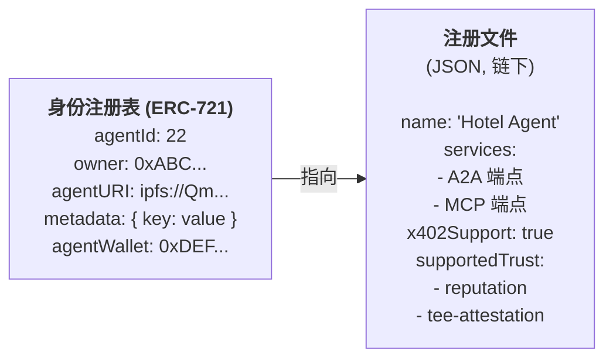
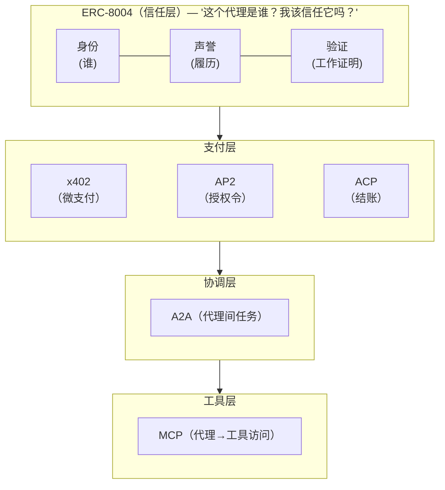

# ERC-8004：链上代理身份、声誉与验证

## 这是什么？

ERC-8004（"Trustless Agents"）是一个以太坊标准，给 AI 代理**持久的链上身份、声誉评分和工作验证**。这是代理网络缺失的信任层。

核心问题：A2A 告诉代理*怎么说话*。MCP 告诉它们*用什么工具*。AP2/x402 告诉它们*怎么付钱*。但没有一个回答：**这个代理是谁，我该不该信任它？**

ERC-8004 用三个链上注册表回答这个问题 — 身份、声誉和验证 — 作为单例合约部署在以太坊主网和 20+ 个 L2 上。

## 为什么重要

没有 ERC-8004，代理经济有信任缺口：

| 问题 | 没有 ERC-8004 | 有 ERC-8004 |
|------|-------------|------------|
| 发现 | 手动配置、人工白名单 | 按能力查询链上注册表 |
| 信任 | "相信我" 或组织边界 | 链上声誉历史 + 验证证明 |
| 问责 | 谁运行了这个代理？无可验证答案 | NFT 身份绑定钱包 + 域名 |
| 支付安全 | 先付钱，祈祷它能用 | 托管合约只在验证完成后释放 |
| 跨组织代理 | 需要预先存在的商业关系 | 通过共享信任层无许可交互 |

## 三个注册表

### 1. 身份注册表（你是谁？）

**ERC-721 NFT = 代理的护照。** 每个代理获得唯一的 `agentId` 令牌，指向链下注册文件。



**注册文件结构：**
```json
{
  "type": "https://eips.ethereum.org/EIPS/eip-8004#registration-v1",
  "name": "myAgentName",
  "description": "自然语言描述",
  "services": [
    {
      "name": "A2A",
      "endpoint": "https://agent.example/.well-known/agent-card.json",
      "version": "0.3.0"
    },
    {
      "name": "MCP",
      "endpoint": "https://mcp.agent.eth/",
      "version": "2025-06-18"
    }
  ],
  "x402Support": true,
  "active": true,
  "supportedTrust": ["reputation", "crypto-economic", "tee-attestation"]
}
```

**关键设计决策：**
- **ERC-721 基础**：可移植、可组合，兼容现有 NFT 基础设施
- **URI 元数据**：重数据在链下（IPFS/HTTPS），链上存指针
- **域名验证**：可选 `/.well-known/agent-registration.json` 证明 HTTPS 端点所有权
- **agentWallet 分离**：代理操作钱包 ≠ 所有者钱包。更改需要 EIP-712/ERC-1271 签名。NFT 转移时自动清除
- **跨链**：`agentRegistry` 格式为 `{namespace}:{chainId}:{contract}`

**核心 Solidity 接口：**
```solidity
function register(string agentURI, MetadataEntry[] calldata metadata)
    external returns (uint256 agentId);

function setAgentURI(uint256 agentId, string calldata newURI) external;

function setAgentWallet(uint256 agentId, address newWallet,
    uint256 deadline, bytes calldata signature) external;
```

### 2. 声誉注册表（我能信你吗？）

**来自真实交互的结构化反馈。** 不是单一评分 — 原始信号，消费者自行聚合。

**反馈值示例：**

| tag1 | 测量 | 示例 | value | decimals |
|------|------|------|-------|----------|
| `starred` | 质量 (0-100) | 87/100 | 87 | 0 |
| `uptime` | 可用性 (%) | 99.77% | 9977 | 2 |
| `successRate` | 任务完成率 (%) | 89% | 89 | 0 |
| `tradingYield` | 收益 (%) | -3.2% | -32 | 1 |
| `latency` | 响应时间 (ms) | 150ms | 150 | 0 |

**反作弊措施：**
- **禁止自评**：代理所有者/操作员不能给自己评分
- **客户端地址过滤**：`getSummary()` 要求明确的客户端地址 — 消费者选择信任谁的反馈，限制女巫攻击
- **可撤销**：反馈可撤销（标记，不删除）
- **只追加**：链上哈希不可删除 — 永久审计轨迹
- **x402 支付证明**：反馈文件包含 `proofOfPayment` 证明评论者确实付费使用了服务

**链下反馈文件：**
```json
{
  "agentId": 22,
  "clientAddress": "eip155:1:0xABC...",
  "value": 100,
  "tag1": "starred",
  "endpoint": "https://agent.example.com/GetPrice",
  "a2a": {
    "skills": ["book-hotel"],
    "taskId": "task-123"
  },
  "proofOfPayment": {
    "txHash": "0x00...",
    "chainId": "1"
  }
}
```

### 3. 验证注册表（你真的做了吗？）

**独立的工作验证。** 信任有了牙齿 — 不只是 "大家说它好"，而是 "我们能证明它做对了"。

**三个验证层级 — 安全性与价值成正比：**

| 层级 | 方法 | 成本 | 用途 | 原理 |
|------|------|------|------|------|
| 1 — 社交 | 仅声誉 | 免费 | 订外卖、低价值任务 | 查声誉分，无需验证 |
| 2 — 加密经济 | 质押再执行 | 中 | 数据分析、中价值 | 验证者质押 ETH，重新执行工作，做错被罚没 |
| 3 — 密码学 | zkML / TEE | 高 | 医疗诊断、大额交易 | 正确执行的数学证明 |

**托管模式 — 杀手级应用：**
```
IF (ValidationRegistry.read(jobHash) == TRUE)
THEN releasePayment()
```

智能合约锁定资金。只有当验证注册表确认工作正确完成时才释放支付。无需人类仲裁。这就是无信任的代理商务。

## 已部署合约

2026 年 1 月 29 日上线以太坊主网，及 20+ 网络：

| 合约 | 主网地址 |
|------|---------|
| 身份注册表 | `0x8004A169FB4a3325136EB29fA0ceB6D2e539a432` |
| 声誉注册表 | `0x8004BAa17C55a88189AE136b182e5fdA19dE9b63` |

也部署在：Base、Arbitrum、Polygon、Optimism、Avalanche、Celo、Gnosis、Linea、Scroll、Taiko、Monad、BSC + 测试网。

## 如何连接协议栈



**具体集成：**

| 协议 | ERC-8004 怎么连接 |
|------|-----------------|
| **A2A** | 注册文件列出 A2A 端点。链上身份增强 Agent Card 发现 |
| **MCP** | 注册文件列出 MCP 端点。V2 规范添加更深 MCP 支持 |
| **x402** | `x402Support: true` 标志。声誉反馈包含 `proofOfPayment` 交易哈希 |
| **AP2** | 授权令系统可引用 `agentId` 做问责。验证注册表为争议解决提供证明 |

**完整生命周期：**
1. 代理在身份注册表注册 → 获得 `agentId` NFT
2. 发布包含 A2A/MCP 端点的注册文件
3. 客户端通过注册表查询发现代理（按能力、信任模型过滤）
4. 客户端通过 A2A 委托任务
5. 代理使用 MCP 工具执行
6. 代理通过 x402 为服务付费
7. 客户端向声誉注册表提交反馈
8. 高价值工作：客户端通过验证注册表请求验证
9. 托管合约根据验证结果释放支付

## 作者

| 作者 | 组织 | 角色 |
|------|------|------|
| Marco De Rossi | MetaMask | 身份/钱包 |
| Davide Crapis | 以太坊基金会 | 协议设计 |
| Jordan Ellis | Google | A2A 集成 |
| Erik Reppel | Coinbase | x402/支付集成 |

以太坊基金会 dAI（去中心化 AI）团队将 ERC-8004 指定为战略基础设施。

## 权衡与问题

### 真实问题

| 问题 | 严重性 | 详情 |
|------|--------|------|
| 女巫攻击 | 高 | 恶意行为者创建多身份膨胀声誉。客户端过滤部分缓解但未解决 |
| 身份 ≠ 能力 | 高 | 有 NFT 证明你*存在*，不证明你*好用*。注册文件可以声称任何东西 |
| 验证者激励设计 | 高 | ERC-8004 故意将激励/罚没设计留给 "特定验证协议" |
| 规模 gas 成本 | 中 | 即使在 L2，数百万反馈条目和验证请求也会累积 |
| 存储耗尽 | 中 | 无界验证请求无限期存储挂起元组。DoS 向量 |
| 链下依赖 | 中 | 注册文件、反馈详情、验证证据都在链下。IPFS pin 消失则元数据丢失 |
| 合谋网络 | 中 | 代理可互相放大声誉。反馈循环扭曲信任信号 |

### ERC-8004 故意不做的事

规范刻意最小化。不处理：
- **支付**：无原生支付机制（x402/AP2 处理）
- **定价**：无市场或定价逻辑
- **商业模式**：无收入分成或佣金结构
- **声誉算法**：只有原始信号 — 聚合在链下
- **验证者经济**：无内置质押/罚没

这是设计选择，不是限制："一个新基础协议能做的最聪明的事是对上层保持无观点。"

### 先有鸡还是先有蛋

ERC-8004 要有用，代理需要注册，客户端需要查注册表。但：
- 没人查的话代理为什么要注册？
- 注册代理少的话客户端为什么要查？

经典网络效应引导问题。以太坊基金会 dAI 团队在通过开发者项目和会议推动采用，但仍在早期。

## 替代方案

| 替代方案 | 内容 | 权衡 |
|----------|------|------|
| 仅 A2A Agent Card | 自声明能力 | 无独立验证，无声誉历史 |
| AP2 白名单 | 手动策展可信代理 | 不可扩展，中心化把关 |
| ENS + 证明 | 基于域名的身份 | 无声誉或验证框架 |
| 自定义声誉系统 | 平台特定信任 | 孤立、不可移植、厂商锁定 |
| ERC-7007（可验证 AI） | AI 推理的 ZK 证明 | 聚焦模型验证，不是代理身份 |

## 可偷的模式

| 模式 | 内容 | 为什么重要 |
|------|------|-----------|
| NFT 即身份 | ERC-721 令牌 = 可移植、可组合的代理护照 | 兼容现有 NFT 基础设施 |
| 混合链上/链下 | 链上：指针 + 哈希。链下：完整数据 | 比全链上存储节省 95%+ 成本 |
| 客户端过滤声誉 | 消费者选择信任谁的反馈 | 无需许可访问的女巫攻击抵抗 |
| 分层验证 | 社交 → 加密经济 → 密码学 | 安全性与价值风险成正比 |
| 验证托管 | 智能合约只在验证工作后释放支付 | 无信任代理商务 — 无需人类仲裁 |
| 支付证明反馈 | 包含证明评论者付费的 tx hash | 将真实用户与虚假评论者分开 |
| 域名验证 | `/.well-known/agent-registration.json` | 证明代理控制其声称的 HTTPS 端点 |
| 渐进验证 | 每个 requestHash 多个响应 + tag | "软最终性" → "硬最终性" 分阶段验证 |

## 最新动态 (2026)

**主网上线与快速采用。** ERC-8004 于 2026 年 1 月 29 日在以太坊主网上线。前两周内，超过 24,000 个代理身份在以太坊生态系统中注册。Olas 等平台报告有数千个镜像代理在多个环境中运行。该标准成为 Ethereum Magicians 论坛上讨论量第二高的提案，超过 150 个项目在其基础上构建。

**以太坊基金会 dAI 2026 路线图。** 以太坊基金会 AI 负责人 Davide Crapis 发布了 dAI 团队 2026 路线图，旨在将以太坊打造为 AI 的全球去中心化结算与协调骨干。ERC-8004 和 x402 被指定为两大核心支柱。短短三个月内团队建立了超过 1,000 名成员的开发者社群，社区电话会议有数百人参与。基金会领导层表示："如果以太坊不带头，封闭平台或中心化实体将主导并控制不断增长的 AI 经济。"

**以太坊之外的多链扩展。** BNB Chain 于 2026 年 2 月 4 日宣布正式支持 ERC-8004，在 BSC 主网和测试网上部署注册表。同时，BNB Chain 推出了 BAP-578（Non-Fungible Agent 标准），让 AI 代理作为链上资产存在，能够持有资产、执行逻辑、与 DeFi 协议交互，并可被买卖或雇用。Avalanche C-Chain 也在 2026 年 2 月采用了 ERC-8004。包括 Base、Taiko、Polygon、Arbitrum、Scroll 和 Linea 在内的主要 L2 均已部署官方注册表。

**The Graph 索引基础设施。** The Graph 发布了专门的 Subgraph，为八条区块链上的 ERC-8004 身份、声誉和验证注册表建立索引。这使得不同链上的代理能即时验证彼此的声誉，无需扫描原始区块链数据。The Graph 还开发了 GraphTally 微支付系统，解决 x402 的 gas 成本问题 — 让代理发行加密签名凭证，聚合为单笔批量结算 — 每分钟支持数千次查询而不被 gas 费用瓶颈制约。

**真实采用案例：AdPrompt.ai。** AdPrompt.ai 成为首批在 ERC-8004 下注册代理的商业平台之一，部署了三个按用途划分的 API 资源（品牌扫描代理、创意资产代理和策略代理），搭配 x402 按次付费访问。这展示了 ERC-8004 + x402 技术栈在代理营销服务中的生产环境运作 — 身份、声誉信号和微支付在单一流程中完成。

**Cortensor 三阶段集成计划。** 去中心化 AI 推理网络 Cortensor 发布了详细的 x402 + ERC-8004 三阶段集成计划。阶段一使用委托会话，无需核心协议变更。阶段二将其路由节点升级为双模路由代理，通过 HTTP 和 MCP 暴露推理与验证服务，作为 ERC-8004 代理可被发现并通过 x402 支付。阶段三为推理端点添加一次性 x402 支付及 ERC-8004 代理绑定。这是 DePIN/推理项目中最具体的公开 ERC-8004 深度集成路线图。

**V2 规范进展。** V2 规范持续开发中，重点包括：增强 MCP 支持以实现超越 A2A 的更广泛兼容性、更灵活的链上声誉数据存储以支持复杂的智能合约可组合性、更简洁的 x402 集成及标准化支付证明格式、以及优化反馈和代理注册文件的 schema 以驱动专业代理浏览器和市场。x402 V2 本身已于 2025 年 12 月上线，支持多链及传统支付通道兼容（ACH、银行卡网络）。

## 结论

**真实的**：ERC-8004 已部署在主网和 20+ 个 L2。合约能用。身份注册表就是标准 ERC-721。规范经过深思且最小化。

**未就绪的**：生态系统。注册代理极少。声誉聚合服务尚不存在。有正当激励设计的验证者网络是理论性的。V2 的更深 MCP/x402 集成仍在开发中。

**诚实评估**：ERC-8004 是代理身份的正确*形状* — 基于 NFT、可组合、分层信任。但它是等待采用的基础设施。验证托管模式真正强大，可能成为无信任代理商务的基础。是否发生在 ERC-8004 上，取决于 2026-2027 年的生态势头。

**今天该做的**：如果你在构建代理，去身份注册表注册。一笔交易的成本，让你的代理可被发现。不用等声誉生态成熟 — 早期注册者在信任层获得势头时有先发优势。

## References

### 官方规范

- [EIP-8004: Trustless Agents — Ethereum.org](https://eips.ethereum.org/EIPS/eip-8004) — 完整 EIP 规范与 Solidity 接口
- [ERC-8004 Discussion — Fellowship of Ethereum Magicians](https://ethereum-magicians.org/t/erc-8004-trustless-agents/25098) — 社区讨论帖
- [erc-8004-contracts — GitHub](https://github.com/erc-8004/erc-8004-contracts) — 参考实现、部署地址（20+ 网络）
- [awesome-erc8004 — GitHub](https://github.com/sudeepb02/awesome-erc8004) — 精选资源列表

### 技术深度分析

- [ERC-8004: Practical Explainer — Composable Security](https://composable-security.com/blog/erc-8004-a-practical-explainer-for-trustless-agents/) — 安全审计视角、架构解析
- [ERC-8004 Explained — Backpack Exchange](https://learn.backpack.exchange/articles/erc-8004-explained) — 完整指南：注册表、验证层级、时间线、路线图
- [ERC-8004: Trust Layer for AI Agent Economy — PayRam](https://payram.com/blog/what-is-erc-8004-protocol) — 协议栈集成、托管模式、分层安全
- [ERC-8004: Trustless Extension of A2A — Coinmonks/Medium](https://medium.com/coinmonks/erc-8004-a-trustless-extension-of-googles-a2a-protocol-for-on-chain-agents-b474cc422c9a) — A2A 集成模式
- [ERC-8004 Technical, Economic, and Policy Analysis — Medium](https://medium.com/@gwrx2005/erc-8004-and-the-ethereum-ai-agent-economy-technical-economic-and-policy-analysis-3134290b24d1) — 经济模型、验证者激励
- [ERC-8004: Building the Trustless Agent Layer — Medium](https://medium.com/@savvysid/erc-8004-building-the-trustless-agent-layer-of-ethereum-0eec8b9ad112) — 架构分析
- [ERC-8004 Standard Explained — C# Corner](https://www.c-sharpcorner.com/article/erc-8004-standard-explained-the-trustless-agents-protocol-for-identity-reputati/) — 开发者教程

### 新闻与行业报道

- [ERC-8004 Mainnet Launch — CoinDesk](https://www.coindesk.com/markets/2026/01/28/ethereum-s-erc-8004-aims-to-put-identity-and-trust-behind-ai-agents/) — 主网部署报道（2026 年 1 月 29 日）
- [ERC-8004 Standard Nears Mainnet — CCN](https://www.ccn.com/news/crypto/erc-8004-agents-standard-nears-mainnet-as-ethereum-teases-rollout/) — 上线前报道
- [What Is ERC-8004? Risks Explained — CCN](https://www.ccn.com/education/crypto/erc-8004-ai-agents-on-chain-ethereum-how-works-risks-explained/) — 风险与局限性分析
- [Ethereum Introduces ERC-8004 — CryptoRank](https://cryptorank.io/news/feed/53277-ethereum-introduces-erc-8004-standard-for-ai-agent-identity-and-reputation-systems) — 标准介绍
- [ERC-8004 Mainnet Launch Explained — Bitcoin Ethereum News](https://bitcoinethereumnews.com/tech/erc-8004-mainnet-launch-what-this-agent-protocol-actually-does/) — 实际功能解析
- [Ethereum's Decentralized AI Revolution — Technology.org](https://www.technology.org/2026/02/05/ethereums-decentralized-ai-revolution-surges-as-agentic-standards-transform-2026/) — dAI 团队策略
- [The Protocol: Ethereum AI Agents Standard — CoinDesk](https://www.coindesk.com/tech/2026/01/28/the-protocol-ethereum-to-roll-out-new-ai-agents-standard-soon/) — 协议通讯报道

### 生态系统与平台

- [ERC-8004 on Eco — Eco Support](https://eco.com/support/en/articles/13221214-what-is-erc-8004-the-ethereum-standard-enabling-trustless-ai-agents) — 验证层级、托管模式、x402 连接
- [ERC-8004 Beginner's Guide — Bitget](https://web3.bitget.com/en/academy/what-is-erc-8004-a-beginners-guide-to-trustless-ai-agents-on-ethereum) — 入门概述
- [ERC-8004: Trustless Agents — Oasis Network](https://oasis.net/blog/erc-8004-trustless-agents) — ROFL/TEE 集成视角
- [ERC-8004 — BuildBear](https://www.buildbear.io/blog/erc-8004) — 开发者教程

### 相关背景

- [Onchain Reputation for AI Agents — Medium](https://medium.com/@ellie_43405/onchain-reputation-for-ai-agents-human-users-64c7b8ef25dc) — 更广泛的声誉景观
- [Agentic AI in DeFi — Medium](https://medium.com/@trentice.bolar/agentic-ai-in-defi-the-dawn-of-autonomous-on-chain-finance-584652364d08) — DeFi 代理经济背景
- [CV VC: AI Agents as Catalyst for Onchain Finance — CVVC](https://www.cvvc.com/blogs/cv-vc-insights-ai-agents-as-the-catalyst-for-onchain-finance) — 投资者视角

### 2026 年更新

- [ERC-8004 Powers Thousands of Onchain AI Identities — Bitcoin.com](https://news.bitcoin.com/what-is-erc-8004-ethereums-new-agent-standard-powers-thousands-of-onchain-ai-identities/) — 24K+ 注册代理
- [Ethereum Foundation dAI 2026 Roadmap — Metaverse Post](https://mpost.io/ethereum-foundation-progresses-dai-teams-2026-roadmap-highlighting-erc-8004-and-x402-as-key-priorities/) — dAI 团队优先事项与里程碑
- [BNB Chain Announces ERC-8004 Support — Chainwire](https://chainwire.org/2026/02/04/bnb-chain-announces-support-for-erc-8004-to-enable-verifiable-identity-for-autonomous-ai-agents/) — BSC 部署与 BAP-578
- [BNB Chain AI Advances with ERC-8004 — Cryptonomist](https://en.cryptonomist.ch/2026/02/18/bnb-chain-ai-standards/) — BNB Chain 生态扩展
- [Understanding x402 and ERC-8004 — The Graph Blog](https://thegraph.com/blog/understanding-x402-erc8004/) — Subgraph 索引与 GraphTally 微支付
- [AdPrompt.ai Registers Under ERC-8004 — PRWeb](https://www.prweb.com/releases/adpromptai-registers-its-agentic-marketing-solution-under-erc-8004-for-on-chain-agent-identity-and-reputation-signals-302689395.html) — 首个商业代理注册
- [Cortensor x402 & ERC-8004 Integration Plan — Cortensor Docs](https://docs.cortensor.network/technical-architecture/designs-wip/x402-and-erc-8004-three-phase-integration-plan) — 三阶段 DePIN 集成
- [Davide Crapis on ERC-8004 — CryptoBriefing/Unchained](https://cryptobriefing.com/davide-crapis-erc-8004-enables-decentralized-ai-agent-interactions-establishes-trustless-commerce-and-enhances-reputation-systems-on-ethereum-unchained/) — 基金会负责人访谈
- [ERC-8004 on Avalanche C-Chain — Medium](https://medium.com/@gwrx2005/erc-8004-a-trustless-agent-standard-for-on-chain-ai-in-avalanche-c-chain-4dc1bdad509a) — Avalanche 采用
- [x402 & ERC-8004: AI Commerce Infrastructure — SmartContracts.tools](https://www.smartcontracts.tools/blog/erc8004-x402-infrastructure-for-autonomous-ai-agents/) — x402 V2 集成详情
