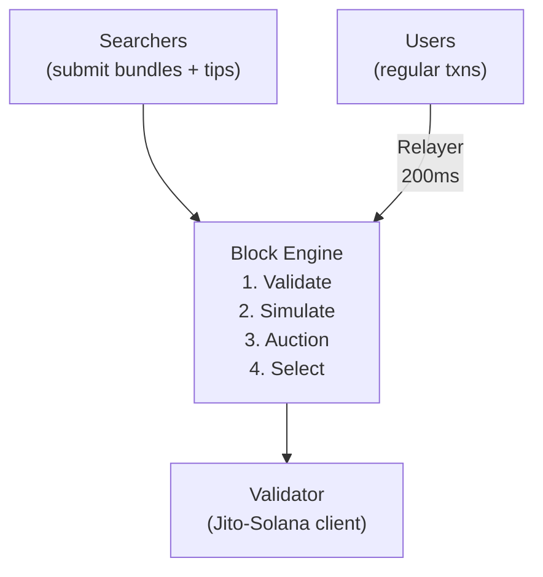
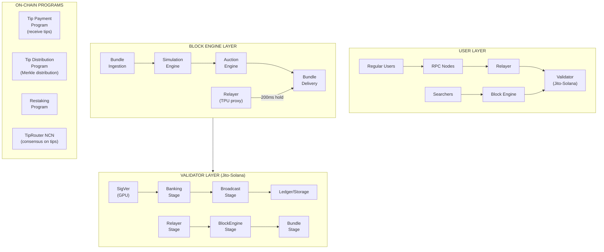
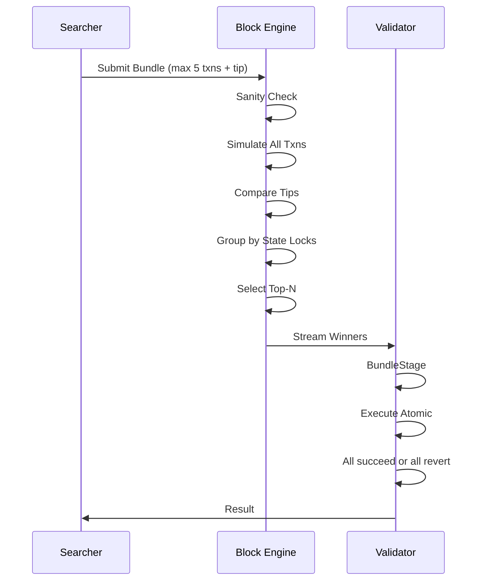
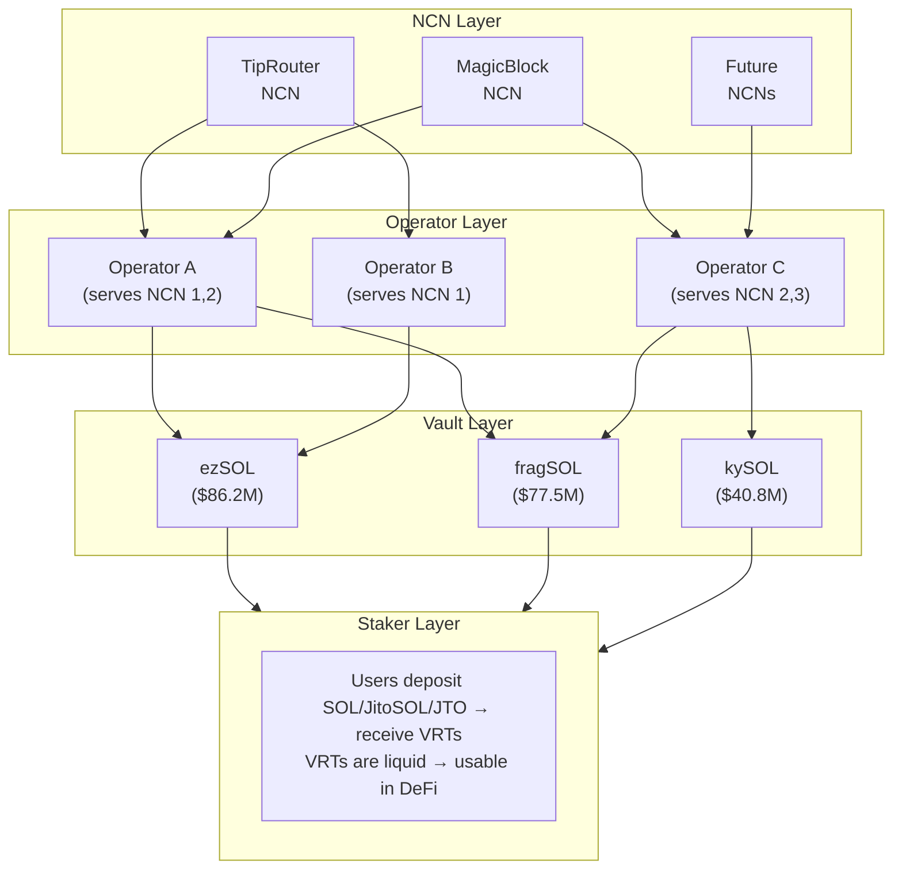
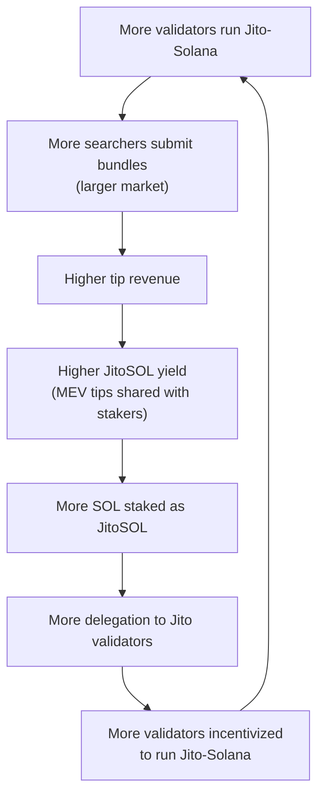

# Jito: Solana's MEV Infrastructure & Liquid Staking Protocol — Deep Analysis

## 1. What is Jito — Product Deep Dive

Jito is Solana's dominant MEV (Maximal Extractable Value) infrastructure stack combined with the network's largest liquid staking protocol. By early 2026, over 95% of Solana's stake weight runs the Jito-Solana validator client, making it the single most critical piece of third-party infrastructure on Solana.

### 1.1 Jito-Solana Validator Client

A fork of the Agave validator (formerly Solana Labs client) written in Rust, with three additional pipeline stages:

| Stage | Purpose |
|-------|---------|
| **RelayerStage** | Connects to the Jito Relayer via gRPC for transaction ingestion |
| **BlockEngineStage** | Receives winning bundles from the Block Engine auction |
| **BundleStage** | Processes bundles atomically within the block production pipeline |

Performance is identical to stock Agave — the additions are purely MEV-related. The client was open-sourced on October 27, 2022, audited by Neodyme and Halborn.

**Timeline:**
- 2022 Q2: Private beta with select validators
- 2022 Oct: Open-sourced
- 2023: Rapid adoption, crossing 50% stake
- 2024: 90%+ stake
- 2025-2026: 95-97% stake weight

### 1.2 Jito Block Engine

The Block Engine is an **off-chain blockspace auction** — the core MEV coordination mechanism.

**Auction process:**
1. **Sanity Check** — validates transactions, ensures bundle contains 5 or fewer transactions
2. **Simulation** — verifies all transactions succeed, calculates tip amounts
3. **Auction** — groups bundles by state locks, simulates combinations, selects top-N highest-paying bundles
4. **Delivery** — streams winning bundles to the validator's BundleStage

The Block Engine is **partial-block** — unlike Ethereum's MEV-Boost where builders produce full blocks, Jito runs granular auctions for bundle inclusion within a block. Multiple auctions can occur per block.

### 1.3 Jito Bundles

A bundle = a group of up to 5 transactions executed **atomically and sequentially**:

- **All-or-nothing**: if any transaction fails, the entire bundle is dropped
- **Ordered**: transactions execute in the exact sequence specified
- **Tip required**: the last transaction must include a tip to the validator

Common bundle patterns:
- **Arbitrage**: buy on DEX A + sell on DEX B (2 txns)
- **Liquidation**: observe undercollateralized position + liquidate (2 txns)
- **Sandwich**: frontrun + victim + backrun (3 txns, now targeted by BAM)

### 1.4 Jito Relayer

The Relayer is a **TPU (Transaction Processing Unit) proxy** that sits between users and the validator:

- Runs as a standalone service connected to the validator via gRPC
- Performs deduplication, filtering, and signature verification
- **Holds transactions for ~200ms** to allow the Block Engine time to run the bundle auction
- Sends heartbeats every 500ms; validator falls back to direct QUIC if no heartbeat for ~1.5s
- Uses Tokio async runtime for non-blocking event-driven processing
- Balances load to prevent Block Engine bottlenecks

### 1.5 Jito Tips — Distribution Mechanism

Two on-chain programs handle tip flow:

**Tip Payment Program:**
- Acts as an on-chain "piggy bank" for each validator's MEV tips
- Searchers transfer tips to static public keys, ensuring they pay the correct leader
- Tips are SOL denominated

**Tip Distribution Program:**
- Every epoch (~2-3 days), the validator creates a unique `TipDistributionAccount` derived from epoch + vote account
- After epoch ends, a validator snapshots the last slot, generates a Merkle tree of claims for each validator and stake account
- Uploads the Merkle root on-chain
- Validators and stakers claim MEV tips via Merkle proof (permissionless claiming)

**Fee split (pre-JIP-24):** 94% to validators/stakers, 3% to Jito Labs, 3% to Jito DAO
**Fee split (post-JIP-24, Aug 2025):** 94% to validators/stakers, 6% to Jito DAO treasury

### 1.6 JitoSOL — Liquid Staking Token

JitoSOL is Solana's largest LST — the first to include MEV rewards in staking yield.

**Mechanics:**
- User deposits SOL, receives JitoSOL
- JitoSOL quantity stays fixed; exchange rate to SOL increases over time
- Yield = base staking rewards (~6-6.6% APY) + MEV tips (~1.2-1.8% APY) = **~7.2-8.4% total APY**
- Protocol fee: 4% of all rewards (managed by DAO)

**DeFi integrations:**
- Collateral on Kamino, Drift, Marginfi, Solend
- LP pairs on Orca, Raydium
- Leveraged yield strategies via Kamino
- Over $420M in LSTs held by lending platforms (40.3% of their TVL)

### 1.7 Jito StakeNet

StakeNet = decentralized, on-chain stake pool management. Replaces off-chain delegation bots.

**Scoring system:**
- 4-tier hierarchical scoring: yield, commission rates, uptime, MEV performance
- Top 200 validators selected every 10-epoch cycle
- Each selected validator receives 0.5% of pool TVL
- Lower-scoring validators prioritized for unstaking

**Safety mechanisms:**
- Immediate removal if voting < 70% of expected slots (delinquency)
- Immediate removal if commission > 5% or MEV commission > 10%
- Permissionless cranking — anyone can advance the state machine

### 1.8 Jito (Re)staking

A multi-asset staking protocol for Node Consensus Networks (NCNs) — Solana's answer to EigenLayer.

**Three participants:**

| Role | Function |
|------|----------|
| **NCNs** | Sets of node operators + on-chain programs that reach consensus on off-chain workloads |
| **Vaults** | Hold staked SPL tokens, delegate to Operators, mint liquid receipt tokens (VRTs) |
| **Operators** | Perform arbitrary logic defined by the NCN (data processing, consensus, verification) |

**Key properties:**
- Multi-asset: accepts SOL, JitoSOL, JTO, and other SPL tokens
- Vaults produce Vault Receipt Tokens (VRTs) for DeFi composability
- Operators can serve multiple NCNs simultaneously
- NCN slashing conditions enforced by the Solana runtime

**TVL (Feb 2025):** $227M across 9 VRTs — ezSOL ($86.2M), fragSOL ($77.5M), kySOL ($40.8M), fragJTO ($10.8M), kyJTO ($6.7M), ezJTO ($5.0M)

### 1.9 TipRouter NCN

The first live NCN — decentralized MEV tip distribution.

**Launched:** January 30, 2025

**How it works:**
1. Each epoch, NCN node operators independently compute the Merkle root for tip distribution
2. When 2/3 consensus is reached, root is posted on-chain
3. Distribution automatically includes the 3% DAO/NCN fee
4. 2.7% of all Jito tips and block rewards go to Jito DAO
5. 0.30% routed to NCN participants (split between JTO stakers and JitoSOL restakers)

**Why it matters:** Previously, tip distribution was centralized — Jito Labs computed and uploaded the Merkle root. TipRouter decentralizes this into a consensus process among independent operators.

---

## 2. MEV on Solana — Technical Deep Dive

### 2.1 Solana vs Ethereum MEV Architecture

| Dimension | Ethereum | Solana |
|-----------|----------|--------|
| **Block time** | 12 seconds | 400ms slots |
| **Mempool** | Public (visible to all) | None (Gulf Stream forwards directly to leader) |
| **Block building** | Full-block auctions (MEV-Boost) | Partial-block bundle auctions (Jito) |
| **Competition axis** | Gas price bidding | Latency (first to reach leader) |
| **MEV surface** | Discrete (per-block) | Continuous (streaming) |
| **State model** | Global lock (serial EVM) | Explicit account locks (parallel Sealevel) |
| **Leader schedule** | Unknown until selected | Known in advance (deterministic) |

### 2.2 Why Solana Creates Different MEV Dynamics

**Gulf Stream** — transactions are forwarded directly to the next leader before their slot begins. No public mempool means no public transaction visibility, which theoretically limits frontrunning. But...

**Leader Schedule** — Solana's leader schedule is deterministic and known 2 epochs in advance. Searchers know exactly which validator will produce the next block and can:
- Co-locate infrastructure near known leaders
- Build direct network paths to leaders
- Gain latency advantages measured in microseconds

**Continuous Block Building** — Solana's 400ms slot time with continuous state updates means:
- Reading state updates quickly is paramount
- Opportunities appear and disappear in milliseconds
- **Latency is the primary competitive axis**, not gas price
- This creates centralization pressure — whoever has the fastest network connection wins

**Sealevel Parallelism** — transactions declare their account locks upfront, enabling parallel execution. MEV implications:
- Bundles only conflict if they touch overlapping accounts
- Multiple non-conflicting bundles can execute in the same block
- Block Engine can optimize bundle placement based on account lock analysis

### 2.3 MEV Types on Solana

**Arbitrage (dominant):**
- Cross-DEX price discrepancies (Orca, Raydium, Jupiter pools)
- CEX-DEX arbitrage
- In 2024, Jito detected 90.4M successful arbitrage trades, average profit $1.58 per trade
- Mostly back-run strategies

**Liquidations:**
- Scanning lending protocols (Kamino, Drift, Marginfi) for undercollateralized positions
- Atomic liquidation + collateral claim
- Back-run strategies

**Sandwich Attacks:**
- Front-run + victim + back-run bundled atomically
- Exploits known price impact from large swaps
- $370-500M extracted over 16 months post-mempool shutdown
- 93% of sandwiches are "wide" (multi-slot), extracting 529K+ SOL/year

### 2.4 The Mempool Controversy (March 2024)

**Timeline:**
- **Nov 2022**: Jito launches a public mempool alongside the Block Engine
- **2023-2024**: Mempool enables sandwich attacks; memecoin trading amplifies the problem
- **March 8, 2024**: MEV tips hit 10,000 SOL ($1.5M) in a single day — highest ever
- **March 9, 2024**: Jito Labs suspends the mempool, citing harm to retail users
- **June 2024**: Solana Foundation removes 32 sandwich-attacking validators from delegation program (1.5M SOL, 0.5% of program stake)
- **June 2024**: Jito DAO governance proposal to blacklist malicious validators from JitoSOL stake pool

**What happened after:**
- Problem went underground — private mempools emerged
- Operators reportedly earning "hundreds of thousands of dollars" from private sandwich infrastructure
- Solana Foundation's delegation blacklist was criticized as centralized governance
- Tools like sandwich.me launched to track and expose MEV activity

**Why they couldn't engineer a solution:**
- Solana's architecture sends transactions to the leader, not to a mempool
- But any intermediary (like the Block Engine/Relayer) that sees transactions before the leader creates a de facto mempool
- The 200ms relayer delay was the attack window
- Engineering a solution required fundamental rethinking of block building — which became BAM

### 2.5 Current MEV Landscape (Post-Mempool)

**Revenue numbers:**
- 2024 total: Jito tips accounted for ~50% of Solana's Real Economic Value (REV)
- $674M+ paid out to stakers and validators through 2024
- Nov 17, 2024: single-day peak of $14.7M in tips
- Jan 20-21, 2025: over $20M daily fees, 100,000 SOL peak in one day
- Average daily MEV income post-Oct 2024: ~30,000 SOL (minimum 10,000 SOL)
- Jito captures 60% of Solana's fee market by January 2025

---

## 3. Architecture & Technical Stack

### 3.1 Complete System Architecture

### 3.2 Bundle Lifecycle

### 3.3 How Jito-Solana Differs from Stock Agave

| Component | Stock Agave | Jito-Solana |
|-----------|-------------|-------------|
| TPU | Direct QUIC connection | Relayer proxy (gRPC) |
| Block Building | FIFO scheduling | Bundle-aware scheduling |
| Pipeline Stages | Standard 4 stages | Standard 4 + 3 Jito stages |
| Transaction Types | Individual transactions | Individual + atomic bundles |
| Revenue | Base rewards + priority fees | Base rewards + priority fees + MEV tips |
| Configuration | Standard | Additional Block Engine/Relayer config |

---

## 4. Liquid Staking — JitoSOL

### 4.1 Yield Breakdown

| Source | APY Range | Notes |
|--------|-----------|-------|
| Base Staking | 6.0-6.6% | Solana inflation rewards |
| MEV Tips | 1.2-1.8% | Variable, correlated with network activity |
| **Total** | **7.2-8.4%** | Before protocol fee |
| Protocol Fee | -4% of rewards | Managed by DAO |
| **Net to Holder** | **~6.9-8.1%** | After fee |

### 4.2 Solana LST Comparison (Q4 2025)

| Protocol | Token | TVL (SOL) | Market Share | APY | MEV Rewards | Differentiator |
|----------|-------|-----------|-------------|-----|-------------|----------------|
| **Jito** | JitoSOL | 15.1M | ~40-76% | 7.2-8.4% | Yes | MEV + largest DeFi integrations |
| **Binance** | bnSOL | ~7M | ~19% | 7.0-7.5% | Partial | Binance distribution |
| **Marinade** | mSOL | ~4M | ~11% | 6.8-7.2% | No | Institutional (Select) |
| **Sanctum** | INF | ~2M | ~5% | 7.5-8.5% | Variable | Multi-LST aggregator |
| **BlazeStake** | bSOL | ~1.5M | ~4% | 6.5-7.0% | No | BLZE token subsidies |

**JitoSOL's moat**: MEV rewards create a structural yield advantage. As the largest LST, it has the deepest DeFi integrations (lending, collateral, LP), creating a liquidity flywheel that attracts more stakers.

### 4.3 DeFi Integration Depth

- **Lending**: Kamino, Drift, Marginfi, Solend — JitoSOL as collateral
- **DEX**: Orca, Raydium — JitoSOL/SOL and JitoSOL/USDC pools
- **Leverage**: Kamino multiply vaults for leveraged staking yield
- **Cross-chain**: growing bridges to other networks
- **ETF**: VanEck filed S-1 for JitoSOL ETF (August 2025) — first LST-backed spot ETF filing
- Lending platforms hold over $420M in LSTs = 40.3% of their total TVL

---

## 5. Jito (Re)staking — Solana's EigenLayer

### 5.1 Architecture

### 5.2 Jito vs EigenLayer Comparison

| Dimension | Jito (Re)staking | EigenLayer |
|-----------|-----------------|------------|
| **Chain** | Solana | Ethereum |
| **TVL** | ~$227M-$500M | $18B+ |
| **Terminology** | NCN (Node Consensus Network) | AVS (Actively Validated Service) |
| **Stake unit** | Vaults (SPL tokens) | EigenPods (ETH/LSTs) |
| **Transaction cost** | Sub-$0.01 | $1-50+ |
| **TPS** | ~65,000 | ~15 |
| **Focus** | Endogenous AVSs (built inside Solana L1) | Exogenous services (external networks) |
| **Live services** | TipRouter + growing | 100+ building |
| **Liquid receipt** | VRTs (Vault Receipt Tokens) | N/A (third-party LRTs) |
| **Maturity** | Early (launched late 2024) | Established (2023+) |

### 5.3 NCN Use Cases

Current and planned NCN types:
- **MEV tip distribution** (TipRouter — live)
- **Oracle networks**
- **DePIN coordination**
- **Cross-chain bridges**
- **Layer-2 sequencers and provers**
- **Keeper/cranker networks**
- **RPC verification** (Blocksize RPC-NCN — proposed)
- **Insurance protocols**
- **Ephemeral rollup security** (MagicBlock — integrating)

---

## 6. JTO Token

### 6.1 Tokenomics

| Allocation | Percentage | Tokens | Vesting |
|-----------|-----------|--------|---------|
| Community Growth | 34.29% | 342.9M | Various programs |
| Ecosystem Development | 25.00% | 250.0M | Foundation-managed |
| Core Contributors | 24.50% | 245.0M | 3-year vest, 1-year cliff |
| Investors | 16.21% | 162.1M | 3-year vest, 1-year cliff |
| **Total Supply** | **100%** | **1,000,000,000** | |

### 6.2 Airdrop (December 7, 2023)

- 10% of total supply (100M JTO) airdropped
- 80% allocated to JitoSOL points holders (>100 points)
- Snapshot: November 25, 2023
- Claim start: December 7, 2023 at 11am ET
- 50% claimable at genesis, 50% linear unlock over 12 months
- Even small participants received thousands of dollars worth

### 6.3 Price History

| Date | Event | Price |
|------|-------|-------|
| Dec 7, 2023 | Airdrop / TGE | ~$2.00 |
| Dec 2023 | ATH | $5.32-6.01 |
| Apr 3, 2024 | 2024 High | $4.87 |
| End 2024 | Year close | $3.30 |
| Feb 2026 | Current | ~$0.30-0.35 |
| | **Decline from ATH** | **-94.7%** |

Market cap (Feb 2026): ~$108-170M (varies by circulating supply calculation)

### 6.4 Governance

- 1 JTO = 1 vote
- Proposal threshold: 250,000 JTO
- Voting threshold: 3% of supply (30M JTO) must vote "Yes"
- Voting period: 3 days + 2-day delay before execution
- Uses Realms governance framework on Solana
- Key powers: pool fees, delegation strategy, treasury management, protocol upgrades
- JIP-24 (Aug 2025): DAO now receives 100% of Block Engine + BAM fees

### 6.5 JTO Utility

- Governance voting on all protocol parameters
- Restaking in NCN vaults (earn additional yield from NCN participation)
- TipRouter NCN participation (0.15% of all tips flow to JTO stakers)
- Not a yield token by design — value accrual through DAO treasury (post-JIP-24, CSD manages buybacks/subsidies)

---

## 7. Team & Background

### 7.1 Founders

**Lucas Bruder — CEO**
- Education: Carnegie Mellon University (Electrical & Computer Engineering)
- Pre-crypto: Tesla (Model X, Falcon Wing doors — "anything that moves or lights up"), Ouster (LiDAR), Built Robotics (autonomous bulldozers, tech lead)
- Crypto origin: Read Dan Robinson's "Dark Forest" article about Ethereum mempool bots, stayed up until 3am every night for two months building MEV bots
- Met Zano Sherwani on Twitter while both were researching MEV

**Zano Sherwani — Co-Founder & CTO**
- Education: George Mason University (B.S. Computer Science, 2018)
- Pre-crypto: Hungry (full-stack developer), Amazon (software engineer, 1 year), Parsec Finance (2021)
- In crypto since 2017
- Co-founded Jito Labs September 2021

### 7.2 Jito Foundation

- Cayman Islands foundation company (announced move to US, 2025)
- Two independent directors: Matt Shaw and Glenn Kennedy
- Independent supervisor: FFP Corporate Services
- DAO administrator: Webslinger (advisory firm)
- Hired head of governance (Almond Tokenomics)
- Manages 25% of JTO supply for ecosystem development

### 7.3 Funding

| Round | Date | Amount | Lead Investors |
|-------|------|--------|---------------|
| Series A | Aug 2022 | $10M | Multicoin Capital, Framework Ventures |
| Strategic Token Sale | Oct 2025 | $50M | a16z crypto |
| **Total Raised** | | **$60M+** | |

Other investors include: Solana Ventures, Anatoly Yakovenko (Solana Labs co-founder), Electric Capital, Foundation Capital, R89 Capital, 18decimal — 21 investors total.

### 7.4 Relationship to Jump Crypto

Jito Labs and Jump Crypto are **independent organizations** that both build critical Solana infrastructure:
- Jito Labs: MEV client (Jito-Solana fork of Agave)
- Jump Crypto: Firedancer client (independent C/C++ implementation)
- Both have worked on integration (FireBAM = BAM + Firedancer)
- No equity/ownership relationship documented

---

## 8. Business Model & Revenue

### 8.1 Revenue Streams

| Stream | Mechanism | Revenue Split |
|--------|-----------|---------------|
| **Block Engine Fees** | 6% of all MEV tips | 100% to DAO treasury (post-JIP-24) |
| **JitoSOL Protocol Fee** | 4% of staking + MEV rewards | Split: DAO + operational |
| **BAM Fees** | Plugin fees + transaction scheduling | 100% to DAO treasury |

### 8.2 Revenue Numbers

| Period | Metric | Value |
|--------|--------|-------|
| 2024 Total | Tips paid to stakers/validators | $674M+ |
| Nov 17, 2024 | Single-day peak | $14.7M |
| Jan 20-21, 2025 | Daily fees | $20M+ each day |
| Jan 20, 2025 | Peak single-day MEV revenue | 100,000 SOL |
| Post-Oct 2024 | Average daily MEV | ~30,000 SOL |
| Post-Oct 2024 | Minimum daily MEV | ~10,000 SOL |
| Late 2025 | BAM projected annual revenue | $15M |
| 2025 Q2 | MEV as % of staking rewards | 13-15% |
| Jan 2025 | Jito tips as % of Solana fee market | 60% |

### 8.3 Revenue Flywheel

---

## 9. Competition & Market Position

### 9.1 Liquid Staking Competition

| Competitor | Token | Market Share | Approach | Advantage over Jito |
|-----------|-------|-------------|----------|-------------------|
| Marinade | mSOL | ~11% | Institutional focus (Select) | Enterprise-grade + institutional trust |
| Binance | bnSOL | ~19% | CEX distribution | Binance user base |
| Sanctum | INF | ~5% | LST aggregator | Multi-LST exposure |
| BlazeStake | bSOL | ~4% | Community-focused | BLZE incentives |

**Jito's position:** ~40-76% market share (varies by metric), dominant through MEV yield advantage + DeFi integrations.

### 9.2 Jito vs Flashbots (MEV)

| Dimension | Jito | Flashbots |
|-----------|------|-----------|
| **Chain** | Solana | Ethereum |
| **Block building** | Partial-block auctions | Full-block auctions (MEV-Boost) |
| **Architecture** | Integrated (MEV + LST) | Modular (separate MEV, no LST) |
| **Revenue sharing** | 94% to validators/stakers | Varies by builder |
| **Open source** | Yes (Oct 2022) | Yes (mev-geth, MEV-Boost) |
| **Approach** | Practical/commercial | Research-oriented/public goods |
| **Trust model** | Repeated-game incentives + market trust | PBS + cryptographic commitments |
| **Token** | JTO (governance) | No token |
| **Privacy** | BAM (TEE-based) | SUAVE (planned) |

### 9.3 Validator Client Market Share

- Jito-Solana: 88-97% of stake weight (varies by source/date)
- Stock Agave: ~3-12%
- Firedancer: growing (21%+ stake by late 2025)
- BAM validators: 330+ (growing)

### 9.4 Block Building Competition (2025-2026)

- **Jito BAM**: TEE-based scheduling with plugins, first-mover
- **Temporal Harmonic**: Competing block builder, aggregation model sourcing from multiple builders
- Both BAM and Harmonic added ~30% of stake each in 2025
- Competition is intensifying but Jito maintains infrastructure dominance

---

## 10. Controversy & Criticism

### 10.1 The Private Mempool Saga

**Core issue:** Jito's mempool enabled sandwich attacks that cost retail users money. Shutting it down pushed the problem underground rather than solving it.

**Timeline:**
1. Nov 2022: Mempool launches as part of Block Engine
2. 2023: Memecoin boom amplifies sandwich attack profitability
3. March 8, 2024: Record 10,000 SOL ($1.5M) in tips, largely sandwich-driven
4. March 9, 2024: Jito suspends mempool
5. March-June 2024: Private mempools emerge
6. June 2024: Solana Foundation blacklists 32 sandwich validators
7. June 2024: Jito DAO proposes validator blacklist
8. 2024-2025: $370-500M extracted by sandwich bots over 16 months

**The uncomfortable truth:** Jito created the infrastructure that enabled Solana sandwich attacks. Removing the public mempool didn't stop the practice — it just made it less transparent and concentrated profits among fewer, more sophisticated operators.

### 10.2 Centralization Concerns

- **Client monoculture**: 95%+ of Solana stake running one modified client is a systemic risk
- **Block Engine as chokepoint**: all MEV flows through Jito's off-chain infrastructure
- **200ms relayer delay**: creates a structured information advantage
- **Validator economics**: running without Jito means forfeiting MEV revenue, creating economic lock-in
- **Foundation delegation blacklist**: criticized as centralized governance over a "decentralized" network

### 10.3 Sandwich Attack Debate

The philosophical tension:
- **Pro-Jito argument**: MEV is inevitable; Jito at least distributes it to stakers (94% back to validators/stakers) rather than letting it concentrate among sophisticated traders
- **Anti-Jito argument**: Jito industrialized MEV extraction on Solana, creating infrastructure that enabled sandwich attacks at scale. The 200ms delay was effectively a front-running window

### 10.4 Validator Incentive Alignment

- Validators are economically incentivized to run Jito-Solana (MEV tips = 13-15% more rewards)
- Not running Jito = competitive disadvantage
- This creates a near-monopoly that reduces client diversity (critical for network resilience)
- Firedancer adoption provides some relief, but Jito + Firedancer integration (FireBAM) may perpetuate the pattern

---

## 11. 2025-2026 Developments

### 11.1 Block Assembly Marketplace (BAM)

**Launched:** July 21, 2025 (mainnet September 2025)

**Architecture:**
- BAM Nodes: TEE-based schedulers that privately order transactions
- BAM Validators: run updated Jito-Solana client, receive ordered transactions
- Plugins: programmable interfaces for custom transaction logic

**Key innovation:** transactions remain private in TEEs until execution, mitigating sandwich attacks by design (not policy).

**Plugins enable:**
- Speed bumps for DEX trades
- Custom sequencing logic
- Fee-sharing between developers, validators, and DAO
- New revenue models for app developers

**Targets:** 50-100+ BAM nodes across all major geographic regions.

### 11.2 JIP-24 — DAO Revenue Restructuring (August 2025)

- 100% of Block Engine fees redirected to DAO treasury (previously 50/50 with Jito Labs)
- All future BAM revenue also goes to DAO
- Cryptoeconomics SubDAO (CSD) manages funds: buybacks, yield subsidies, fee switch vaults
- Represents Jito Labs voluntarily giving up revenue to the DAO

### 11.3 VanEck JitoSOL ETF

- S-1 filed August 22, 2025; amended October 31, 2025
- First spot ETF backed 100% by a liquid staking token
- Enabled by SEC August 2025 guidance: LSTs are "evidence of ownership," not securities
- Would give TradFi investors exposure to JitoSOL yield

### 11.4 a16z Investment

- $50M strategic token sale (October 2025)
- Largest single investment in Jito ecosystem
- Signals institutional validation of the restaking thesis

### 11.5 Firedancer Integration (FireBAM)

- BAM integrating as modular scheduler within both Agave and Firedancer
- FireBAM = BAM scheduling + Firedancer execution
- Enables validators to benefit from both MEV optimization and Firedancer's performance improvements

### 11.6 Jito Foundation Redomiciling

- Moving core operations from Cayman Islands to US
- Reflects regulatory clarity around staking/LSTs

### 11.7 IBRL Explorer

- Launched January 6, 2026
- Validator performance analytics with IBRL Score metrics
- JIP-31 proposed: Validator Subsidy Program to incentivize BAM participation

---

## 12. Latest Updates (2026)

### 12.1 21Shares JSOL ETP Launch in Europe

On January 29, 2026, 21Shares launched the Jito Staked SOL ETP (ticker: JSOL) on Euronext Amsterdam and Paris — the world's first exchange-traded product linked directly to JitoSOL. The ETP trades in both USD (JSOL NA) and EUR (JSOL FP) with a 0.99% total expense ratio. Investors get full SOL price exposure plus automatic staking yield (5.8-6% base APY as of launch) and MEV revenue, without managing on-chain operations. This follows VanEck's US S-1 filing from August 2025 and represents a major milestone in bringing liquid staking yields to traditional finance — now live and tradeable in Europe, while the US filing remains pending SEC review.

### 12.2 BAM Mainnet Launch and Adoption

BAM officially launched on Solana mainnet on September 25, 2025, with initial validators including Figment, Helius, SOL Strategies, and Triton One. The transition from Jito's proprietary block engine to the open-source BAM framework marks a fundamental architectural shift. Early testing suggests BAM could generate $25M+ in quarterly fees. JIP-31, proposed for Q1 2026, introduces a Validator Subsidy Program to accelerate BAM adoption by subsidizing participating validators. BAM is planned to evolve into a fully permissionless platform with open-sourced node software and community-managed governance.

### 12.3 Jito as Solana Mobile Guardian

Jito was named one of the first Guardians for Solana Mobile's TEEPIN (Trusted Execution Environment Platform Infrastructure Network), alongside Helius, when the Seeker network launched in January 2026. Guardians function like validators but for the mobile ecosystem — verifying app integrity, device security, and overall ecosystem trust. SKR token staking launched simultaneously, enabling users to stake SKR to support Guardians and earn rewards. This extends Jito's infrastructure role beyond MEV and staking into mobile security.

### 12.4 JIP-25: Validator Set Expansion

JIP-25 passed on October 8, 2025, expanding the StakeNet validator set from 200 to 400 validators. The proposal also modified eligibility and ranking criteria to mitigate negative stake pool dynamics. The steward program was upgraded with new scoring mechanisms and parameter updates. This doubling of the validator set is a direct response to centralization concerns, distributing JitoSOL stake across a broader set of validators.

### 12.5 JTO Token: All-Time Low and Recovery

JTO hit an all-time low of $0.218 on February 6, 2026 — a 96.4% decline from its $6.01 ATH in December 2023. However, the token staged a rapid recovery, surging 37% on February 17 and reaching ~$0.39 by February 18 (a 51.2% recovery from the ATL). The bounce was accompanied by significant volume spikes. Despite the Cryptoeconomics SubDAO (CSD) managing buybacks and fee switch vaults under JIP-24, the token has struggled to reflect the protocol's dominant position and revenue generation.

### 12.6 NCN Ecosystem Expansion

The NCN ecosystem continues to grow beyond TipRouter. Switchboard is building an oracle solution leveraging Jito restaking for accessible on-chain and off-chain data. MagicBlock is integrating restaking to enhance security for ephemeral rollups supporting real-time decentralized applications. Over $284K in rewards have been distributed through TipRouter NCN since its January 2025 launch. The restaking TVL remains at approximately $227M across nine VRTs, though activity-based metrics like rewards distribution show increasing adoption.

### 12.7 Governance Maturation

Active governance continues with multiple significant proposals beyond JIP-24 and JIP-25. JID-10 proposes integrating $JTO staking directly into the NCN framework, adding economic security and new utility to the token. The DAO has also passed proposals for directed staking preferences (allowing JitoSOL holders to express validator delegation preferences) and accelerated BAM adoption. The Jito Foundation's relocation from the Cayman Islands to the US, announced in 2025, is proceeding to leverage regulatory clarity from the GENIUS Act and expand institutional partnerships.

---

## 13. Honest Assessment & Stealable Patterns

### 13.1 What Jito Genuinely Does Better

1. **Integrated MEV + LST flywheel**: No other protocol combines MEV infrastructure with liquid staking. The flywheel is real and self-reinforcing.

2. **Revenue sharing with stakers**: 94% of MEV tips go back to validators and stakers. Compared to Ethereum where MEV extraction often benefits builders/searchers disproportionately, Jito's model is more equitable.

3. **Open-source MEV infrastructure**: Unlike private MEV operations, Jito published its client, making the extraction transparent and auditable.

4. **Progressive decentralization**: TipRouter NCN, JIP-24 (100% revenue to DAO), StakeNet (on-chain delegation) — each step reduces Jito Labs' control.

5. **BAM as engineering solution**: Rather than relying on policy (mempool shutdown), BAM uses TEEs to make sandwich attacks structurally difficult.

### 13.2 Real Weaknesses and Risks

1. **Client monoculture risk**: 95%+ stake on one client = systemic risk. A Jito-Solana bug could halt the network.

2. **Created the problem it's solving**: Jito's mempool enabled sandwich attacks; BAM is the engineering fix for infrastructure Jito built.

3. **JTO token value collapse**: -94.7% from ATH. Despite massive revenue ($674M+ in tips), token holders have not benefited proportionally. JIP-24 and CSD are attempts to fix this.

4. **Centralization through economics**: Not running Jito = forfeiting 13-15% of rewards. This isn't decentralization — it's economic coercion.

5. **Off-chain trust assumptions**: The Block Engine and Relayer are off-chain. Validators trust that Jito's infrastructure is honest. TEEs in BAM partially address this, but full verification remains elusive.

6. **Restaking is early**: $227M TVL vs EigenLayer's $18B. NCN ecosystem is nascent — TipRouter is the only production NCN.

### 13.3 Stealable Patterns for Other Systems

| Pattern | Description | Applicability |
|---------|-------------|---------------|
| **MEV + LST Flywheel** | Combine MEV infrastructure with liquid staking so MEV revenue increases staking yield, which attracts more stake, which increases MEV coverage | Any PoS chain with MEV |
| **Partial-Block Auctions** | Instead of full-block builder auctions, run granular per-bundle auctions allowing multiple winning searchers per block | Alternative to PBS |
| **On-Chain Delegation Scoring** | Replace off-chain delegation bots with on-chain scoring programs (StakeNet) with permissionless cranking | Any stake pool/delegation system |
| **Progressive Decentralization** | Company builds it → open sources it → DAO governs it → company gives up revenue (JIP-24) → NCN decentralizes operations (TipRouter) | Protocol to DAO transition |
| **TEE-Based Transaction Privacy** | Use trusted execution environments for transaction ordering to prevent frontrunning by design, not policy | Any chain with MEV concerns |
| **Plugin Architecture for Block Building** | Let developers write custom scheduling logic (plugins) that interact with the block builder, creating new revenue models | Block builder design |
| **Relayer as TPU Proxy** | Insert a proxy between users and block producer that provides a brief delay for MEV auction, with automatic fallback | MEV coordination |
| **Atomic Bundle Primitive** | All-or-nothing execution of transaction groups as a first-class primitive | Any smart contract platform |
| **NCN Model** | Generic restaking → operators perform off-chain work → on-chain enforcement. More flexible than AVS (multi-asset, SPL token support) | Shared security systems |
| **Revenue-to-DAO Pipeline** | Protocol generates revenue → all fees flow to DAO treasury → DAO-managed subDAO deploys capital (buybacks, subsidies) | Token value accrual |

### 13.4 The Big Picture

Jito is the most important third-party infrastructure on Solana. It controls MEV extraction, liquid staking, validator economics, and increasingly, block building. This makes it both incredibly valuable and a single point of systemic risk.

The honest tension: **Jito makes Solana work better (higher validator revenue, competitive MEV markets, liquid staking) while simultaneously centralizing critical infrastructure around one company's stack.** BAM, TipRouter, StakeNet, and JIP-24 are genuine steps toward decentralization. But the economic gravitational pull of Jito's flywheel makes it hard for alternatives to compete. Firedancer provides the best hope for client diversity, but FireBAM integration means even Firedancer validators will likely run Jito MEV infrastructure.

The question isn't whether Jito is good or bad -- it's whether a protocol ecosystem can be healthy when 95%+ of its economic infrastructure runs through one company's software, however open-source and DAO-governed that software may be.

---

## References

### Official Documentation & Sites

- Jito Labs Official: https://www.jito.wtf/
- Jito Foundation: https://www.jito.network/
- Jito Docs (Block Engine): https://docs.jito.wtf/
- Jito MEV GitBook: https://jito-foundation.gitbook.io/mev/
- Jito Restaking Docs: https://docs.restaking.jito.network/
- Jito StakeNet Docs: https://www.jito.network/docs/stakenet/introduction/
- Jito Governance Constitution: https://www.jito.network/docs/governance/constitution-of-the-jito-foundation/
- Jito JTO Token Page: https://www.jito.network/jto/
- BAM Official Site: https://bam.dev/
- Jito GitHub (jito-solana): https://github.com/jito-foundation/jito-solana
- Jito GitHub (jito-relayer): https://github.com/jito-foundation/jito-relayer
- Jito NCN Template: https://github.com/jito-foundation/ncn-template

### Architecture & Technical Deep Dives

- How Jito-Solana Works - A Deep Dive (Dare to Know): https://thogiti.github.io/2025/01/01/How-Jito-Solana-Works.html
- How Jito Works - A Deep Dive (Eclipse Labs): https://www.eclipselabs.io/blogs/how-jito-works---a-deep-dive
- Solana MEV: An Introduction (Helius): https://www.helius.dev/blog/solana-mev-an-introduction
- Solana MEV Report: Trends, Insights, and Challenges (Helius): https://www.helius.dev/blog/solana-mev-report
- MEV on Solana (Umbra Research): https://www.umbraresearch.xyz/writings/mev-on-solana
- Solana MEV: A Deep Dive into Jito and the Future of Arbitrage (sanj.dev): https://sanj.dev/post/solana-mev-jito-deep-dive
- Jito Bundles: What They Are and How to Use Them (QuickNode): https://www.quicknode.com/guides/solana-development/transactions/jito-bundles

### Block Assembly Marketplace (BAM)

- BAM Deep Dive (Helius): https://www.helius.dev/blog/block-assembly-marketplace-bam
- Introducing BAM (BAM Official Blog): https://bam.dev/blog/introducing-bam/
- Jito Launches BAM to Reshape Solana's Blockspace Economy (CoinDesk): https://www.coindesk.com/tech/2025/07/21/jito-launches-bam-to-reshape-solanas-blockspace-economy
- Jito Unveils Major Upgrade to Block-Building Architecture (Blockworks): https://blockworks.co/news/jito-upgrade-block-assembly-marketplace
- Thoughts on BAM (Chorus One): https://chorus.one/reports-research/thoughts-on-bam-the-new-block-building-architecture-introduced-by-jito
- BAM Launches to Redefine Block-Building on Solana (PR Newswire): https://www.prnewswire.com/news-releases/bam-launches-to-redefine-block-building-on-solana-302508999.html
- Solana's Block Building Wars (Blockworks Research): https://app.blockworksresearch.com/unlocked/solana-s-block-building-wars
- Jito launches BAM on Solana mainnet (Blockworks): https://blockworks.co/news/jito-bam-solana-mainnet

### MEV Economics & Analysis

- Jito Bundling and MEV Optimization Strategies on Solana (Jung-Hua Liu): https://medium.com/@gwrx2005/jito-bundling-and-mev-optimization-strategies-on-solana-an-economic-analysis-c035b6885e1f
- The Anatomy of Jito Tips (Shamikh Zafar): https://medium.com/@shamikhzafar0/the-anatomy-of-jito-tips-who-pays-why-and-how-market-dynamics-shape-solanas-mev-economy-de2a0b09ca26
- Beyond Base Fees: How Jito Tips Became Solana's MEV Powerhouse (Deepak S): https://medium.com/@alchemist1411/beyond-base-fees-how-jito-tips-became-solanas-mev-powerhouse-e915d40e241c
- Jito Tokenomics: How JTO Captures MEV and Staking Revenue (Tokenomics.com): https://tokenomics.com/articles/jito-tokenomics-how-jto-captures-mev-and-staking-revenue-on-solana
- Latency and Profits: MEV On Solana (Paul Timofeev): https://paultimofeevresearch.medium.com/latency-and-profits-mev-on-solana-defe9a05011a
- Solana MEV Economics (QuickNode): https://blog.quicknode.com/solana-mev-economics-jito-bundles-liquid-staking-guide/
- MEV Series Part I: Blockspace Markets (Volt Capital): https://volt.capital/blog/mev-series-part-i-blockspace-markets-across-ecosystems

### Mempool Controversy & Sandwich Attacks

- Jito Labs Ends Mempool Functionality (Blockworks): https://blockworks.co/news/jito-labs-suspends-mempool-functionality
- Solana Client Developer Jito Ends 'Mempool' Function (CoinDesk): https://www.coindesk.com/business/2024/03/08/solana-client-developer-jito-announces-end-of-mempool-function
- Why Jito Suspended Its Mempool on Solana (Decentralised): https://www.decentralised.co/p/mev-on-solana
- Solana Heavyweights Wage War Against Private Mempool Operators (CoinDesk): https://www.coindesk.com/business/2024/06/10/solana-heavyweights-wage-war-against-private-mempool-operators
- Solana Foundation Ousts Validators for Sandwich Attacks (Gate): https://www.gate.com/learn/articles/solana-foundation-ousts-validators-for-sandwich-attacks-against-retail-traders/3373
- Solana Validator Sandwich Attacks: Everything That's Happened (blocmates): https://www.blocmates.com/news-posts/solana-validator-sandwich-attacks-here-s-everything-that-s-happened
- Quantifying the Threat of Sandwiching MEV on Jito (Academic Paper): https://cnitarot.github.io/papers/imc26_solana.pdf
- Solana MEV Exposed: Sandwich Attacks Analysis (Solana Compass): https://solanacompass.com/learn/accelerate-25/scale-or-die-at-accelerate-2025-the-state-of-solana-mev
- Jito Proposes Safer Solana Block Buildings (Cryptopolitan): https://www.cryptopolitan.com/jito-proposes-safer-solana-block-buildings-fully-protecting-against-sandwich-attacks/

### TipRouter NCN & Restaking

- What Is Jito TipRouter? (Jito Foundation Blog): https://www.jito.network/blog/what-is-jito-tiprouter/
- TipRouter Overview (Jito Docs): https://www.jito.network/docs/tiprouter/overview/
- JIP-8: Adopt TipRouter NCN (Jito Forum): https://forum.jito.network/t/jip-8-adopt-tiprouter-ncn-protocol-development/413
- TipRouter: Jito's 2025 Growth Engine (Kairos Crypto): https://kairoscrypto.substack.com/p/tiprouter-jitos-2025-growth-engine
- TipRouter Upgrade: Facilitating Priority Fees (Jito Blog): https://www.jito.network/blog/tiprouter-upgrade-facilitating-priority-fees/
- Understanding Node Consensus Networks (Jito Foundation Blog): https://www.jito.network/blog/understanding-node-consensus-networks/
- Announcing Jito (Re)staking (Jito Foundation Blog): https://www.jito.network/blog/announcing-jito-restaking/
- Jito Restaking NCN List: https://www.jito.network/restaking/ncns/
- Jito Restaking Ecosystem Stats: https://www.jito.network/restaking/stats/
- Discover Jito Restaking (Kiln): https://www.kiln.fi/post/discover-jito-restaking-unlocking-additional-rewards-on-solana
- Restaking on Solana vs Ethereum: Jito and EigenLayer Comparison (Solana Compass): https://solanacompass.com/learn/Lightspeed/everything-you-need-to-know-about-restaking-on-solana-vs-ethereum-lucas-bruder-sreeram-kannan

### Liquid Staking & JitoSOL

- Jito Liquid Staking (DefiLlama): https://defillama.com/protocol/jito-liquid-staking
- JitoSOL The #1 LST on Solana (Vault of Azmoth): https://medium.com/@azm0th/jitosol-the-1-liquid-staking-token-lst-on-solana-a5e1fe95dc32
- Solana Liquid Staking Guide (Phantom): https://phantom.com/learn/crypto-101/solana-liquid-staking
- Best Solana Liquid Staking Tokens 2025 (Sanctum): https://sanctum.so/blog/best-solana-liquid-staking-tokens-2025
- Guide to Solana Liquid Staking (CoinGecko): https://www.coingecko.com/learn/solana-liquid-staking-top-liquid-staking-sol-platforms
- Solana Liquid Staking (The DeFi Report): https://thedefireport.substack.com/p/solana-liquid-staking-revisiting
- Comparison of Solana Liquid Staking Projects (Gate): https://www.gate.com/post/status/12000166
- Solana Staking in 2025: Institutional Momentum (Solana Floor): https://solanafloor.com/news/solana-staking-in-2025-institutional-momentum-grows-as-marinade-select-surpasses-3-1-m-sol-in-tvl

### JTO Token & Governance

- Announcing JTO Token (Jito Foundation Blog): https://www.jito.network/blog/announcing-jto-the-jito-governance-token/
- JTO Airdrop Eligibility (Jito Foundation Blog): https://www.jito.network/blog/jto-airdrop-eligibility-and-allocation-specifications/
- Even Small-Time Jito Airdroppers Getting Thousands (CoinDesk): https://www.coindesk.com/markets/2023/12/07/even-small-time-jito-airdroppers-are-getting-thousands-of-dollars-in-jto-tokens
- Jito Labs (JTO) Token Unlocks and Vesting (CryptoRank): https://cryptorank.io/price/jito-labs/vesting
- Jito (JTO) Tokenomics & Release Schedule (Tokenomist): https://tokenomist.ai/jito-governance-token
- Jito Price (CoinGecko): https://www.coingecko.com/en/coins/jito
- Jito Price History (CoinMarketCap): https://coinmarketcap.com/currencies/jito/historical-data/

### JIP-24, JIP-25 & DAO Revenue

- JIP-24: Jito DAO Receives All Fees (Jito Forum): https://forum.jito.network/t/jip-24-jito-dao-receives-all-jito-block-engine-fees-and-future-bam-fees/860
- Jito DAO Proposes Directing 100% of Fees (Solana Floor): https://solanafloor.com/news/jito-dao-proposes-directing-100-of-fees-into-dao-treasury-via-jip-24
- Solana's Jito Proposes Routing 100% Fees to DAO (CoinDesk): https://www.coindesk.com/tech/2025/08/05/solana-s-jito-proposes-routing-100-of-block-engine-fees-to-dao-treasury
- Jito Labs Proposes Full Revenue Control for DAO (Invezz): https://invezz.com/news/2025/08/05/jito-labs-proposes-full-revenue-control-for-dao-in-jip-24-governance-proposal/
- Jito DAO May Start Taking MEV Fees (Blockworks): https://blockworks.co/news/jito-dao-mev-fee-scheme
- JIP-25: Expand Validator Set (Jito Forum): https://forum.jito.network/t/jip-25-expand-the-validator-set-and-modify-jito-stake-pool-eligibility-and-ranking-criteria/877

### VanEck JitoSOL ETF

- Announcing the S-1 Filing for VanEck JitoSOL ETF (Jito Foundation): https://www.jito.network/blog/announcing-the-s-1-filing-for-the-vaneck-jitosol-etf/
- VanEck Files to Launch Staked Solana ETF Backed by JitoSOL (CoinDesk): https://www.coindesk.com/markets/2025/08/22/vaneck-aims-to-take-solana-s-liquid-staking-to-tradfi-investors-via-jitosol-etf
- VanEck JitoSOL ETF SEC Filing: https://www.sec.gov/Archives/edgar/data/2082189/000162828025041000/vaneckjitosoletfs-1.htm
- VanEck Proposes JitoSOL ETF (The Block): https://www.theblock.co/post/367959/vaneck-proposes-jitosol-etf-signaling-new-chapter-in-potential-crypto-staking-funds
- VanEck and Jito File First Liquid Staking-Backed Solana ETF (CryptoSlate): https://cryptoslate.com/vaneck-and-jito-file-the-first-liquid-staking-backed-solana-etf/

### 21Shares JSOL ETP

- 21Shares Launches Jito Staked SOL ETP (GlobeNewsWire): https://www.globenewswire.com/news-release/2026/01/29/3228224/0/en/21shares-Launches-Jito-Staked-SOL-ETP-JSOL-Offering-Enhanced-Yield-Exposure-to-Solana.html
- 21Shares Expands Solana Exposure with JitoSOL Staking ETP (CoinLaw): https://coinlaw.io/21shares-jitosol-solana-etp-launch/
- 21Shares Launches JitoSOL Staking ETP on Euronext (crypto.news): https://crypto.news/21shares-launches-jitosol-etp-on-euronext-2026/
- 21Shares Launches JitoSOL-Based Solana Staking ETP in Europe (The Block): https://www.theblock.co/post/387614/21shares-launches-jitosol-based-solana-staking-etp-in-europe

### Solana Mobile & SKR Guardians

- SKR Launches January 2026 (Solana Mobile Blog): https://blog.solanamobile.com/post/skr-launches-january-2026
- Solana Mobile Seeker 2025 Update: SKR Token, Guardians (Solana Compass): https://solanacompass.com/learn/breakpoint-25/update-from-solana-mobile-the-seeker-economy

### Team & Funding

- Jito Labs Team (CryptoRank): https://cryptorank.io/price/jito-labs/team
- Lucas Bruder (IQ.wiki): https://iq.wiki/wiki/lucas-bruder
- Zano Sherwani (IQ.wiki): https://iq.wiki/wiki/zano-sherwani
- Lucas Bruder (Crunchbase): https://www.crunchbase.com/person/lucas-bruder-3a25
- Zano Sherwani (Crunchbase): https://www.crunchbase.com/person/zano-sherwani-8e4b
- Jito Labs (Crunchbase): https://www.crunchbase.com/organization/jito-labs
- Jito Labs Funding (CryptoRank): https://cryptorank.io/ico/jito-labs
- a16z Crypto Invests $50M in Jito (a16z): https://a16zcrypto.com/posts/article/investing-in-jito/
- a16z Invests $50M in Jito (Blockworks): https://blockworks.co/news/a16z-invests-jito-v
- Jito Labs CEO Interview (Solana Compass): https://solanacompass.com/learn/Midcurve/jito-and-the-future-of-solana-w-lucas-bruder-ep-2
- Zano Sherwani on Solana's Future (Solana Compass): https://solanacompass.com/learn/Lightspeed/the-future-of-solana-in-2024-beyond-zano-sherwani

### StakeNet

- Introducing the StakeNet Steward Program (Jito Foundation Blog): https://www.jito.network/blog/introducing-the-stakenet-steward-program/
- A Deep Dive into Jito StakeNet (Chainflow): https://chainflow.io/jito-stakenet/
- SPL Stake Pool Internals (Jito Docs): https://www.jito.network/docs/stakenet/jito-steward/advanced/spl-stake-pool-internals/
- Lightspeed Newsletter: Jito DAO's $1.76B StakeNet Question (Blockworks): https://blockworks.co/news/lightspeed-newsletter-jito-dao-delegation-management
- Delegation Criteria (Jito Docs): https://www.jito.network/docs/jitosol/jitosol-liquid-staking/stake-pool-operations/delegation-criteria/

### Solana MEV vs Ethereum Comparison

- Solana vs Ethereum MEV Trading: 2025 Guide (sanj.dev): https://sanj.dev/post/solana-ethereum-mev-trading-2025
- MEV on Solana vs Ethereum (Dmitry Sky): https://medium.com/@Sky_Hustle/mev-on-solana-vs-ethereum-309d272b0eb3
- Unpacking MEV on Solana (Adevar Labs): https://www.adevarlabs.com/blog/unpacking-mev-on-solana-challenges-threats-and-developer-defenses
- Solana MEV Guide (QuickNode): https://www.quicknode.com/guides/solana-development/defi/mev-on-solana
- Solana MEV (RPC Fast): https://rpcfast.com/blog/solana-mev

### Firedancer Integration

- Firedancer Setup Guide for Jito (GitBook): https://jito-foundation.gitbook.io/mev/jito-solana/firedancer-setup-guide
- Solana's Firedancer Validator Client Deep Dive (BlockDaemon): https://www.blockdaemon.com/blog/solanas-firedancer-validator-client-deep-dive
- Jump Crypto's Firedancer Hits Solana Mainnet (The Block): https://www.theblock.co/post/382411/jump-cryptos-firedancer-hits-solana-mainnet-as-the-network-aims-to-unlock-1-million-tps

### Market & Ecosystem Analysis

- Jito: Past, Present, and Future (Lucas Bruder, Substack): https://buffalu.substack.com/p/jito-past-present-and-future
- Jito Labs and the Future of Solana's MEV Infrastructure (Ainvest): https://www.ainvest.com/news/jito-labs-future-solana-mev-infrastructure-2601/
- Jito Becomes Largest Protocol on Solana (The Block): https://www.theblock.co/post/292146/jito-network-largest-defi-protocol-solana-tvl
- Measuring Solana's Decentralization (Helius): https://www.helius.dev/blog/solana-decentralization-facts-and-figures
- Jito's Role in Solana Deep Dive (Killy/Pine Analytics): https://pineanalytics.substack.com/p/jitos-role-in-solana-deep-dive
- Jito on Solana: Project Reviews (Solana Compass): https://solanacompass.com/projects/jito
- What is Jito Solana MEV Client? (GetBlock): https://getblock.io/blog/what-is-jito-solana-mev-client/
- Jito Open Source Announcement (Jito Foundation): https://www.jito.network/blog/jito-solana-is-now-open-source/
- Jito Foundation Comes Home (Jito Foundation): https://www.jito.network/blog/the-jito-foundation-comes-home/
- Jito Monthly Reviews 2025 (Jito Foundation): https://www.jito.network/blog/jito-january-month-in-review/ , https://www.jito.network/blog/jito-february-month-in-review/

### Restaking & Liquid Staking Market Statistics

- Liquid Staking and Restaking Adoption Statistics 2025 (CoinLaw): https://coinlaw.io/liquid-staking-and-restaking-adoption-statistics/
- Top 10 Solana Staking Statistics and Trends 2025 (DataWallet): https://www.datawallet.com/crypto/solana-staking-statistics-and-trends
- Solana Statistics 2025 (CoinLaw): https://coinlaw.io/solana-statistics/
- Best DeFi Staking Platforms 2026 (Coin Bureau): https://coinbureau.com/analysis/best-defi-staking-platforms
- Top Solana Restaking Protocols (BingX): https://bingx.com/en/learn/article/what-are-the-top-solana-restaking-protocols-to-earn-sol-rewards
- Restaking on Solana 2025 Guide (KuCoin Learn): https://www.kucoin.com/learn/crypto/restaking-on-solana-comprehensive-guide
- Jito Amasses 14.7M SOL in TVL (Solana Floor): https://solanafloor.com/news/jito-amasses-14-7m-sol-in-tvl-amid-surging-restaking-demand
