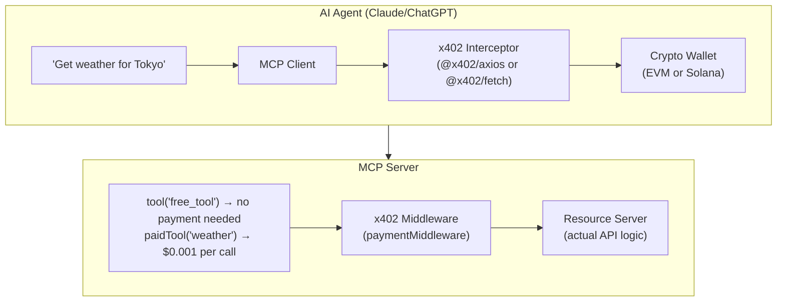
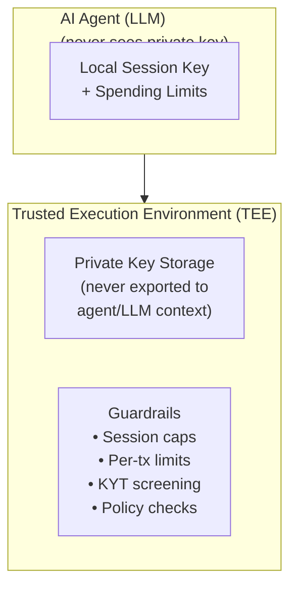

# MCP + x402: How AI Agents Pay for Services

## What Is This?

MCP (Model Context Protocol) gives AI agents the ability to **use tools**. x402 gives them the ability to **pay for tools**. Together they create the first practical infrastructure where an AI agent can autonomously discover a service, pay for it, and use it — no human in the loop.

This isn't theoretical. Coinbase's x402 has processed 100M+ payments. Cloudflare, Vercel, and Coinbase have shipped production integrations. Claude Desktop, ChatGPT, and Cursor can all use paid MCP tools today.

## The Core Problem

Traditional API access requires humans to:
1. Create accounts (email, password)
2. Add payment methods (credit card, KYC)
3. Subscribe or buy credits
4. Generate API keys
5. Configure authentication

An AI agent can't do any of this autonomously. x402 eliminates the entire flow by embedding payment directly into HTTP.

## How x402 Works (The Protocol)

x402 revives the HTTP 402 "Payment Required" status code — defined in 1997, never standardized until now.

### The Payment Handshake

```
Client                    Server                   Facilitator        Blockchain
  |                         |                          |                  |
  |--- GET /resource ------>|                          |                  |
  |<-- 402 + PAYMENT-       |                          |                  |
  |    REQUIRED header -----|                          |                  |
  |                         |                          |                  |
  | [sign payment payload]  |                          |                  |
  |                         |                          |                  |
  |--- GET /resource ------>|                          |                  |
  |    + PAYMENT-SIGNATURE  |                          |                  |
  |    header               |--- POST /verify -------->|                  |
  |                         |<-- verified -------------|                  |
  |                         |--- POST /settle -------->|                  |
  |                         |                          |--- tx ---------> |
  |                         |                          |<-- confirmed --- |
  |                         |<-- settled --------------|                  |
  |<-- 200 OK + PAYMENT-    |                          |                  |
  |    RESPONSE header -----|                          |                  |
```

### Three Phases

| Phase | What Happens | HTTP |
|-------|-------------|------|
| Quote | Client requests resource, server responds with price | `402` + `PAYMENT-REQUIRED` header |
| Pay | Client signs payment, retries with proof | Request + `PAYMENT-SIGNATURE` header |
| Settle | Facilitator verifies, settles on-chain, server delivers | `200` + `PAYMENT-RESPONSE` header |

### Key Design Decisions

**HTTP-native**: No extra requests, no WebSocket, no side channels. Payment rides on standard HTTP headers.

**Facilitator pattern**: Servers don't need blockchain infrastructure. A facilitator (Coinbase, Cloudflare, self-hosted) handles verification and on-chain settlement. This abstracts away gas, RPC endpoints, and network specifics.

**EIP-3009 (Transfer With Authorization)**: The cryptographic primitive underneath. Proposed by Circle in 2020, it allows pre-signed token transfers. Currently only USDC natively supports this — which is why x402 runs on USDC.

**Scheme-extensible**: `exact` (fixed price per call) ships today. `upto` (usage-based ceiling) and `deferred` (batch settlement) are in V2.

### V2 Improvements (Shipped)

| Feature | V1 | V2 |
|---------|----|----|
| Headers | `X-PAYMENT-*` (deprecated) | `PAYMENT-REQUIRED`, `PAYMENT-SIGNATURE`, `PAYMENT-RESPONSE` |
| Sessions | None — pay every call | Wallet-based sessions via `@x402/paywall` |
| Discovery | Manual | Auto-indexing by facilitators |
| Schemes | `exact` only | `exact` + `deferred` + extensible |
| Chains | Base | Base, Solana, Ethereum, L2s |
| SDK | Monolithic | Modular `@x402/*` packages |

## How MCP + x402 Integrate

### Architecture



### Three Integration Patterns

#### Pattern 1: Coinbase SDK (Official)

MCP server wraps a paid API using `@x402/axios`. The wrapper automatically handles the 402 handshake.

**Server side:**
```typescript
import { McpServer } from "@modelcontextprotocol/sdk/server/mcp.js";
import { x402Client, wrapAxiosWithPayment } from "@x402/axios";
import { registerExactEvmScheme } from "@x402/evm/exact/client";

const client = new x402Client();
registerExactEvmScheme(client, { signer: privateKeyToAccount(key) });
const http = wrapAxiosWithPayment(axios.create({ baseURL }), client);

server.tool("get-weather", "Paid weather data", {}, async () => {
  const res = await http.get("/weather"); // 402 handled automatically
  return { content: [{ type: "text", text: JSON.stringify(res.data) }] };
});
```

**Config (Claude Desktop `claude_desktop_config.json`):**
```json
{
  "mcpServers": {
    "weather": {
      "command": "pnpm",
      "args": ["--silent", "-C", "/path/to/mcp-server", "dev"],
      "env": {
        "EVM_PRIVATE_KEY": "0x...",
        "RESOURCE_SERVER_URL": "http://localhost:4021",
        "ENDPOINT_PATH": "/weather"
      }
    }
  }
}
```

#### Pattern 2: Vercel x402-mcp (paidTool)

Vercel's wrapper adds a `paidTool()` method directly to MCP server definition. Cleaner API — price declared alongside the tool.

**Server side:**
```typescript
server.paidTool(
  "add_numbers",
  { price: 0.001 },
  { a: z.number(), b: z.number() },
  async (args) => ({
    content: [{ type: "text", text: String(args.a + args.b) }]
  })
);
```

**Client side:**
```typescript
const mcpClient = await createMCPClient({
  transport: new StreamableHTTPClientTransport(url),
}).then((client) => withPayment(client, { account }));
```

#### Pattern 3: Cloudflare Workers + Agents

Payment middleware on Workers routes. Agents use `fetchWithPay` wrapper.

**Server (Hono on Workers):**
```typescript
app.use(
  paymentMiddleware(
    process.env.SERVER_ADDRESS,
    {
      "/weather": {
        price: "$0.10",
        network: "base-sepolia",
        config: { description: "Weather data" },
      },
    },
    { url: "https://x402.org/facilitator" }
  )
);
```

**Agent:**
```typescript
const account = privateKeyToAccount(env.PRIVATE_KEY);
const pay = fetchWithPay(account);
const res = await pay("https://api.example.com/weather");
```

#### Pattern 4: MCPay (Third-party Proxy)

MCPay sits as a proxy in front of any existing MCP server. Zero code changes to upstream — just wrap it.

```bash
npx mcpay connect --urls https://existing-mcp-server.com --api-key YOUR_KEY
```

Or via SDK:
```typescript
server.paidTool("weather", "Paid tool", "$0.001",
  { city: z.string() }, {},
  async ({ city }) => ({ /* ... */ })
);
```

## The Wallet Layer: Coinbase Agentic Wallets

Agents need wallets to pay. Coinbase built the first wallet infrastructure specifically for AI agents.

### Architecture



### Security Model

| Control | What It Does |
|---------|-------------|
| TEE isolation | Private keys stored in hardware-isolated enclave, never in LLM context |
| Session caps | Maximum total spend per agent session |
| Per-tx limits | Maximum per single transaction |
| KYT (Know Your Transaction) | Blocks high-risk interactions |
| Non-custodial | User retains key ownership, can export |

The critical insight: **the agent never sees the private key**. The TEE signs transactions on the agent's behalf, bounded by spending limits set by the human owner. If the LLM is prompt-injected, the worst case is capped by session limits.

## The Protocol Stack

Where does MCP + x402 fit in the broader agentic web?

| Layer | Protocol | Role |
|-------|----------|------|
| Connectivity | **MCP** | Agent ↔ Tools (discover, invoke) |
| Orchestration | **A2A** (Google) | Agent ↔ Agent (delegate, coordinate) |
| Payment (crypto) | **x402** | HTTP-native stablecoin micropayments |
| Payment (fiat) | **AP2** (Google) | Fiat payments via traditional rails |
| Payment (cards) | **ACP** | Credit card infra adapted for agents |
| Identity/Trust | **ERC-8004** | Onchain agent reputation, staking |

The "Mullet Economy" thesis: **fiat in the front (B2C), crypto in the back (B2B/M2M)**. Consumer-facing agent transactions use AP2/ACP (familiar, regulated). Machine-to-machine backend automation uses x402 (instant, no accounts, programmable).

## Tradeoffs and Problems

### What Works

| Strength | Detail |
|----------|--------|
| Zero-friction onboarding | No accounts, no API keys, no KYC for machine-to-machine |
| Instant settlement | On-chain finality in seconds (Base) |
| Open standard | Not locked to Coinbase despite their heavy involvement |
| MCP compatibility | Works with Claude, ChatGPT, Cursor, any MCP client |
| Micropayment viable | $0.001 per call is practical (Base L2 gas is negligible) |

### What Doesn't Work (Yet)

| Problem | Severity | Detail |
|---------|----------|--------|
| USDC-only | High | EIP-3009 only supported by USDC. Other tokens can't use x402's trust-minimizing design |
| Facilitator centralization | High | Most implementations use Coinbase's facilitator. "Open standard" with one gatekeeper |
| No fiat on-ramp for agents | High | Agents need USDC. Getting USDC still requires human KYC somewhere in the chain |
| Retry/dispute handling | Medium | V1 had no retry logic or dispute resolution. V2 improving but still thin |
| Human confirmation UX | Medium | Current MCP clients prompt humans for payment approval. Not truly autonomous yet |
| Wallet key management | Medium | Even with TEE, who provisions the wallet? Who funds it? Still human bootstrapping |

### The Centralization Irony

x402 is an "open standard" but the infrastructure is dominated by Coinbase:
- Coinbase built the SDK
- Coinbase runs the primary facilitator
- Coinbase provides the wallet infrastructure (AgentKit, Agentic Wallets)
- Coinbase co-founded the x402 Foundation with Cloudflare

This is the Web3 pattern repeating: decentralized protocol, centralized implementation.

### The Bootstrap Problem

For an agent to pay with x402, someone must:
1. Create a wallet (requires human)
2. Fund the wallet with USDC (requires human + KYC exchange)
3. Configure the agent with wallet access (requires human)
4. Set spending limits (requires human)

x402 removes the per-transaction human involvement, but the initial setup is still fully human-dependent. The "fully autonomous agent economy" narrative breaks down at bootstrapping.

## Alternatives

| Alternative | Approach | Trade-off |
|-------------|----------|-----------|
| Stripe MCP | Traditional payment rails via MCP | Requires accounts, but familiar and regulated |
| Google AP2 | Fiat agent payments with cryptographic mandates | More enterprise-friendly, less crypto-native |
| Plain API keys | Pre-provisioned access, no per-call payment | No autonomy, but simple and works today |
| OAuth + billing | Standard web auth with usage billing | Human-managed, but battle-tested |
| ACP (Agentic Commerce) | Credit card infra adapted for agents | Familiar rails, but still requires card issuance |

## Steal These Patterns

| Pattern | What | Use Case |
|---------|------|----------|
| HTTP 402 handshake | Payment embedded in standard request-response | Any API monetization — no account system needed |
| `paidTool()` decorator | Price declared alongside tool definition | Monetize MCP tools with one line |
| Facilitator abstraction | Separate payment verification from business logic | Server doesn't need blockchain knowledge |
| TEE wallet isolation | Private keys never in LLM context | Secure agent autonomy with bounded risk |
| Session-based access | Pay once, get session token via `@x402/paywall` | Reduce per-call overhead for high-frequency use |
| Deferred settlement | Aggregate micropayments, settle in batches | Cost-effective for high-volume, low-value calls |
| Proxy monetization (MCPay) | Wrap existing MCP servers with payment | Monetize without touching upstream code |

## Practical Getting Started

### Fastest Path: Use Coinbase x402 + MCP

```bash
git clone https://github.com/coinbase/x402.git
cd x402/examples/typescript
pnpm install && pnpm build

# Start the demo paid API server
cd servers/express && pnpm dev

# In another terminal, configure Claude Desktop with the MCP server
# Add to claude_desktop_config.json (see Pattern 1 above)
```

Requirements:
- Node.js v20+
- A wallet with USDC on Base Sepolia (testnet) or Base Mainnet
- Claude Desktop with MCP enabled

### Fastest Path: Monetize an Existing MCP Server

```bash
npx mcpay connect --urls https://your-mcp-server.com --wallet-key 0x...
```

MCPay wraps your server as a proxy — zero code changes.

## Latest Updates (2026)

### MCP Donated to the Agentic AI Foundation (December 2025)

Anthropic donated MCP to the newly formed **Agentic AI Foundation (AAIF)** under the Linux Foundation. OpenAI and Block joined as co-founders, with AWS, Google, Microsoft, Cloudflare, and Bloomberg as platinum members. This is a major governance shift: MCP is no longer Anthropic's project — it is now an industry-wide open standard with neutral governance. OpenAI contributed AGENTS.md (adopted by 60,000+ open-source projects), and Block contributed goose (an open-source local-first AI agent framework).

### MCP Spec 2025-11-25: Async Tasks and URL Elicitation

The November 2025 spec release introduced two critical primitives:

- **Tasks**: A new abstraction for asynchronous, long-running operations. Any request can now become "call-now, fetch-later" — the server returns task metadata immediately, and the client polls for results. Tasks move through states (`working`, `input_required`, `completed`, `failed`, `cancelled`), enabling multi-step workflows that were impossible with synchronous-only tool calls.
- **URL Mode Elicitation (SEP-1036)**: Servers can send a URL to redirect users to a browser for sensitive flows (OAuth, payments, API key provisioning) instead of handling credentials inside the MCP client. This is directly relevant to x402 — payment confirmation can now happen in a proper browser context rather than being shoehorned into agent UX.

### x402 Facilitator Decentralization: Dexter Overtakes Coinbase

As of January 2026, **Dexter has overtaken Coinbase as the largest daily x402 facilitator**, handling roughly 50% of daily transaction volume. Four facilitators have each processed over 10 million transactions: Coinbase, Dexter, PayAI, and DayDreams. Base leads all chains with 68M+ total x402 transactions since October 2025. This directly addresses the "centralization irony" noted earlier — the facilitator layer is genuinely diversifying, though Base (a Coinbase L2) still dominates as the settlement chain.

### Google AP2 + x402 Extension: Fiat and Crypto Converge

Google released the **A2A x402 Extension** as a production-ready bridge between its Agent-to-Agent (A2A) protocol and x402 crypto payments. AP2 is payment-agnostic (cards, bank transfers, stablecoins), and the x402 extension lets agents settle API calls in stablecoin underneath AP2's Intent Mandate framework. Google assembled 60+ launch partners including Mastercard, Adyen, PayPal, and Coinbase. The "Mullet Economy" thesis is now live infrastructure: AP2 handles the fiat front-end, x402 handles the crypto back-end.

### Browserbase x402 Endpoint: Agents Pay to Browse the Web

Browserbase launched an x402 endpoint that lets AI agents **autonomously purchase browser sessions**. Agents can open Chrome, navigate websites, click buttons, fill forms, and read pages — paid per session in USDC on Base. No API keys, no accounts, no billing portals. This is one of the first non-API use cases for x402: agents aren't just calling data endpoints, they're paying for compute resources (headless browser time) on demand.

### XRP Ledger x402 Facilitator (February 2026)

t54.ai launched an x402 facilitator on the **XRP Ledger**, enabling AI agents to pay with XRP and RLUSD (Ripple's USD stablecoin). This breaks x402's dependency on EVM-compatible chains and USDC. The facilitator processes payer-signed presigned Payment transaction blobs and supports both XRP and IOU tokens. Already in production with BlockRunAI, a unified gateway providing agent access to 30+ LLM models (GPT, Claude, Grok) with per-request x402 payment settling on XRPL.

### x402 Transaction Volume Surge

Total x402 transactions have surged into the tens of millions since the protocol's September 2025 launch. Over 100 million payments have been processed across APIs, apps, and AI agents. Weekly transaction volume has reached 500,000+. The ecosystem now spans multiple chains (Base, Solana, Ethereum, XRPL, BNB Chain) and multiple facilitators, validating the protocol's production readiness beyond testnet experiments.

## Bottom Line

**MCP + x402 is the first practical "agent pays for service" stack.** It's real, it's shipping, and it works today on testnet and mainnet.

**The honest picture**: It solves the per-transaction friction (no accounts, no API keys, instant payment). It does NOT solve the bootstrapping problem (someone still funds the wallet). The "autonomous agent economy" is real for machine-to-machine backend payments, but consumer-facing agent commerce will likely use fiat rails (AP2/ACP) for regulatory reasons.

**What to build today**: If you have an API or MCP tool, adding x402 payment is ~10 lines of middleware. If you're building agents, `@x402/fetch` or `@x402/axios` wraps your HTTP client with automatic payment. The infrastructure is mature enough for production use on Base mainnet.

## References

### x402 Protocol Core

- [x402.org — Official Site](https://www.x402.org/) — Protocol specification, ecosystem, foundation info
- [x402 V2 Launch Announcement](https://www.x402.org/writing/x402-v2-launch) — V2 changes: sessions, discovery, deferred settlement, modular SDK
- [x402 Whitepaper (PDF)](https://www.x402.org/x402-whitepaper.pdf) — Full protocol specification
- [coinbase/x402 — GitHub](https://github.com/coinbase/x402) — Reference implementation (TypeScript, Python, Go, Java)
- [x402 Protocol Explained — QuickNode](https://blog.quicknode.com/x402-protocol-explained-inside-the-https-native-payment-layer/) — Technical deep dive: EIP-3009, facilitator role, settlement
- [What is x402? — Solana](https://solana.com/x402/what-is-x402) — Solana-side x402 explanation
- [What is x402? — Thirdweb](https://blog.thirdweb.com/what-is-x402-protocol-the-http-based-payment-standard-for-onchain-commerce/) — General overview

### MCP + x402 Integration

- [MCP Server with x402 — Coinbase Docs](https://docs.cdp.coinbase.com/x402/mcp-server) — Official guide: MCP server setup with x402 payments
- [x402-mcp: Open Protocol Payments for MCP Tools — Vercel](https://vercel.com/blog/introducing-x402-mcp-open-protocol-payments-for-mcp-tools) — Vercel's `paidTool()` wrapper
- [x402 · Cloudflare Agents Docs](https://developers.cloudflare.com/agents/x402/) — Workers + Agents x402 integration
- [Autonomous API & MCP Server Payments with x402 — Zuplo](https://zuplo.com/blog/mcp-api-payments-with-x402) — Implementation examples, server/client code
- [MCP Server with x402 — x402 Gitbook](https://x402.gitbook.io/x402/guides/mcp-server-with-x402) — Step-by-step guide
- [x402 MCP Examples — GitHub](https://github.com/coinbase/x402/tree/main/examples/typescript/mcp) — Official example code

### MCPay (Third-party)

- [MCPay — GitHub](https://github.com/microchipgnu/MCPay) — Open-source proxy for adding x402 payments to any MCP server
- [mcp-go-x402 — GitHub](https://github.com/mark3labs/mcp-go-x402) — Go implementation of x402 transport for MCP

### Wallet Infrastructure

- [Agentic Wallets — Coinbase](https://www.coinbase.com/developer-platform/discover/launches/agentic-wallets) — TEE architecture, spending limits, security model
- [Agentic Wallet Docs — Coinbase](https://docs.cdp.coinbase.com/agentic-wallet/welcome) — Technical documentation
- [AgentKit — GitHub](https://github.com/coinbase/agentkit) — "Every AI Agent deserves a wallet" — framework-agnostic agent wallet toolkit
- [AgentKit MCP Extension — Coinbase Docs](https://docs.cdp.coinbase.com/agent-kit/core-concepts/model-context-protocol) — MCP integration for AgentKit
- [Coinbase Debuts Crypto Wallet Infrastructure for AI Agents — PYMNTS](https://www.pymnts.com/cryptocurrency/2026/coinbase-debuts-crypto-wallet-infrastructure-for-ai-agents/)
- [Coinbase Rolls Out AI Tool to 'Give Any Agent a Wallet' — The Block](https://www.theblock.co/post/389524/coinbase-rolls-out-ai-tool-to-give-any-agent-a-wallet)

### x402 Foundation & Partnerships

- [Launching the x402 Foundation with Coinbase — Cloudflare Blog](https://blog.cloudflare.com/x402/) — Foundation mission, deferred payment scheme, Workers integration
- [Cloudflare and Coinbase Launch x402 Foundation — The Block](https://www.theblock.co/post/372064/cloudflare-coinbase-launch-x402-foundation)
- [x402 Ecosystem](https://www.x402.org/ecosystem) — Full ecosystem map

### Protocol Landscape

- [MCP, A2A, AP2, ACP, x402 & ERC-8004 Explained — PayRam](https://payram.com/blog/mcp-a2a-ap2-acp-x402-erc-8004) — Full protocol stack comparison
- [From DeFi Summer to x402 Summer — Medium](https://medium.com/@a6b8/from-defi-summer-to-x402-summer-mcp-x402-and-the-fragmented-web-94faa1c5ffb7) — MCP + x402 convergence analysis
- [x402 + AnChain.AI: Unlocking Trust in Agentic AI Payments](https://www.anchain.ai/blog/x402) — Security perspective
- [x402 V2 Upgrade — InfoQ](https://www.infoq.com/news/2026/01/x402-agentic-http-payments/) — Industry coverage of V2 launch

### Community Implementations

- [P-Link-MCP — GitHub](https://github.com/paracetamol951/P-Link-MCP) — x402 client + HTTP 402 server + MCP for P-Link.io
- [x402-playground — Morpheus](https://github.com/MorpheusAIs/x402-playground) — Experimental AI chat with x402 APIs and MCP servers
- [rome-x402-mcp — GitHub](https://github.com/xarmian/rome-x402-mcp) — Cross-chain token bridging via x402 + MCP
- [tip-md-x402-mcp-server — GitHub](https://github.com/xR0am/tip-md-x402-mcp-server) — Crypto tipping MCP server with x402
- [@civic/x402-mcp — npm](https://www.npmjs.com/package/@civic/x402-mcp) — Civic's x402 MCP implementation

### Latest Updates Sources (2026)

- [Linux Foundation Announces AAIF](https://www.linuxfoundation.org/press/linux-foundation-announces-the-formation-of-the-agentic-ai-foundation) — MCP donated to Agentic AI Foundation
- [Anthropic: Donating MCP and Establishing AAIF](https://www.anthropic.com/news/donating-the-model-context-protocol-and-establishing-of-the-agentic-ai-foundation) — Anthropic's announcement
- [MCP Spec 2025-11-25](https://modelcontextprotocol.io/specification/2025-11-25) — November 2025 specification with Tasks, URL elicitation
- [MCP 2025-11-25 Spec Update — WorkOS](https://workos.com/blog/mcp-2025-11-25-spec-update) — Async Tasks, OAuth improvements
- [Dexter Overtakes Coinbase as Top x402 Facilitator — The Coin Republic](https://www.thecoinrepublic.com/2026/01/02/dexter-overtakes-coinbase-as-top-x402-facilitator/) — Facilitator decentralization
- [Dexter Overtakes Coinbase as Top x402 Transaction Facilitator — ainvest](https://www.ainvest.com/news/dexter-overtakes-coinbase-top-x402-transaction-facilitator-2601/) — Market share data
- [Google AP2 + x402: Agents Can Now Pay Each Other — Coinbase](https://www.coinbase.com/developer-platform/discover/launches/google_x402) — AP2/x402 integration
- [A2A x402 Extension — GitHub](https://github.com/google-agentic-commerce/a2a-x402) — Google's A2A x402 open-source extension
- [Browserbase Enables Agentic Browser Sessions with x402 — Coinbase](https://www.coinbase.com/en-fr/developer-platform/discover/launches/browserbase-x402-usdc) — Browser sessions via x402
- [Browserbase + Coinbase x402 — Browserbase Blog](https://www.browserbase.com/blog/browserbase-and-coinbase-x402) — Technical details
- [XRP Ledger Gets x402 Facilitator — CryptBull](https://www.cryptbull.net/2026/02/21/xrp-ledger-gets-x402-facilitator-for-ai-agent-payments-why-this-is-bullish/) — XRPL x402 support
- [AI Agents Can Now Pay With XRP and RLUSD via x402 — Coinpedia](https://coinpedia.org/news/xrp-ledger-news-today-ai-agents-can-now-pay-with-xrp-and-rlusd-via-x402/) — XRP/RLUSD payments
- [Coinbase Expands Reach of Stablecoin-Based AI Agent Payments Tool — CoinDesk](https://www.coindesk.com/tech/2025/12/11/coinbase-expands-the-reach-of-its-stablecoin-based-ai-agent-payments-tool) — V2 expansion coverage
- [x402-incubated V2 Rolls Out — The Block](https://www.theblock.co/post/382284/coinbase-incubated-x402-payments-protocol-built-for-ais-rolls-out-v2) — V2 launch coverage
