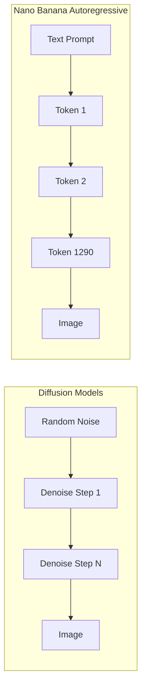
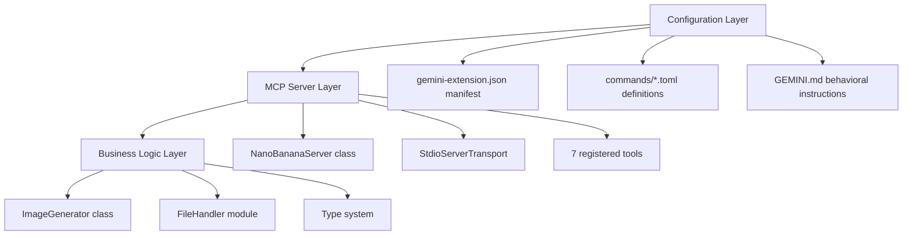
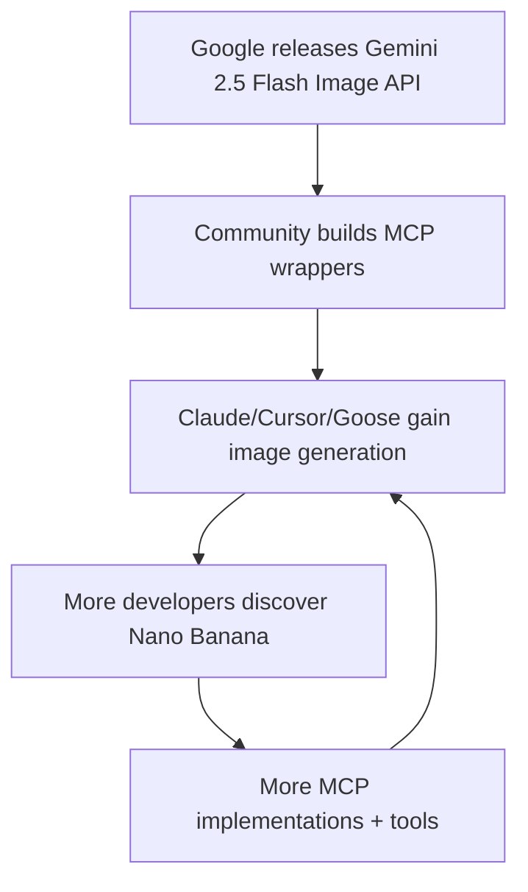

# Nano Banana: Google's Native Image Generation Revolution

## What Is It?

"Nano Banana" is Google DeepMind's codename for **Gemini 2.5 Flash Image** (`gemini-2.5-flash-image`), a natively multimodal model that generates and edits images autoregressively — not via diffusion. Its successor, **Nano Banana Pro** (`gemini-3-pro-image-preview`), built on Gemini 3 Pro, adds 4K output, advanced text rendering, and Google Search grounding.

The name originated at 2:30 AM when product manager **Naina Raisinghani** needed a codename for anonymous LMArena testing. She combined her two nicknames — "Naina Banana" (friends) and "Nano" (short stature + computer nerd) — into "Nano Banana." It was meant as a throwaway placeholder but went viral when the model topped LMArena's image editing leaderboard with a **171-point Elo lead** and **2.5M+ community votes**. Google embraced it: yellow "Run" button in AI Studio, banana emoji in Gemini app, limited-edition banana swag.

Beyond the model itself, "Nano Banana" now refers to an entire ecosystem: 141+ GitHub repos, multiple MCP servers, CLI tools, Gemini CLI extensions, hackathon kits, prompt libraries, and third-party SaaS wrappers.

## Timeline

| Date | Event |
|------|-------|
| Dec 2024 | Gemini 2.0 Flash native image generation (early access to trusted testers) |
| Mar 2025 | Gemini 2.0 Flash image output public via AI Studio & API |
| Aug 12, 2025 | "Nano Banana" appears anonymously on LMArena — immediately dominates image editing rankings |
| Aug 26, 2025 | Official launch: Gemini 2.5 Flash Image via Gemini API, AI Studio, Vertex AI |
| Sep 6-8, 2025 | Google DeepMind Nano Banana Hackathon — 832 projects, 50 winners, $400K+ prizes |
| Nov 20, 2025 | Nano Banana Pro (Gemini 3 Pro Image) released |
| Jan 15, 2026 | Google publishes "How Nano Banana Got Its Name" blog post |
| Jan 17, 2026 | API performance degradation incident (180s+ generation times, tightened content filtering) |

## Architecture: Why Native Multimodal Matters

### Autoregressive vs Diffusion

Traditional image generators (DALL-E 3, Stable Diffusion, Midjourney) use **diffusion** — progressively denoising random noise into an image. Nano Banana uses **autoregressive token generation** — the same mechanism that generates text. Each image is **1,290 output tokens** decoded into pixels.



**Why this matters:**

| Aspect | Diffusion (DALL-E, Flux) | Autoregressive (Nano Banana) |
|--------|--------------------------|------------------------------|
| Text understanding | Separate CLIP/T5 encoder, limited context | Full Gemini LLM encoder, 32K token context |
| Editing precision | Requires inpainting masks, ControlNet | Natural language editing ("remove the stain on the shirt") |
| Multi-turn conversation | Not natively supported | Chat-based iterative refinement |
| Text in images | Historically terrible | Industry-leading (especially Pro) |
| Style transfer | Strong | Weak (architectural limitation) |
| Speed | Varies (10-60s typical) | 0.8s (Flash), 20-40s (Pro) |

### Model Architecture

Gemini models are **sparse Mixture-of-Experts (MoE) transformers** trained natively on text, vision, and audio from the ground up. For image generation:

1. The gating network routes input tokens to relevant expert subsets
2. Only a fraction of total parameters activate per token (decoupling capacity from compute cost)
3. Image tokens are generated in the same unified sequence as text tokens
4. A decoder converts the 1,290 image tokens back into pixel data

This means the model has **world knowledge** when generating images — it understands what things look like, how they relate, and can reason about composition. A diffusion model just learns noise-to-image mappings.

## Model Comparison

| Feature | Nano Banana (Flash) | Nano Banana Pro |
|---------|--------------------|--------------------|
| Model ID | `gemini-2.5-flash-image` | `gemini-3-pro-image-preview` |
| Optimized for | Speed, high-volume, low-latency | Professional asset production |
| Max resolution | 1024x1024 | 4K (3840px) |
| Resolution options | 1K only | 1K, 2K, 4K |
| Text rendering | Good | Industry-leading (long passages, multilingual) |
| Thinking mode | No | Yes (advanced reasoning before generation) |
| Google Search grounding | No | Yes (real-time data in images) |
| Reference images | Supported | Up to 14 (6 object + 5 human + 3 style) |
| Aspect ratios | 1:1, 2:3, 3:2, 3:4, 4:3, 4:5, 5:4, 9:16, 16:9, 21:9 | Same + flexible |
| Speed | ~0.8s per image | 20-40s per image |
| SynthID watermark | Yes (invisible) + visible for free tier | Yes (invisible) + visible for free tier |

### Pricing (Gemini Developer API)

| Model | Input (text/image) | Output (image) | Per Image Cost | Batch (50% off) |
|-------|-------------------|-----------------|----------------|------------------|
| Flash | $0.30/1M tokens | $30/1M tokens | **$0.039** (1,290 tokens) | $0.0195 |
| Pro | $2.00/1M tokens | $120/1M tokens | **$0.134** (1K/2K), **$0.24** (4K) | $0.067 / $0.12 |

**Free tier**: No free image generation for Flash or Pro. Free access runs through Gemini 2.0 Flash (500 RPD, 250K TPM).

### API Usage

```typescript
// Basic text-to-image
const response = await model.generateContent({
  contents: [{ parts: [{ text: "A futuristic city at night" }] }],
  generationConfig: {
    responseModalities: ["TEXT", "IMAGE"],  // REQUIRED for image output
  }
});

// Image editing (provide input image + instruction)
const response = await model.generateContent({
  contents: [{
    parts: [
      { inlineData: { mimeType: "image/png", data: base64Image } },
      { text: "Remove the person in the background" }
    ]
  }],
  generationConfig: { responseModalities: ["TEXT", "IMAGE"] }
});
```

Key API parameter: `responseModalities: ["TEXT", "IMAGE"]` — without this, the model returns text only.

## The Nano Banana Ecosystem

### GitHub Scale

The `nano-banana` GitHub topic has **141 public repositories** across TypeScript (48), Python (39), JavaScript (11), and more.

**Top repos by stars:**

| Repo | Stars | Description |
|------|-------|-------------|
| Awesome-Nano-Banana-images | 20.9K | Curated collection of images generated with Nano Banana |
| AionUi | 16.8K | Open-source multi-model AI app (includes Gemini) |
| awesome-nano-banana | 8.6K | Prompts and visuals collection |
| awesome-nano-banana-pro-prompts | 7.7K | 8,000+ prompts with multilingual support |
| big-AGI | 6.9K | Multi-model AI suite with Gemini integration |

### MCP Servers (Model Context Protocol)

Multiple MCP server implementations exist, giving AI assistants (Claude, Cursor, etc.) the ability to generate images via Nano Banana:

#### 1. ConechoAI/Nano-Banana-MCP (99 stars, 51 forks)

The most popular MCP implementation. TypeScript, built with Claude Code.

**Architecture:**

```
src/
  index.ts          → MCP server (StdioServerTransport, JSON-RPC)
  imageGenerator.ts → Gemini API interactions
  fileHandler.ts    → File I/O, smart naming, cross-platform paths
  types.ts          → Shared TypeScript interfaces
```

**Tools exposed:**

| Tool | Purpose |
|------|---------|
| `generate_image` | Create new images from text prompts |
| `edit_image` | Modify existing images with optional reference images |
| `continue_editing` | Iterate on the last generated/edited image |
| `get_last_image_info` | Retrieve metadata about previous output |
| `configure_gemini_token` | Set API key programmatically |
| `get_configuration_status` | Check if API is configured |

**Tech stack**: TypeScript, Node.js 18+, `@modelcontextprotocol/sdk`, `@google/genai`, Zod validation.

**Configuration (Claude Desktop/Code):**

```json
{
  "mcpServers": {
    "nano-banana": {
      "command": "npx",
      "args": ["nano-banana-mcp"],
      "env": { "GEMINI_API_KEY": "your-key" }
    }
  }
}
```

**API key priority**: MCP config env > system env > `.nano-banana-config.json`

**File storage**: Windows: `%USERPROFILE%\Documents\nano-banana-images\`, macOS/Linux: `./generated_imgs/`

#### 2. zhongweili/nanobanana-mcp-server (Python)

Production-ready Python MCP server with **intelligent model selection**.

**Auto-selection logic:**
- **Pro** chosen when: quality keywords ("4K", "professional"), high resolution requested, Search grounding, complex reasoning
- **Flash** chosen when: speed keywords ("quick", "draft"), batch generation (n > 2), standard resolution

**Auth methods**: API Key (default), Vertex AI ADC (Google Cloud), or automatic fallback.

**Install**: `uvx nanobanana-mcp-server@latest` or `pip install nanobanana-mcp-server`

**Compatible with**: Claude Desktop, Claude Code (VS Code), Cursor, Continue.dev, Open WebUI, generic MCP clients.

#### 3. Other MCP Implementations

| Repo | Key Differentiator |
|------|-------------------|
| shinpr/mcp-image | Gemini 3 Pro focused, for Cursor & Codex |
| mrafaeldie12/nano-banana-pro-mcp | Gemini 3 Pro only |
| YCSE/nanobanana-mcp | Claude Desktop + Claude Code specific |
| nanana-app/mcp-server-nano-banana | Nanana AI service wrapper |
| ion-aluminium/nanobanana-mcp-cliproxyapi | CLI proxy API edition |

### Gemini CLI Extension (gemini-cli-extensions/nanobanana)

A first-class Gemini CLI extension with the richest command set.

**Install**: `gemini extensions install https://github.com/gemini-cli-extensions/nanobanana`

**Architecture (3-layer):**



**8 Commands:**

| Command | MCP Tool | Purpose |
|---------|----------|---------|
| `/generate` | `generate_image` | Single/multi image generation with `--count`, `--styles`, `--variations`, `--seed` |
| `/edit` | `edit_image` | Modify existing images |
| `/restore` | `restore_image` | Enhance damaged/old photos |
| `/icon` | `generate_icon` | App icons, favicons, UI elements in multiple sizes |
| `/pattern` | `generate_pattern` | Seamless patterns and textures |
| `/story` | `generate_story` | Sequential narrative images |
| `/diagram` | `generate_diagram` | Flowcharts, architecture diagrams |
| `/nanobanana` | Natural language | Freeform natural language interface |

**Generate options**: `--count=N` (1-8), `--styles="style1,style2"`, `--variations="var1,var2"`, `--format=grid|separate`, `--seed=123`, `--preview` (auto-open)

**Model selection**: Default `gemini-2.5-flash-image`, set `NANOBANANA_MODEL` env var for Pro.

**Key files:**
- `gemini-extension.json` — manifest with MCP server command path
- `commands/*.toml` — 8 TOML command definitions with parameter schemas
- `GEMINI.md` — behavioral instructions loaded into conversation context (exact count adherence, visual consistency, text rendering quality)
- `mcp-server/src/index.ts` — NanoBananaServer class, 7 tool registrations
- `mcp-server/src/imageGenerator.ts` — Gemini API calls, prompt engineering, batch operations
- `mcp-server/src/fileHandler.ts` — findInputFile() searches 6 directories, generateFilename() with collision avoidance, base64 encode/decode

**Release**: GitHub Actions builds `nanobanana-release.tar.gz` with compiled JS + runtime deps (no TypeScript sources).

### CLI Tools

#### The-Focus-AI/nano-banana-cli (TypeScript)

```bash
npx @the-focus-ai/nano-banana [prompt] --file [input] --output [path]
```

- Text-to-image, editing, batch processing
- **Claude Code plugin** with `nano-banana-imagegen` skill
- Makefile for batch operations: `make process PROMPT=slide-extractor`
- Default model: `nano-banana-pro-preview`

#### erikceballos/nano-banana-cli (Go)

Written in Go (69.6% of codebase). Personal project — "Pull requests are not accepted."
- Image generation, editing, icon creation, pattern generation, image composition
- `.goreleaser.yml` for release automation
- Apache 2.0 license

#### minimaxir/gemimg (Python)

Max Woolf's lightweight Python wrapper — the most technically rigorous implementation.

```python
from gemimg import GemImg
g = GemImg(api_key="YOUR_KEY")
gen = g.generate("A kitten with purple-and-green fur")
```

- **No Google SDK dependency** — direct API calls
- CLI: `gemimg "prompt"` or `python -m gemimg "prompt"`
- Grid generation (multiple images in one API call, Pro)
- Automatic grid slicing into individual images
- Stores prompts in PNG metadata
- Aspect ratio control, WebP output
- Nano Banana Pro support with 1K/2K/4K sizes

#### aaronkwhite/nanobanana-studio (NextJS)

Self-hosted batch image generation UI.
- **50% cost reduction** via Gemini Batch API
- NextJS + SQLite, fully local
- Drag & drop, aspect ratio/resolution controls
- Async batch processing (10-30 min per batch)

### Other Notable Projects

| Project | Description |
|---------|-------------|
| gavrielc/Nano-PDF | Edit PDF files with Nano Banana |
| simonliu-ai-product/simon-nb | CLI tools for interacting with Nano Banana + local files |
| markfulton/NanoBananaEditor | Full GUI editor with masks, version history, reference images |
| google-gemini/nano-banana-hackathon-kit | Official hackathon starter kit |
| ZeroLu/awesome-nanobanana-pro | Curated Pro prompts from X/WeChat/Replicate |
| YouMind-OpenLab/awesome-nano-banana-pro-prompts | 8,000+ prompts, 3.8K stars |

## Prompt Engineering Deep Dive

Max Woolf's research (minimaxir.com) provides the most rigorous prompt engineering analysis.

### What Works

**Structured prompts**: Nano Banana's text encoder (Gemini 2.5 Flash) was trained on code repos, JSON, and agentic behaviors. It understands:
- Markdown lists and formatting
- Hex color codes (`#9F2B68`)
- Multi-part instructions with numbered steps
- JSON character descriptions

**ALL CAPS and "threats"**: Actually improve instruction adherence. This is unusual but documented.

**Specification buzzwords**: "Pulitzer Prize-winning", "Vanity Fair cover", "by Annie Leibovitz" influence composition quality.

**Physical constraints**: Adding "shot on Canon EOS R5, 85mm f/1.4" forces photorealism over digital illustration.

**Large context window**: 32,768 tokens available (vs CLIP's 77 or T5's 512). You can include full JSON character sheets, HTML code, and detailed scene descriptions.

**Multi-image consistency**: Without LoRA training, maintained accurate depictions of "Ugly Sonic" across 17 reference images.

### What Fails

**Style transfer**: The autoregressive architecture that excels at detailed editing ironically resists style transfer. "Convert this photo to Studio Ghibli style" performs poorly. Generating *new images in that style* works better.

**Spatial reasoning**: Struggles with left/right directional instructions. Workaround: add "from the character's perspective, NOT the camera's perspective."

**Consistency across edits**: "Nano banana will sporadically add a convincing fireplace to a room or new garage behind a house. This happens even with explicit ALL CAPS instructions not to do so" — making it "impossible to build a reliable app" for some use cases.

**Cost**: ~$0.04 per 1024x1024 image = ~25 generations per dollar. Cheap for experimentation, adds up for production.

## Benchmarks & Rankings

### LMArena Performance

| Metric | Result |
|--------|--------|
| Image Editing ranking | #1 (Aug 2025) |
| Text-to-Image ranking | #1 (Aug 2025) |
| Elo lead | 171 points (largest in Arena history) |
| Community votes | 2.5M+ for Nano Banana |
| Total platform votes | 5M+ |
| Speed | 0.8s (Flash) — 10x faster than Flux Kontext |

### vs GPT Image 1.5 (Feb 2026)

| Dimension | Nano Banana Pro | GPT Image 1.5 |
|-----------|-----------------|----------------|
| Resolution | 4K (3840px) | 1.5K |
| Speed | 3x faster | Baseline |
| Text rendering | Superior (dense text, multilingual) | Good but inconsistent with dense text |
| Aesthetic | "Candid photograph" — authentic feel | "Commercial photography" — polished but artificial |
| Cost | $0.134/image (1K) | ~20% cheaper |
| Image editing (Artificial Analysis) | Close second (-3 pts) | Narrow leader |
| Text-to-image (Artificial Analysis) | Competitive | Leader (1264 pts) |

**Summary**: Nano Banana Pro = "final render tool" (precision, resolution). GPT Image 1.5 = "creative sketchpad" (speed, cost). Neither dominates all benchmarks.

### Competitive Landscape (Feb 2026)

| Model | Best For | Weakness |
|-------|----------|----------|
| GPT Image 1.5 | Text-to-image, instruction following | Sometimes artificial look |
| Nano Banana Pro | Text rendering, editing, 4K resolution | Style transfer, consistency bugs |
| Nano Banana (Flash) | Speed, volume, prototyping | Lower resolution (1K only) |
| Flux 2 Pro | Character consistency, editing workflows | No native text understanding |
| Ideogram 3.0 | 90% text accuracy, typography | Limited editing |
| Midjourney | Photorealism, artistic style | No API, slow |
| Recraft | Logos, icons, SVG vectors | Limited photorealism |
| Imagen 4 (Google) | Text rendering, consistency | Early access only |

## Limitations & Known Issues

### Technical Limitations

1. **Style transfer fails**: Autoregressive architecture resists converting existing images to new artistic styles
2. **Spatial reasoning weak**: Left/right, above/below instructions unreliable
3. **Consistency drift**: Multi-edit sessions produce hallucinated additions (fireplaces, garages)
4. **Quality degradation**: Images get blurry/pixelated after multiple sequential edits
5. **Size constraints**: Flash limited to 1024x1024; Pro preview may have instability
6. **No animation/video**: Static images only
7. **Grid images**: Only Pro supports grid generation

### Content Moderation & Safety

- **Safety filters**: Conservative bias toward blocking borderline cases
- **"Content Blocked" errors**: Common frustration — triggers on restricted words, sensitive topics, any NSFW content
- **January 2026 tightening**: IMAGE_SAFETY filtering strengthened, well-known IP restrictions added. Developer community pushback
- **SynthID watermarking**: All outputs watermarked (invisible binary encoding + visible Gemini sparkle for free users)
- **Visible watermark removal**: Only for Google AI Ultra subscribers and AI Studio developer tool
- **Minimal IP restrictions** (vs ChatGPT): Generates copyrighted characters more freely — potential legal liability
- **NSFW moderation**: Among the more permissive AI APIs (though tightening over time)

### Performance Issues

- **Jan 17, 2026 incident**: Generation times spiked from 20-40s to 180s+ for Pro. Triggered by tightened review processes for high-concurrency calls, abnormal traffic, suspected commercial abuse
- **Rate limits**: Preview models have restrictive limits that may change
- **Free tier squeeze**: No free image generation for Flash/Pro via API (only through Gemini 2.0 Flash)

## The Broader Context

### Why Native Image Generation Matters

Nano Banana represents a fundamental architectural shift. Previous image generation was a **separate pipeline**: text encoder (CLIP) → diffusion model → image decoder. Gemini integrates image generation into the **same model** that understands language, code, and world knowledge.

**Implications:**

1. **Editing becomes conversation**: "Remove the stain" instead of drawing inpainting masks
2. **World knowledge in images**: The model knows what a "2026 Tesla Model Y" looks like without being explicitly trained on it
3. **Multi-modal workflows**: Generate an image, analyze it, edit it, write alt-text — all in one model call
4. **Agent integration**: MCP servers let AI coding assistants generate images mid-workflow — design mockups, diagrams, icons on demand
5. **Cost democratization**: $0.039/image makes bulk generation accessible

### The MCP Ecosystem Pattern

Nano Banana's MCP adoption reveals a broader pattern: **open models + protocol standardization = rapid ecosystem formation**.



Within 6 months of launch: 141+ GitHub repos, multiple npm packages, Python wrappers, Gemini CLI extensions, self-hosted UIs, batch processors, and n8n workflow integrations. The MCP protocol acts as a force multiplier — one integration pattern serves every MCP-compatible client.

### Google's Strategic Position

Nano Banana gives Google a unique advantage: the **only major cloud provider** offering state-of-the-art image generation natively in their LLM API. OpenAI has DALL-E/GPT Image (separate), Anthropic has no image generation, Meta has no commercial image API.

The $400K hackathon, banana branding, and aggressive pricing ($0.039/image) are deliberate ecosystem plays. Google is betting that developer adoption of Gemini for image generation creates lock-in for the broader Gemini API platform.

## Hackathon & Community

### Nano Banana Hackathon (Sep 6-8, 2025)

- Hosted by Google DeepMind
- **832 projects submitted**, 50 winners selected
- **$400,000+ in prizes**: each winner received $5K Gemini API credits, $1K Fal credits, ~$2K ElevenLabs credits
- Judging: 10% demo quality, 40% innovation/"wow factor", 50% technical execution + impact

**Notable winners:**
- **LifeTrace Timeline** (Chris Tang): Raw location data → personalized hand-drawn visual diary
- **ArtLens** (Mark Greenfield): Reimagines famous paintings as real-world scenes
- **ForgeOne**: AI system that critiques and refines its own creative output

### Hacker News Reception

**Positive signals:**
- "This is the GPT-4 moment for image editing models"
- Designers report replacing thousands of dollars in studio work
- 171 Elo point jump on LMArena noted as significant
- "Photoshop killer" nickname on social media

**Skeptic voices:**
- Reliability concerns: colorization fails ~80% of the time for some users
- Detail problems: mismatched jacket details, awkward hands, inconsistent fingernails
- "Flux Kontext and Qwen Image perform comparably" — advancement may be overstated
- Results "required significant iteration" — not magic, still requires prompt engineering skill

**Community consensus**: Revolutionary for image editing (natural language), competitive but not dominant for text-to-image. Speed advantage (0.8s Flash) is genuinely differentiating. Price point ($0.039) enables experimentation. Style transfer weakness is a real limitation.

## Stealable Patterns

1. **Autoregressive image generation > diffusion for editing**: When you need precise, instruction-following edits, generating images as token sequences wins over denoising pipelines
2. **MCP as ecosystem accelerator**: One protocol wrapper turns a single API into tools for Claude, Cursor, Goose, Windsurf, and every other MCP client
3. **Intelligent model routing**: zhongweili's auto-selection between Flash (speed) and Pro (quality) based on keyword detection — applicable to any multi-model system
4. **Codename as brand**: "Nano Banana" succeeded as branding precisely because it was authentic and accidental. Google leaned in rather than reverting to "Gemini 2.5 Flash Image"
5. **Batch API for cost reduction**: nanobanana-studio gets 50% cheaper generation via async batch processing
6. **Structured prompts for image models**: Markdown, JSON, numbered lists work better than keyword soup because the underlying text encoder was trained on code
7. **Six-directory file search pattern**: The Gemini CLI extension's FileHandler searches CWD, ./images/, ./input/, ./nanobanana-output/, ~/Downloads/, ~/Desktop/ — pragmatic UX for finding user's files
8. **GEMINI.md behavioral constraints**: Loading a context file with strict behavioral rules (exact count adherence, visual consistency requirements) into the model conversation — applicable to any agentic workflow

## References

- [Nano Banana Image Generation - Google AI Docs](https://ai.google.dev/gemini-api/docs/image-generation)
- [How Nano Banana Got Its Name - Google Blog](https://blog.google/products-and-platforms/products/gemini/how-nano-banana-got-its-name/)
- [Nano Banana Pro - Google DeepMind](https://deepmind.google/models/gemini-image/pro/)
- [Introducing Gemini 2.5 Flash Image - Google Developers Blog](https://developers.googleblog.com/introducing-gemini-2-5-flash-image/)
- [ConechoAI/Nano-Banana-MCP - GitHub](https://github.com/ConechoAI/Nano-Banana-MCP)
- [gemini-cli-extensions/nanobanana - GitHub](https://github.com/gemini-cli-extensions/nanobanana)
- [gemini-cli-extensions/nanobanana Architecture - DeepWiki](https://deepwiki.com/gemini-cli-extensions/nanobanana)
- [zhongweili/nanobanana-mcp-server - GitHub](https://github.com/zhongweili/nanobanana-mcp-server)
- [The-Focus-AI/nano-banana-cli - GitHub](https://github.com/The-Focus-AI/nano-banana-cli)
- [erikceballos/nano-banana-cli - GitHub](https://github.com/erikceballos/nano-banana-cli)
- [minimaxir/gemimg - GitHub](https://github.com/minimaxir/gemimg)
- [aaronkwhite/nanobanana-studio - GitHub](https://github.com/aaronkwhite/nanobanana-studio)
- [Nano Banana Prompt Engineering - Max Woolf](https://minimaxir.com/2025/11/nano-banana-prompts/)
- [Nano Banana Pro Review - Max Woolf](https://minimaxir.com/2025/12/nano-banana-pro/)
- [nano-banana GitHub Topic](https://github.com/topics/nano-banana?o=desc&s=stars)
- [Nano Banana on LMArena](https://arena.ai/blog/nano-banana/)
- [Gemini 2.5 Flash Image on OpenRouter](https://openrouter.ai/google/gemini-2.5-flash-image-preview)
- [Gemini API Pricing](https://ai.google.dev/gemini-api/docs/pricing)
- [Nano Banana Hackathon Winners - Neowin](https://www.neowin.net/news/google-announces-nano-banana-hackathon-winners-awards-400000-in-prizes/)
- [HN: "GPT-4 moment for image editing"](https://news.ycombinator.com/item?id=45027760)
- [HN: Nano Banana Prompt Engineering](https://news.ycombinator.com/item?id=45917875)
- [GPT Image 1.5 vs Nano Banana Pro Comparison - getimg.ai](https://getimg.ai/blog/gpt-image-15-vs-nano-banana-pro-comparison-which-ai-image-model-is-better)
- [Gemini 2.5 Flash Model Card (PDF)](https://storage.googleapis.com/deepmind-media/Model-Cards/Gemini-2-5-Flash-Model-Card.pdf)
- [Nano Banana Limitations & Issues Discussion - Google Dev Forums](https://discuss.google.dev/t/gemini-flash-2-5-image-nano-banana-safety-filtering-problem/260375)
- [Nano Banana Pro January 2026 Policy Changes - Apiyi](https://help.apiyi.com/en/nano-banana-pro-policy-update-image-safety-ip-restriction-2026-en.html)
- [Wonder Why It's Called "Nano Banana"? - Chrome Unboxed](https://chromeunboxed.com/wonder-why-its-called-nano-banana-google-explains/)
