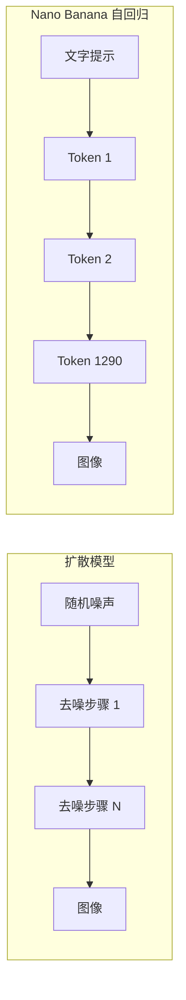
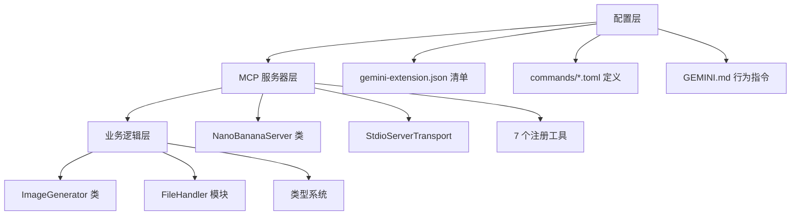
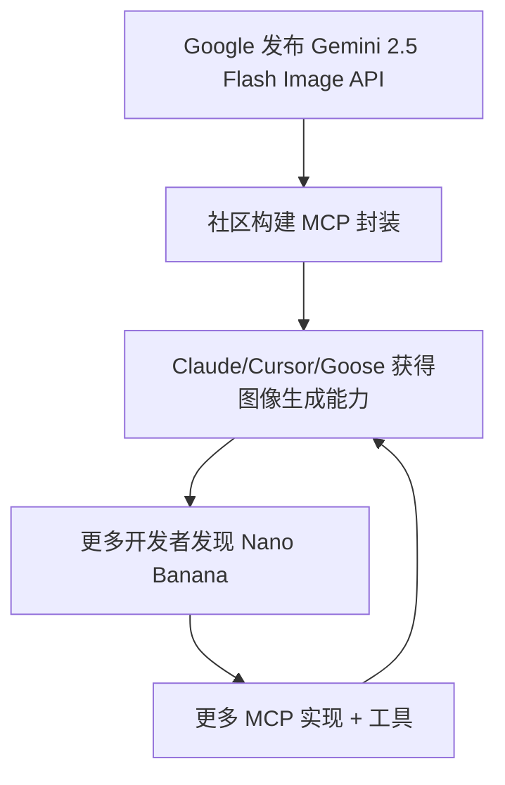

# Nano Banana：Google 原生图像生成革命

## 这是什么？

"Nano Banana" 是 Google DeepMind 对 **Gemini 2.5 Flash Image**（`gemini-2.5-flash-image`）的代号——一个原生多模态模型，通过自回归方式生成和编辑图像，而非扩散模型。其继任者 **Nano Banana Pro**（`gemini-3-pro-image-preview`）基于 Gemini 3 Pro 构建，新增 4K 输出、高级文字渲染和 Google Search 数据接入。

名字的由来：凌晨 2:30，产品经理 **Naina Raisinghani** 需要一个代号用于 LMArena 匿名测试。她把朋友给她起的两个绰号——"Naina Banana"（朋友叫的）和 "Nano"（个子小 + 电脑宅）——合成了 "Nano Banana"。本来只是个临时占位符，但当模型以 **171 分 Elo 领先**和 **250 万+社区投票**登顶 LMArena 图像编辑排行榜后彻底火了。Google 选择拥抱它：AI Studio 的黄色 "Run" 按钮、Gemini 应用里的香蕉表情、限量版香蕉周边。

模型之外，"Nano Banana" 现在指代一整个生态系统：141+ GitHub 仓库、多个 MCP 服务器、CLI 工具、Gemini CLI 扩展、黑客松工具包、提示词库和第三方 SaaS 封装。

## 时间线

| 日期 | 事件 |
|------|------|
| 2024年12月 | Gemini 2.0 Flash 原生图像生成（受信测试者早期访问） |
| 2025年3月 | Gemini 2.0 Flash 图像输出通过 AI Studio 和 API 公开 |
| 2025年8月12日 | "Nano Banana" 匿名出现在 LMArena——立即称霸图像编辑排行榜 |
| 2025年8月26日 | 正式发布：Gemini 2.5 Flash Image 通过 Gemini API、AI Studio、Vertex AI |
| 2025年9月6-8日 | Google DeepMind Nano Banana 黑客松——832个项目，50个获奖者，$400K+ 奖金 |
| 2025年11月20日 | Nano Banana Pro（Gemini 3 Pro Image）发布 |
| 2026年1月15日 | Google 发布 "Nano Banana 名字的由来" 博客文章 |
| 2026年1月17日 | API 性能下降事件（生成时间 180s+，内容过滤收紧） |

## 架构：为什么原生多模态很重要

### 自回归 vs 扩散

传统图像生成器（DALL-E 3、Stable Diffusion、Midjourney）使用**扩散**——从随机噪声逐步去噪得到图像。Nano Banana 使用**自回归 token 生成**——和生成文本一样的机制。每张图像是 **1,290 个输出 token** 解码为像素。



**为什么这很重要：**

| 维度 | 扩散（DALL-E, Flux） | 自回归（Nano Banana） |
|------|---------------------|----------------------|
| 文本理解 | 独立 CLIP/T5 编码器，有限上下文 | 完整 Gemini LLM 编码器，32K token 上下文 |
| 编辑精度 | 需要修复蒙版、ControlNet | 自然语言编辑（"去掉衬衫上的污渍"） |
| 多轮对话 | 原生不支持 | 基于对话的迭代优化 |
| 图中文字 | 历来很差 | 业界领先（尤其 Pro） |
| 风格迁移 | 强 | 弱（架构限制） |
| 速度 | 不等（典型 10-60s） | 0.8s（Flash），20-40s（Pro） |

### 模型架构

Gemini 模型是**稀疏混合专家（MoE）Transformer**，从头开始在文本、视觉和音频上原生训练。图像生成流程：

1. 门控网络将输入 token 路由到相关的专家子集
2. 每个 token 只激活总参数的一小部分（将容量与计算成本解耦）
3. 图像 token 在与文本 token 相同的统一序列中生成
4. 解码器将 1,290 个图像 token 转换回像素数据

这意味着模型在生成图像时拥有**世界知识**——它理解事物的外观、相互关系，并能推理构图。扩散模型只学习噪声到图像的映射。

## 模型对比

| 特性 | Nano Banana（Flash） | Nano Banana Pro |
|------|---------------------|-----------------|
| 模型 ID | `gemini-2.5-flash-image` | `gemini-3-pro-image-preview` |
| 优化方向 | 速度、高吞吐、低延迟 | 专业素材制作 |
| 最大分辨率 | 1024x1024 | 4K（3840px） |
| 分辨率选项 | 仅 1K | 1K、2K、4K |
| 文字渲染 | 好 | 业界领先（长段落、多语言） |
| 思考模式 | 无 | 有（生成前高级推理） |
| Google Search 接入 | 无 | 有（图像中包含实时数据） |
| 参考图像 | 支持 | 最多 14 张（6 物体 + 5 人物 + 3 风格） |
| 宽高比 | 1:1, 2:3, 3:2, 3:4, 4:3, 4:5, 5:4, 9:16, 16:9, 21:9 | 相同 + 灵活 |
| 速度 | ~0.8s/张 | 20-40s/张 |
| SynthID 水印 | 有（不可见）+ 免费层可见 | 有（不可见）+ 免费层可见 |

### 定价（Gemini Developer API）

| 模型 | 输入（文本/图像） | 输出（图像） | 每张成本 | 批量（5折） |
|------|------------------|-------------|---------|------------|
| Flash | $0.30/1M tokens | $30/1M tokens | **$0.039**（1,290 tokens） | $0.0195 |
| Pro | $2.00/1M tokens | $120/1M tokens | **$0.134**（1K/2K），**$0.24**（4K） | $0.067 / $0.12 |

**免费层**：Flash 和 Pro 无免费图像生成。免费访问通过 Gemini 2.0 Flash（500 RPD，250K TPM）。

### API 用法

```typescript
// 基本文字转图像
const response = await model.generateContent({
  contents: [{ parts: [{ text: "A futuristic city at night" }] }],
  generationConfig: {
    responseModalities: ["TEXT", "IMAGE"],  // 图像输出必需
  }
});

// 图像编辑（提供输入图像 + 指令）
const response = await model.generateContent({
  contents: [{
    parts: [
      { inlineData: { mimeType: "image/png", data: base64Image } },
      { text: "Remove the person in the background" }
    ]
  }],
  generationConfig: { responseModalities: ["TEXT", "IMAGE"] }
});
```

关键 API 参数：`responseModalities: ["TEXT", "IMAGE"]`——没有这个，模型只返回文本。

## Nano Banana 生态系统

### GitHub 规模

`nano-banana` GitHub 主题有 **141 个公开仓库**，涵盖 TypeScript（48）、Python（39）、JavaScript（11）等。

**按星数排名：**

| 仓库 | 星数 | 描述 |
|------|------|------|
| Awesome-Nano-Banana-images | 20.9K | Nano Banana 生成图像精选集 |
| AionUi | 16.8K | 开源多模型 AI 应用（含 Gemini） |
| awesome-nano-banana | 8.6K | 提示词和视觉作品集 |
| awesome-nano-banana-pro-prompts | 7.7K | 8,000+ 提示词，多语言支持 |
| big-AGI | 6.9K | 多模型 AI 套件，Gemini 集成 |

### MCP 服务器（Model Context Protocol）

多个 MCP 服务器实现，让 AI 助手（Claude、Cursor 等）能通过 Nano Banana 生成图像：

#### 1. ConechoAI/Nano-Banana-MCP（99 stars，51 forks）

最受欢迎的 MCP 实现。TypeScript，用 Claude Code 构建。

**架构：**

```
src/
  index.ts          → MCP 服务器（StdioServerTransport，JSON-RPC）
  imageGenerator.ts → Gemini API 交互
  fileHandler.ts    → 文件 I/O，智能命名，跨平台路径
  types.ts          → 共享 TypeScript 接口
```

**暴露的工具：**

| 工具 | 用途 |
|------|------|
| `generate_image` | 从文字提示创建新图像 |
| `edit_image` | 用可选参考图像修改现有图像 |
| `continue_editing` | 迭代最后一次生成/编辑的图像 |
| `get_last_image_info` | 获取上次输出的元数据 |
| `configure_gemini_token` | 程序化设置 API key |
| `get_configuration_status` | 检查 API 配置状态 |

**配置（Claude Desktop/Code）：**

```json
{
  "mcpServers": {
    "nano-banana": {
      "command": "npx",
      "args": ["nano-banana-mcp"],
      "env": { "GEMINI_API_KEY": "your-key" }
    }
  }
}
```

**API key 优先级**：MCP 配置 env > 系统 env > `.nano-banana-config.json`

**文件存储**：Windows: `%USERPROFILE%\Documents\nano-banana-images\`，macOS/Linux: `./generated_imgs/`

#### 2. zhongweili/nanobanana-mcp-server（Python）

生产就绪的 Python MCP 服务器，带**智能模型选择**。

**自动选择逻辑：**
- **Pro** 被选择当：质量关键词（"4K"、"professional"）、高分辨率请求、Search 接入、复杂推理
- **Flash** 被选择当：速度关键词（"quick"、"draft"）、批量生成（n > 2）、标准分辨率

**认证方式**：API Key（默认）、Vertex AI ADC（Google Cloud）、或自动回退。

**安装**：`uvx nanobanana-mcp-server@latest` 或 `pip install nanobanana-mcp-server`

**兼容**：Claude Desktop、Claude Code（VS Code）、Cursor、Continue.dev、Open WebUI、通用 MCP 客户端。

#### 3. 其他 MCP 实现

| 仓库 | 关键差异 |
|------|---------|
| shinpr/mcp-image | Gemini 3 Pro 专用，面向 Cursor & Codex |
| mrafaeldie12/nano-banana-pro-mcp | 仅 Gemini 3 Pro |
| YCSE/nanobanana-mcp | Claude Desktop + Claude Code 专用 |
| nanana-app/mcp-server-nano-banana | Nanana AI 服务封装 |
| ion-aluminium/nanobanana-mcp-cliproxyapi | CLI 代理 API 版 |

### Gemini CLI 扩展（gemini-cli-extensions/nanobanana）

一流的 Gemini CLI 扩展，命令集最丰富。

**安装**：`gemini extensions install https://github.com/gemini-cli-extensions/nanobanana`

**架构（3 层）：**



**8 个命令：**

| 命令 | MCP 工具 | 用途 |
|------|---------|------|
| `/generate` | `generate_image` | 单/多图生成，支持 `--count`、`--styles`、`--variations`、`--seed` |
| `/edit` | `edit_image` | 修改现有图像 |
| `/restore` | `restore_image` | 增强修复受损照片 |
| `/icon` | `generate_icon` | 应用图标、favicon、UI 元素，多尺寸 |
| `/pattern` | `generate_pattern` | 无缝图案和纹理 |
| `/story` | `generate_story` | 序列叙事图像 |
| `/diagram` | `generate_diagram` | 流程图、架构图 |
| `/nanobanana` | 自然语言 | 自由自然语言接口 |

**关键文件：**
- `gemini-extension.json` — 清单，含 MCP 服务器命令路径
- `commands/*.toml` — 8 个 TOML 命令定义，带参数 schema
- `GEMINI.md` — 行为指令，加载到对话上下文（精确计数遵守、视觉一致性、文字渲染质量）
- `mcp-server/src/index.ts` — NanoBananaServer 类，7 个工具注册
- `mcp-server/src/imageGenerator.ts` — Gemini API 调用、提示工程、批量操作
- `mcp-server/src/fileHandler.ts` — findInputFile() 搜索 6 个目录、generateFilename() 带碰撞避免、base64 编解码

### CLI 工具

#### The-Focus-AI/nano-banana-cli（TypeScript）

```bash
npx @the-focus-ai/nano-banana [prompt] --file [input] --output [path]
```

- 文字转图像、编辑、批量处理
- **Claude Code 插件**带 `nano-banana-imagegen` 技能
- Makefile 批量操作：`make process PROMPT=slide-extractor`
- 默认模型：`nano-banana-pro-preview`

#### erikceballos/nano-banana-cli（Go）

Go 编写（69.6% 代码）。个人项目——"不接受 Pull requests。"
- 图像生成、编辑、图标创建、图案生成、图像合成
- `.goreleaser.yml` 发布自动化
- Apache 2.0 许可证

#### minimaxir/gemimg（Python）

Max Woolf 的轻量级 Python 封装——技术上最严谨的实现。

```python
from gemimg import GemImg
g = GemImg(api_key="YOUR_KEY")
gen = g.generate("A kitten with purple-and-green fur")
```

- **无 Google SDK 依赖**——直接 API 调用
- CLI：`gemimg "prompt"` 或 `python -m gemimg "prompt"`
- 网格生成（一次 API 调用多张图像，Pro）
- 自动网格切割为单独图像
- 提示词存储在 PNG 元数据中
- 宽高比控制、WebP 输出
- Nano Banana Pro 支持 1K/2K/4K 尺寸

#### aaronkwhite/nanobanana-studio（NextJS）

自托管批量图像生成 UI。
- 通过 Gemini Batch API 实现 **50% 成本降低**
- NextJS + SQLite，完全本地
- 拖拽、宽高比/分辨率控制
- 异步批量处理（每批 10-30 分钟）

### 其他值得关注的项目

| 项目 | 描述 |
|------|------|
| gavrielc/Nano-PDF | 用 Nano Banana 编辑 PDF 文件 |
| simonliu-ai-product/simon-nb | 与本地文件交互的 Nano Banana CLI 工具 |
| markfulton/NanoBananaEditor | 完整 GUI 编辑器，带蒙版、版本历史、参考图像 |
| google-gemini/nano-banana-hackathon-kit | 官方黑客松入门工具包 |
| ZeroLu/awesome-nanobanana-pro | X/微信/Replicate 精选 Pro 提示词 |
| YouMind-OpenLab/awesome-nano-banana-pro-prompts | 8,000+ 提示词，3.8K 星 |

## 提示工程深度解析

Max Woolf 的研究（minimaxir.com）提供了最严谨的提示工程分析。

### 有效的技巧

**结构化提示**：Nano Banana 的文本编码器（Gemini 2.5 Flash）在代码仓库、JSON 和智能体行为上训练过。它能理解：
- Markdown 列表和格式
- 十六进制颜色代码（`#9F2B68`）
- 带编号步骤的多部分指令
- JSON 角色描述

**全大写和"威胁"**：确实能提高指令遵从度。这不寻常但有记录。

**规格说明性词汇**："Pulitzer Prize-winning"、"Vanity Fair cover"、"by Annie Leibovitz" 影响构图质量。

**物理约束**：添加 "shot on Canon EOS R5, 85mm f/1.4" 能强制照片写实而非数字插画。

**大上下文窗口**：可用 32,768 token（对比 CLIP 的 77 或 T5 的 512）。你可以包含完整的 JSON 角色描述、HTML 代码和详细场景描述。

**多图一致性**：不需要 LoRA 训练，在 17 张参考图像中保持了对 "Ugly Sonic" 的准确描绘。

### 失败的场景

**风格迁移**：擅长细节编辑的自回归架构反而抵抗风格迁移。"把这照片转成吉卜力风格" 效果差。生成*该风格的新图像*效果更好。

**空间推理**：左/右方向指令困难。变通方案：添加 "from the character's perspective, NOT the camera's perspective。"

**跨编辑一致性**："Nano banana 会随机给房间加一个逼真的壁炉或在房子后面加个新车库。即使用全大写明确指令不要这样做也会发生"——使某些用例 "不可能构建可靠的应用"。

**成本**：~$0.04/张 1024x1024 图像 = 每美元约 25 次生成。实验便宜，生产环境会累积。

## 基准测试 & 排名

### LMArena 表现

| 指标 | 结果 |
|------|------|
| 图像编辑排名 | #1（2025年8月） |
| 文字转图像排名 | #1（2025年8月） |
| Elo 领先 | 171 分（Arena 历史最大） |
| 社区投票 | Nano Banana 250 万+ |
| 平台总投票 | 500 万+ |
| 速度 | 0.8s（Flash）——比 Flux Kontext 快 10x |

### vs GPT Image 1.5（2026年2月）

| 维度 | Nano Banana Pro | GPT Image 1.5 |
|------|-----------------|----------------|
| 分辨率 | 4K（3840px） | 1.5K |
| 速度 | 快 3x | 基线 |
| 文字渲染 | 优（密集文字、多语言） | 好但密集文字不稳定 |
| 美学 | "抓拍照片"——真实感 | "商业摄影"——精致但人工感 |
| 成本 | $0.134/张（1K） | 便宜约 20% |
| 图像编辑（Artificial Analysis） | 接近第二（-3 分） | 微弱领先 |
| 文字转图像（Artificial Analysis） | 有竞争力 | 领先（1264 分） |

**总结**：Nano Banana Pro = "最终渲染工具"（精度、分辨率）。GPT Image 1.5 = "创意画板"（速度、成本）。两者都不全面统治。

### 竞争格局（2026年2月）

| 模型 | 最佳用途 | 弱点 |
|------|---------|------|
| GPT Image 1.5 | 文字转图像、指令遵从 | 有时人工感 |
| Nano Banana Pro | 文字渲染、编辑、4K 分辨率 | 风格迁移、一致性 bug |
| Nano Banana（Flash） | 速度、批量、原型 | 较低分辨率（仅 1K） |
| Flux 2 Pro | 角色一致性、编辑工作流 | 无原生文本理解 |
| Ideogram 3.0 | 90% 文字准确率、排版 | 编辑功能有限 |
| Midjourney | 照片写实、艺术风格 | 无 API，速度慢 |
| Recraft | Logo、图标、SVG 矢量 | 照片写实有限 |
| Imagen 4（Google） | 文字渲染、一致性 | 仅早期访问 |

## 局限性 & 已知问题

### 技术限制

1. **风格迁移失败**：自回归架构抵抗将现有图像转换为新艺术风格
2. **空间推理弱**：左/右、上/下指令不可靠
3. **一致性漂移**：多次编辑会话产生幻觉添加（壁炉、车库）
4. **质量退化**：多次连续编辑后图像变模糊/像素化
5. **尺寸限制**：Flash 限于 1024x1024；Pro 预览版可能不稳定
6. **无动画/视频**：仅静态图像
7. **网格图像**：仅 Pro 支持网格生成

### 内容审核 & 安全

- **安全过滤器**：倾向于保守地阻止边界情况
- **"Content Blocked" 错误**：常见痛点——触发限制词、敏感话题、任何 NSFW 内容
- **2026年1月收紧**：IMAGE_SAFETY 过滤加强，知名 IP 限制添加。开发者社区反弹
- **SynthID 水印**：所有输出都加水印（不可见二进制编码 + 免费用户可见 Gemini 闪光）
- **可见水印移除**：仅 Google AI Ultra 订阅者和 AI Studio 开发者工具
- **IP 限制较少**（对比 ChatGPT）：更自由地生成版权角色——潜在法律风险
- **NSFW 审核**：AI API 中较宽松的（虽然逐步收紧）

### 性能问题

- **2026年1月17日事件**：Pro 生成时间从 20-40s 飙升至 180s+。原因：高并发调用审核流程收紧、异常流量、疑似商业滥用
- **速率限制**：预览模型有限制性配额，可能变化
- **免费层缩水**：通过 API 的 Flash/Pro 无免费图像生成（仅通过 Gemini 2.0 Flash）

## 更广阔的视角

### 为什么原生图像生成重要

Nano Banana 代表了根本性的架构转变。之前的图像生成是**独立管道**：文本编码器（CLIP）→ 扩散模型 → 图像解码器。Gemini 将图像生成整合到**理解语言、代码和世界知识的同一个模型**中。

**影响：**

1. **编辑变成对话**："去掉污渍" 而不是画修复蒙版
2. **图像中的世界知识**：模型知道 "2026 Tesla Model Y" 长什么样，不需要专门训练
3. **多模态工作流**：生成图像、分析它、编辑它、写 alt-text——全在一次模型调用中
4. **智能体集成**：MCP 服务器让 AI 编码助手在工作流中按需生成图像——设计原型、图表、图标
5. **成本民主化**：$0.039/张使批量生成变得可及

### MCP 生态系统模式

Nano Banana 的 MCP 采用揭示了更广泛的模式：**开放模型 + 协议标准化 = 快速生态系统形成**。



发布后 6 个月内：141+ GitHub 仓库、多个 npm 包、Python 封装、Gemini CLI 扩展、自托管 UI、批量处理器和 n8n 工作流集成。MCP 协议充当力量倍增器——一个集成模式服务所有 MCP 兼容客户端。

### Google 的战略地位

Nano Banana 给了 Google 独特优势：**唯一在其 LLM API 中原生提供最先进图像生成的主要云厂商**。OpenAI 有 DALL-E/GPT Image（独立），Anthropic 没有图像生成，Meta 没有商业图像 API。

$400K 黑客松、香蕉品牌和激进定价（$0.039/张）是刻意的生态系统策略。Google 押注开发者采用 Gemini 图像生成会为更广泛的 Gemini API 平台创造锁定效应。

## 黑客松 & 社区

### Nano Banana 黑客松（2025年9月6-8日）

- Google DeepMind 主办
- **832 个项目提交**，50 个获奖者
- **$400,000+ 奖金**：每位获奖者获得 $5K Gemini API 积分、$1K Fal 积分、~$2K ElevenLabs 积分
- 评审：10% 演示质量，40% 创新/"惊艳因素"，50% 技术执行 + 影响力

**获奖项目：**
- **LifeTrace Timeline**（Chris Tang）：原始位置数据 → 个性化手绘视觉日记
- **ArtLens**（Mark Greenfield）：将名画重新想象为真实世界场景
- **ForgeOne**：AI 系统自我批评和优化创意输出

### Hacker News 反应

**正面信号：**
- "这是图像编辑模型的 GPT-4 时刻"
- 设计师报告替代了数千美元的工作室工作
- 171 Elo 分跳跃被认为意义重大
- 社交媒体上的 "Photoshop 杀手" 绰号

**质疑声音：**
- 可靠性担忧：某些用户上色失败率约 80%
- 细节问题：夹克细节不匹配、尴尬的手、指甲不一致
- "Flux Kontext 和 Qwen Image 表现相当"——进步可能被夸大
- 结果 "需要大量迭代"——不是魔法，仍需提示工程技巧

**社区共识**：图像编辑革命性（自然语言），文字转图像有竞争力但非统治性。速度优势（0.8s Flash）确实差异化。价格点（$0.039）使实验成为可能。风格迁移弱点是真实限制。

## 可复用的模式

1. **自回归图像生成 > 扩散用于编辑**：当你需要精确、遵循指令的编辑时，将图像作为 token 序列生成优于去噪管道
2. **MCP 作为生态系统加速器**：一个协议封装将单一 API 变成 Claude、Cursor、Goose、Windsurf 和所有 MCP 兼容客户端的工具
3. **智能模型路由**：zhongweili 的基于关键词检测在 Flash（速度）和 Pro（质量）间自动选择——适用于任何多模型系统
4. **代号即品牌**："Nano Banana" 作为品牌成功恰恰因为它是真实和意外的。Google 选择拥抱而非回退到 "Gemini 2.5 Flash Image"
5. **Batch API 降低成本**：nanobanana-studio 通过异步批量处理获得 50% 更便宜的生成
6. **结构化提示给图像模型**：Markdown、JSON、编号列表效果优于关键词堆砌，因为底层文本编码器在代码上训练过
7. **六目录文件搜索模式**：Gemini CLI 扩展的 FileHandler 搜索 CWD、./images/、./input/、./nanobanana-output/、~/Downloads/、~/Desktop/——实用的用户文件查找 UX
8. **GEMINI.md 行为约束**：将严格行为规则（精确计数遵守、视觉一致性要求）的上下文文件加载到模型对话中——适用于任何智能体工作流

## References

- [Nano Banana Image Generation - Google AI Docs](https://ai.google.dev/gemini-api/docs/image-generation)
- [How Nano Banana Got Its Name - Google Blog](https://blog.google/products-and-platforms/products/gemini/how-nano-banana-got-its-name/)
- [Nano Banana Pro - Google DeepMind](https://deepmind.google/models/gemini-image/pro/)
- [Introducing Gemini 2.5 Flash Image - Google Developers Blog](https://developers.googleblog.com/introducing-gemini-2-5-flash-image/)
- [ConechoAI/Nano-Banana-MCP - GitHub](https://github.com/ConechoAI/Nano-Banana-MCP)
- [gemini-cli-extensions/nanobanana - GitHub](https://github.com/gemini-cli-extensions/nanobanana)
- [gemini-cli-extensions/nanobanana Architecture - DeepWiki](https://deepwiki.com/gemini-cli-extensions/nanobanana)
- [zhongweili/nanobanana-mcp-server - GitHub](https://github.com/zhongweili/nanobanana-mcp-server)
- [The-Focus-AI/nano-banana-cli - GitHub](https://github.com/The-Focus-AI/nano-banana-cli)
- [erikceballos/nano-banana-cli - GitHub](https://github.com/erikceballos/nano-banana-cli)
- [minimaxir/gemimg - GitHub](https://github.com/minimaxir/gemimg)
- [aaronkwhite/nanobanana-studio - GitHub](https://github.com/aaronkwhite/nanobanana-studio)
- [Nano Banana Prompt Engineering - Max Woolf](https://minimaxir.com/2025/11/nano-banana-prompts/)
- [Nano Banana Pro Review - Max Woolf](https://minimaxir.com/2025/12/nano-banana-pro/)
- [nano-banana GitHub Topic](https://github.com/topics/nano-banana?o=desc&s=stars)
- [Nano Banana on LMArena](https://arena.ai/blog/nano-banana/)
- [Gemini 2.5 Flash Image on OpenRouter](https://openrouter.ai/google/gemini-2.5-flash-image-preview)
- [Gemini API Pricing](https://ai.google.dev/gemini-api/docs/pricing)
- [Nano Banana Hackathon Winners - Neowin](https://www.neowin.net/news/google-announces-nano-banana-hackathon-winners-awards-400000-in-prizes/)
- [HN: "GPT-4 moment for image editing"](https://news.ycombinator.com/item?id=45027760)
- [HN: Nano Banana Prompt Engineering](https://news.ycombinator.com/item?id=45917875)
- [GPT Image 1.5 vs Nano Banana Pro Comparison - getimg.ai](https://getimg.ai/blog/gpt-image-15-vs-nano-banana-pro-comparison-which-ai-image-model-is-better)
- [Gemini 2.5 Flash Model Card (PDF)](https://storage.googleapis.com/deepmind-media/Model-Cards/Gemini-2-5-Flash-Model-Card.pdf)
- [Nano Banana Limitations & Issues Discussion - Google Dev Forums](https://discuss.google.dev/t/gemini-flash-2-5-image-nano-banana-safety-filtering-problem/260375)
- [Nano Banana Pro January 2026 Policy Changes - Apiyi](https://help.apiyi.com/en/nano-banana-pro-policy-update-image-safety-ip-restriction-2026-en.html)
- [Wonder Why It's Called "Nano Banana"? - Chrome Unboxed](https://chromeunboxed.com/wonder-why-its-called-nano-banana-google-explains/)
