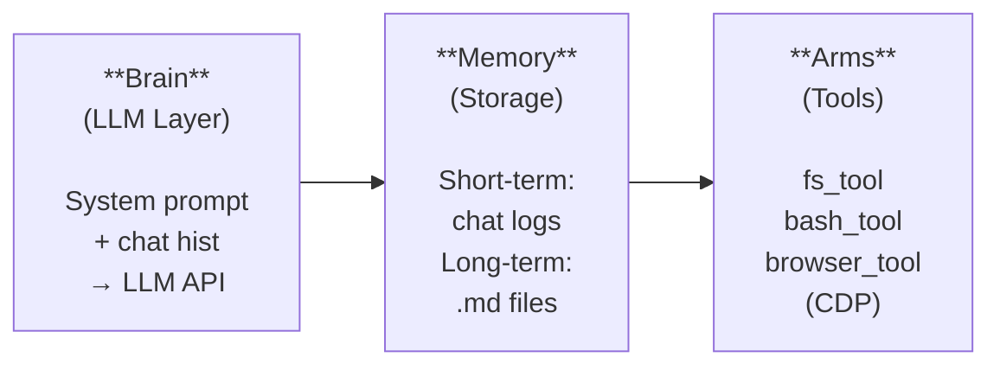

# OpenClaw — Open-Source Personal AI Agent (v2026.2.6)

## TL;DR

OpenClaw (formerly Clawdbot/Moltbot) is an open-source, self-hosted AI agent framework by Peter Steinberger (PSPDFKit founder). It bridges LLMs (Claude, GPT, Grok, local models) with your OS — giving AI full access to files, shell, browser, and 50+ integrations (WhatsApp, Slack, Discord, Gmail, etc.). 145K+ GitHub stars. Latest version v2026.2.6 (Feb 7, 2026) adds Opus 4.6, GPT-5.3-Codex, safety scanner, and token dashboard.

---

## What It Is

A local-first AI agent gateway that:
- Runs on your machine (Mac/Windows/Linux)
- Connects to any LLM (Claude, GPT, Gemini, Grok, DeepSeek, local Llama)
- Interfaces via messaging apps (WhatsApp, Telegram, Discord, Slack, Signal, iMessage)
- Has 100+ AgentSkills for autonomous task execution
- Maintains persistent memory across sessions

**Not a chatbot** — a proactive agent that acts on your behalf, 24/7.

---

## Architecture

### Three-Component Design



| Component | Role | Implementation |
|-----------|------|----------------|
| **Brain** | Constructs system prompt + sends to LLM | External LLM API (Claude, GPT, etc.) |
| **Memory** | Local-first persistence | Flat-file Markdown in `~/.openclaw/memory` |
| **Arms** | JSON API tools on host OS | fs_tool, bash_tool, browser_tool (Chromium CDP) |

### Agentic Loop (Think → Plan → Act → Observe → Iterate)

1. **Think** — LLM analyzes request, consults memory
2. **Plan** — Breaks request into tool-call sequences
3. **Act** — Executes tools on the machine
4. **Observe** — Interprets stdout/stderr
5. **Iterate** — Refines approach, loops until task complete

### Gateway Architecture

The Gateway is the single control plane managing:
- Sessions (scoped by channel/peer/team)
- Channels (WhatsApp, Telegram, Slack, Discord, etc.)
- Tools (skill dispatching)
- Events (scheduling, heartbeats, webhooks)

Access: `http://127.0.0.1:18789/` for local Web UI dashboard.

### Workspace File Structure

| File | Purpose |
|------|---------|
| `AGENTS.md` | Operating instructions |
| `SOUL.md` | Persona and behavioral boundaries |
| `MEMORY.md` | Long-term curated facts |
| `memory/YYYY-MM-DD.md` | Daily append-only logs |
| `HEARTBEAT.md` | Automated health checklist |

---

## Skills System (AgentSkills)

### How It Works

Skills = directories containing a `SKILL.md` with YAML frontmatter. Declarative — tells the agent what tools to use, not how to code them.

### Loading Hierarchy (precedence order)

1. **Workspace skills** (`<workspace>/skills`) — highest priority
2. **Managed/local skills** (`~/.openclaw/skills`) — shared across agents
3. **Bundled skills** — shipped with installation

### Skill Structure

```yaml
---
name: nano-banana-pro
description: Generate or edit images via Gemini 3 Pro Image
homepage: https://example.com
user-invocable: true
metadata:
  openclaw:
    requires:
      bins: [ffmpeg]
      env: [GEMINI_API_KEY]
    os: [darwin, linux]
---
# Instructions for the agent...
```

### Gating System

Skills auto-filter at load time based on:
- Required binaries on PATH
- Required environment variables
- Required config paths
- OS platform restrictions

### ClawHub Registry

Public marketplace: `clawhub.com`

```bash
clawhub install <skill-slug>
clawhub update --all
clawhub sync --all
```

### Token Cost

~24 tokens per skill + field lengths. System prompt overhead: 195 chars base + 97 chars per skill.

### Security Warning

**Treat third-party skills as untrusted code.** v2026.2.6 added a code safety scanner, but it's not foolproof. Read skills before enabling.

---

## Supported AI Models (v2026.2.6)

| Provider | Models |
|----------|--------|
| **Anthropic** | Claude Opus 4.6, Sonnet 4.5, earlier versions |
| **OpenAI** | GPT-5.3-Codex, GPT-4o, earlier versions |
| **xAI** | Grok (new in v2026.2.6) |
| **Baidu** | Qianfan (new in v2026.2.6) |
| **Google** | Gemini models |
| **Local** | Llama 3, any Ollama-compatible model |

Forward-compatibility fallbacks for new model identifiers (e.g., Opus 4.6 → graceful downgrade if provider unavailable).

---

## Integrations (50+)

| Category | Platforms |
|----------|-----------|
| **Messaging** | WhatsApp, Telegram, Discord, Slack, Signal, iMessage (BlueBubbles), Microsoft Teams, Matrix, Google Chat, Zalo, WebChat |
| **Productivity** | Gmail, Google Calendar, Notion, GitHub |
| **Services** | Stripe, AWS, Zapier, Spotify, YouTube, Figma, Dropbox, Airtable, Twitter/X |
| **Smart Home** | Various devices via integrations |
| **Blockchain** | Base (Ethereum L2), MetaMask, DEXs via skills |

---

## v2026.2.6 Release (Feb 7, 2026) — What's New

### Models
- Anthropic Opus 4.6 + OpenAI GPT-5.3-Codex with forward-compat fallbacks
- xAI Grok provider
- Baidu Qianfan provider

### Security
- **Skill/plugin code safety scanner** — scans community skills for malicious patterns
- Credential redaction from `config.get` gateway responses
- Gateway canvas host + A2UI assets now require authentication

### Features
- **Token usage dashboard** in Web UI
- **Voyage AI** native support for memory embeddings
- Session history payload caps (prevents context overflow)
- CLI help output alphabetically ordered

### Fixes
- Scheduling/reminder delivery regression fixed
- Telegram: auto-injects DM topic threadId
- Slack: mention stripPatterns for `/new` and `/reset`
- Chrome extension: bundled path resolution
- Compaction retry logic for context overflow
- Better billing error messaging

---

## Memory System

### Default (Markdown-based)

- Short-term: active chat logs (immediate context)
- Long-term: Markdown summaries in `~/.openclaw/memory`
- Semantic search over memory chunks (~400 tokens) via `memory_search` tool

### QMD Plugin (v2026.2.2+)

**Local Hybrid Intelligence engine** combining three search technologies:

| Technology | Type | Strength |
|------------|------|----------|
| BM25 | Keyword | Exact term matching |
| Vector | Semantic | Meaning-based search |
| LLM Rerank | Re-ranking | Contextual relevance |

Benefits:
- Searches local files (Markdown, Notion exports, Obsidian)
- Pulls only 2-3 relevant sentences into prompt
- 60-97% token savings
- Runs entirely offline
- No more context overflow

### Voyage AI (v2026.2.6+)

Native vector embedding support for enhanced memory retrieval.

---

## Multi-Agent Support

- Each agent gets its own isolated workspace
- Separate authentication and session stores
- Routing: peer → guildId → teamId → accountId → channel → default agent
- Per-agent skills in workspace directories
- Shared skills in `~/.openclaw/skills` visible to all agents
- Session scope modes: `per-channel-peer` prevents context leakage in multi-user scenarios

---

## Onchain / Web3 Integration

Since v2026.2.2, deeper integration with Base (Coinbase's Ethereum L2):
- Agents can initiate and manage blockchain transactions autonomously
- Community projects: 4claw, lobchanai, starkbotai
- MetaMask + DEX (ColorPool) connectivity via skills
- Virtual Protocol: any OpenClaw agent can discover, hire, and pay other agents on-chain
- Use cases: wallet monitoring, airdrop automation, autonomous trading

---

## Installation

```bash
# macOS/Linux
curl -fsSL https://openclaw.ai/install.sh | bash

# Windows
iwr -useb https://openclaw.ai/install.ps1 | iex

# npm
npm i -g openclawd

# Homebrew
brew install openclawd
```

**Requirements**: Node.js 22+

**Setup**: `openclaw onboard --install-daemon` runs interactive wizard.

---

## Pricing

| Component | Cost |
|-----------|------|
| Software | Free (MIT License) |
| Hardware | $0 (existing machine) to $599 (Mac mini M2) |
| API usage | ~$5-50/month depending on model + usage |
| OpenClawd hosted | Managed service (launched Feb 10, 2026) |

No subscription — pay-per-API-request only.

---

## Security Analysis — The Hard Truths

### What It Needs Access To

- File system (read/write/delete)
- Shell (arbitrary command execution)
- Browser sessions (headless Chromium via CDP)
- API keys, credentials, SSH keys
- Email, calendar, messaging accounts

### Known Vulnerability Vectors

| Vector | Risk | Severity |
|--------|------|----------|
| **Privilege Escalation** | Runs with full user permissions — access to SSH keys, `.env`, browser cookies | Critical |
| **Indirect Prompt Injection** | Reads websites/docs with hidden instructions → executes exfiltration commands | Critical |
| **Plaintext Storage** | API keys and chat history in readable `config.json` and `.md` files | High |
| **Supply Chain (Skills)** | Community skills on ClawHub may contain malicious scripts (wallet draining, backdoors) | High |
| **Context Overflow** | Session payloads can overflow, causing unpredictable behavior | Medium |

### Mitigation Best Practices

1. **Containerize** — Docker/VM mandatory, never run on bare metal with sensitive data
2. **Network isolation** — Firewall monitoring outbound traffic (Little Snitch on macOS)
3. **Human-in-the-loop** — Require approval for bash, file deletion, git push
4. **Scoped API keys** — Project-specific credentials, budget cap ($5 max)
5. **Ephemeral browser** — Clean, wiped instances separate from primary profile
6. **Treat as untrusted** — Design systems assuming the agent is compromised

> IBM Distinguished Engineer Chris Hay: OpenClaw exposes users to "too many security vulnerabilities" for enterprise use.

---

## Alternatives Comparison

| Tool | Type | Key Difference |
|------|------|----------------|
| **Nanobot** | Lightweight (4K lines Python vs OpenClaw's 430K+) | Research-friendly, auditable |
| **Moltworker** | Cloudflare Workers deployment | Serverless, sandboxed, persistent state |
| **Zapier** | Cloud automation | No-code, no system access needed |
| **Knolli** | Enterprise AI copilot | Structured permissions, managed infra |
| **Claude Code** | Anthropic CLI agent | Code-focused, built-in sandboxing |
| **Cursor/Windsurf** | IDE-integrated AI | Editor-bound, less autonomous |

### Why OpenClaw Wins

- Fully open-source, no vendor lock-in
- Model-agnostic (any LLM)
- Messaging-native (chat with your agent via WhatsApp)
- 100+ skills ecosystem
- Community-driven (145K+ stars, 20K+ forks)

### Why OpenClaw Loses

- Security nightmare without proper containerization
- 430K+ lines of code — massive attack surface
- Enterprise-hostile (IBM: "too many vulnerabilities")
- Plaintext secrets storage
- Community skills = supply chain risk

---

## Key Insights

### 1. Loose Integration Beats Vertical Integration (Sometimes)

IBM's Kaoutar El Maghraoui: "Vertical integration is important in certain domains because of the security aspect. But in other domains, maybe we don't need that."

OpenClaw proves autonomous agents don't require a single vendor controlling models, memory, tools, and interfaces. Community-driven, open-source agents can be "incredibly powerful if they have full system access."

### 2. The Agent = Gateway Pattern

OpenClaw's core insight: the **gateway** is the right abstraction for agentic AI. One process that mediates between LLM brain and OS arms, with memory as the state layer. This is the pattern every personal AI agent will converge on.

### 3. Skills Are The New Plugins

The SKILL.md declarative format (YAML frontmatter + natural language instructions) is the equivalent of browser extensions for AI agents. ClawHub is the Chrome Web Store. Same ecosystem dynamics — and same supply chain risks.

### 4. Memory Is The Moat

The QMD plugin (BM25 + Vector + LLM Rerank, all local) achieves 60-97% token savings. This is where OpenClaw's real value compounds — the longer you use it, the more it knows about you. Switching costs become astronomical.

### 5. Web3 Integration Is Real (Not Just Hype)

Unlike most "crypto + AI" plays, OpenClaw's onchain integration has practical use cases: autonomous trading, wallet monitoring, agent-to-agent payments. The Base ecosystem (Coinbase L2) is building real infrastructure here.

---

## Latest Updates (2026)

### Founder Joins OpenAI, Project Moves to Foundation

On February 14, 2026, Peter Steinberger announced he would be joining OpenAI to "drive the next generation of personal agents," as Sam Altman described it on X. OpenClaw will transition to an independent open-source foundation under the MIT license — sponsored by OpenAI but not controlled by them. This acqui-hire signals that OpenAI views the personal agent gateway pattern as core to their future strategy, not just a side project. VentureBeat called it "the beginning of the end of the ChatGPT era" — the shift from chat interfaces to autonomous agents acting on your behalf.

### Explosive Growth: 180K+ Stars, 2M Visitors in One Week

OpenClaw became the fastest-growing open-source AI project in GitHub history. The project surpassed 180,000 GitHub stars by mid-February 2026, with over 2 million visitors in a single week. This growth was fueled by the viral popularity of the Moltbook project and extensive media coverage (CNBC, Scientific American, Fortune, Bloomberg). Raspberry Pi Holdings shares surged 43% as enthusiasts rushed to deploy OpenClaw on dedicated hardware.

### Critical Security Crisis (CVE-2026-25253 + Six Additional Vulnerabilities)

A critical remote code execution vulnerability (CVE-2026-25253, CVSS 8.8) was disclosed on February 3, 2026 — a logic flaw allowing an attacker to steal a user's authentication token and achieve RCE with a single click through the victim's browser. The vulnerability was patched in v2026.1.29. Subsequently, Endor Labs researchers revealed six additional vulnerabilities including SSRF, missing authentication, and path traversal bugs. Bitsight observed over 30,000 exposed OpenClaw instances on the public internet with authentication bypass conditions. Over 341 malicious skills were documented circulating in the ecosystem, with independent scans reporting more than one-third of community skills contained vulnerabilities or risky behaviors.

### Enterprise Bans: Meta, Google DeepMind Restrict Access

Meta, Google DeepMind, and a coalition of AI companies restricted or banned OpenClaw usage in late January/early February 2026. A Meta executive told staff they risk losing their jobs if they use the software on work laptops. Google DeepMind withdrew several contributed modules entirely. This represents one of the most significant reversals in the open-source AI movement — companies that initially contributed to the project actively pulling back over security concerns including demonstrations that OpenClaw's core modules could be repurposed for autonomous weapons targeting and critical infrastructure attacks.

### Astrix OpenClaw Scanner — Enterprise Detection Tool

Astrix Security released the OpenClaw Scanner (available free on PyPI), an open-source tool that detects where autonomous AI agents are operating across corporate environments. It works with existing EDR telemetry (CrowdStrike Falcon, Microsoft Defender), analyzes behavioral indicators of OpenClaw activity on endpoints, and produces portable reports — all with read-only access and no data transmitted externally. CrowdStrike also added native OpenClaw visibility via their AI Service Usage Monitor dashboard.

### ClawBody — Physical Robotics Bridge

The community-built ClawBody project (by Tom Rikert) bridges OpenClaw to physical robot hardware, integrating MuJoCo simulation support for training agents in high-fidelity 3D physics environments before deploying to real motors. The initial integration uses the Reachy Mini humanoid platform for multi-joint control. A dedicated OpenClaw Robotics Community has formed, and ClawBox (a pre-configured Jetson Orin Nano with OpenClaw optimized for production) is available for pre-order in Q2 2026.

### Raspberry Pi as Dedicated AI Agent Hardware

Raspberry Pi officially endorsed running OpenClaw on Pi 5 (or Pi 4 with 8GB RAM) as a security-conscious deployment option — providing isolation, always-on operation, and low power consumption. This sparked a broader trend of treating consumer single-board computers as dedicated AI agent infrastructure, with the official Raspberry Pi blog publishing a setup guide.

---

## Stealable Patterns

| Pattern | What To Steal |
|---------|---------------|
| **Gateway-as-control-plane** | Single process mediating LLM ↔ OS, with session/channel/tool management |
| **SKILL.md declarative format** | YAML frontmatter + natural language = portable, model-agnostic tool definitions |
| **Gating system** | Auto-filter capabilities by OS, bins, env vars — zero config for users |
| **Memory hierarchy** | Short-term (chat) → Long-term (curated .md) → Semantic search (QMD/Voyage) |
| **Workspace isolation** | Per-agent workspace with separate auth + session stores for multi-agent |
| **Session scope modes** | `per-channel-peer` prevents context leakage — critical for multi-user |
| **Forward-compat fallbacks** | New model identifiers gracefully downgrade — never crash on unknown model |
| **Heartbeat pattern** | `HEARTBEAT.md` automated health checks — self-healing agent infrastructure |

---

## References

### Official
- OpenClaw GitHub: https://github.com/openclaw/openclaw
- OpenClaw Website: https://openclaw.ai/
- OpenClaw Docs — Getting Started: https://docs.openclaw.ai/start/getting-started
- OpenClaw Docs — Skills: https://docs.openclaw.ai/tools/skills
- OpenClawd AI (Hosted Platform): https://openclawd.ai/
- ClawHub (Skills Registry): https://clawhub.com

### Release Notes
- v2026.2.6 Release: https://github.com/openclaw/openclaw/releases/tag/v2026.2.6
- v2026.2.6 Announcement (X): https://x.com/openclaw/status/2020059808444084506
- v2026.2.6 Coverage (CyberSecurity News): https://cybersecuritynews.com/openclaw-v2026-2-6-released/
- v2026.2.2 Onchain Release: https://evolutionaihub.com/openclaw-2026-2-2-ai-agent-framework-onchain/

### Analysis & Deep Dives
- IBM Think — OpenClaw, Moltbook and the future of AI agents: https://www.ibm.com/think/news/clawdbot-ai-agent-testing-limits-vertical-integration
- Sapt — Architecture, Security, and Best Practices: https://sapt.ai/insights/openclaw-architecture-security-agentic-ai-best-practices
- DigitalOcean — What is OpenClaw?: https://www.digitalocean.com/resources/articles/what-is-openclaw
- Sterlites — Architecture, Emergence & Security Risks: https://sterlites.com/blog/moltbot-local-first-ai-agents-guide-2026
- Wikipedia — OpenClaw: https://en.wikipedia.org/wiki/OpenClaw

### Guides & Tutorials
- Molt Founders — OpenClaw Mega Cheatsheet: https://moltfounders.com/openclaw-mega-cheatsheet
- Codecademy — OpenClaw Tutorial: https://www.codecademy.com/article/open-claw-tutorial-installation-to-first-chat-setup
- DigitalOcean — How to Run OpenClaw: https://www.digitalocean.com/community/tutorials/how-to-run-openclaw

### Ecosystem & Skills
- Awesome OpenClaw Skills: https://github.com/VoltAgent/awesome-openclaw-skills
- QMD Memory Plugin: https://github.com/sac34333/openclawmemory
- OpenClaw Extensions Ecosystem Guide: https://help.apiyi.com/en/openclaw-extensions-ecosystem-guide-en.html

### Alternatives & Comparisons
- CodeConductor — Top OpenClaw Alternatives: https://codeconductor.ai/blog/openclaw-alternatives/
- SuperPrompt — Best OpenClaw Alternatives 2026: https://superprompt.com/blog/best-openclaw-alternatives-2026
- Metana — OpenClaw vs Moltbook: https://metana.io/blog/openclaw-vs-moltbook-what-are-the-key-differences/

### News
- CNBC — From Clawdbot to OpenClaw: https://www.cnbc.com/2026/02/02/openclaw-open-source-ai-agent-rise-controversy-clawdbot-moltbot-moltbook.html
- Yahoo Finance — OpenClawd Hosted Platform Launch: https://finance.yahoo.com/news/openclawd-ai-launches-hosted-platform-143600648.html
- CoinMarketCap — OpenClaw and Crypto: https://coinmarketcap.com/academy/article/what-is-openclaw-moltbot-clawdbot-ai-agent-crypto-twitter
- The Defiant — OpenClaw x Crypto Ecosystem: https://thedefiant.io/newsletter/defi-daily/the-openclaw-x-crypto-ecosystem

### Security
- Security.com — The Rise of OpenClaw: https://www.security.com/expert-perspectives/rise-openclaw
- Xpert Digital — AI agents out of control?: https://xpert.digital/en/local-ai-assistant/

### Latest (2026 Updates)
- TechCrunch — OpenClaw creator joins OpenAI: https://techcrunch.com/2026/02/15/openclaw-creator-peter-steinberger-joins-openai/
- Peter Steinberger — OpenClaw, OpenAI and the future: https://steipete.me/posts/2026/openclaw
- Fortune — Who is Peter Steinberger?: https://fortune.com/2026/02/19/openclaw-who-is-peter-steinberger-openai-sam-altman-anthropic-moltbook/
- CNBC — Steinberger joining OpenAI: https://www.cnbc.com/2026/02/15/openclaw-creator-peter-steinberger-joining-openai-altman-says.html
- VentureBeat — OpenAI acquisition signals end of ChatGPT era: https://venturebeat.com/technology/openais-acquisition-of-openclaw-signals-the-beginning-of-the-end-of-the
- CrowdStrike — What Security Teams Need to Know: https://www.crowdstrike.com/en-us/blog/what-security-teams-need-to-know-about-openclaw-ai-super-agent/
- Help Net Security — OpenClaw Scanner: https://www.helpnetsecurity.com/2026/02/12/openclaw-scanner-open-source-tool-detects-autonomous-ai-agents/
- Infosecurity Magazine — Six New Vulnerabilities: https://www.infosecurity-magazine.com/news/researchers-six-new-openclaw/
- SOCRadar — CVE-2026-25253 Analysis: https://socradar.io/blog/cve-2026-25253-rce-openclaw-auth-token/
- Meta Bans OpenClaw (TechBuzz): https://www.techbuzz.ai/articles/meta-bans-viral-ai-tool-openclaw-over-security-risks
- Fortune — OpenClaw Security Risks: https://fortune.com/2026/02/12/openclaw-ai-agents-security-risks-beware/
- Raspberry Pi — Turn your Pi into an AI agent: https://www.raspberrypi.com/news/turn-your-raspberry-pi-into-an-ai-agent-with-openclaw/
- Bloomberg — Raspberry Pi shares surge on OpenClaw: https://www.bloomberg.com/news/articles/2026-02-17/ai-agent-openclaw-puts-raspberry-pi-shares-on-investor-radars
- Scientific American — OpenClaw runs your computer: https://www.scientificamerican.com/article/moltbot-is-an-open-source-ai-agent-that-runs-your-computer/
- ClawBody GitHub (Reachy Mini robotics): https://github.com/tomrikert/clawbody
- Astrix Security — OpenClaw Scanner: https://astrix.security/learn/blog/introducing-astrix-openclaw-moltbot-footprint-scanner/
