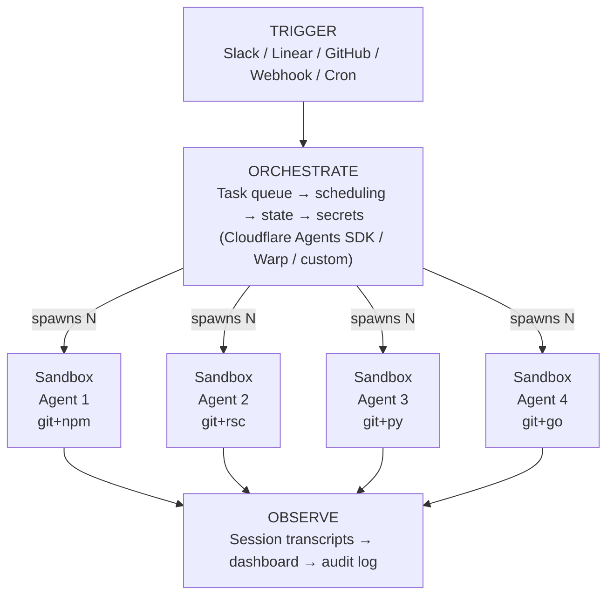
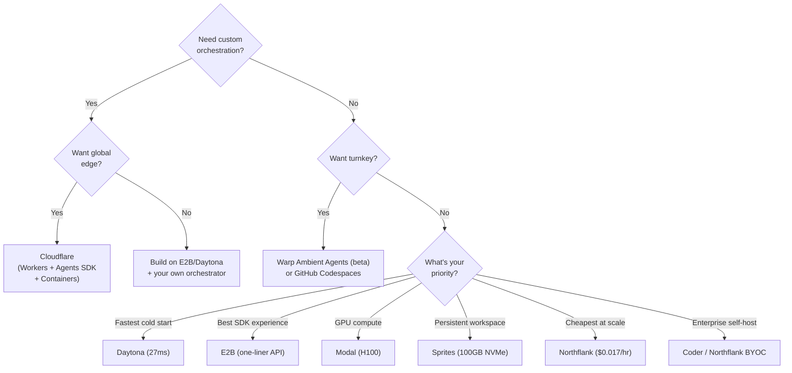

# Parallel Coding Agents: Architecture Guide

## What

Running N coding agents simultaneously in the cloud — each with its own git repo, filesystem, package manager, and shell — to parallelize software development. The 2025→2026 shift: from local worktrees on your MacBook to cloud sandboxes managed by an orchestrator.

```
2025: MacBook runs 4 git worktrees, each with an agent
2026: MacBook dispatches tasks, cloud runs N sandboxes in parallel
```

## Why Cloud, Why Now

Warp CEO Zach Lloyd's thesis (Sequoia podcast, Jan 2026):

> "Coding will be solved within years. The bottleneck shifts to human capacity to express intent clearly."

Five forces pushing agents off the laptop:

| Force | Problem | Cloud Solves It |
|-------|---------|-----------------|
| **Compute ceiling** | 2 cargo builds saturate a MacBook | Cloud scales horizontally |
| **Sandbox isolation** | Agents testing UI need exclusive screen access | Each gets its own container |
| **Always-on** | Agents need to run while laptop sleeps | Cloud doesn't sleep |
| **Team visibility** | No way to track agent activity across a team | Dashboards, audit logs |
| **Setup cost** | Docker + provisioning was painful | Agents can now configure their own environments |

The progression is intentional — don't skip steps:

| Phase | Where | Human Role | Trust Level |
|-------|-------|------------|-------------|
| Interactive | Local | Review every diff | Low |
| Parallel local | Local (worktrees) | Manage 4-5 agents | Medium |
| Cloud ambient | Cloud sandbox | Review PRs, approve/reject | High |
| Autonomous | Cloud, event-triggered | Set policies, handle escalations | Very high |

## Architecture: The Universal Pattern

Every platform — Cloudflare, Warp, E2B, Daytona — converges on the same layered architecture:



**Rule: never run agent logic in the orchestrator.** The orchestrator routes, authenticates, and coordinates. Sandboxes execute. This separation is non-negotiable.

## Platform Landscape

### Tier 1: Agent-Native Sandboxes

These were built specifically for AI coding agents.

| Platform | Cold Start | Isolation | Key Feature | Weakness |
|----------|-----------|-----------|-------------|----------|
| **Daytona** | 27-90ms | Docker (Kata optional) | Fork/snapshot | Docker isolation weaker |
| **E2B** | ~150ms | Firecracker microVM | Best SDK (Python/TS) | 24h session cap |
| **Fly.io Sprites** | 1-12s | Firecracker microVM | 100GB NVMe persistence | Slowest cold start |
| **Blaxel** | 25ms | Lightweight | Fastest measured start | Newest, least proven |

### Tier 2: General Compute with Sandbox Support

| Platform | Cold Start | Key Feature | Weakness |
|----------|-----------|-------------|----------|
| **Cloudflare Containers** | 2-3 min | Global edge + integrated orchestration | Resource ceiling (4 vCPU, 20GB disk) |
| **Modal** | Sub-second | GPU (H100), 50k concurrent | Python only, gVisor overhead |
| **Northflank** | Varies | BYOC, cheapest ($0.017/hr) | Not agent-first |

### Tier 3: Full Platforms (Orchestration + Execution)

| Platform | Approach | Best For |
|----------|----------|----------|
| **Warp** | Terminal-native ADE + Namespace sandboxes | Teams wanting turnkey agent orchestration |
| **GitHub Codespaces** | Dev environment + Copilot agents | GitHub-native workflows |
| **Cloudflare** (full stack) | Workers + Agents SDK + Durable Objects + Containers | Custom orchestration + global edge |

## Comparison Matrix

| Feature | E2B | Daytona | Modal | Sprites | Cloudflare | Warp |
|---------|-----|---------|-------|---------|------------|------|
| Cold Start | 150ms | 27-90ms | <1s | 1-12s | 2-3min | N/A |
| Max Session | 24h | Unlimited | 24h | Unlimited | Unlimited | N/A |
| GPU | No | No | H100 | Limited | No | No |
| Fork/Snapshot | No | Yes | No | Checkpoint | No | No |
| Orchestration | No | No | No | No | Yes (Agents SDK) | Yes |
| Open Source | Yes | Yes | No | No | Partial | No |
| Cost (1vCPU/2GB/hr) | $0.08 | $0.08 | $0.12 | $0.07 | Pay-per-10ms | $20/mo + credits |

## Isolation Technologies

Pick your tradeoff:

| Technology | Isolation | Overhead | Cold Start | Used By |
|------------|----------|----------|------------|---------|
| **Firecracker** (microVM) | Hardware-level | ~5% | 100-200ms | E2B, Sprites, AWS Lambda |
| **Kata** (container-VM hybrid) | Hardware-level | 5-10% | 200-500ms | Northflank |
| **gVisor** (user-space kernel) | Kernel-level | 2-9x syscall | Sub-second | Modal, Google |
| **Docker** (namespace/cgroup) | Process-level | Minimal | 27-90ms | Daytona |

**Practical rule**: if agents only run YOUR LLM-generated code (not untrusted user code), Docker is good enough. The 2x speed gain over Firecracker is worth the isolation tradeoff.

## Five Architecture Patterns

### Pattern 1: Ephemeral Sandbox Per Task

```
Orchestrator → spawn N sandboxes → each runs one task → collect results → destroy
```

**When**: Independent, well-defined tasks (fix bug A, add feature B, write tests for C).
**Best platforms**: E2B (fast start, clean SDK), Modal (massive scale).

### Pattern 2: Fork-and-Explore

```
Agent runs → decision point → fork into N branches → evaluate → keep winner
```

**When**: Uncertain approach — let agent explore multiple solutions in parallel. Same pattern as MCTS in game AI.
**Best platform**: Daytona (native fork/snapshot primitives).

### Pattern 3: Persistent Agent Workstation

```
Agent gets a "computer" → installs tools once → works for days → checkpoint/restore
```

**When**: Long-running, complex tasks that build on previous work. Agent needs accumulated state.
**Best platform**: Sprites.dev (NVMe persistence, 300ms checkpoint).

### Pattern 4: Orchestrator-as-Brain (Cloudflare Stack)

```
Worker (API gateway) → Agents SDK on Durable Objects (state + WebSocket) → N Sandbox containers
```

**When**: You want custom orchestration logic, global edge deployment, and scale-to-zero pricing.
**Best platform**: Cloudflare (Workers + Agents SDK + Containers + Sandbox SDK).

Cloudflare has an official tutorial for running Claude Code in a Sandbox:
1. Worker receives request (repo URL + task)
2. Creates Sandbox, clones repo via `gitCheckout()`
3. Claude Code executes inside sandbox
4. Returns execution logs + git diff

### Pattern 5: Event-Triggered Ambient Agents (Warp Stack)

```
Event fires (Slack/Linear/GitHub/cron) → Warp orchestrator → Namespace sandbox → PR/message
```

**When**: You want agents that react to system events without human initiation.
**Best platform**: Warp Ambient Agents (beta).

Warp's key technical decisions:
- **Sidecar volumes**: mount `/agent/` volume (Warp CLI + git + CA certs) onto any user Docker image — zero config
- **Shared cache**: all team sandboxes share codebase embeddings and context indices — agents don't rebuild context from scratch
- **Scoped credentials**: inject short-lived, user-scoped GitHub tokens at sandbox creation — never embed in images

## Tradeoffs That Matter

### Cold Start vs Isolation

The fundamental tension. You can't have sub-100ms starts AND hardware-level isolation.

```
Faster ←──────────────────────────────────→ Safer
Docker (27ms)  gVisor (<1s)  Firecracker (150ms)  Kata (200-500ms)
Daytona        Modal         E2B/Sprites           Northflank
```

### Ephemeral vs Persistent

24-hour session caps (E2B, Modal) force ephemeral architecture — agents start clean every time. Unlimited sessions (Sprites, Daytona) enable persistent workstations. Your agent architecture must choose one.

### Integrated vs Composable

| Approach | Pros | Cons |
|----------|------|------|
| **Integrated** (Warp, Cloudflare full stack) | Turnkey, less glue code | Vendor lock-in |
| **Composable** (E2B + custom orchestrator) | Swap any layer | More integration work |

The Rivet Sandbox Agent SDK is the convergence signal — one API that runs Claude Code, Codex, or OpenCode inside any sandbox (Daytona, E2B, Docker). The sandbox layer is commoditizing. Value moves up to orchestration.

### Resource Ceiling

| If Your Agent Needs... | Avoid | Use |
|------------------------|-------|-----|
| >20GB disk (big monorepo) | Cloudflare | Codespaces (64GB), Sprites (100GB) |
| GPU inference | E2B, Daytona, Cloudflare | Modal (H100) |
| >4 vCPU per agent | Cloudflare | Codespaces (32 vCPU) |
| Multi-day persistence | E2B, Modal (24h cap) | Sprites, Daytona |

## Decision Framework



## Steal: Patterns to Reuse

### 1. Orchestrator ≠ Executor (from everyone)
Workers route. Containers execute. Never mix these concerns. The orchestrator should be lightweight (V8 isolate, Lambda, or a simple queue consumer). The executor needs full Linux.

### 2. Sidecar Volume (from Warp)
Mount agent tooling as a sidecar volume (`/agent/` with CLI, git, CA certs) onto any user Docker image. Users supply their standard image, you inject your runtime. Decouples agent from environment, enables zero-config onboarding and instant updates.

### 3. Fork-and-Snapshot (from Daytona)
For exploratory tasks, fork the sandbox at a decision point. Run N approaches in parallel. Snapshot the winner, discard the rest. This is MCTS for code — the most powerful pattern for uncertain problems.

### 4. Shared Cache Across Runs (from Warp)
Persist codebase embeddings, context indices, and dependency caches across agent sandbox lifecycles. Agents that cold-start context every run waste minutes. A shared cache volume eliminates this.

### 5. Scoped Credential Injection (from Warp)
Never embed credentials in container images. Inject short-lived, user-scoped tokens at sandbox creation. GitHub tokens should be temporary and limited to the triggering user's repo access.

### 6. Progressive Autonomy (from Warp)
Start local and interactive. Graduate to local-parallel. Then cloud-background. Then event-triggered autonomous. Each step builds trust before increasing autonomy. Don't skip steps — the trust model matters as much as the technology.

### 7. Friction-Point Activation (from Warp)
Instead of always-on agent suggestions, detect friction moments (git conflicts, test failures, build breaks) and offer one-click "let agent fix this." Higher adoption than proactive suggestions.

### 8. TOEO Architecture (from Warp)
Trigger → Orchestrate → Execute → Observe. Four layers, cleanly separated. Swap execution environment (cloud/local/self-hosted) without changing triggers or orchestration logic. Swap triggers (Slack/webhook/cron) without touching execution.

## Cost Analysis

Running 4 parallel agents, 8 hours/day, 20 days/month (each: 1 vCPU, 2GB RAM):

| Platform | Monthly Cost | Notes |
|----------|-------------|-------|
| Northflank | ~$11 | Cheapest, BYOC option |
| Sprites | ~$45 | + storage costs |
| E2B | ~$51 | Or $150/mo Pro flat |
| Daytona | ~$51 | Similar to E2B |
| Cloudflare | ~$60 | Pay-per-10ms active |
| Modal | ~$77 | + GPU if needed |
| Codespaces | ~$115 | Most expensive |
| Warp | ~$20/mo + credits | Hard to estimate, credit-based |

## Latest Updates (2026)

### Claude Code Agent Teams (Swarms)

Anthropic shipped **Agent Teams** as an experimental feature in Claude Code — the most significant evolution in parallel coding agents since the original subagent system. Unlike subagents (which only report results back to the caller), agent teams introduce **inter-agent communication**: teammates share a task list, claim work independently, and message each other directly. A lead session coordinates the team, spawning N teammates that each run in their own full context window. Two display modes are supported: in-process (cycle through teammates with Shift+Down) and split-pane (via tmux/iTerm2, each teammate gets its own terminal pane). Best use cases: parallel code review with different lenses (security, performance, test coverage), debugging with competing hypotheses where teammates actively try to disprove each other, and cross-layer coordination (frontend/backend/tests each owned by a different teammate). Key tradeoff: agent teams consume 4-15x more tokens than a single session since each teammate is a full Claude Code instance.

Source: [Claude Code Agent Teams docs](https://code.claude.com/docs/en/agent-teams)

### Anthropic's C Compiler Case Study: 16 Parallel Agents

Anthropic published an engineering case study where **16 parallel Claude instances** built a 100,000-line Rust-based C compiler capable of compiling Linux kernel 6.9 on x86, ARM, and RISC-V. Key numbers: ~2,000 Claude Code sessions over two weeks, $20,000 API cost, 2 billion input tokens + 140 million output tokens. The coordination mechanism was remarkably simple — agents claimed tasks by writing files to a `current_tasks/` directory, using git's built-in merge conflict resolution rather than a centralized orchestrator. Each agent autonomously chose "the next most obvious problem." Lessons: high-quality test suites are essential for task verification, context noise must be minimized (precompute statistics rather than dumping raw output), and language models lack time perception (implement `--fast` sampling options for time-sensitive operations).

Source: [Building a C compiler with a team of parallel Claudes](https://www.anthropic.com/engineering/building-c-compiler)

### OpenAI Codex App: Multi-Agent Desktop Client

OpenAI launched the **Codex app** (macOS) on February 2, 2026 — a standalone desktop application that functions as a "command center for agents." Developers manage multiple parallel coding agents across projects, with built-in worktree support so agents work on the same repo without conflicts. Agents run in separate threads organized by project context, can execute for up to 30 minutes independently, and return completed code for review. The underlying GPT-5.2-Codex model (released December 2025) has driven Codex usage to over 1 million developers monthly. For a limited time, the app is included with ChatGPT Free and Go plans.

Sources: [OpenAI Codex App announcement](https://openai.com/index/introducing-the-codex-app/), [VentureBeat coverage](https://venturebeat.com/orchestration/openai-launches-a-codex-desktop-app-for-macos-to-run-multiple-ai-coding-agents-in-parallel)

### VS Code 1.109: Multi-Agent Development Platform

VS Code's January 2026 release (1.109, shipped Feb 4) rebranded itself as **"Your Home for Multi-Agent Development."** The IDE now natively supports Claude, Codex, and GitHub Copilot agents side-by-side — developers pick the right agent for each task without switching editors. A new **Agent Sessions** view provides centralized management across local agents (interactive, on-device), background agents (async CLI-based), and cloud agents (remote infrastructure). Parallel subagent support lets developers spawn multiple focused agents simultaneously for research, implementation, and documentation. Agent Skills (GA) allow packaging specialized capabilities into reusable workflows via skill folders.

Source: [VS Code Multi-Agent Development blog](https://code.visualstudio.com/blogs/2026/02/05/multi-agent-development)

### Anthropic 2026 Agentic Coding Trends Report

Anthropic published a comprehensive trends report identifying multi-agent coordination as one of the eight defining trends for software engineering in 2026. Key finding: developers use AI in ~60% of their work but can "fully delegate" only 0-20% of tasks — effective agentic coding requires active human oversight, not full automation. Enterprise case studies: **TELUS** created 13,000+ custom AI solutions and shipped engineering code 30% faster (500,000 hours saved); **Rakuten** used Claude Code to autonomously complete a vLLM activation vector extraction in 7 hours with 99.9% numerical accuracy on a 12.5-million-line codebase; **Zapier** achieved 89% AI adoption organization-wide with 800+ internally deployed agents.

Sources: [Anthropic Trends Report](https://resources.anthropic.com/2026-agentic-coding-trends-report), [Eight trends blog post](https://claude.com/blog/eight-trends-defining-how-software-gets-built-in-2026)

### Market Trajectory: Two Paths Diverge

Industry analysis from Futurum Group identifies two parallel paths forming in agent-driven development. **Path 1: Multi-agent execution** — coordination and parallelism are primary (Anthropic agent teams, OpenAI Codex app, VS Code multi-agent). **Path 2: Intent-first structuring** — specifications and constraints shape how agents act (structured prompts, guardrails, policy-based orchestration). The AI agents market is projected to grow from $7.84 billion (2025) to $52.62 billion by 2030 at a 46.3% CAGR. The convergence signal: every major platform (Anthropic, OpenAI, Microsoft, GitHub) shipped multi-agent parallel execution features within the same 6-week window (Jan-Feb 2026).

Sources: [Futurum Group analysis](https://futurumgroup.com/insights/agent-driven-development-two-paths-one-future/), [The New Stack: 5 Key Trends](https://thenewstack.io/5-key-trends-shaping-agentic-development-in-2026/)

## What's Next

The market is moving fast:
- **Daytona** just raised $24M Series A (Feb 2026) — fork/snapshot is their bet
- **Warp** Ambient Agents in beta — event-triggered cloud agents
- **Cloudflare** Containers in public beta — Sandbox SDK with Claude Code tutorial
- **GitHub** Agents HQ (Feb 2026) — multi-agent execution within GitHub
- **Rivet** Sandbox Agent SDK — universal agent-sandbox abstraction layer

The sandbox layer is commoditizing. The value is moving to **orchestration** (how you coordinate N agents) and **intent specification** (how you tell agents what to build). The terminal becomes a cockpit for managing agent fleets, not a place where you type commands.

## References

### Cloudflare — Workers, Containers, Sandbox SDK
- [Workers Platform Limits](https://developers.cloudflare.com/workers/platform/limits/)
- [Cloudflare Containers Announcement (Apr 2025)](https://blog.cloudflare.com/cloudflare-containers-coming-2025/)
- [Containers Public Beta (Jun 2025)](https://blog.cloudflare.com/containers-are-available-in-public-beta-for-simple-global-and-programmable/)
- [Container Instance Types & Limits](https://developers.cloudflare.com/containers/platform-details/limits/)
- [Container Pricing](https://developers.cloudflare.com/containers/pricing/)
- [Sandbox SDK Overview](https://developers.cloudflare.com/sandbox/)
- [Run Claude Code on a Sandbox](https://developers.cloudflare.com/sandbox/tutorials/claude-code/)
- [Sandbox SDK GitHub](https://github.com/cloudflare/sandbox-sdk)
- [Agents SDK Documentation](https://developers.cloudflare.com/agents/)
- [Workflows GA](https://blog.cloudflare.com/workflows-ga-production-ready-durable-execution/)
- [Durable Objects Docs](https://developers.cloudflare.com/durable-objects/)

### Warp — Agentic Development Environment
- [Warp 2.0: Reimagining Coding as ADE](https://www.warp.dev/blog/reimagining-coding-agentic-development-environment)
- [Cloud Sandboxes with Namespace](https://www.warp.dev/blog/secure-cloud-sandboxes-for-ai-dev-with-namespace)
- [Warp 2025 in Review](https://www.warp.dev/blog/2025-in-review)
- [Ambient Agents Overview](https://docs.warp.dev/agent-platform/ambient-agents/ambient-agents-overview)
- [Deployment Patterns](https://docs.warp.dev/platform/deployment-patterns)
- [Agent API & SDK](https://docs.warp.dev/platform/agent-api-and-sdk)
- [How To: Run 3 Agents in Parallel](https://docs.warp.dev/university/developer-workflows/power-user/how-to-run-3-agents-in-parallel-summarize-logs-+-analyze-pr-+-modify-ui)
- [Sequoia: Terminal as AI's Workbench — Zach Lloyd](https://sequoiacap.com/podcast/making-the-case-for-the-terminal-as-ais-workbench-warps-zach-lloyd/)
- [StartupHub.ai: Human Intent is the Next Bottleneck](https://www.startuphub.ai/ai-news/tech/2026/the-terminal-as-ais-workbench-why-warps-zach-lloyd-believes-human-intent-is-the-next-bottleneck)
- [The New Stack: Warp Evolution](https://thenewstack.io/how-warp-went-from-terminal-to-agentic-development-environment/)
- [The New Stack: Warp 2.0 Walkthrough](https://thenewstack.io/warp-goes-agentic-a-developer-walk-through-of-warp-2-0/)
- [TIME: Best Inventions 2025](https://time.com/collections/best-inventions-2025/7318249/warp-agentic-development-environment/)

### E2B
- [E2B Official](https://e2b.dev/)
- [E2B GitHub](https://github.com/e2b-dev/E2B)
- [E2B Documentation](https://e2b.dev/docs)
- [E2B $21M Series A](https://e2b.dev/blog/series-a)
- [Docker + E2B: Trusted AI](https://www.docker.com/blog/docker-e2b-building-the-future-of-trusted-ai/)

### Daytona
- [Daytona Official](https://www.daytona.io/)
- [Daytona GitHub](https://github.com/daytonaio/daytona)
- [Daytona $24M Series A (PRNewswire)](https://www.prnewswire.com/news-releases/daytona-raises-24m-series-a-to-give-every-agent-a-computer-302680740.html)
- [Daytona Series A (Tech.eu)](https://tech.eu/2026/02/06/daytona-raises-24m-series-a-to-build-agent-native-compute-infrastructure/)
- [Daytona Cloud Introduction](https://www.daytona.io/dotfiles/introducing-daytona-cloud-the-agent-native-infrastructure)

### Modal
- [Modal Official](https://modal.com/)
- [Modal $80M Raise (SiliconANGLE)](https://siliconangle.com/2025/09/29/modal-labs-raises-80m-simplify-cloud-ai-infrastructure-programmable-building-blocks/)
- [Modal: Top Code Agent Sandbox Products](https://modal.com/blog/top-code-agent-sandbox-products)

### Fly.io / Sprites
- [Sprites.dev Official](https://sprites.dev/)
- [Fly's Sprites — Simon Willison](https://simonwillison.net/2026/Jan/9/sprites-dev/)
- [Fly.io Debuts Sprites (SDxCentral)](https://www.sdxcentral.com/news/flyio-debuts-sprites-persistent-vms-that-let-ai-agents-keep-their-state/)
- [Fly.io Sprites (DevClass)](https://devclass.com/2026/01/13/fly-io-introduces-sprites-lightweight-persistent-vms-to-isolate-agentic-ai/)

### Northflank
- [Best Code Execution Sandbox 2026](https://northflank.com/blog/best-code-execution-sandbox-for-ai-agents)
- [How to Sandbox AI Agents](https://northflank.com/blog/how-to-sandbox-ai-agents)
- [Top AI Sandbox Platforms 2026](https://northflank.com/blog/top-ai-sandbox-platforms-for-code-execution)

### GitHub
- [Copilot CLI: Parallel Execution (WinBuzzer)](https://winbuzzer.com/2026/01/16/github-copilot-cli-gains-specialized-agents-parallel-execution-and-smarter-context-management-xcxwbn/)
- [GitHub Enables Multi-Agent Coding (HelpNetSecurity)](https://www.helpnetsecurity.com/2026/02/05/github-enables-coding-agents/)
- [GitHub Coding Agent for Copilot](https://github.com/newsroom/press-releases/coding-agent-for-github-copilot)

### Cross-Platform Comparisons & Benchmarks
- [AI Code Sandbox Benchmark 2026 (Superagent)](https://www.superagent.sh/blog/ai-code-sandbox-benchmark-2026)
- [E2B vs Modal vs Fly.io (Athenic)](https://getathenic.com/blog/e2b-vs-modal-vs-flyio-sandbox-comparison)
- [E2B, Daytona, Modal, Sprites Comparison (SoftwareSeni)](https://www.softwareseni.com/e2b-daytona-modal-and-sprites-dev-choosing-the-right-ai-agent-sandbox-platform/)
- [10 Best Sandbox Runners 2026 (Better Stack)](https://betterstack.com/community/comparisons/best-sandbox-runners/)
- [Choosing an AI Sandbox Provider (cto.new)](https://cto.new/blog/choosing-an-ai-sandbox-provider-in-2026)
- [The Sandbox Explosion (daax.dev)](https://daax.dev/blogs/the-sandbox-explosion)

### Emerging Platforms & SDKs
- [Rivet Sandbox Agent SDK](https://www.rivet.dev/changelog/2026-01-28-sandbox-agent-sdk/)
- [Rivet Sandbox Agent GitHub](https://github.com/rivet-dev/sandbox-agent)
- [Blaxel — Modal Pricing & Alternatives](https://blaxel.ai/blog/modal-pricing-alternatives-guide)
- [Awesome Sandbox (GitHub)](https://github.com/restyler/awesome-sandbox)
- [Kubernetes Agent Sandbox (k8s-sigs)](https://github.com/kubernetes-sigs/agent-sandbox)
- [K8s Needs New Standard for Agent Execution (Google)](https://opensource.googleblog.com/2025/11/unleashing-autonomous-ai-agents-why-kubernetes-needs-a-new-standard-for-agent-execution.html)

### Coder
- [Coder Official](https://coder.com/)

### Latest Updates (2026) Sources
- [Claude Code Agent Teams Documentation](https://code.claude.com/docs/en/agent-teams)
- [Building a C compiler with a team of parallel Claudes](https://www.anthropic.com/engineering/building-c-compiler)
- [OpenAI Codex App Announcement](https://openai.com/index/introducing-the-codex-app/)
- [OpenAI Codex App (VentureBeat)](https://venturebeat.com/orchestration/openai-launches-a-codex-desktop-app-for-macos-to-run-multiple-ai-coding-agents-in-parallel)
- [OpenAI Codex App (TechCrunch)](https://techcrunch.com/2026/02/02/openai-launches-new-macos-app-for-agentic-coding/)
- [VS Code Multi-Agent Development](https://code.visualstudio.com/blogs/2026/02/05/multi-agent-development)
- [VS Code 1.109 Multi-Agent Platform (Visual Studio Magazine)](https://visualstudiomagazine.com/articles/2026/02/05/vs-code-1-109-deemed-multi-agent-development-platform.aspx)
- [Anthropic 2026 Agentic Coding Trends Report](https://resources.anthropic.com/2026-agentic-coding-trends-report)
- [Eight Trends Defining Software in 2026 (Claude blog)](https://claude.com/blog/eight-trends-defining-how-software-gets-built-in-2026)
- [Agent-Driven Development: Two Paths, One Future (Futurum)](https://futurumgroup.com/insights/agent-driven-development-two-paths-one-future/)
- [5 Key Trends Shaping Agentic Development in 2026 (The New Stack)](https://thenewstack.io/5-key-trends-shaping-agentic-development-in-2026/)
- [AI Coding Agents: Coherence Through Orchestration (Mike Mason)](https://mikemason.ca/writing/ai-coding-agents-jan-2026/)
- [Claude Code Swarms (Addy Osmani)](https://addyosmani.com/blog/claude-code-agent-teams/)
- [Parallel Coding Agents Complete Guide (Simon Willison)](https://simonwillison.net/2025/Oct/5/parallel-coding-agents/)
