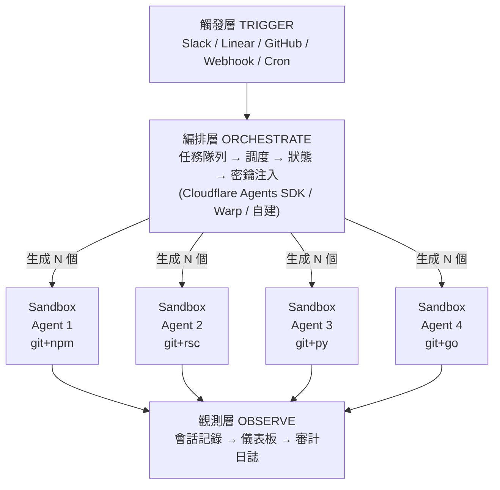
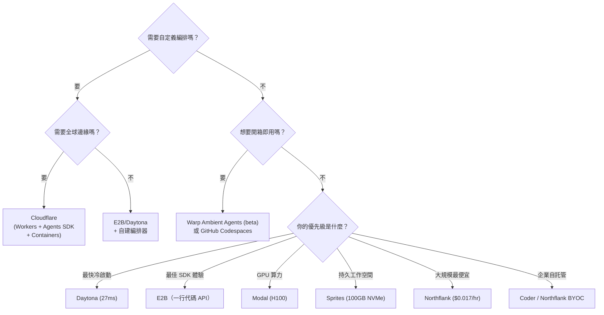

# 並行編碼代理：架構指南

## What

在雲端同時運行 N 個編碼代理 — 每個有自己的 git 倉庫、文件系統、包管理器和 shell — 來並行化軟件開發。2025→2026 的轉變：從 MacBook 上的本地 worktree 到由編排器管理的雲端沙箱。

```
2025: MacBook 跑 4 個 git worktree，各配一個 agent
2026: MacBook 派發任務，雲端跑 N 個沙箱並行執行
```

## Why — 為什麼是現在

Warp CEO Zach Lloyd 的論述（Sequoia podcast，2026 年 1 月）：

> "編碼問題幾年內就會被解決。瓶頸轉移到人類清晰表達意圖的能力。"

五股力量把 agent 推離筆電：

| 驅動力 | 問題 | 雲端怎麼解 |
|--------|------|-----------|
| **算力天花板** | 2 個 cargo build 就把 MacBook 跑滿 | 雲端水平擴展 |
| **沙箱隔離** | Agent 測試 UI 需要獨佔屏幕 | 每個有自己的容器 |
| **永不停機** | Agent 需要在筆電休眠時繼續工作 | 雲端不會睡覺 |
| **團隊可見性** | 無法追蹤團隊 agent 活動 | 儀表板、審計日誌 |
| **設置成本** | Docker + 機器配置很痛苦 | Agent 現在能自己配環境 |

進展是刻意的 — 不要跳步驟：

| 階段 | 在哪 | 人的角色 | 信任等級 |
|------|------|---------|---------|
| 交互式 | 本地 | 審查每個 diff | 低 |
| 本地並行 | 本地（worktree） | 管理 4-5 個 agent | 中 |
| 雲端環境 | 雲端沙箱 | 審查 PR、批准/拒絕 | 高 |
| 自主運行 | 雲端，事件觸發 | 設策略、處理升級 | 很高 |

## 架構：通用模式

所有平台 — Cloudflare、Warp、E2B、Daytona — 都收斂到相同的分層架構：



**鐵律：永遠不要在編排器裡跑 agent 邏輯。** 編排器負責路由、認證和協調。沙箱負責執行。這個分離不可妥協。

## 平台全景

### 第一梯隊：Agent 原生沙箱

這些平台專為 AI 編碼代理而建。

| 平台 | 冷啟動 | 隔離 | 殺手功能 | 弱點 |
|------|--------|------|---------|------|
| **Daytona** | 27-90ms | Docker（可選 Kata） | Fork/Snapshot | Docker 隔離較弱 |
| **E2B** | ~150ms | Firecracker microVM | 最佳 SDK（Python/TS） | 24h 會話上限 |
| **Fly.io Sprites** | 1-12s | Firecracker microVM | 100GB NVMe 持久化 | 最慢冷啟動 |
| **Blaxel** | 25ms | 輕量級 | 最快冷啟動記錄 | 最新，最少驗證 |

### 第二梯隊：通用計算 + 沙箱支持

| 平台 | 冷啟動 | 殺手功能 | 弱點 |
|------|--------|---------|------|
| **Cloudflare Containers** | 2-3 min | 全球邊緣 + 集成編排 | 資源上限（4 vCPU，20GB 磁盤） |
| **Modal** | 亞秒級 | GPU（H100），5 萬並發 | 僅 Python，gVisor 開銷 |
| **Northflank** | 不定 | BYOC，最便宜（$0.017/hr） | 非 agent 優先 |

### 第三梯隊：完整平台（編排 + 執行）

| 平台 | 方式 | 適合 |
|------|------|------|
| **Warp** | 終端原生 ADE + Namespace 沙箱 | 想要開箱即用 agent 編排的團隊 |
| **GitHub Codespaces** | 開發環境 + Copilot agents | GitHub 原生工作流 |
| **Cloudflare**（全棧） | Workers + Agents SDK + DO + Containers | 自定義編排 + 全球邊緣 |

## 對比矩陣

| 功能 | E2B | Daytona | Modal | Sprites | Cloudflare | Warp |
|------|-----|---------|-------|---------|------------|------|
| 冷啟動 | 150ms | 27-90ms | <1s | 1-12s | 2-3min | N/A |
| 最大會話 | 24h | 無限 | 24h | 無限 | 無限 | N/A |
| GPU | 無 | 無 | H100 | 有限 | 無 | 無 |
| Fork/Snapshot | 無 | 有 | 無 | Checkpoint | 無 | 無 |
| 編排層 | 無 | 無 | 無 | 無 | 有（Agents SDK） | 有 |
| 開源 | 是 | 是 | 否 | 否 | 部分 | 否 |
| 費用（1vCPU/2GB/hr） | $0.08 | $0.08 | $0.12 | $0.07 | 按 10ms 計費 | $20/月+額度 |

## 隔離技術

選擇你的權衡：

| 技術 | 隔離強度 | 開銷 | 冷啟動 | 使用者 |
|------|---------|------|--------|--------|
| **Firecracker**（microVM） | 硬件級 | ~5% | 100-200ms | E2B、Sprites、AWS Lambda |
| **Kata**（容器-VM 混合） | 硬件級 | 5-10% | 200-500ms | Northflank |
| **gVisor**（用戶空間內核） | 內核級 | 2-9x 系統調用 | 亞秒級 | Modal、Google |
| **Docker**（命名空間/cgroup） | 進程級 | 最小 | 27-90ms | Daytona |

**實用法則**：如果 agent 只跑你自己 LLM 生成的代碼（不是不受信任的用戶代碼），Docker 就夠了。比 Firecracker 快 2 倍的速度值得這個隔離上的取捨。

## 五種架構模式

### 模式 1：每任務一個臨時沙箱

```
編排器 → 生成 N 個沙箱 → 各跑一個任務 → 收集結果 → 銷毀
```

**何時用**：獨立、定義明確的任務（修 bug A、加功能 B、寫 C 的測試）。
**最佳平台**：E2B（快速啟動、乾淨 SDK），Modal（大規模擴展）。

### 模式 2：Fork 探索

```
Agent 運行 → 決策點 → fork 出 N 個分支 → 評估 → 保留贏家
```

**何時用**：不確定方案時 — 讓 agent 並行嘗試多種方案。跟遊戲 AI 的 MCTS 一個模式。
**最佳平台**：Daytona（原生 fork/snapshot 原語）。

### 模式 3：持久 Agent 工作站

```
Agent 獲得一台「電腦」→ 安裝工具一次 → 工作數天 → checkpoint/restore
```

**何時用**：長期運行的複雜任務，需要累積狀態。
**最佳平台**：Sprites.dev（NVMe 持久化，300ms checkpoint）。

### 模式 4：編排器即大腦（Cloudflare 棧）

```
Worker（API 網關）→ Agents SDK on Durable Objects（狀態 + WebSocket）→ N 個 Sandbox 容器
```

**何時用**：想要自定義編排邏輯、全球邊緣部署、按使用量計費。
**最佳平台**：Cloudflare（Workers + Agents SDK + Containers + Sandbox SDK）。

Cloudflare 官方有在 Sandbox 跑 Claude Code 的教程：
1. Worker 收到請求（倉庫 URL + 任務）
2. 創建 Sandbox，通過 `gitCheckout()` 克隆倉庫
3. Claude Code 在沙箱內執行
4. 返回執行日誌 + git diff

### 模式 5：事件觸發的環境代理（Warp 棧）

```
事件觸發（Slack/Linear/GitHub/cron）→ Warp 編排器 → Namespace 沙箱 → PR/消息
```

**何時用**：想要 agent 對系統事件自動反應，無需人工啟動。
**最佳平台**：Warp Ambient Agents（beta）。

Warp 的關鍵技術決策：
- **Sidecar Volume**：掛載 `/agent/` 卷（Warp CLI + git + CA 證書）到任意用戶 Docker 鏡像 — 零配置
- **共享緩存**：團隊所有沙箱共享代碼庫 embedding 和上下文索引 — agent 不用從頭構建上下文
- **範圍化憑證**：在沙箱創建時注入短期、用戶範圍的 GitHub token — 永遠不要嵌入鏡像

## 關鍵權衡

### 冷啟動 vs 隔離

根本矛盾。你不可能同時有 sub-100ms 啟動和硬件級隔離。

```
更快 ←──────────────────────────────────→ 更安全
Docker (27ms)  gVisor (<1s)  Firecracker (150ms)  Kata (200-500ms)
Daytona        Modal         E2B/Sprites           Northflank
```

### 臨時 vs 持久

24 小時會話上限（E2B、Modal）強制臨時架構 — agent 每次從零開始。無限會話（Sprites、Daytona）支持持久工作站。你的 agent 架構必須二選一。

### 集成 vs 可組合

| 方式 | 優點 | 缺點 |
|------|------|------|
| **集成**（Warp、Cloudflare 全棧） | 開箱即用，膠水代碼少 | 供應商鎖定 |
| **可組合**（E2B + 自建編排器） | 任意替換任何層 | 更多集成工作 |

Rivet Sandbox Agent SDK 是收斂信號 — 一個 API 可以在任何沙箱（Daytona、E2B、Docker）裡跑 Claude Code、Codex 或 OpenCode。沙箱層正在商品化。價值向上移到編排層。

### 資源天花板

| 如果你的 Agent 需要... | 避開 | 用這個 |
|------------------------|------|--------|
| >20GB 磁盤（大 monorepo） | Cloudflare | Codespaces (64GB)、Sprites (100GB) |
| GPU 推理 | E2B、Daytona、Cloudflare | Modal (H100) |
| >4 vCPU 每 agent | Cloudflare | Codespaces (32 vCPU) |
| 多天持久化 | E2B、Modal（24h 上限） | Sprites、Daytona |

## 決策框架



## Steal：可直接複用的模式

### 1. 編排器 ≠ 執行器（全行業共識）
Workers 負責路由。Containers 負責執行。永遠不要混合這兩個關注點。編排器應該是輕量的（V8 isolate、Lambda、或簡單的隊列消費者）。執行器需要完整 Linux。

### 2. Sidecar Volume（來自 Warp）
把 agent 工具掛載為 sidecar 卷（`/agent/` 含 CLI、git、CA 證書）到任意用戶 Docker 鏡像。用戶提供標準鏡像，你注入你的運行時。解耦 agent 和環境，零配置接入，即時更新。

### 3. Fork-and-Snapshot（來自 Daytona）
探索性任務時，在決策點 fork 沙箱。並行跑 N 種方案。快照贏家，丟棄其餘。這是代碼版的 MCTS — 對不確定問題最強大的模式。

### 4. 跨運行共享緩存（來自 Warp）
在 agent 沙箱生命週期間持久化代碼庫 embedding、上下文索引和依賴緩存。每次冷啟動上下文的 agent 浪費幾分鐘。共享緩存卷消除這個問題。

### 5. 範圍化憑證注入（來自 Warp）
永遠不要在容器鏡像中嵌入憑證。在沙箱創建時注入短期、用戶範圍的 token。GitHub token 應該是臨時的，僅限觸發用戶的倉庫訪問。

### 6. 漸進式自主（來自 Warp）
從本地交互開始。畢業到本地並行。再到雲端後台。再到事件觸發自主。每一步在增加自主度前先建立信任。不要跳步驟 — 信任模型和技術一樣重要。

### 7. 摩擦點激活（來自 Warp）
不要用永遠在線的 agent 建議，而是檢測摩擦時刻（git 衝突、測試失敗、構建崩潰）然後提供一鍵「讓 agent 修」。比主動建議的採用率更高。

### 8. TOEO 架構（來自 Warp）
觸發 → 編排 → 執行 → 觀測。四層，乾淨分離。替換執行環境（雲端/本地/自託管）不用改觸發器或編排邏輯。替換觸發器（Slack/webhook/cron）不用動執行層。

## 成本分析

跑 4 個並行 agent，每天 8 小時，每月 20 天（每個：1 vCPU，2GB RAM）：

| 平台 | 月費 | 備註 |
|------|------|------|
| Northflank | ~$11 | 最便宜，有 BYOC |
| Sprites | ~$45 | + 存儲費用 |
| E2B | ~$51 | 或 $150/月 Pro 包月 |
| Daytona | ~$51 | 類似 E2B |
| Cloudflare | ~$60 | 按 10ms 活躍時間計費 |
| Modal | ~$77 | + GPU 另計 |
| Codespaces | ~$115 | 最貴 |
| Warp | ~$20/月 + 額度 | 難估算，基於額度 |

## 最新動態 (2026)

### Claude Code Agent Teams（Swarms）

Anthropic 在 Claude Code 中推出了 **Agent Teams** 實驗性功能 — 這是自原始 subagent 系統以來並行編碼代理最重大的進化。與 subagent（只能向調用者回報結果）不同，agent teams 引入了**代理間通信**：隊友共享任務列表、獨立認領工作、直接互相發消息。一個 lead session 協調整個團隊，生成 N 個隊友，每個都在自己的完整上下文窗口中運行。支持兩種顯示模式：進程內（用 Shift+Down 循環切換隊友）和分屏（通過 tmux/iTerm2，每個隊友有自己的終端面板）。最佳用例：多角度並行代碼審查（安全、性能、測試覆蓋率）、競爭假設調試（隊友主動嘗試推翻彼此的理論）、跨層協調（前端/後端/測試各由不同隊友負責）。關鍵取捨：agent teams 消耗的 token 是單一會話的 4-15 倍，因為每個隊友都是完整的 Claude Code 實例。

來源：[Claude Code Agent Teams 文檔](https://code.claude.com/docs/en/agent-teams)

### Anthropic C 編譯器案例研究：16 個並行 Agent

Anthropic 發布了一個工程案例研究，**16 個並行 Claude 實例** 構建了一個 100,000 行的 Rust 基 C 編譯器，能夠在 x86、ARM 和 RISC-V 上編譯 Linux 內核 6.9。關鍵數據：兩週內約 2,000 個 Claude Code 會話，$20,000 API 成本，20 億輸入 token + 1.4 億輸出 token。協調機制非常簡單 — agent 通過向 `current_tasks/` 目錄寫入文件來認領任務，利用 git 內建的合併衝突解決機制而非集中式編排器。每個 agent 自主選擇「下一個最明顯的問題」。經驗教訓：高質量測試套件對任務驗證至關重要，必須最小化上下文噪音（預計算統計數據而非傾倒原始輸出），語言模型缺乏時間感知（為時間敏感操作實現 `--fast` 採樣選項）。

來源：[用一組並行 Claude 構建 C 編譯器](https://www.anthropic.com/engineering/building-c-compiler)

### OpenAI Codex App：多代理桌面客戶端

OpenAI 於 2026 年 2 月 2 日推出了 **Codex app**（macOS）— 一個獨立桌面應用程式，充當「代理指揮中心」。開發者可以跨項目管理多個並行編碼代理，內建 worktree 支持讓代理在同一倉庫上工作不產生衝突。代理在按項目上下文組織的獨立線程中運行，可以獨立執行最多 30 分鐘，然後返回完成的代碼供審查。底層的 GPT-5.2-Codex 模型（2025 年 12 月發布）推動 Codex 月活開發者超過 100 萬。限時期間，該應用包含在 ChatGPT Free 和 Go 計劃中。

來源：[OpenAI Codex App 公告](https://openai.com/index/introducing-the-codex-app/)、[VentureBeat 報道](https://venturebeat.com/orchestration/openai-launches-a-codex-desktop-app-for-macos-to-run-multiple-ai-coding-agents-in-parallel)

### VS Code 1.109：多代理開發平台

VS Code 2026 年 1 月版本（1.109，2 月 4 日發布）將自己重新定位為**「多代理開發之家」**。IDE 現在原生支持 Claude、Codex 和 GitHub Copilot 代理並排使用 — 開發者無需切換編輯器即可為每個任務選擇合適的代理。新的 **Agent Sessions** 視圖提供跨本地代理（交互式、設備上）、後台代理（異步 CLI 基）和雲端代理（遠程基礎設施）的集中管理。並行 subagent 支持讓開發者同時生成多個專注的代理來處理研究、實現和文檔。Agent Skills（GA）允許通過技能文件夾將專門能力打包成可重用的工作流。

來源：[VS Code 多代理開發博客](https://code.visualstudio.com/blogs/2026/02/05/multi-agent-development)

### Anthropic 2026 Agentic Coding 趨勢報告

Anthropic 發布了一份全面的趨勢報告，將多代理協調列為 2026 年軟件工程八大定義性趨勢之一。關鍵發現：開發者在約 60% 的工作中使用 AI，但只能「完全委派」0-20% 的任務 — 有效的 agentic coding 需要積極的人工監督，而非完全自動化。企業案例：**TELUS** 創建了 13,000+ 個自定義 AI 解決方案，工程代碼交付速度提升 30%（節省 500,000 小時）；**Rakuten** 使用 Claude Code 在 1250 萬行代碼庫上自主完成 vLLM 激活向量提取，耗時 7 小時，數值準確度 99.9%；**Zapier** 全組織 AI 採用率達 89%，內部部署了 800+ 個代理。

來源：[Anthropic 趨勢報告](https://resources.anthropic.com/2026-agentic-coding-trends-report)、[八大趨勢博客](https://claude.com/blog/eight-trends-defining-how-software-gets-built-in-2026)

### 市場軌跡：兩條路徑分叉

Futurum Group 的行業分析識別出代理驅動開發中形成的兩條平行路徑。**路徑 1：多代理執行** — 協調和並行性為主（Anthropic agent teams、OpenAI Codex app、VS Code 多代理）。**路徑 2：意圖優先結構化** — 規範和約束塑造代理行為（結構化提示、護欄、基於策略的編排）。AI 代理市場預計從 78.4 億美元（2025）增長到 2030 年的 526.2 億美元，複合年增長率 46.3%。收斂信號：每個主要平台（Anthropic、OpenAI、Microsoft、GitHub）都在同一個 6 週窗口期（2026 年 1-2 月）內推出了多代理並行執行功能。

來源：[Futurum Group 分析](https://futurumgroup.com/insights/agent-driven-development-two-paths-one-future/)、[The New Stack：5 大關鍵趨勢](https://thenewstack.io/5-key-trends-shaping-agentic-development-in-2026/)

## 接下來

市場在快速移動：
- **Daytona** 剛完成 $24M A 輪（2026 年 2 月）— fork/snapshot 是他們的賭注
- **Warp** Ambient Agents 在 beta — 事件觸發的雲端 agent
- **Cloudflare** Containers 公開測試 — Sandbox SDK 有 Claude Code 教程
- **GitHub** Agents HQ（2026 年 2 月）— GitHub 內多 agent 執行
- **Rivet** Sandbox Agent SDK — 通用 agent-沙箱抽象層

沙箱層正在商品化。價值向上移到**編排**（如何協調 N 個 agent）和**意圖規範**（如何告訴 agent 要構建什麼）。終端成為管理 agent 艦隊的駕駛艙，而不只是你打命令的地方。

## References

### Cloudflare — Workers, Containers, Sandbox SDK
- [Workers Platform Limits](https://developers.cloudflare.com/workers/platform/limits/)
- [Cloudflare Containers Announcement (Apr 2025)](https://blog.cloudflare.com/cloudflare-containers-coming-2025/)
- [Containers Public Beta (Jun 2025)](https://blog.cloudflare.com/containers-are-available-in-public-beta-for-simple-global-and-programmable/)
- [Container Instance Types & Limits](https://developers.cloudflare.com/containers/platform-details/limits/)
- [Container Pricing](https://developers.cloudflare.com/containers/pricing/)
- [Sandbox SDK Overview](https://developers.cloudflare.com/sandbox/)
- [Run Claude Code on a Sandbox](https://developers.cloudflare.com/sandbox/tutorials/claude-code/)
- [Sandbox SDK GitHub](https://github.com/cloudflare/sandbox-sdk)
- [Agents SDK Documentation](https://developers.cloudflare.com/agents/)
- [Workflows GA](https://blog.cloudflare.com/workflows-ga-production-ready-durable-execution/)
- [Durable Objects Docs](https://developers.cloudflare.com/durable-objects/)

### Warp — Agentic Development Environment
- [Warp 2.0: Reimagining Coding as ADE](https://www.warp.dev/blog/reimagining-coding-agentic-development-environment)
- [Cloud Sandboxes with Namespace](https://www.warp.dev/blog/secure-cloud-sandboxes-for-ai-dev-with-namespace)
- [Warp 2025 in Review](https://www.warp.dev/blog/2025-in-review)
- [Ambient Agents Overview](https://docs.warp.dev/agent-platform/ambient-agents/ambient-agents-overview)
- [Deployment Patterns](https://docs.warp.dev/platform/deployment-patterns)
- [Agent API & SDK](https://docs.warp.dev/platform/agent-api-and-sdk)
- [How To: Run 3 Agents in Parallel](https://docs.warp.dev/university/developer-workflows/power-user/how-to-run-3-agents-in-parallel-summarize-logs-+-analyze-pr-+-modify-ui)
- [Sequoia: Terminal as AI's Workbench — Zach Lloyd](https://sequoiacap.com/podcast/making-the-case-for-the-terminal-as-ais-workbench-warps-zach-lloyd/)
- [StartupHub.ai: Human Intent is the Next Bottleneck](https://www.startuphub.ai/ai-news/tech/2026/the-terminal-as-ais-workbench-why-warps-zach-lloyd-believes-human-intent-is-the-next-bottleneck)
- [The New Stack: Warp Evolution](https://thenewstack.io/how-warp-went-from-terminal-to-agentic-development-environment/)
- [The New Stack: Warp 2.0 Walkthrough](https://thenewstack.io/warp-goes-agentic-a-developer-walk-through-of-warp-2-0/)
- [TIME: Best Inventions 2025](https://time.com/collections/best-inventions-2025/7318249/warp-agentic-development-environment/)

### E2B
- [E2B Official](https://e2b.dev/)
- [E2B GitHub](https://github.com/e2b-dev/E2B)
- [E2B Documentation](https://e2b.dev/docs)
- [E2B $21M Series A](https://e2b.dev/blog/series-a)
- [Docker + E2B: Trusted AI](https://www.docker.com/blog/docker-e2b-building-the-future-of-trusted-ai/)

### Daytona
- [Daytona Official](https://www.daytona.io/)
- [Daytona GitHub](https://github.com/daytonaio/daytona)
- [Daytona $24M Series A (PRNewswire)](https://www.prnewswire.com/news-releases/daytona-raises-24m-series-a-to-give-every-agent-a-computer-302680740.html)
- [Daytona Series A (Tech.eu)](https://tech.eu/2026/02/06/daytona-raises-24m-series-a-to-build-agent-native-compute-infrastructure/)
- [Daytona Cloud Introduction](https://www.daytona.io/dotfiles/introducing-daytona-cloud-the-agent-native-infrastructure)

### Modal
- [Modal Official](https://modal.com/)
- [Modal $80M Raise (SiliconANGLE)](https://siliconangle.com/2025/09/29/modal-labs-raises-80m-simplify-cloud-ai-infrastructure-programmable-building-blocks/)
- [Modal: Top Code Agent Sandbox Products](https://modal.com/blog/top-code-agent-sandbox-products)

### Fly.io / Sprites
- [Sprites.dev Official](https://sprites.dev/)
- [Fly's Sprites — Simon Willison](https://simonwillison.net/2026/Jan/9/sprites-dev/)
- [Fly.io Debuts Sprites (SDxCentral)](https://www.sdxcentral.com/news/flyio-debuts-sprites-persistent-vms-that-let-ai-agents-keep-their-state/)
- [Fly.io Sprites (DevClass)](https://devclass.com/2026/01/13/fly-io-introduces-sprites-lightweight-persistent-vms-to-isolate-agentic-ai/)

### Northflank
- [Best Code Execution Sandbox 2026](https://northflank.com/blog/best-code-execution-sandbox-for-ai-agents)
- [How to Sandbox AI Agents](https://northflank.com/blog/how-to-sandbox-ai-agents)
- [Top AI Sandbox Platforms 2026](https://northflank.com/blog/top-ai-sandbox-platforms-for-code-execution)

### GitHub
- [Copilot CLI: Parallel Execution (WinBuzzer)](https://winbuzzer.com/2026/01/16/github-copilot-cli-gains-specialized-agents-parallel-execution-and-smarter-context-management-xcxwbn/)
- [GitHub Enables Multi-Agent Coding (HelpNetSecurity)](https://www.helpnetsecurity.com/2026/02/05/github-enables-coding-agents/)
- [GitHub Coding Agent for Copilot](https://github.com/newsroom/press-releases/coding-agent-for-github-copilot)

### Cross-Platform Comparisons & Benchmarks
- [AI Code Sandbox Benchmark 2026 (Superagent)](https://www.superagent.sh/blog/ai-code-sandbox-benchmark-2026)
- [E2B vs Modal vs Fly.io (Athenic)](https://getathenic.com/blog/e2b-vs-modal-vs-flyio-sandbox-comparison)
- [E2B, Daytona, Modal, Sprites Comparison (SoftwareSeni)](https://www.softwareseni.com/e2b-daytona-modal-and-sprites-dev-choosing-the-right-ai-agent-sandbox-platform/)
- [10 Best Sandbox Runners 2026 (Better Stack)](https://betterstack.com/community/comparisons/best-sandbox-runners/)
- [Choosing an AI Sandbox Provider (cto.new)](https://cto.new/blog/choosing-an-ai-sandbox-provider-in-2026)
- [The Sandbox Explosion (daax.dev)](https://daax.dev/blogs/the-sandbox-explosion)

### Emerging Platforms & SDKs
- [Rivet Sandbox Agent SDK](https://www.rivet.dev/changelog/2026-01-28-sandbox-agent-sdk/)
- [Rivet Sandbox Agent GitHub](https://github.com/rivet-dev/sandbox-agent)
- [Blaxel — Modal Pricing & Alternatives](https://blaxel.ai/blog/modal-pricing-alternatives-guide)
- [Awesome Sandbox (GitHub)](https://github.com/restyler/awesome-sandbox)
- [Kubernetes Agent Sandbox (k8s-sigs)](https://github.com/kubernetes-sigs/agent-sandbox)
- [K8s Needs New Standard for Agent Execution (Google)](https://opensource.googleblog.com/2025/11/unleashing-autonomous-ai-agents-why-kubernetes-needs-a-new-standard-for-agent-execution.html)

### Coder
- [Coder Official](https://coder.com/)

### 最新動態 (2026) 來源
- [Claude Code Agent Teams 文檔](https://code.claude.com/docs/en/agent-teams)
- [用一組並行 Claude 構建 C 編譯器](https://www.anthropic.com/engineering/building-c-compiler)
- [OpenAI Codex App 公告](https://openai.com/index/introducing-the-codex-app/)
- [OpenAI Codex App (VentureBeat)](https://venturebeat.com/orchestration/openai-launches-a-codex-desktop-app-for-macos-to-run-multiple-ai-coding-agents-in-parallel)
- [OpenAI Codex App (TechCrunch)](https://techcrunch.com/2026/02/02/openai-launches-new-macos-app-for-agentic-coding/)
- [VS Code 多代理開發](https://code.visualstudio.com/blogs/2026/02/05/multi-agent-development)
- [VS Code 1.109 多代理平台 (Visual Studio Magazine)](https://visualstudiomagazine.com/articles/2026/02/05/vs-code-1-109-deemed-multi-agent-development-platform.aspx)
- [Anthropic 2026 Agentic Coding 趨勢報告](https://resources.anthropic.com/2026-agentic-coding-trends-report)
- [八大趨勢定義 2026 軟件構建 (Claude 博客)](https://claude.com/blog/eight-trends-defining-how-software-gets-built-in-2026)
- [代理驅動開發：兩條路徑，一個未來 (Futurum)](https://futurumgroup.com/insights/agent-driven-development-two-paths-one-future/)
- [2026 Agentic 開發五大關鍵趨勢 (The New Stack)](https://thenewstack.io/5-key-trends-shaping-agentic-development-in-2026/)
- [AI 編碼代理：通過編排實現一致性 (Mike Mason)](https://mikemason.ca/writing/ai-coding-agents-jan-2026/)
- [Claude Code Swarms (Addy Osmani)](https://addyosmani.com/blog/claude-code-agent-teams/)
- [並行編碼代理完整指南 (Simon Willison)](https://simonwillison.net/2025/Oct/5/parallel-coding-agents/)
