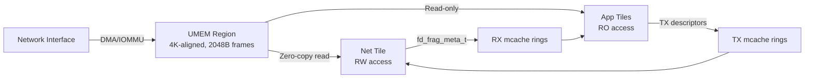
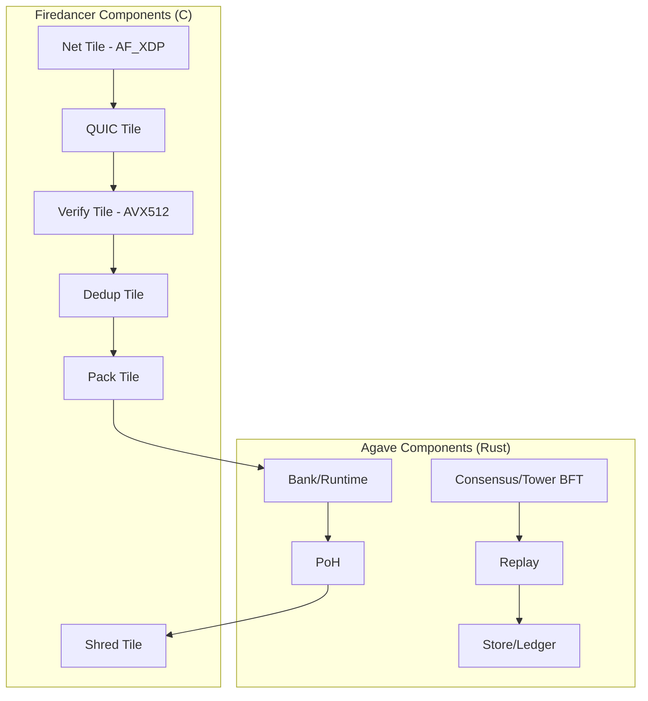
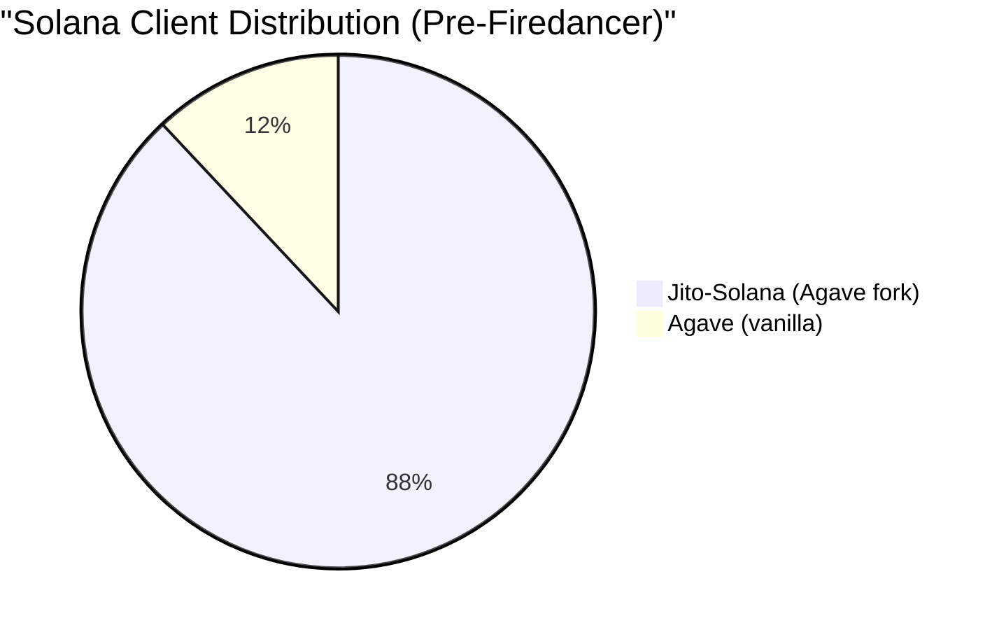
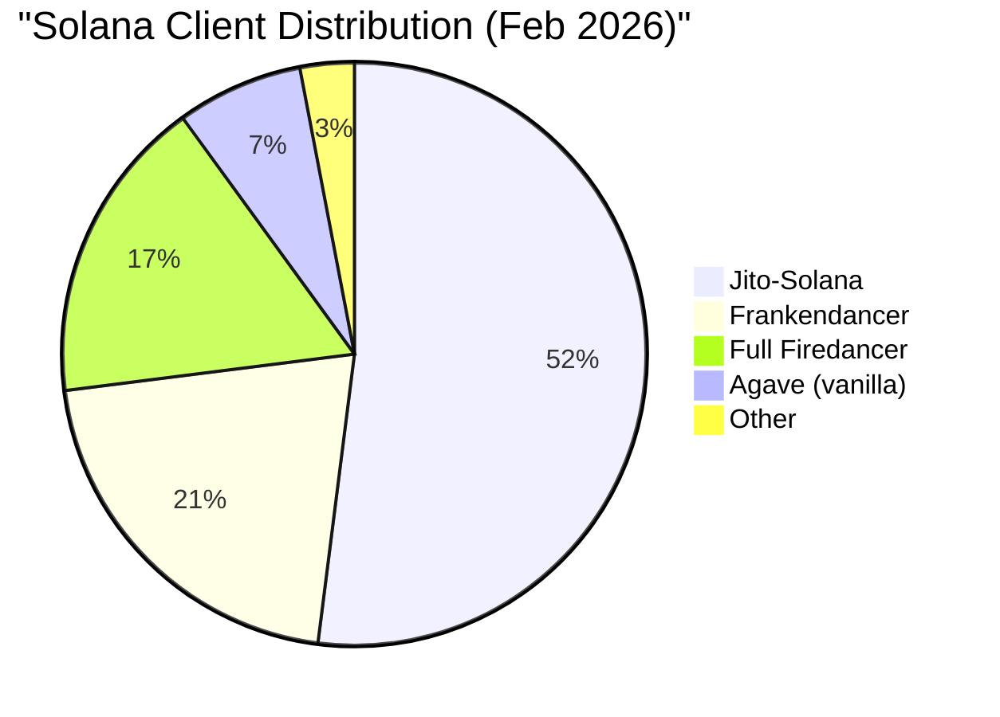

# Solana Firedancer: The High-Performance Validator Client That Rewrites the Rules

## What Is Firedancer

Firedancer is a complete, ground-up reimplementation of the Solana validator client written in C/C++, developed by Jump Crypto (now Jump Trading) in collaboration with the Solana Foundation. Announced at Solana Breakpoint 2022, it represents the first truly independent validator client for Solana -- sharing zero code with the original Rust-based client.

**The core thesis**: Jump Trading's decades of experience building nanosecond-latency high-frequency trading systems, applied to blockchain validator software, can extract orders of magnitude more performance from the same commodity hardware that existing validators run on.

**Key facts**:

| Attribute | Detail |
|-----------|--------|
| Language | C/C++ (vs Rust for Agave) |
| Developer | Jump Trading (Kevin Bowers, Chief Science Officer) |
| Announced | November 2022 (Breakpoint) |
| Frankendancer mainnet | September 2024 |
| Full Firedancer mainnet | December 2025 (Breakpoint Abu Dhabi) |
| Lab TPS demo | 1.2M raw TPS, 600K after deduplication |
| Current stake (Feb 2026) | ~16.87% (91 validators, per wenfiredancer.com) |
| License | Apache 2.0 |
| GitHub | github.com/firedancer-io/firedancer |

### Why It Was Built

Three problems forced Firedancer's creation:

1. **Client monoculture risk**: For years, 90%+ of Solana stake ran on one codebase (Solana Labs/Agave). A single bug could halt the entire network -- and did, 8 times between 2021-2024.

2. **Software bottlenecks hiding hardware capacity**: Kevin Bowers argues that modern programming languages and OS abstractions "go out of their way to hide locality and data flow from you," leaving enormous hardware capacity untapped. The existing Rust client hits software walls long before hardware limits.

3. **Credibility gap**: Solana's "fastest blockchain" narrative needed engineering proof, not marketing claims. Jump offered to build that proof.

## Technical Architecture: The Tiled Model

Firedancer's architecture is fundamentally different from Agave's monolithic single-process design. It operates as a **collection of independent Linux processes called tiles**, each pinned to a dedicated CPU core, communicating through shared memory.

### Design Philosophy

Kevin Bowers' core insight comes from HFT: "Everything is limited by speed of light and everything is oriented around data flow if you really want to be optimized." This means:

- **No thread contention** -- each tile owns its core, no locks
- **No dynamic memory allocation** -- everything pre-allocated at startup
- **NUMA-aware placement** -- memory allocated on the same node as the processing core
- **Cache-line optimized** -- data structures sized for L1/L2/L3 locality
- **Large page sizes** -- reduces TLB misses and page table overhead

The CPU is treated as a distributed network of 32+ logical "computers," each performing a single function and passing data through ultra-fast shared memory channels.

### Tile Types and Transaction Pipeline

Firedancer defines 11 tile types forming a linear pipeline:

```
net → quic → verify → dedup → pack → bank → poh → shred → store
                                                          ↑
                                                        sign
```

| Tile | Function | Parallelizable |
|------|----------|----------------|
| **net** | Sends/receives packets from NIC via AF_XDP | Yes |
| **quic** | QUIC protocol handling, connection management, TLS | Yes |
| **verify** | Ed25519 signature verification (AVX512) | Yes |
| **dedup** | Filters duplicate transactions | No |
| **pack** | Schedules transactions into blocks (leader only) | No |
| **bank** | Executes transactions against account state | Yes |
| **poh** | Proof of History hash chain mixing | No |
| **shred** | Distributes/receives block shreds via Turbine | Yes |
| **store** | Persists blocks to disk | No |
| **sign** | Holds validator private key, responds to signing requests | No |
| **replay** | Replays blocks from other leaders | No |

Only net, quic, verify, bank, and shred tile counts are configurable -- the rest are singletons by design.

### Inter-Tile Communication (IPC)

Tiles communicate through **tango** -- Jump's custom shared-memory message queue system, refined over a decade of HFT infrastructure:

- **Shared memory channels**: Predefined memory regions mapped into specific tile address spaces
- **Zero-copy semantics**: Packets flow from NIC to application tiles without software copies
- **Read-only enforcement**: RX mcaches are mapped read-only to app tiles, preventing corruption
- **Fragment descriptors** (`fd_frag_meta_t`): Lightweight 24-byte descriptors encode sequence number, netmux signature, chunk offset, size, and control bits
- **No locks, no syscalls**: Pure userspace polling with deterministic latency

The topology uses N net tiles x M app tile kinds x K instances per kind, creating N*M mcache RX links. Multiple instances of the same tile type take turns consuming from shared mcaches based on load-balancing hashes.

### Networking: AF_XDP and Kernel Bypass

All Firedancer versions use Linux **AF_XDP** (Address Family XDP) APIs, bypassing the kernel network stack entirely:



**XDP operating modes**:
- **`drv` mode**: Driver-level processing before kernel buffer allocation (high-performance, NIC-dependent)
- **`skb` mode**: Falls back to `struct sk_buff` processing (universally supported, slower)

With `XDP_FLAGS_DRV_MODE` + `XDP_ZEROCOPY`, PCIe network devices write incoming Ethernet packets directly to DRAM without any software copies. The UMEM region is shared across the net tile (RW), Linux kernel (RW), PCIe devices (RW via IOMMU), and app tiles (RO).

**Performance**: 4 CPU cores reliably ingest 21.8 Gbps of incoming transactions (~1.08M TPS with ~1KB transactions), saturating a standard 25 Gbps NIC.

The net tile event loop wakes the kernel ~20K times/second for batched RX/TX operations, using busy polling for deterministic latency.

### QUIC Implementation (fd_quic)

Firedancer implements the QUIC transport protocol entirely from scratch in C11 -- a massive engineering investment covering the 151-page RFC 9000 specification. No existing C QUIC library met Jump's requirements for licensing, performance, and reliability.

**Key design choices**:
- Optimized data structures preventing memory exhaustion
- Minimal dynamic allocation during connection handling
- Flow control for DDoS protection
- Receive-Side Scaling (RSS) for hardware-accelerated load distribution across cores
- Custom TLS implementation (fd_tls) -- no OpenSSL dependency

A QUIC server on 4 CPU cores processes 1.08M TPS at 21.8 Gbps.

### Signature Verification: Ed25519 with AVX512

Firedancer's cryptographic engine is where HFT expertise shows most clearly.

**CPU-based verification**:
- Custom AVX512 implementation of Ed25519 using a 6-long-limb radix-2^43 representation in a single AVX-512 register
- Uses `_mm512_madd52{lo,hi}_epu64` intrinsics for parallelized column-sum arithmetic
- **4x faster than scalar**, **2x faster than AVX2**: 34.2 microseconds vs 154.4 microseconds (scalar)
- ~30,000 signature verifications per second per core
- 100% vector lane utilization through massive data parallelization

**FPGA-based verification** (optional acceleration):
- **8 million signatures/second** on 8 FPGAs at ~400W total power
- ~200 microsecond latency per transaction (vs ~10ms for GPU batch processing)
- Streaming per-transaction processing (no batching needed)
- SHA-512 implemented in pure RTL pipeline with custom ECC-CPU
- Uses AWS accelerator form factor for cloud compatibility
- Achieved 8M TPS on 7-year-old FPGA hardware

### Reed-Solomon Erasure Coding

Firedancer's erasure coding for Turbine block propagation uses an O(n log n) algorithm (2016 paper) for matrix multiplication:

| Metric | Firedancer | rust-rse (Agave) | Speedup |
|--------|-----------|------------------|---------|
| RS encoding | ~120 Gbps/core | ~8 Gbps/core | **15x** |
| RS decoding | ~50 Gbps/core | ~8 Gbps/core | **6x** |

Uses optimized Lagrange Polynomial construction, achieving 14x faster encoding than traditional approaches. This directly improves Turbine shred distribution: ~22% faster without Merkle trees, nearly 2x faster with Merkle trees.

## Frankendancer vs Full Firedancer

The rollout followed a phased strategy:

### Frankendancer (Hybrid)



- Firedancer's high-performance networking + Agave's proven runtime and consensus
- Launched on mainnet **September 2024**
- Allowed validators to get performance benefits with lower risk
- By October 2025: 207 validators, ~20.9% of staked SOL
- Up from 8% in June 2025

### Full Firedancer (Independent)

- Zero Agave dependency -- entirely C/C++ stack
- Launched on mainnet **December 2025** at Breakpoint Abu Dhabi
- Had been running on a handful of validators for 100 days prior, producing 50,000+ blocks
- As of February 21, 2026: 91 validators, ~16.87% of stake (per wenfiredancer.com)
- Approaching ~30% of mainnet stake including Frankendancer variants (per validator discussions Feb 2026)

**Key distinction**: Frankendancer shares Agave's runtime bugs. Full Firedancer doesn't -- a bug in Agave's memory management won't affect Firedancer validators, and vice versa. This is the true client diversity that matters.

## Performance Benchmarks

### Lab Results

| Test | Result | Hardware |
|------|--------|----------|
| Packet ingress | 1.08M TPS (21.8 Gbps) | 4 CPU cores |
| Live demo (Breakpoint 2022) | 1.2M raw TPS, 600K deduplicated | AMD EPYC |
| Ed25519 verification (CPU) | 30K sigs/sec/core | AVX512 |
| Ed25519 verification (FPGA) | 8M sigs/sec total | 8x FPGA, 400W |
| Reed-Solomon encoding | ~120 Gbps/core | Single core |
| Shred creation | ~22% faster (no Merkle), ~2x (with Merkle) | vs Agave |
| Network outbound | 6 Gbps/tile | Standard hardware |

### Real-World Production Numbers

| Metric | Result |
|--------|--------|
| Agave lab match | 1.1M TPS (single-node synthetic) |
| Protocol consensus limit | ~81,000 TPS (current Solana protocol) |
| Unoptimized benchmark | ~63,000 TPS (AMD EPYC 7513, 32 cores) |
| Optimized benchmarks | 89K-308K TPS (various configurations) |
| Block finality (current) | ~400ms |
| Block finality (target with Alpenglow) | ~150ms (80x improvement from 12.8s full finality) |

**Critical context**: The 1M+ TPS numbers are **hardware capacity demonstrations**, not protocol throughput. Solana's consensus protocol currently limits actual throughput to ~81K TPS. Firedancer proves the hardware isn't the bottleneck -- the protocol is.

### Figment's Production Experience

Figment, a major staking provider, migrated their flagship Solana validator to Firedancer and reported:

- **18-28 basis points higher staking rewards** vs their Agave validator
- Gains primarily from better MEV capture and more efficient transaction processing
- 99.8% voting effectiveness rate
- 1.02-slot voting latency
- 0.55% skip rate
- 15% reduction in missed voting credits when combined with DoubleZero (low-latency network)

## Security Architecture

### Defense in Depth

Firedancer's tile architecture provides inherent security isolation:

1. **Process isolation**: Each tile runs as a separate Linux process -- exploit in one tile doesn't compromise others
2. **Memory isolation**: Tiles can only access specific shared memory regions they need
3. **Linux namespaces**: Limited filesystem, network, and process visibility per tile
4. **seccomp-BPF filtering**: Kernel-level syscall filtering restricts what each tile can do
5. **Capability dropping**: Tiles drop unnecessary Linux capabilities at startup
6. **Read-only enforcement**: RX mcaches mapped read-only to app tiles; TX mcaches mapped read-only to net tiles

This mirrors browser security architecture -- sandboxed rendering processes can't escape to compromise the system.

### Formal Verification and Audits

**Neodyme v0.1 Audit** (2024):
- Full security audit of initial release
- Reports published at github.com/firedancer-io/audits

**Neodyme v0.4 Audit** (February-March 2025):
- 5 senior security researchers, time-boxed engagement
- **No remote code execution (RCE) vulnerabilities found** (consistent with v0.1)
- Most findings: DoS scenarios in QUIC networking stack
- One high-severity issue: unintuitive Agave feature activation interaction
- All findings addressed and fixes verified by Neodyme

### Bug Bounty Program

- **Platform**: Immunefi
- **Launch**: September 18, 2024 (ongoing)
- **Maximum payout**: $500,000 (critical blockchain/DLT)
- **Competitive audit** (July-August 2024): 42-day event with up to $1M rewards
- **Last updated**: January 28, 2026

| Severity | Reward Range |
|----------|-------------|
| Critical | $100,000 - $500,000 |
| High | $50,000 - $100,000 |
| Medium | $5,000 - $50,000 |
| Low | $5,000 |

### Continuous Security Infrastructure

- **OSS-Fuzz + ClusterFuzzer**: Automated fuzzing of untrusted input components (P2P parsers, SBPF VM)
- **Internal code reviews**: Focus on high-risk/high-impact components
- **Stress testing**: Test networks subjected to node duplication, link failures, packet floods, consensus violations
- **External security reviews**: Pre- and post-launch audits

### Known Vulnerability Disclosures

**QUIC Transport Parameter UB + Consensus-Splitting Cast Bug** (February 2025):

Three QUIC bugs in `fd_quic_apply_peer_params` (src/waltz/quic/fd_quic.c):

1. **A1 - Signed Integer Overflow** (line 2713): Converting unsigned QUIC VARINT to signed long then multiplying by 1e6 causes overflow for values >9.22e12, causing immediate connection termination
2. **A2 - Invalid Shift Exponent** (line 2724): No validation of `peer_ack_delay_exponent` (RFC 9000 limits to <=20), shifts >=64 produce UB, corrupts loss detection and RTT estimation
3. **A3 - Unsigned Multiplication Overflow** (line 2730): `max_ack_delay` multiplied by 1000 without validation, large values wrap and disable packet retransmission

Plus one **consensus-splitting bug** in `fd_cast.h`:
- `fd_rust_cast_double_to_ulong(-INFINITY)` returns `ULONG_MAX` instead of `0` (Rust returns 0)
- Affects rent exempt calculations, stake warmup/cooldown, and rent calculation paths
- Current risk: low (call sites use non-negative intermediates), but potential for future consensus split

**Timeline**: Discovered Feb 7, 2025. Immunefi submission failed (identity validation). Full public disclosure Feb 10, 2025 via seclists.org.

## Current Status (February 2026)

### Deployment

| Client | Validators | Stake % | Notes |
|--------|-----------|---------|-------|
| Jito-Solana (Agave fork) | ~550+ | ~72% | Dominant, MEV-optimized |
| Frankendancer | ~200+ | ~20.9% | Hybrid, stable |
| Full Firedancer | 91 | ~16.87% | Independent, growing |
| Agave (vanilla) | ~50+ | ~7% | Declining |

**Combined Firedancer variants approaching 30% of mainnet stake** (per February 2026 validator discussions).

### Version Scheme

Frankendancer releases use version format `v0.8xx.xxxxx` where:
- Minor version increments by 100 per new release
- Patch number encodes the Agave validator version it's paired with
- Current versions: 0.811.30108 (78% of Firedancer validators), 0.812.30108 (13.2%)

### Hardware Requirements

| Component | Minimum | Recommended |
|-----------|---------|-------------|
| CPU | 12 cores @ >2.5 GHz | 32 cores @ >3 GHz with AVX512 |
| RAM | 64 GB | 128 GB ECC |
| Storage | 512 GB SSD | 1 TB NVMe + separate OS disk |
| Network | 300 Mbps | 1 Gbps |

The recommended CPU spec (AVX512) matters significantly for Ed25519 verification performance.

### Roadmap: Alpenglow Integration

Alpenglow (SIMD-0326) is Solana's largest protocol upgrade, replacing Proof of History and Tower BFT with the new Votor/Rotor consensus mechanism:

- **98.27% validator approval** (September 2025 governance vote)
- **Testnet**: Q1 2026
- **Mainnet**: Q2 2026 (projected)
- **Finality target**: 150ms (vs current 12.8s full finality -- 80x improvement)
  - 80%+ validators responsive: single-round finality ~100ms
  - 60%+ validators responsive: two-round finality ~150ms

Firedancer will need to implement Alpenglow consensus, replacing its current Tower BFT + PoH implementation. This is a major development effort.

## Impact on Solana Ecosystem

### Client Diversity Progress

Before Firedancer, Solana had a dangerous single-client architecture:





**Progress is real but incomplete**. Ethereum's safety threshold requires no single client above 33% -- Jito-Solana still dominates at ~52-72% depending on measurement. However, the combined Firedancer variants at ~30% represent genuine diversity for the first time.

### The Supermajority Safety Argument

Critics (notably CryptoSlate) argue Solana is "violating the one safety rule Ethereum treats as non-negotiable":

- Any client controlling >2/3 of stake can unilaterally finalize incorrect blocks
- Any client controlling >1/3 can prevent finality
- Jito-Solana alone exceeds both thresholds
- **Counter-argument**: Jito-Solana is an Agave fork, not an independent client. The real diversity is between Agave-derived clients (Jito + vanilla Agave) and Firedancer

### Institutional Adoption Catalyst

Firedancer directly addresses institutional concerns:

1. **Uptime resilience**: Independent codebase means a bug in one client doesn't take down the network
2. **Performance credibility**: 1M+ TPS demonstrated on commodity hardware
3. **Engineering pedigree**: Jump Trading's reputation in financial infrastructure lends credibility
4. **Validator economics**: Figment reports 18-28 bps higher rewards, creating economic incentive for migration

## Comparison: Firedancer vs Agave vs Jito-Solana

| Dimension | Firedancer | Agave (Anza) | Jito-Solana |
|-----------|-----------|-------------|-------------|
| Language | C/C++ | Rust | Rust (Agave fork) |
| Architecture | Tile-based multi-process | Monolithic single-process | Monolithic single-process + 3 extra stages |
| Networking | AF_XDP kernel bypass | Standard Linux sockets | Standard Linux sockets |
| QUIC | fd_quic (custom C11) | quinn (Rust library) | quinn (inherited) |
| Sig verification | Custom AVX512 + optional FPGA | Standard Rust crypto | Standard Rust crypto (inherited) |
| IPC | Shared memory (tango) | Thread-based | Thread-based |
| Memory model | Pre-allocated, NUMA-aware | Dynamic allocation | Dynamic allocation (inherited) |
| MEV support | Not built-in (BAM integration TBD) | None | Block Engine, bundles, tips |
| Mainnet stake | ~17% | ~7% | ~72% |
| Unique value | Raw performance + security isolation | Original reference implementation | MEV rewards + priority fees |
| Risk | Newer, less battle-tested | Aging architecture | Monoculture + centralization |
| Added MEV stages | None | None | RelayerStage, BlockEngineStage, BundleStage |

**Key insight**: Jito-Solana is NOT an independent client -- it's an Agave fork with 3 additional pipeline stages for MEV. A bug in Agave's core affects Jito-Solana too. Only Firedancer provides true codebase diversity.

The open question is Firedancer + MEV integration. Jito's Block Assembly Marketplace (BAM) integration with Firedancer is in progress but not yet complete. Until it is, validators running Firedancer may earn less than Jito-Solana validators due to missed MEV tips (~13-15% reward difference).

## Key Technical Innovations

### 1. HFT Architecture Applied to Blockchain

Firedancer is fundamentally an HFT trading system repurposed for block production. The tango message queue, pinned core tiles, zero-copy networking, and NUMA-aware allocation are all standard in nanosecond-latency trading infrastructure but unprecedented in blockchain.

### 2. Process-Level Security Isolation

Unlike monolithic validators where a QUIC bug = full compromise, Firedancer's tile isolation means an exploited QUIC tile can't access bank state, signing keys, or consensus logic. This is browser-level security applied to validator design.

### 3. Hardware-First Design Philosophy

Bowers' principle: design for the hardware, not the abstraction. Firedancer reaches "the hardware limit" on network performance -- achieving maximum throughput possible with standard validator hardware. The bottleneck is provably in the Solana protocol, not the software.

### 4. Protocol Documentation as a Side Effect

Firedancer's explicit goal: "Document and standardize the Solana protocol -- in the end, a person should be able to create a Solana validator just by looking at the documentation and not the Rust validator code." Before Firedancer, the Solana protocol was defined by its implementation, not a specification.

### 5. Tile Architecture as Upgrade Mechanism

Individual tiles can be restarted without validator downtime -- shared memory objects persist across tile restarts. This enables on-the-fly upgrades within seconds, compared to Agave's requirement to completely shut down and restart.

## Stealable Patterns

1. **Tile architecture for isolation**: Any system processing untrusted input benefits from process-level isolation with shared-memory IPC. Each "tile" has a single responsibility, minimal attack surface, and can be independently restarted.

2. **AF_XDP for network-heavy services**: Kernel bypass networking isn't just for blockchain -- any service handling >1Gbps of traffic benefits from AF_XDP with zero-copy UMEM.

3. **Pre-allocated everything**: Dynamic allocation is a latency tax. Pre-allocate all memory at startup, use pool-based allocation patterns, and let the allocator do nothing at runtime.

4. **NUMA-aware data placement**: On multi-socket servers, data locality matters more than algorithm optimization. Allocate on the same NUMA node as the processing core.

5. **Hardware-first design**: Before optimizing algorithms, understand your hardware's actual bottlenecks. Firedancer proved that "widely available community hardware can have over a one-million-transactions-per-second capacity" -- the software was always the bottleneck.

6. **Phased rollout via hybrid architecture**: Frankendancer proved you can ship high-risk infrastructure incrementally. Replace the networking layer first (lower risk), gain adoption, then replace runtime/consensus (higher risk).

7. **Custom cryptographic implementations**: When cryptographic operations are your bottleneck, generic libraries leave 2-4x performance on the table. AVX512-specific Ed25519 verification demonstrates what's possible with instruction-level optimization.

## References

- [Firedancer Official Documentation](https://docs.firedancer.io/)
- [Firedancer GitHub Repository](https://github.com/firedancer-io/firedancer)
- [Jump Crypto - Firedancer](https://jumpcrypto.com/firedancer/)
- [Helius - What is Firedancer? A Deep Dive into Solana 2.0](https://www.helius.dev/blog/what-is-firedancer)
- [Blockdaemon - Solana's Firedancer Validator Client Deep Dive](https://www.blockdaemon.com/blog/solanas-firedancer-validator-client-deep-dive)
- [The Block - Jump Crypto's Firedancer hits Solana mainnet](https://www.theblock.co/post/382411/jump-cryptos-firedancer-hits-solana-mainnet-as-the-network-aims-to-unlock-1-million-tps)
- [Unchained - Jump Crypto's Firedancer Goes Live on Solana Mainnet](https://unchainedcrypto.com/jump-cryptos-firedancer-goes-live-on-solana-mainnet/)
- [CryptoSlate - Firedancer is live, but Solana is violating the one safety rule Ethereum treats as non-negotiable](https://cryptoslate.com/firedancer-is-live-but-solana-is-violating-the-one-safety-rule-ethereum-treats-as-non-negotiable/)
- [Firedancer Net Tile Documentation](https://docs.firedancer.io/guide/internals/net_tile.html)
- [Deep RnD - Firedancer Solana Client Technical Overview](https://deeprnd.medium.com/firedancer-solana-client-technical-overview-e528d449e4ec)
- [Deep RnD - Deep Dive into QUIC: The Transport Protocol Powering Firedancer](https://deeprnd.medium.com/deep-dive-into-quic-the-transport-protocol-powering-solanas-firedancer-7d9e28f37ba8)
- [Solana Forum - QUIC-TLS in Firedancer (fd_tls)](https://forum.solana.com/t/quic-tls-in-firedancer-fd-tls/326)
- [GitHub PR #716 - AVX512 accelerated ED25519 and X25519 implementations](https://github.com/firedancer-io/firedancer/pull/716)
- [Firedancer v0.4 Security Audit by Neodyme AG](https://neodyme.io/reports/Firedancer-v0.4.pdf)
- [Immunefi - Firedancer Bug Bounty](https://immunefi.com/bug-bounty/firedancer/information/)
- [Immunefi - Firedancer v0.1 Audit Competition](https://immunefi.com/audit-competition/firedancer-boost/scope/)
- [Full Disclosure - Firedancer QUIC Transport Parameter UB and Consensus-Splitting Cast Bug](http://www.mail-archive.com/fulldisclosure@seclists.org/msg09274.html)
- [Kevin Bowers - Firedancer w/ Kevin Bowers (Validated Podcast)](https://solanacompass.com/learn/Validated/firedancer-w-kevin-bowers)
- [Kevin Bowers - Rethinking High Performance Computing (Validated Podcast)](https://solana.com/validated/episodes/rethinking-high-performance-computing-with-kevin-f-bowers-l3znswiz)
- [The Block - Jump Crypto's Firedancer project aims to optimize Solana for HFT](https://www.theblock.co/post/204495/jump-crypto-firedancer-project-optimize-solana-hft)
- [Cherry Servers - What is Solana Firedancer (Validator Guide)](https://www.cherryservers.com/blog/solana-firedancer)
- [Figment - Migration to Firedancer](https://www.figment.io/insights/figments-migration-to-firedancer-unlocking-next-generation-solana-validator-performance/)
- [Figment - Firedancer: A New Era for Solana's Network Performance](https://www.figment.io/insights/firedancer-a-new-era-for-solanas-network-performance/)
- [Wen Firedancer? - Solana Client Adoption Tracker](https://www.wenfiredancer.com/)
- [Solana Compass - Firedancer Project Overview](https://solanacompass.com/projects/firedancer)
- [QuickNode - Alpenglow Consensus: Solana's Biggest Protocol Upgrade](https://blog.quicknode.com/solana-alpenglow-upgrade/)
- [Solana - Breakpoint 2025: Convergence of State, Capital, and Code](https://solana.com/news/solana-breakpoint-2025)
- [Bankless - Solana's Firedancer Client Finally Goes Live](https://www.bankless.com/read/news/solanas-firedancer-client-finally-goes-live)
- [Backpack - What Is Firedancer and Why It Matters for Solana](https://learn.backpack.exchange/articles/what-is-firedancer)
- [Phantom - What is Firedancer on Solana?](https://phantom.com/learn/crypto-101/firedancer)
- [Chainflow - Summary of Solana Validator Discussions, Feb 6-13 2026](https://chainflowsol.substack.com/p/summary-of-solana-validator-discussions-3c4)
- [Firedancer Performance Tuning Guide](https://docs.firedancer.io/guide/tuning.html)
- [Firedancer Configuration Guide](https://docs.firedancer.io/guide/configuring.html)
- [Solana Breakpoint - Kevin Bowers Firedancer Demo (1.2M TPS)](https://x.com/SolanaConf/status/1589255025288949761)
