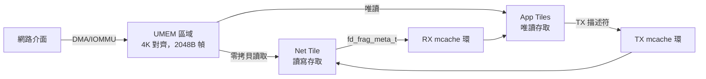
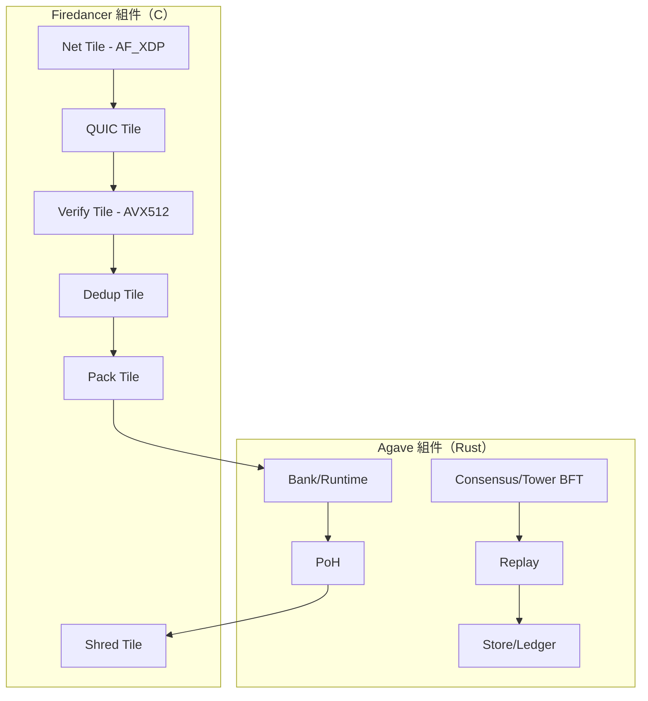
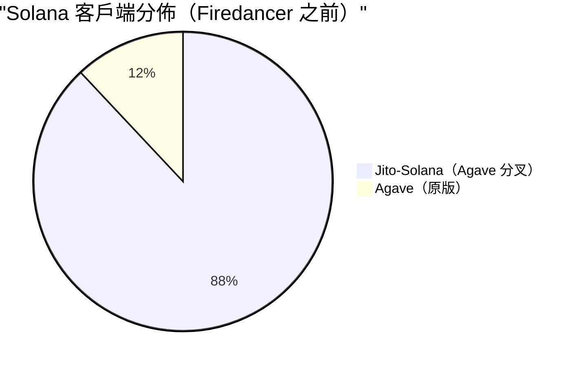
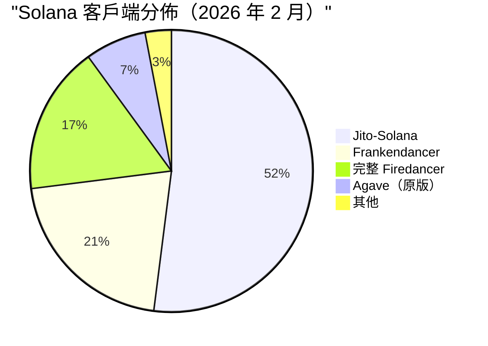

# Solana Firedancer：重寫規則的高性能驗證器客戶端

## Firedancer 是什麼

Firedancer 是 Solana 區塊鏈驗證器客戶端的完全獨立重新實現，使用 C/C++ 從零編寫，由 Jump Crypto（現 Jump Trading）與 Solana 基金會合作開發。於 2022 年 Solana Breakpoint 大會宣佈，它是 Solana 第一個真正獨立的驗證器客戶端——與原始 Rust 客戶端零代碼共享。

**核心論點**：Jump Trading 數十年建構奈秒級延遲高頻交易系統的經驗，應用於區塊鏈驗證器軟體，可以從現有驗證器運行的同一商用硬體中提取數量級更高的性能。

**關鍵事實**：

| 屬性 | 詳情 |
|------|------|
| 語言 | C/C++（對比 Agave 的 Rust） |
| 開發者 | Jump Trading（Kevin Bowers，首席科學官） |
| 宣佈時間 | 2022 年 11 月（Breakpoint） |
| Frankendancer 主網 | 2024 年 9 月 |
| 完整 Firedancer 主網 | 2025 年 12 月（Breakpoint 阿布達比） |
| 實驗室 TPS 演示 | 120 萬原始 TPS，去重後 60 萬 |
| 當前質押（2026 年 2 月） | ~16.87%（91 個驗證器，wenfiredancer.com 數據） |
| 許可證 | Apache 2.0 |
| GitHub | github.com/firedancer-io/firedancer |

### 為什麼要建構它

三個問題迫使 Firedancer 誕生：

1. **客戶端單一文化風險**：多年來 90%+ 的 Solana 質押運行在同一代碼庫上（Solana Labs/Agave）。一個 bug 就能癱瘓整個網路——而且確實發生了，2021-2024 年間發生了 8 次。

2. **軟體瓶頸隱藏了硬體容量**：Kevin Bowers 認為現代程式語言和 OS 抽象「刻意向你隱藏了局部性和數據流」，留下了巨大的未開發硬體容量。現有 Rust 客戶端在遠未達到硬體極限時就碰到了軟體壁壘。

3. **可信度差距**：Solana「最快區塊鏈」的敘事需要工程證明，而不是行銷口號。Jump 主動提供了這個證明。

## 技術架構：Tile 模型

Firedancer 的架構與 Agave 的單體單進程設計根本不同。它作為一組**獨立的 Linux 進程（稱為 tiles）**運行，每個進程固定在專用 CPU 核心上，通過共享記憶體通信。

### 設計哲學

Kevin Bowers 的核心洞察來自 HFT：「一切都受限於光速，如果你真的想優化，一切都圍繞數據流。」這意味著：

- **零線程競爭** —— 每個 tile 擁有自己的核心，無鎖
- **零動態記憶體分配** —— 一切在啟動時預分配
- **NUMA 感知放置** —— 記憶體分配在與處理核心相同的節點上
- **快取行優化** —— 數據結構大小針對 L1/L2/L3 局部性設計
- **大頁面** —— 減少 TLB 未命中和頁表開銷

CPU 被視為 32+ 個邏輯「電腦」組成的分散式網路，每個執行單一功能，通過超快共享記憶體通道傳遞數據。

### Tile 類型與交易管線

Firedancer 定義了 11 種 tile 類型，形成線性管線：

```
net → quic → verify → dedup → pack → bank → poh → shred → store
                                                          ↑
                                                        sign
```

| Tile | 功能 | 可並行化 |
|------|------|----------|
| **net** | 通過 AF_XDP 從 NIC 發送/接收封包 | 是 |
| **quic** | QUIC 協議處理、連接管理、TLS | 是 |
| **verify** | Ed25519 簽名驗證（AVX512） | 是 |
| **dedup** | 過濾重複交易 | 否 |
| **pack** | 將交易排程到區塊中（僅 leader） | 否 |
| **bank** | 對帳戶狀態執行交易 | 是 |
| **poh** | 歷史證明哈希鏈混合 | 否 |
| **shred** | 通過 Turbine 分發/接收區塊碎片 | 是 |
| **store** | 將區塊持久化到磁碟 | 否 |
| **sign** | 持有驗證器私鑰，響應簽名請求 | 否 |
| **replay** | 重放其他 leader 的區塊 | 否 |

只有 net、quic、verify、bank 和 shred 的 tile 數量可配置——其餘設計上是單例。

### Tile 間通信（IPC）

Tile 通過 **tango** 通信——Jump 自定義的共享記憶體消息佇列系統，經過十多年 HFT 基礎設施的打磨：

- **共享記憶體通道**：預定義的記憶體區域映射到特定 tile 的地址空間
- **零拷貝語義**：封包從 NIC 到應用 tile 無需軟體拷貝
- **唯讀強制**：RX mcache 以唯讀方式映射到 app tile，防止損壞
- **片段描述符**（`fd_frag_meta_t`）：24 字節輕量描述符編碼序列號、netmux 簽名、chunk 偏移、大小和控制位
- **無鎖、無系統調用**：純用戶空間輪詢，確定性延遲

拓撲結構使用 N 個 net tile x M 種 app tile x K 個實例，創建 N*M 個 mcache RX 鏈接。同一 tile 類型的多個實例基於負載均衡哈希輪流消費共享 mcache。

### 網路：AF_XDP 與核心旁路

所有 Firedancer 版本使用 Linux **AF_XDP**（Address Family XDP）API，完全繞過核心網路堆疊：



**XDP 運作模式**：
- **`drv` 模式**：在核心緩衝區分配之前的驅動級處理（高性能，NIC 依賴）
- **`skb` 模式**：退回到 `struct sk_buff` 處理（通用支持，較慢）

使用 `XDP_FLAGS_DRV_MODE` + `XDP_ZEROCOPY`，PCIe 網路設備直接將入站乙太網封包寫入 DRAM，無任何軟體拷貝。UMEM 區域在 net tile（讀寫）、Linux 核心（讀寫）、PCIe 設備（通過 IOMMU 讀寫）和 app tile（唯讀）之間共享。

**性能**：4 個 CPU 核心可靠地接收 21.8 Gbps 的入站交易（約 108 萬 TPS，約 1KB 交易），飽和標準 25 Gbps NIC。

Net tile 事件循環以約 20K 次/秒的頻率喚醒核心進行批量 RX/TX 操作，使用忙碌輪詢實現確定性延遲。

### QUIC 實現（fd_quic）

Firedancer 完全從零開始用 C11 實現了 QUIC 傳輸協議——這是一項巨大的工程投資，覆蓋了 151 頁的 RFC 9000 規範。沒有現存的 C QUIC 庫能滿足 Jump 在許可證、性能和可靠性方面的要求。

**關鍵設計選擇**：
- 防止記憶體耗盡的優化數據結構
- 連接處理期間最小化動態分配
- 用於 DDoS 防護的流量控制
- 接收端縮放（RSS）用於硬體加速的跨核心負載分配
- 自定義 TLS 實現（fd_tls）——無 OpenSSL 依賴

4 個 CPU 核心上的 QUIC 伺服器處理 108 萬 TPS，流量 21.8 Gbps。

### 簽名驗證：Ed25519 與 AVX512

Firedancer 的密碼學引擎是 HFT 專業知識最明顯的體現。

**基於 CPU 的驗證**：
- 自定義 AVX512 Ed25519 實現，使用單個 AVX-512 暫存器中的 6-long-limb radix-2^43 表示
- 使用 `_mm512_madd52{lo,hi}_epu64` 內部函數進行並行化列求和運算
- **比純量快 4 倍**，**比 AVX2 快 2 倍**：34.2 微秒 vs 154.4 微秒（純量）
- 每核心每秒約 30,000 次簽名驗證
- 通過大規模數據並行化實現 100% 向量通道利用率

**基於 FPGA 的驗證**（可選加速）：
- 8 個 FPGA 上 **800 萬次簽名/秒**，總功耗約 400W
- 每筆交易約 200 微秒延遲（對比 GPU 批處理約 10ms）
- 流式逐筆交易處理（無需批處理）
- 純 RTL 管線中實現 SHA-512，配合自定義 ECC-CPU
- 使用 AWS 加速器形式因子實現雲端相容
- 在 7 年前的 FPGA 硬體上實現 800 萬 TPS

### Reed-Solomon 糾刪編碼

Firedancer 用於 Turbine 區塊傳播的糾刪編碼使用 O(n log n) 算法（2016 年論文）進行矩陣乘法：

| 指標 | Firedancer | rust-rse（Agave） | 加速比 |
|------|-----------|-------------------|--------|
| RS 編碼 | ~120 Gbps/核心 | ~8 Gbps/核心 | **15x** |
| RS 解碼 | ~50 Gbps/核心 | ~8 Gbps/核心 | **6x** |

使用優化的拉格朗日多項式構造，實現比傳統方法快 14 倍的編碼。這直接改善了 Turbine 碎片分發：無 Merkle 樹時快約 22%，有 Merkle 樹時快近 2 倍。

## Frankendancer vs 完整 Firedancer

部署遵循分階段策略：

### Frankendancer（混合型）



- Firedancer 的高性能網路 + Agave 經過驗證的運行時和共識
- **2024 年 9 月**在主網上線
- 讓驗證器以較低風險獲得性能提升
- 截至 2025 年 10 月：207 個驗證器，約 20.9% 的質押 SOL
- 從 2025 年 6 月的 8% 增長

### 完整 Firedancer（獨立型）

- 零 Agave 依賴——完全 C/C++ 堆疊
- **2025 年 12 月**在阿布達比 Breakpoint 大會上線主網
- 此前已在少數驗證器上運行 100 天，產生 50,000+ 個區塊
- 截至 2026 年 2 月 21 日：91 個驗證器，約 16.87% 質押（wenfiredancer.com 數據）
- 包括 Frankendancer 變體在內接近主網質押的 30%（2026 年 2 月驗證器討論數據）

**關鍵區別**：Frankendancer 共享 Agave 的運行時 bug。完整 Firedancer 不會——Agave 的記憶體管理 bug 不會影響 Firedancer 驗證器，反之亦然。這才是真正重要的客戶端多樣性。

## 性能基準

### 實驗室結果

| 測試 | 結果 | 硬體 |
|------|------|------|
| 封包接收 | 108 萬 TPS（21.8 Gbps） | 4 個 CPU 核心 |
| 現場演示（Breakpoint 2022） | 120 萬原始 TPS，去重後 60 萬 | AMD EPYC |
| Ed25519 驗證（CPU） | 30K 簽名/秒/核心 | AVX512 |
| Ed25519 驗證（FPGA） | 800 萬簽名/秒總計 | 8 個 FPGA，400W |
| Reed-Solomon 編碼 | ~120 Gbps/核心 | 單核心 |
| 碎片創建 | 快約 22%（無 Merkle），快約 2x（有 Merkle） | 對比 Agave |
| 網路出站 | 6 Gbps/tile | 標準硬體 |

### 真實生產數據

| 指標 | 結果 |
|------|------|
| Agave 實驗室匹配 | 110 萬 TPS（單節點合成） |
| 協議共識限制 | ~81,000 TPS（當前 Solana 協議） |
| 未優化基準 | ~63,000 TPS（AMD EPYC 7513，32 核心） |
| 優化基準 | 89K-308K TPS（各種配置） |
| 區塊最終性（當前） | ~400ms |
| 區塊最終性（Alpenglow 目標） | ~150ms（從 12.8s 完全最終性提升 80 倍） |

**關鍵背景**：100 萬+ TPS 數字是**硬體容量演示**，不是協議吞吐量。Solana 的共識協議目前將實際吞吐量限制在約 81K TPS。Firedancer 證明了硬體不是瓶頸——協議才是。

### Figment 的生產經驗

主要質押提供商 Figment 將旗艦 Solana 驗證器遷移到 Firedancer 並報告：

- 對比 Agave 驗證器**質押獎勵高 18-28 個基點**
- 收益主要來自更好的 MEV 捕獲和更高效的交易處理
- 99.8% 投票有效率
- 1.02 slot 投票延遲
- 0.55% 跳過率
- 與 DoubleZero（低延遲網路）結合時未投票信用減少 15%

## 安全架構

### 縱深防禦

Firedancer 的 tile 架構提供固有的安全隔離：

1. **進程隔離**：每個 tile 作為獨立 Linux 進程運行——一個 tile 中的漏洞不會危及其他 tile
2. **記憶體隔離**：tile 只能存取所需的特定共享記憶體區域
3. **Linux 命名空間**：每個 tile 的文件系統、網路和進程可見性受限
4. **seccomp-BPF 過濾**：核心級系統調用過濾限制每個 tile 的操作
5. **能力丟棄**：tile 在啟動時丟棄不必要的 Linux 能力
6. **唯讀強制**：RX mcache 對 app tile 唯讀映射；TX mcache 對 net tile 唯讀映射

這反映了瀏覽器安全架構——沙箱化的渲染進程無法逃逸來危害系統。

### 形式化驗證與審計

**Neodyme v0.1 審計**（2024 年）：
- 初始版本的完整安全審計
- 報告發布在 github.com/firedancer-io/audits

**Neodyme v0.4 審計**（2025 年 2-3 月）：
- 5 位資深安全研究員，限時參與
- **未發現遠端代碼執行（RCE）漏洞**（與 v0.1 一致）
- 大多數發現：QUIC 網路堆疊中的 DoS 場景
- 一個高嚴重性問題：非直覺的 Agave 功能啟動交互
- 所有發現已被 Firedancer 開發團隊處理，Neodyme 驗證了修復的正確性和完整性

### 漏洞賞金計劃

- **平台**：Immunefi
- **啟動**：2024 年 9 月 18 日（持續中）
- **最高支付**：500,000 美元（關鍵區塊鏈/DLT）
- **競爭性審計**（2024 年 7-8 月）：42 天活動，最高 100 萬美元獎勵
- **最近更新**：2026 年 1 月 28 日

| 嚴重性 | 獎勵範圍 |
|--------|----------|
| 關鍵 | $100,000 - $500,000 |
| 高 | $50,000 - $100,000 |
| 中 | $5,000 - $50,000 |
| 低 | $5,000 |

### 持續安全基礎設施

- **OSS-Fuzz + ClusterFuzzer**：自動模糊測試不受信任的輸入組件（P2P 解析器、SBPF VM）
- **內部代碼審查**：專注高風險/高影響組件
- **壓力測試**：測試網路承受節點複製、鏈路故障、封包洪水、共識違規
- **外部安全審查**：上線前後的審計

### 已知漏洞披露

**QUIC 傳輸參數 UB + 共識分裂轉換 Bug**（2025 年 2 月）：

`fd_quic_apply_peer_params`（src/waltz/quic/fd_quic.c）中的三個 QUIC bug：

1. **A1 - 有符號整數溢出**（第 2713 行）：將無符號 QUIC VARINT 轉換為有符號 long 後乘以 1e6，當值 >9.22e12 時溢出，導致立即連接終止
2. **A2 - 無效位移指數**（第 2724 行）：未驗證 `peer_ack_delay_exponent`（RFC 9000 限制 <=20），位移 >=64 產生 UB，損壞丟失檢測和 RTT 估算
3. **A3 - 無符號乘法溢出**（第 2730 行）：`max_ack_delay` 乘以 1000 未驗證，大值回繞並禁用封包重傳

加上一個**共識分裂 bug**（fd_cast.h）：
- `fd_rust_cast_double_to_ulong(-INFINITY)` 返回 `ULONG_MAX` 而非 `0`（Rust 返回 0）
- 影響租金豁免計算、質押預熱/冷卻和租金計算路徑
- 當前風險：低（調用點使用非負中間值），但有未來共識分裂的潛在風險

**時間線**：2025 年 2 月 7 日發現。Immunefi 提交失敗（身份驗證）。2025 年 2 月 10 日通過 seclists.org 完全公開披露。

## 當前狀態（2026 年 2 月）

### 部署

| 客戶端 | 驗證器數 | 質押 % | 備註 |
|--------|----------|--------|------|
| Jito-Solana（Agave 分叉） | ~550+ | ~72% | 主導，MEV 優化 |
| Frankendancer | ~200+ | ~20.9% | 混合型，穩定 |
| 完整 Firedancer | 91 | ~16.87% | 獨立，增長中 |
| Agave（原版） | ~50+ | ~7% | 下降中 |

**Firedancer 組合變體接近主網質押的 30%**（2026 年 2 月驗證器討論數據）。

### 版本方案

Frankendancer 發布使用版本格式 `v0.8xx.xxxxx`，其中：
- 每個新版本次版本號增加 100
- 修補號編碼配對的 Agave 驗證器版本
- 當前版本：0.811.30108（78% 的 Firedancer 驗證器），0.812.30108（13.2%）

### 硬體要求

| 組件 | 最低 | 推薦 |
|------|------|------|
| CPU | 12 核 @ >2.5 GHz | 32 核 @ >3 GHz，支持 AVX512 |
| 記憶體 | 64 GB | 128 GB ECC |
| 儲存 | 512 GB SSD | 1 TB NVMe + 獨立 OS 磁碟 |
| 網路 | 300 Mbps | 1 Gbps |

推薦 CPU 規格（AVX512）對 Ed25519 驗證性能有顯著影響。

### 路線圖：Alpenglow 整合

Alpenglow（SIMD-0326）是 Solana 最大的協議升級，用新的 Votor/Rotor 共識機制取代歷史證明和 Tower BFT：

- **98.27% 驗證器批准**（2025 年 9 月治理投票）
- **測試網**：2026 年 Q1
- **主網**：2026 年 Q2（預計）
- **最終性目標**：150ms（對比當前 12.8 秒完全最終性——80 倍改進）
  - 80%+ 驗證器響應：單輪最終性約 100ms
  - 60%+ 驗證器響應：兩輪最終性約 150ms

Firedancer 需要實現 Alpenglow 共識，取代當前的 Tower BFT + PoH 實現。這是一項重大開發工作。

## 對 Solana 生態的影響

### 客戶端多樣性進展

Firedancer 之前，Solana 有危險的單一客戶端架構：





**進展是真實的但不完整**。以太坊的安全閾值要求沒有單一客戶端超過 33%——Jito-Solana 仍以約 52-72% 主導（取決於計算方式）。然而，Firedancer 組合變體約 30% 代表了第一次真正的多樣性。

### 超級多數安全論點

批評者（特別是 CryptoSlate）認為 Solana 正在「違反以太坊視為不可協商的安全規則」：

- 控制超過 2/3 質押的客戶端可以單方面確認不正確的區塊
- 控制超過 1/3 的客戶端可以阻止最終性
- 僅 Jito-Solana 就超過了兩個閾值
- **反論**：Jito-Solana 是 Agave 分叉，不是獨立客戶端。真正的多樣性是 Agave 衍生客戶端（Jito + 原版 Agave）與 Firedancer 之間

### 機構採用催化劑

Firedancer 直接解決機構關切：

1. **運行時間韌性**：獨立代碼庫意味著一個客戶端的 bug 不會癱瘓網路
2. **性能可信度**：在商用硬體上演示 100 萬+ TPS
3. **工程血統**：Jump Trading 在金融基礎設施方面的聲譽增加可信度
4. **驗證器經濟**：Figment 報告高 18-28 個基點的獎勵，為遷移創造經濟激勵

## 對比：Firedancer vs Agave vs Jito-Solana

| 維度 | Firedancer | Agave（Anza） | Jito-Solana |
|------|-----------|-------------|-------------|
| 語言 | C/C++ | Rust | Rust（Agave 分叉） |
| 架構 | 基於 Tile 的多進程 | 單體單進程 | 單體單進程 + 3 個額外階段 |
| 網路 | AF_XDP 核心旁路 | 標準 Linux socket | 標準 Linux socket |
| QUIC | fd_quic（自定義 C11） | quinn（Rust 庫） | quinn（繼承） |
| 簽名驗證 | 自定義 AVX512 + 可選 FPGA | 標準 Rust 密碼學 | 標準 Rust 密碼學（繼承） |
| IPC | 共享記憶體（tango） | 基於線程 | 基於線程 |
| 記憶體模型 | 預分配，NUMA 感知 | 動態分配 | 動態分配（繼承） |
| MEV 支持 | 未內建（BAM 整合進行中） | 無 | Block Engine、bundles、tips |
| 主網質押 | ~17% | ~7% | ~72% |
| 獨特價值 | 原始性能 + 安全隔離 | 原始參考實現 | MEV 獎勵 + 優先費用 |
| 風險 | 較新，戰鬥測試較少 | 老化的架構 | 單一文化 + 中心化 |
| 新增 MEV 階段 | 無 | 無 | RelayerStage、BlockEngineStage、BundleStage |

**關鍵洞察**：Jito-Solana **不是**獨立客戶端——它是 Agave 的分叉，增加了 3 個用於 MEV 的管線階段。Agave 核心的 bug 也會影響 Jito-Solana。只有 Firedancer 提供真正的代碼庫多樣性。

開放問題是 Firedancer + MEV 整合。Jito 的 Block Assembly Marketplace（BAM）與 Firedancer 的整合正在進行中但尚未完成。在此之前，運行 Firedancer 的驗證器可能比 Jito-Solana 驗證器收益更低，因為錯過了 MEV 小費（約 13-15% 的獎勵差異）。

## 關鍵技術創新

### 1. HFT 架構應用於區塊鏈

Firedancer 本質上是一個被重新用於區塊生產的 HFT 交易系統。Tango 消息佇列、固定核心 tile、零拷貝網路和 NUMA 感知分配在奈秒級延遲交易基礎設施中都是標準配置，但在區塊鏈中前所未有。

### 2. 進程級安全隔離

與單體驗證器中 QUIC bug = 完全淪陷不同，Firedancer 的 tile 隔離意味著被利用的 QUIC tile 無法存取 bank 狀態、簽名金鑰或共識邏輯。這是瀏覽器級安全應用於驗證器設計。

### 3. 硬體優先設計哲學

Bowers 的原則：為硬體而設計，而非為抽象而設計。Firedancer 達到了「網路性能的硬體極限」——實現了標準驗證器硬體可能的最大吞吐量。瓶頸可證明地在 Solana 協議中，而不在軟體中。

### 4. 協議文檔化作為副產品

Firedancer 的明確目標：「記錄和標準化 Solana 協議——最終，一個人應該能夠僅通過查看文檔而不是 Rust 驗證器代碼來創建 Solana 驗證器。」在 Firedancer 之前，Solana 協議由其實現定義，而非規範。

### 5. Tile 架構作為升級機制

單個 tile 可以在不停機的情況下重啟——共享記憶體對象在 tile 重啟之間持續存在。這使得秒級的動態升級成為可能，對比 Agave 需要完全關閉和重啟。

## 可複用模式

1. **Tile 架構實現隔離**：任何處理不受信任輸入的系統都受益於進程級隔離配合共享記憶體 IPC。每個「tile」有單一職責、最小攻擊面，可以獨立重啟。

2. **AF_XDP 用於網路密集型服務**：核心旁路網路不僅適用於區塊鏈——任何處理 >1Gbps 流量的服務都受益於 AF_XDP 配合零拷貝 UMEM。

3. **一切預分配**：動態分配是延遲稅。在啟動時預分配所有記憶體，使用基於池的分配模式，讓分配器在運行時什麼都不做。

4. **NUMA 感知數據放置**：在多插槽伺服器上，數據局部性比算法優化更重要。在與處理核心相同的 NUMA 節點上分配。

5. **硬體優先設計**：在優化算法之前，了解硬體的實際瓶頸。Firedancer 證明了「廣泛可用的社群硬體可以擁有超過 100 萬交易/秒的容量」——軟體一直是瓶頸。

6. **通過混合架構分階段部署**：Frankendancer 證明你可以增量交付高風險基礎設施。先替換網路層（低風險），獲得採用，然後替換運行時/共識（高風險）。

7. **自定義密碼學實現**：當密碼學操作是瓶頸時，通用庫會在桌上留下 2-4 倍的性能。AVX512 專用的 Ed25519 驗證展示了指令級優化的可能性。

## References

- [Firedancer 官方文檔](https://docs.firedancer.io/)
- [Firedancer GitHub 倉庫](https://github.com/firedancer-io/firedancer)
- [Jump Crypto - Firedancer](https://jumpcrypto.com/firedancer/)
- [Helius - 什麼是 Firedancer？深入了解 Solana 2.0](https://www.helius.dev/blog/what-is-firedancer)
- [Blockdaemon - Solana Firedancer 驗證器客戶端深度分析](https://www.blockdaemon.com/blog/solanas-firedancer-validator-client-deep-dive)
- [The Block - Jump Crypto 的 Firedancer 登陸 Solana 主網](https://www.theblock.co/post/382411/jump-cryptos-firedancer-hits-solana-mainnet-as-the-network-aims-to-unlock-1-million-tps)
- [Unchained - Jump Crypto 的 Firedancer 在 Solana 主網上線](https://unchainedcrypto.com/jump-cryptos-firedancer-goes-live-on-solana-mainnet/)
- [CryptoSlate - Firedancer 上線了，但 Solana 正在違反以太坊視為不可協商的安全規則](https://cryptoslate.com/firedancer-is-live-but-solana-is-violating-the-one-safety-rule-ethereum-treats-as-non-negotiable/)
- [Firedancer Net Tile 文檔](https://docs.firedancer.io/guide/internals/net_tile.html)
- [Deep RnD - Firedancer Solana 客戶端技術概覽](https://deeprnd.medium.com/firedancer-solana-client-technical-overview-e528d449e4ec)
- [Deep RnD - 深入 QUIC：驅動 Firedancer 的傳輸協議](https://deeprnd.medium.com/deep-dive-into-quic-the-transport-protocol-powering-solanas-firedancer-7d9e28f37ba8)
- [Solana 論壇 - Firedancer 中的 QUIC-TLS (fd_tls)](https://forum.solana.com/t/quic-tls-in-firedancer-fd-tls/326)
- [GitHub PR #716 - AVX512 加速的 ED25519 和 X25519 實現](https://github.com/firedancer-io/firedancer/pull/716)
- [Firedancer v0.4 安全審計（Neodyme AG）](https://neodyme.io/reports/Firedancer-v0.4.pdf)
- [Immunefi - Firedancer 漏洞賞金](https://immunefi.com/bug-bounty/firedancer/information/)
- [Immunefi - Firedancer v0.1 審計競賽](https://immunefi.com/audit-competition/firedancer-boost/scope/)
- [完整披露 - Firedancer QUIC 傳輸參數 UB 和共識分裂轉換 Bug](http://www.mail-archive.com/fulldisclosure@seclists.org/msg09274.html)
- [Kevin Bowers - Firedancer（Validated 播客）](https://solanacompass.com/learn/Validated/firedancer-w-kevin-bowers)
- [Kevin Bowers - 重新思考高性能計算（Validated 播客）](https://solana.com/validated/episodes/rethinking-high-performance-computing-with-kevin-f-bowers-l3znswiz)
- [The Block - Jump Crypto 的 Firedancer 項目旨在為 HFT 優化 Solana](https://www.theblock.co/post/204495/jump-crypto-firedancer-project-optimize-solana-hft)
- [Cherry Servers - 什麼是 Solana Firedancer（驗證器指南）](https://www.cherryservers.com/blog/solana-firedancer)
- [Figment - 遷移到 Firedancer](https://www.figment.io/insights/figments-migration-to-firedancer-unlocking-next-generation-solana-validator-performance/)
- [Figment - Firedancer：Solana 網路性能的新時代](https://www.figment.io/insights/firedancer-a-new-era-for-solanas-network-performance/)
- [Wen Firedancer? - Solana 客戶端採用追蹤器](https://www.wenfiredancer.com/)
- [Solana Compass - Firedancer 項目概覽](https://solanacompass.com/projects/firedancer)
- [QuickNode - Alpenglow 共識：Solana 最大的協議升級](https://blog.quicknode.com/solana-alpenglow-upgrade/)
- [Solana - Breakpoint 2025：國家、資本與代碼的交匯](https://solana.com/news/solana-breakpoint-2025)
- [Bankless - Solana 的 Firedancer 客戶端終於上線](https://www.bankless.com/read/news/solanas-firedancer-client-finally-goes-live)
- [Backpack - 什麼是 Firedancer 以及它為什麼對 Solana 重要](https://learn.backpack.exchange/articles/what-is-firedancer)
- [Phantom - Solana 上的 Firedancer 是什麼？](https://phantom.com/learn/crypto-101/firedancer)
- [Chainflow - Solana 驗證器討論摘要，2026 年 2 月 6-13 日](https://chainflowsol.substack.com/p/summary-of-solana-validator-discussions-3c4)
- [Firedancer 性能調優指南](https://docs.firedancer.io/guide/tuning.html)
- [Firedancer 配置指南](https://docs.firedancer.io/guide/configuring.html)
- [Solana Breakpoint - Kevin Bowers Firedancer 演示（120 萬 TPS）](https://x.com/SolanaConf/status/1589255025288949761)
