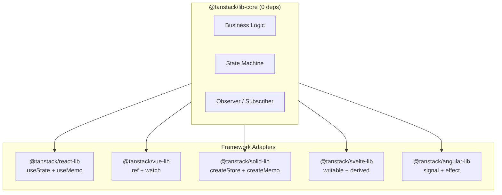
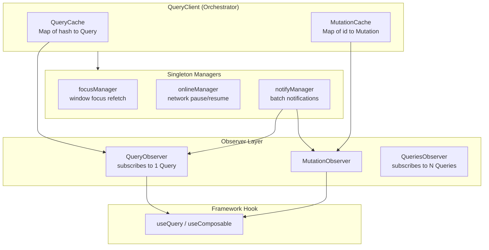
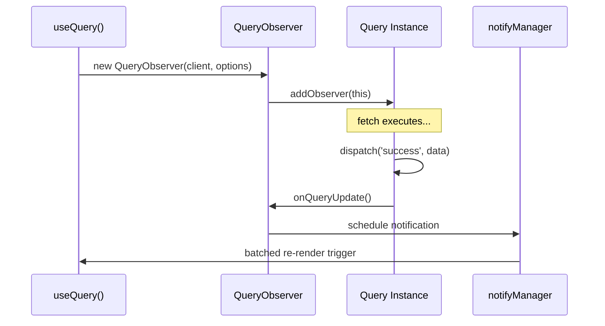
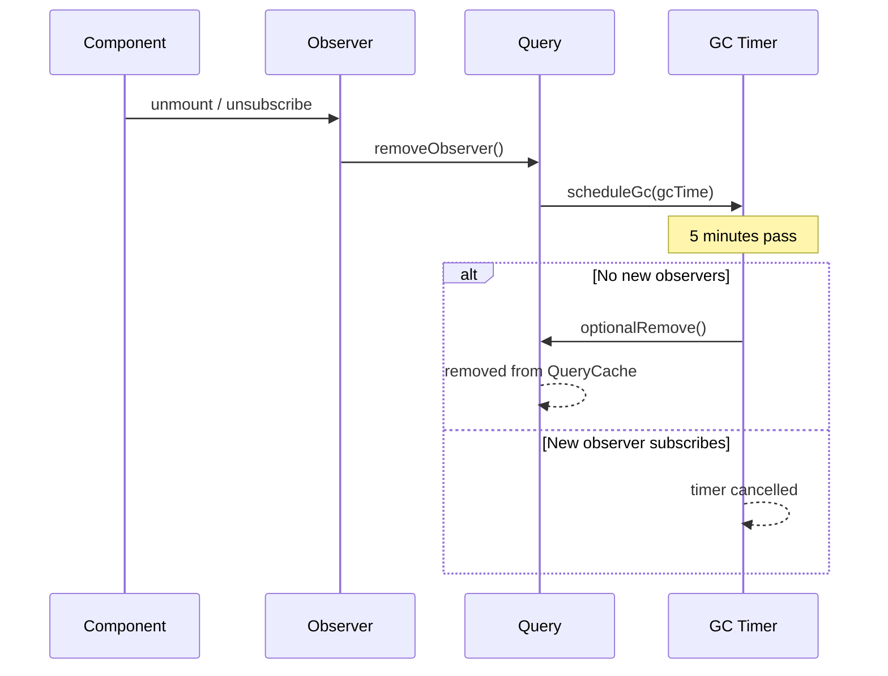
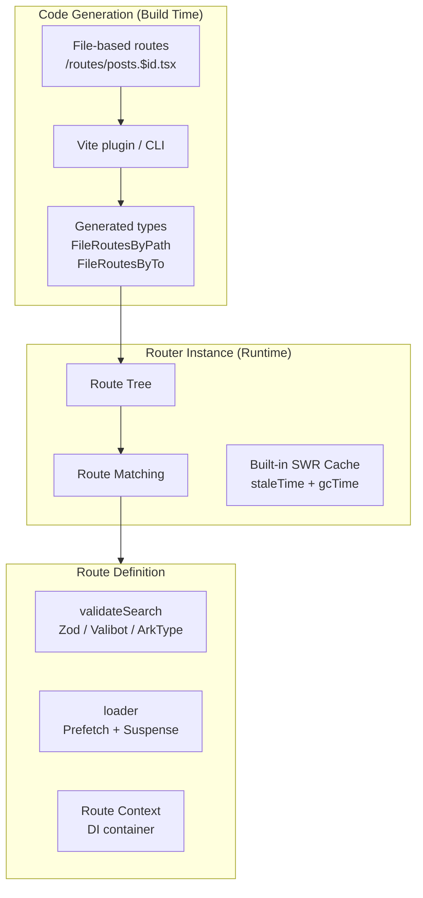
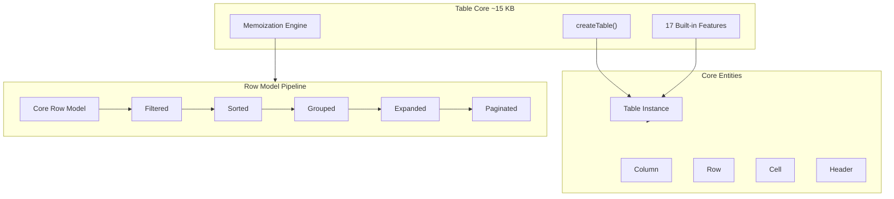
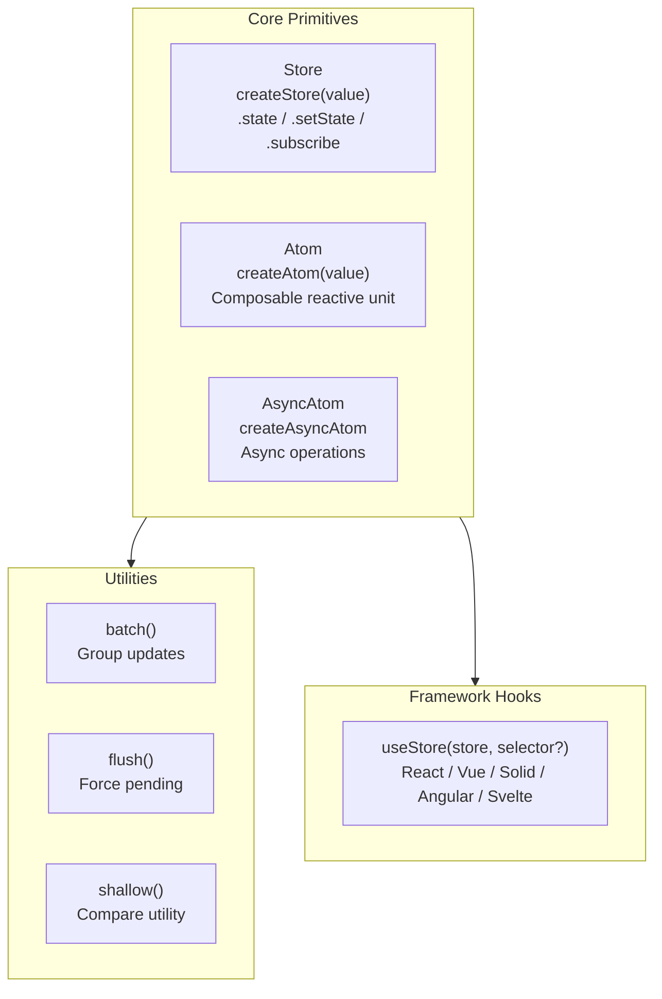

# TanStack Core Architecture — Framework-Agnostic Adapter Pattern, Query, Router, Table, Store Internals

## What They Built

TanStack is a collection of framework-agnostic, type-safe open-source libraries for web development. Every library follows the same architectural pattern: a pure JavaScript/TypeScript core with thin framework adapters for React, Vue, Solid, Svelte, Angular, Qwik, and Lit.

The key insight: TanStack treats framework integration as a **plugin concern**, not a core concern. The business logic never depends on React hooks, Vue reactivity, or Angular signals. Framework adapters are 2-5 KB wrappers that translate core state changes into framework-native reactive updates.

This document covers the **internal architecture** of each core library: how the adapter pattern works, the observer/subscriber model, state machines, cache strategies, type safety mechanisms, and the design decisions behind them.

---

## 1. Framework-Agnostic Adapter Pattern

### The Layered Architecture

Every TanStack library follows this structure:



### How Adapters Work (Table as Example)

**Step 1: Core creates a framework-agnostic instance**

```ts
// @tanstack/table-core - zero framework dependencies
const table = createTable({
  data,
  columns,
  state: { sorting, pagination },
  onStateChange: (updater) => { /* bridge to framework */ },
})
```

**Step 2: Framework adapter wraps with native reactivity**

```ts
// React adapter
function useReactTable(options) {
  const [state, setState] = useState(options.initialState)
  const table = useMemo(() => createTable({
    ...options,
    state,
    onStateChange: setState,  // Bridge: core -> React
  }), [state, options])
  return table
}

// Vue adapter
function useVueTable(options) {
  const state = ref(options.initialState)
  const table = createTable({
    ...options,
    get state() { return state.value },
    onStateChange: (v) => { state.value = v },
  })
  watch(() => options, () => table.setOptions(options))
  return table
}

// Solid adapter
function createSolidTable(options) {
  const [state, setState] = createStore(options.initialState)
  return createTable({
    ...options,
    state,
    onStateChange: setState,
  })
}
```

### The State Bridge Contract

Every adapter fulfills exactly two obligations:

1. **Core-to-Framework**: When the core calls `onStateChange(updater)`, the adapter pushes the new state into the framework's reactivity system
2. **Framework-to-Core**: When the framework re-renders, the adapter passes current state back via the `state` option or getter functions

This is why Table's core can be ~15 KB while supporting 7 frameworks. The adapter overhead is minimal because each framework already has its own reactivity primitive.

### Framework-Specific Adapter Details

| Framework | State Primitive | Reactive Tracking | Rendering Utility |
|-----------|----------------|-------------------|-------------------|
| React | `useState()` + `useMemo()` | Manual (deps arrays) | `flexRender()` via `createElement` |
| Vue | `ref()` + `watch()` | Automatic (Proxy-based) | `FlexRender` component via `h()` |
| Solid | `createStore()` + `createMemo()` | Automatic (fine-grained signals) | `flexRender()` direct function calls |
| Svelte | `writable()` + `derived()` | Automatic (`$:` reactivity) | `flexRender()` component instantiation |
| Angular | `signal()` + `effect()` | Automatic (Angular 17+ signals) | Template directives |
| Qwik | `useStore()` + `useTask$()` | Resumable reactivity | N/A |
| Lit | Reactive properties | `requestUpdate()` | Web Component lifecycle |

### Why Runtime Adapters Over Alternatives

| Approach | Example | Tradeoff |
|----------|---------|----------|
| **Framework-specific** | SWR (React only) | Maximum DX for one framework, zero portability |
| **Compile-time adapters** | Svelte stores | Great perf, but forces transpilation step |
| **Runtime adapters (TanStack)** | Observer + callbacks | Works everywhere, tiny adapter cost, slight indirection |
| **Web Components** | Lit-based libs | Browser-native, but poor React integration |

TanStack chose runtime adapters because the cost is nearly zero (2-5 KB per adapter), the core logic is testable without any framework, and one bug fix propagates everywhere.

---

## 2. TanStack Query Internals

### Core Architecture



### QueryClient & QueryCache

The `QueryClient` is the central coordinator holding two separate caches:

**QueryCache**: Stores `Query` instances indexed by deterministic hash. Keys are serialized with consistent object key sorting: `['todos', { status: 'active' }]` always hashes to `'["todos",{"status":"active"}]'` regardless of property declaration order. This deterministic hashing prevents subtle cache-miss bugs.

**MutationCache**: Stores `Mutation` instances for write operations. Mutations don't auto-refetch and support optimistic updates through `onMutate` callbacks with rollback capability on failure.

### Three Singleton Managers

The client subscribes to three global managers on `mount()`:

**focusManager**: Tracks `visibilitychange` events (v5 dropped `focus` event to fix unnecessary refetch bugs). When the window regains visibility, queries with `refetchOnWindowFocus: true` trigger background refetch.

**onlineManager**: Monitors `online`/`offline` events. Three network modes determine behavior: `'online'` (only fetch with connectivity), `'always'` (fetch regardless), `'offlineFirst'` (attempt fetch, continue if offline -- used with persistence).

**notifyManager**: Batches synchronous state updates using microtask scheduling. When N queries update in the same event loop tick, `notifyManager.batch()` ensures observers receive a single notification. This prevents N re-renders.

### Query State Machine

Each `Query` tracks two independent dimensions:

| Dimension | Values | Purpose |
|-----------|--------|---------|
| `status` | `'pending' \| 'success' \| 'error'` | Does data exist? |
| `fetchStatus` | `'idle' \| 'fetching' \| 'paused'` | Is a fetch in progress? |

This dual-axis model is a critical design decision. A query can be `status: 'success'` AND `fetchStatus: 'fetching'` simultaneously -- showing stale data while background refetching. In v4, `isLoading` conflated these two concerns. v5 split them: `isPending` = no data yet, `isLoading` = `isPending && isFetching`.

Full state properties:

| Property | Type | Purpose |
|----------|------|---------|
| `status` | `'pending' \| 'success' \| 'error'` | Data existence state |
| `fetchStatus` | `'idle' \| 'fetching' \| 'paused'` | Fetch operation state |
| `data` | `TData \| undefined` | Cached result |
| `error` | `TError \| null` | Last error |
| `dataUpdatedAt` | `number` | Timestamp of successful fetch |
| `isInvalidated` | `boolean` | Staleness marker |

State transitions use a reducer pattern via `Query#dispatch()`, ensuring atomic updates.

### Observer Pattern (The Framework Bridge)



1. Framework hook creates `new QueryObserver(client, options)`
2. Observer calls `Query#addObserver(this)` to register
3. Query function resolves, `Query#dispatch('success', data)` fires
4. Query iterates all registered observers, calling `observer.onQueryUpdate()`
5. notifyManager batches calls into a single microtask
6. Framework adapter converts notification into re-render

### Staleness & Freshness

Data freshness is determined by `staleTime` (default: 0, meaning always stale):

```
Query#isStale() checks in order:
1. Any observer explicitly marks it stale
2. data === undefined (always stale)
3. isInvalidated flag is set
4. Date.now() > dataUpdatedAt + staleTime
```

Fresh data renders from cache immediately with no network request. Stale data also renders from cache but triggers a background refetch. This is the "stale-while-revalidate" pattern.

### Garbage Collection

GC is controlled by `gcTime` (default: 5 minutes, renamed from `cacheTime` in v5):



The `Removable` abstract class provides core GC functionality that both `Query` and `Mutation` inherit. GC only starts when a query has **zero active observers**. If a component remounts within `gcTime`, cached data is reused instantly.

All cache data lives in JavaScript runtime memory (browser RAM). It does not persist across page reloads or browser closure.

### Cache Invalidation

```ts
queryClient.invalidateQueries({ queryKey: ['todos'] })
```

`partialMatchKey()` enables prefix-based matching: invalidating `['todos']` affects all queries starting with `['todos']` -- including `['todos', 1]`, `['todos', { status: 'done' }]`, etc. This hierarchical key design enables surgical invalidation.

### Option Resolution Hierarchy

Three-level option merging:

1. **Global Defaults**: Set via `QueryClient` constructor
2. **Query Defaults**: Applied via `setQueryDefaults(queryKey, options)`
3. **Per-Query Options**: Provided directly to hooks

Later levels override earlier ones. Observer-specific options like `select`, `placeholderData`, and `notifyOnChangeProps` extend base query options.

### Retryer Logic

The `Retryer` class handles exponential backoff retry:

- `retry`: boolean, number, or function determining retry count (default: 3 client, 0 server in v5)
- Pauses when offline if network mode is `'online'`
- Query function receives `signal` for AbortController-based cancellation

### v5 Key Changes

| Change | v4 | v5 | Why |
|--------|----|----|-----|
| Hook signature | Multiple overloads | Single object arg | Simpler types |
| Loading state | `isLoading` | `isPending` + `isLoading` | Separate data existence from fetch |
| Cache time | `cacheTime` | `gcTime` | Name reflects behavior |
| Previous data | `keepPreviousData` | Merged into `placeholderData` | Unified API |
| Server retry | Default 3 | Default 0 | Avoid retry storms |
| Callbacks | `onSuccess/onError` on useQuery | Removed from hooks | Moved to QueryClient only |
| Window focus | `focus` event | `visibilitychange` only | Fix unnecessary refetch |

### Comparison with Alternatives

| Feature | TanStack Query | SWR | RTK Query | Apollo Client |
|---------|---------------|-----|-----------|---------------|
| **Core model** | Framework-agnostic observer | React-only hooks | Redux middleware | GraphQL client |
| **Cache type** | Document (key-value) | Document | Document | Normalized |
| **Auto GC** | Yes (gcTime) | No | No | Yes |
| **Offline support** | Yes (network modes) | Limited | Limited | Yes (cache-first) |
| **Optimistic updates** | Manual (onMutate) | Manual | Auto (endpoints) | Auto (cache) |
| **Framework support** | 5 frameworks | React only | React (Redux) | React (+ Vue) |
| **Bundle size** | ~13 KB | ~4 KB | ~25 KB+ | ~33 KB |
| **API definition** | Ad-hoc (per-hook) | Ad-hoc | Central API slice | Schema-defined |

**RTK Query key difference**: Endpoints are defined centrally in an "API slice", enabling automatic invalidation via tag matching. TanStack Query uses ad-hoc hooks with manual invalidation -- more flexible, less automatic.

**Apollo key difference**: Normalized cache stores entities flat, automatically updating all references when an entity changes. Requires GraphQL schema. TanStack Query uses document cache (simpler, protocol-agnostic).

---

## 3. TanStack Router Internals

### Architecture



### Three-Layer Type Safety

**Layer 1: Module Augmentation (Register interface)**

```ts
declare module '@tanstack/react-router' {
  interface Register {
    router: typeof router
  }
}
```

The `Register` interface starts empty. Applications augment it with their router type. Type extractors use conditional types to access registered types:
- `RegisteredRouter<TRegister>` extracts router type, falls back to `AnyRouter`
- `RoutePaths<TRouter>` produces union of all valid paths
- This enables globally available, application-specific types with zero runtime cost

**Layer 2: File-Based Route Code Generation**

The `Generator` class analyzes route files and produces type mappings:

```ts
// Auto-generated: routeTree.gen.ts
interface FileRoutesByPath {
  '/posts/$id': {
    parentRoute: typeof rootRoute
    path: '/posts/$id'
    fullPath: '/posts/$id'
    params: { id: string }
    search: { tab?: 'details' | 'comments' }
  }
}
```

| Interface | Purpose |
|-----------|---------|
| `FileRoutesByPath` | Maps file paths to route metadata |
| `FileRoutesByFullPath` | Maps computed full paths to route types |
| `FileRoutesByTo` | Maps navigation paths to route types |
| `FileRoutesById` | Maps route IDs to route types |
| `FileRouteTypes` | Aggregates all mappings into unions |

When calling `createFileRoute('/posts/$id')`, the type parameter constrains to `keyof FileRoutesByPath`, enabling autocomplete and compile-time validation.

**Layer 3: Hierarchical Type Resolution**

Each route captures a complete `RouteTypes` interface:
- `params` + `allParams` (accumulated from parents)
- `searchSchema` + `fullSearchSchema` (merged with parent search)
- `loaderData`, `routeContext`, `allContext`

Resolution helpers cascade through the hierarchy:
- `ResolveFullSearchSchema<TParentRoute, TSearchValidator>`: merges parent search with current
- `ResolveAllParamsFromParent<TParentRoute, TParams>`: accumulates params upward
- `ResolveAllContext`: builds complete context chain

### Search Params as State Management

This is TanStack Router's most distinctive feature. URL search params become validated, typed, reactive state.

**Why search params over useState for sharable state**:
- URLs persist across sessions and users (shareability)
- Browser history integration (back/forward works)
- Deep linking (bookmark specific app states)
- SSR-friendly (state available on first render)

**How it works internally**:

```ts
// 1. Route defines schema (single source of truth)
const issuesRoute = createFileRoute('/issues')({
  validateSearch: z.object({
    page: z.number().default(1),
    sort: z.enum(['asc', 'desc']).default('desc'),
    filter: z.string().optional(),
  }),
})

// 2. Fine-grained selectors prevent unnecessary re-renders
function IssuesTable() {
  const page = useSearch({
    from: '/issues',
    select: (s) => s.page,  // Only re-renders when page changes
  })
}

// 3. Transactional reducer-pattern updates
navigate({ search: (prev) => ({ ...prev, page: prev.page + 1 }) })
```

**Structural sharing**: `replaceEqualDeep()` compares values recursively. If old and new values are structurally identical (same content, different reference), the old reference is returned. This prevents unnecessary re-renders without manual memoization.

**JSON serialization**: Unlike URLSearchParams (string-only), TanStack Router automatically converts the search string to structured JSON. Complex objects, arrays, and nested data are all supported and type-safe.

**Validation errors**: When `validateSearch` throws, the router wraps it in `SearchParamError`. Path parameter parsing failures produce `PathParamError`. Both route to error components with typed error information.

### StrictOrFrom Pattern

```ts
// Strict (default): guarantees param exists, compile error if wrong route
const { issueId } = useParams({ from: '/issues/$issueId' })

// Loose: returns union of all possible params
const params = useParams({ strict: false })
// type: { issueId?: string; userId?: string; ... }
```

This creates self-documenting code. The `from` parameter acts as both a runtime and compile-time constraint. Renaming a route produces TypeScript errors at every consumer.

### Validator System

| Package | Peer Dependency |
|---------|---|
| `@tanstack/zod-adapter` | `zod ^3.23.8` |
| `@tanstack/valibot-adapter` | `valibot ^1.0.0` |
| `@tanstack/arktype-adapter` | `arktype >=2.0.0-rc` |

Standard Schema v1 allows any validator exposing `~standard.types` to work without an adapter. Type resolution strategy (compile-time, zero runtime):

1. Check Standard Schema -> extract `~standard.types.output`
2. Check adapter wrapper -> use `types.output`
3. Check `parse` method -> infer return type
4. Check function -> infer return type
5. Default to `AnySchema`

### Loader Pattern

```ts
const postRoute = createFileRoute('/posts/$id')({
  loader: async ({ params, context: { queryClient } }) => {
    await queryClient.ensureQueryData(postQuery(params.id))
  },
  component: PostPage,
})

function PostPage() {
  const { id } = useParams({ from: '/posts/$id' })
  const { data } = useSuspenseQuery(postQuery(id))
  // data guaranteed to exist - no loading/error states needed
  return <div>{data.title}</div>
}
```

Loaders are isomorphic: server on initial load, client on subsequent navigations. Built-in SWR-style caching with `staleTime` and `gcTime` enables instant navigations to previously visited routes.

### Type-Safe Navigation

```ts
// Link validates destination and required params at compile time
<Link to="/posts/$id" params={{ id: 'TSR-25' }}>View Post</Link>

// Relative navigation resolves at compile time
// '.' = current route, '..' = parent, '/absolute' = absolute
type ResolveRelativePath  // resolves during compilation
```

### Comparison with Alternatives

| Feature | TanStack Router | React Router v7 | Next.js App Router |
|---------|----------------|------------------|-------------------|
| **Type safety** | End-to-end, compile-time | Partial (generic params) | None for routes |
| **Search params** | First-class, validated, typed | Basic URLSearchParams | Basic URLSearchParams |
| **Data loading** | Loaders + built-in SWR cache | Loaders (Remix heritage) | RSC + fetch cache |
| **Rendering** | Client-first, SSR optional | Client/SSR/static | Server-first (RSC) |
| **File routing** | Optional (code-based also) | Convention-based | Required |
| **Client cache** | Built-in staleTime/gcTime | None | Basic fetch cache |
| **Structural sharing** | Yes | No | No |

**Known limitation**: Uses `useSyncExternalStore` to store state outside React, which bails out of concurrent features (React Transitions). Acknowledged architectural tension awaiting React's "concurrent stores" support.

---

## 4. TanStack Table Internals

### Architecture



### What Headless Means Concretely

TanStack Table provides **zero UI**. It exports:
- State management (sorting direction, filter values, selected rows, page index)
- Data processing (sorting algorithms, filter matching, pagination slicing, grouping)
- API methods (`getHeaderGroups()`, `getRowModel()`, `toggleSorting()`, `setPageIndex()`)

You provide the markup. This means TanStack Table works with native HTML `<table>`, CSS Grid/Flexbox, any component library, Canvas rendering, or even React Native.

### Feature Plugin System

Each feature implements the `TableFeature` interface:

```ts
type TableFeature = {
  getInitialState?: (initialState) => Partial<TableState>
  getDefaultOptions?: (table) => Partial<TableOptions>
  getDefaultColumnDef?: () => Partial<ColumnDef>
  createTable?: (table) => void      // Adds table-level APIs
  createColumn?: (column) => void    // Extends each column
  createRow?: (row) => void          // Extends each row
  createCell?: (cell) => void        // Extends each cell
  createHeader?: (header) => void    // Extends each header
}
```

17 built-in features registered in dependency order: Headers, ColumnVisibility, ColumnOrdering, ColumnPinning, ColumnFaceting, ColumnFiltering, GlobalFaceting, GlobalFiltering, RowSorting, ColumnGrouping, RowExpanding, RowPagination, RowPinning, RowSelection, ColumnSizing.

Each feature contributes state slices, default options, and API extensions. For example, RowSelection adds `setRowSelection()` and `getSelectedRowModel()` to the table, plus `toggleSelected()` to each row.

### Table Creation Flow

1. **Feature Assembly**: Built-in features merge with custom `_features`
2. **Default Options**: Each feature's `getDefaultOptions()` contributes config
3. **State Init**: Features contribute initial state via `getInitialState()`
4. **Entity Creation**: Core creates columns, rows, cells, headers from data + definitions
5. **Feature Extension**: Each feature's lifecycle hooks extend entities

### State Management

- **TableState**: Central container for all feature state
- **Updater Pattern**: `setState((prev) => next)` -- framework-agnostic
- **onStateChange**: Callback bridging core updates to framework reactivity
- Supports both **controlled** (via `state` option) and **uncontrolled** patterns

### Memoization Strategy

Aggressive memoization using internal `memo()` utility:

```ts
memo(
  getDeps: () => [...dependencies],
  compute: (deps) => expensiveComputation(deps),
  { key: 'getSortedRowModel', debug: debugAll }
)
```

Dependencies are shallowly compared. Key memoized operations:
- Column hierarchy (`getAllColumns`, `getAllFlatColumns`)
- Row model pipeline (core -> filtered -> sorted -> grouped -> expanded -> paginated)
- Header group generation
- Cell context creation

**React-specific requirement**: Developers must memoize `data` and `columns` passed to `useReactTable()`. Without this, React creates new references on every render, defeating memoization and causing infinite loops. Vue's automatic dependency tracking eliminates this concern.

### Column Definition System

```ts
const columnHelper = createColumnHelper<Person>()

const columns = [
  // Accessor column: data-bound
  columnHelper.accessor('firstName', {
    header: 'First Name',
    cell: (info) => info.getValue(),
    enableSorting: true,
    size: 200,
  }),
  // Accessor with function
  columnHelper.accessor((row) => row.lastName, {
    id: 'lastName',
    header: () => <span>Last Name</span>,
  }),
  // Display column: render-only, no data
  columnHelper.display({
    id: 'actions',
    cell: ({ row }) => <button>Edit</button>,
  }),
]
```

Three column types: `accessor` (data-bound), `display` (render-only), `group` (header grouping). `createColumnHelper()` provides type-safe builders maintaining TypeScript inference.

### Why Headless > Styled Libraries

| Dimension | TanStack Table | AG Grid | MUI DataGrid |
|-----------|---------------|---------|--------------|
| **Bundle** | ~15 KB | ~200+ KB | ~100+ KB |
| **Styling** | Your choice | AG Grid themes | Material Design |
| **Customization** | Total control | Override slots | Theme overrides |
| **Advanced features** | All free (MIT) | Enterprise $$$ | Pro/Premium $$$ |
| **100K+ rows** | Manual + virtualization | Built-in | Partial (Pro) |
| **Learning curve** | Higher | Medium | Low |
| **Framework** | 7 frameworks | 3 frameworks | React only |

**Core tradeoff**: Headless trades initial development speed for total long-term control. Styled libraries reach 80% faster, but the remaining 20% (custom designs, edge cases) can be harder than building from scratch.

**AG Grid's advantage**: Handles 100K+ rows with built-in row/column virtualization and server-side operations. TanStack Table needs manual virtualization integration (e.g., `@tanstack/react-virtual`).

**Package constraints**: Core enforces a ~15-16 KB size limit via CI/CD. Framework adapters have no size limits.

---

## 5. TanStack Store Internals

### Architecture

TanStack Store (v0.10.1, Dec 2025) is the reactive foundation powering other TanStack libraries internally. It has evolved from Store + Derived to an atom-based architecture.



### Core API

```ts
import { createStore, batch } from '@tanstack/store'

// Create
const countStore = createStore(0)
countStore.state  // 0

// Update (functional updater, always)
countStore.setState((prev) => prev + 1)

// Subscribe (returns { unsubscribe })
const { unsubscribe } = countStore.subscribe(() => {
  console.log('Count:', countStore.state)
})

// Batch (subscribers notified once with final state)
batch(() => {
  countStore.setState(() => 10)
  countStore.setState(() => 20)
  // Notification fires once: count = 20
})
```

### Atom-Based API (Latest)

```ts
import { createAtom, createAsyncAtom } from '@tanstack/store'

const nameAtom = createAtom('Alice')
const asyncDataAtom = createAsyncAtom(async () => {
  return fetch('/api/data').then(r => r.json())
})
```

### Full API Surface

| Export | Type | Purpose |
|--------|------|---------|
| `Store`, `ReadonlyStore` | Class | State containers |
| `createStore()` | Function | Initialize store |
| `createAtom()` | Function | Composable atoms |
| `createAsyncAtom()` | Function | Async atom operations |
| `batch()` | Function | Group updates, single notification |
| `flush()` | Function | Force pending updates |
| `useStore()` | Hook | Framework integration |
| `shallow()` | Utility | Shallow comparison for selectors |
| `Atom`, `AtomOptions`, `BaseAtom` | Interface | Atom types |
| `Subscribable`, `Subscription` | Interface | Subscription contracts |
| `Observer`, `Selection` | Type | Callback and selector types |

### Reactivity Mechanism

1. `setState()` updates internal state value
2. All registered subscribers are notified
3. Selective subscriptions via `useStore(store, selector)` allow components to subscribe to specific slices
4. `shallow()` utility prevents re-renders when selected slice hasn't changed
5. Internally uses Proxies for state selection and memoization

### Framework Integration Pattern

```ts
// React
import { useStore } from '@tanstack/store/react'
const count = useStore(countStore, (s) => s)

// Vue
import { useStore } from '@tanstack/store/vue'
const count = useStore(countStore, (s) => s)

// Same pattern across all frameworks
```

### Comparison with Alternatives

| Feature | TanStack Store | Zustand | Jotai | Valtio |
|---------|---------------|---------|-------|--------|
| **Model** | Signal-based atoms | Single store (module-first) | Atomic (context-first) | Proxy-based mutable |
| **Bundle** | ~1 KB | ~1.2 KB | ~3.4 KB | ~3 KB |
| **Framework** | 5 frameworks | React (primary) | React (primary) | React (primary) |
| **API** | `createStore` + `useStore` | `create` + selectors | `atom` + `useAtom` | `proxy` + `useSnapshot` |
| **Derived state** | Atoms + computed | Middleware / selectors | Derived atoms | Auto-tracked |
| **DevTools** | None | Redux DevTools | Jotai DevTools | Proxy DevTools |
| **Async** | `createAsyncAtom()` | External (Query) | Built-in async atoms | Built-in suspense |
| **Immutability** | Enforced | Recommended | Enforced | Mutable (Proxy) |
| **Primary use** | TanStack internal | General app state | Fine-grained React | Simple mutable state |

**TanStack Store**: Framework-agnostic, lightest option. Use when already in TanStack ecosystem or need cross-framework state.

**Zustand**: General-purpose React state. Largest community, simplest mental model. Most popular pairing with TanStack Query.

**Jotai**: Fine-grained atomic React state. Context-first design. Best for complex derived state trees.

**Valtio**: Mutable syntax with Proxy reactivity. Lowest learning curve. Good for simple state with many mutations.

---

## Cross-Cutting Architectural Patterns

### Pattern 1: Observer/Subscriber as Universal Bridge

Every TanStack library uses the same pattern: core holds state, observers subscribe, framework adapters translate notifications into framework-native updates. This is the foundational innovation enabling framework agnosticism.

### Pattern 2: Immutable State with Functional Updaters

All updates follow `setState((prev) => next)`. Never mutation. This enables predictable transitions, time-travel debugging potential, and framework-agnostic state management (immutability is the universal contract).

### Pattern 3: Option Resolution Hierarchy

Configuration merges from three levels: global defaults -> category defaults -> instance options. Later levels override earlier ones. This provides sensible defaults with fine-grained control.

### Pattern 4: Deterministic Hashing

Query keys, table state, and cache entries use deterministic serialization. Object property order is irrelevant. This prevents cache-miss bugs from property ordering differences.

### Pattern 5: Batch Notification via Microtask

Multiple synchronous state changes produce one notification via `queueMicrotask()`. This prevents cascade re-renders when N queries or state changes happen in the same tick.

### Pattern 6: Headless as Competitive Advantage

Zero UI means: framework-agnostic (no DOM assumptions), tiny bundles, any design system, no "80% fits, 20% fights" problem. The tradeoff is higher initial development cost.

---

## Stealable Patterns

1. **Core + Adapter architecture**: Write business logic in pure JS/TS. The `onStateChange` callback is the universal bridge contract. 2-5 KB per adapter.

2. **Dual-axis state machine**: Separate "does data exist?" from "is an operation in progress?" Eliminates ambiguous loading states.

3. **Search params as state**: Validate URL params with schemas at the route level. Get shareability, browser history, and type safety for free.

4. **Feature plugin system**: Compose behavior from small plugins that each contribute state slices and API methods. Enables tree-shaking and custom extensions.

5. **Structural sharing**: `replaceEqualDeep()` returns old references when new values are structurally identical. Prevents re-renders without manual memoization.

6. **Module augmentation for global types**: `declare module` + `Register` interface = application-specific types flowing through library API. Zero runtime cost.

7. **Deterministic key hashing**: Sort object keys before serializing. Essential for any cache system.

8. **Batch notification via microtask**: Collect synchronous changes, notify once. Prevents cascade re-renders.

---

## References

- [TanStack Official Site](https://tanstack.com/)
- [TanStack Query v5 Documentation](https://tanstack.com/query/v5/docs)
- [TanStack Router Documentation](https://tanstack.com/router/latest/docs)
- [TanStack Table Documentation](https://tanstack.com/table/latest/docs/introduction)
- [TanStack Store Documentation](https://tanstack.com/store/latest/docs)
- [TanStack Store API Reference](https://tanstack.com/store/latest/docs/reference/index)
- [TanStack Query Core Concepts -- DeepWiki](https://deepwiki.com/TanStack/query/2-core-concepts)
- [QueryClient and QueryCache -- DeepWiki](https://deepwiki.com/TanStack/query/2.1-queryclient-and-querycache)
- [TanStack Table Core Architecture -- DeepWiki](https://deepwiki.com/tanstack/table/2.1-core-architecture)
- [TanStack Table Framework Adapters -- DeepWiki](https://deepwiki.com/tanstack/table/5-framework-adapters)
- [TanStack Router Type Safety and Validation -- DeepWiki](https://deepwiki.com/tanstack/router/8-type-safety-and-validation)
- [The Beauty of TanStack Router -- TkDodo](https://tkdodo.eu/blog/the-beauty-of-tan-stack-router)
- [Search Params Are State -- TanStack Blog](https://tanstack.com/blog/search-params-are-state)
- [TanStack Query Comparison](https://tanstack.com/query/latest/docs/framework/react/comparison)
- [Migrating to TanStack Query v5](https://tanstack.com/query/latest/docs/framework/react/guides/migrating-to-v5)
- [Announcing TanStack Query v5](https://tanstack.com/blog/announcing-tanstack-query-v5)
- [staleTime vs gcTime Discussion](https://github.com/TanStack/query/discussions/1685)
- [Understanding staleTime vs gcTime](https://medium.com/@bloodturtle/understanding-staletime-vs-gctime-in-tanstack-query-e9928d3e41d4)
- [TanStack Store GitHub](https://github.com/TanStack/store)
- [TanStack Store for Applications](https://github.com/TanStack/store/discussions/143)
- [State Management in 2025](https://medium.com/@pooja.1502/state-management-in-2025-redux-toolkit-vs-zustand-vs-jotai-vs-tanstack-store-c888e7e6f784)
- [MUI DataGrid vs TanStack Table](https://www.polipo.io/blog/implementing-data-grid-comparing-mui-data-grid-and-tanstack-table)
- [AG Grid Alternatives 2026](https://www.thefrontendcompany.com/posts/ag-grid-alternatives)
- [TanStack Router vs React Router](https://betterstack.com/community/comparisons/tanstack-router-vs-react-router/)
- [Next.js, React Router, TanStack: When to Use Each](https://thenewstack.io/next-js-react-router-tanstack-when-to-use-each/)
- [TanStack AI Toolkit -- The New Stack](https://thenewstack.io/tanstack-adds-framework-agnostic-ai-toolkit/)
- [TanStack AI -- InfoQ](https://www.infoq.com/news/2026/01/tanstack-ai-sdk/)
