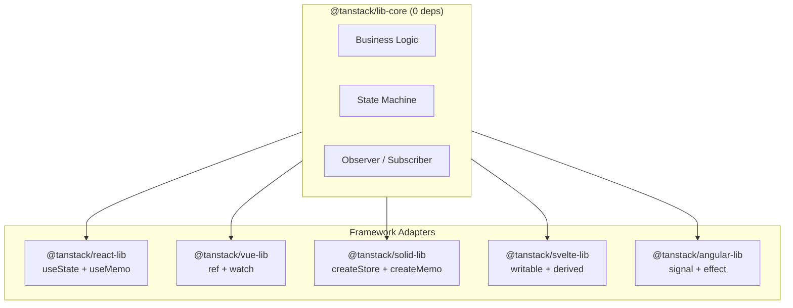
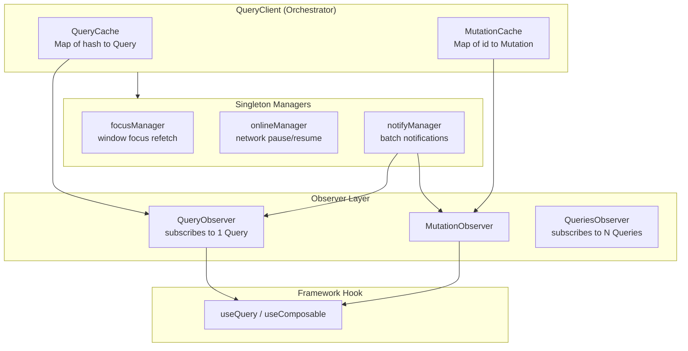
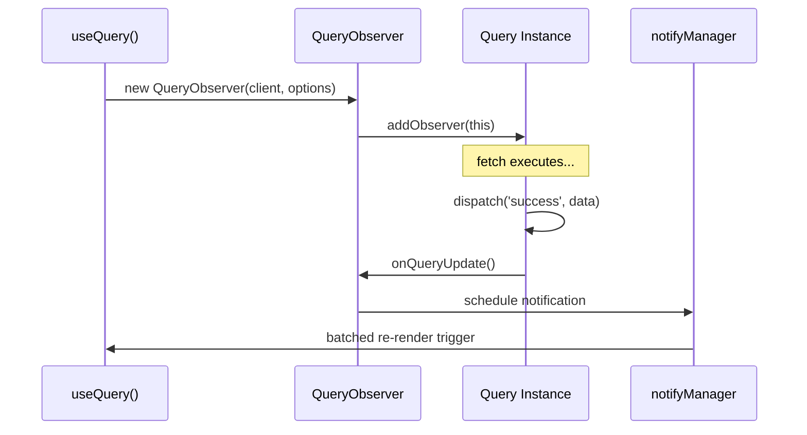
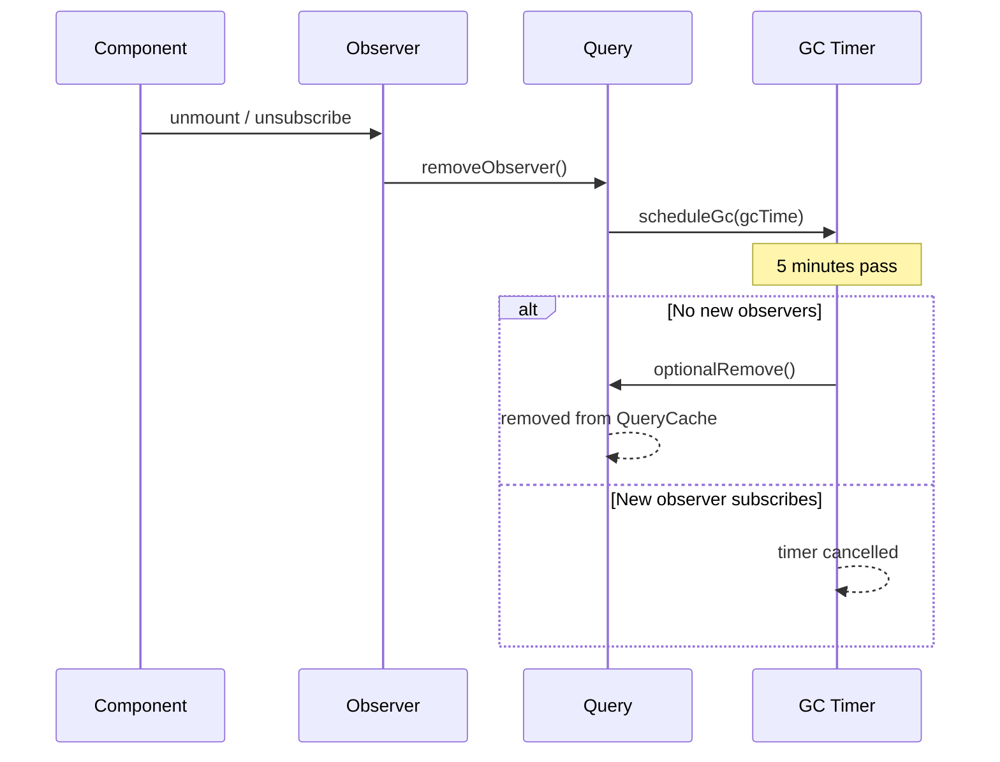
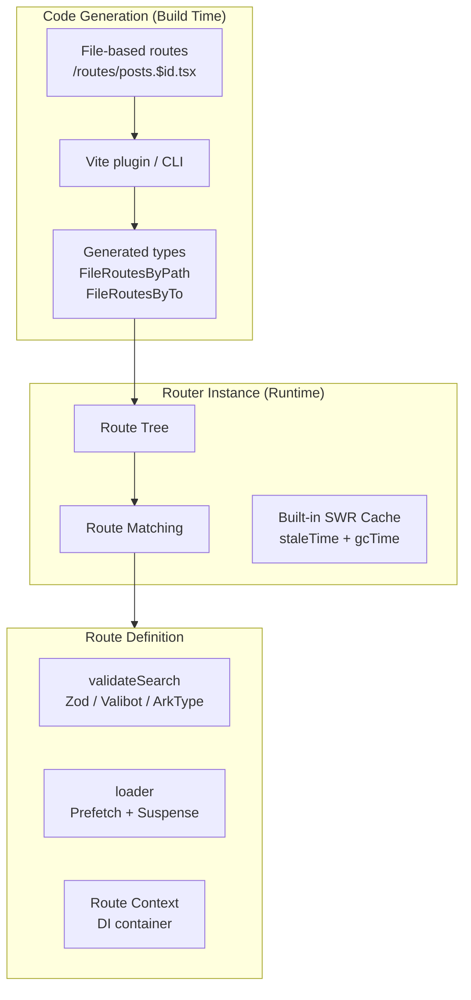
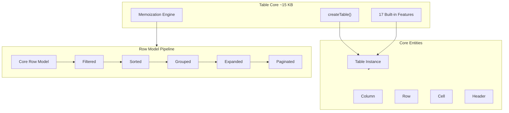
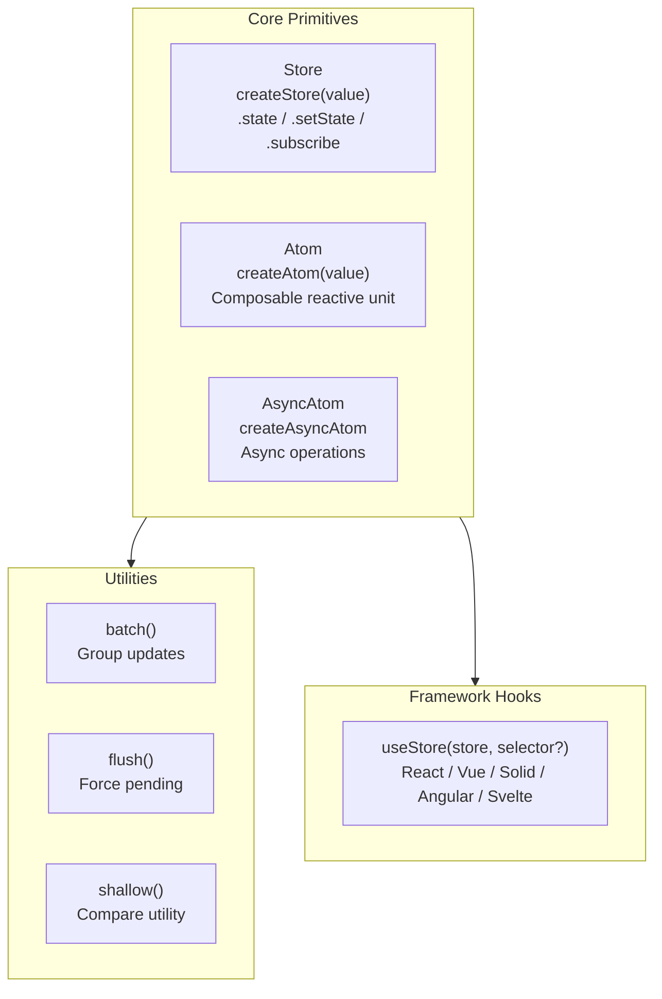

# TanStack 核心架構 — 框架無關 Adapter 模式、Query、Router、Table、Store 內部原理

## 他們構建了什麼

TanStack 是一系列框架無關、型別安全的開源 Web 開發函式庫。每個函式庫都遵循相同的架構模式：純 JavaScript/TypeScript 核心搭配輕量的框架 Adapter，支援 React、Vue、Solid、Svelte、Angular、Qwik 和 Lit。

核心洞察：TanStack 將框架整合視為**插件層面的關注點**，而非核心關注點。業務邏輯從不依賴 React hooks、Vue reactivity 或 Angular signals。框架 Adapter 只是 2-5 KB 的薄包裝層，將核心狀態變化轉譯為框架原生的響應式更新。

本文涵蓋每個核心函式庫的**內部架構**：Adapter 模式的運作方式、Observer/Subscriber 模型、狀態機、快取策略、型別安全機制，以及背後的設計決策。

---

## 1. 框架無關 Adapter 模式

### 分層架構

每個 TanStack 函式庫都遵循此結構：



### Adapter 的運作方式（以 Table 為例）

**第一步：Core 建立一個框架無關的實例**

```ts
// @tanstack/table-core - zero framework dependencies
const table = createTable({
  data,
  columns,
  state: { sorting, pagination },
  onStateChange: (updater) => { /* bridge to framework */ },
})
```

**第二步：Framework Adapter 用原生響應式封裝**

```ts
// React adapter
function useReactTable(options) {
  const [state, setState] = useState(options.initialState)
  const table = useMemo(() => createTable({
    ...options,
    state,
    onStateChange: setState,  // Bridge: core -> React
  }), [state, options])
  return table
}

// Vue adapter
function useVueTable(options) {
  const state = ref(options.initialState)
  const table = createTable({
    ...options,
    get state() { return state.value },
    onStateChange: (v) => { state.value = v },
  })
  watch(() => options, () => table.setOptions(options))
  return table
}

// Solid adapter
function createSolidTable(options) {
  const [state, setState] = createStore(options.initialState)
  return createTable({
    ...options,
    state,
    onStateChange: setState,
  })
}
```

### State Bridge 契約

每個 Adapter 恰好履行兩項義務：

1. **Core-to-Framework**：當 Core 呼叫 `onStateChange(updater)` 時，Adapter 將新狀態推送到框架的響應式系統中
2. **Framework-to-Core**：當框架重新渲染時，Adapter 透過 `state` 選項或 getter 函式將當前狀態傳回 Core

這就是為什麼 Table 的核心只有 ~15 KB 卻能支援 7 個框架。Adapter 的額外開銷極小，因為每個框架本身就有自己的響應式原語。

### 各框架 Adapter 細節

| Framework | State Primitive | Reactive Tracking | Rendering Utility |
|-----------|----------------|-------------------|-------------------|
| React | `useState()` + `useMemo()` | Manual (deps arrays) | `flexRender()` via `createElement` |
| Vue | `ref()` + `watch()` | Automatic (Proxy-based) | `FlexRender` component via `h()` |
| Solid | `createStore()` + `createMemo()` | Automatic (fine-grained signals) | `flexRender()` direct function calls |
| Svelte | `writable()` + `derived()` | Automatic (`$:` reactivity) | `flexRender()` component instantiation |
| Angular | `signal()` + `effect()` | Automatic (Angular 17+ signals) | Template directives |
| Qwik | `useStore()` + `useTask$()` | Resumable reactivity | N/A |
| Lit | Reactive properties | `requestUpdate()` | Web Component lifecycle |

### 為何選擇 Runtime Adapter 而非其他方案

| 方案 | 範例 | 取捨 |
|----------|---------|----------|
| **框架專屬** | SWR（僅限 React） | 單一框架的最佳開發體驗，零可攜性 |
| **編譯時 Adapter** | Svelte stores | 極佳效能，但強制需要轉譯步驟 |
| **Runtime Adapter（TanStack）** | Observer + callbacks | 到處都能用，極小的 Adapter 成本，略有間接層 |
| **Web Components** | 基於 Lit 的函式庫 | 瀏覽器原生，但 React 整合性差 |

TanStack 選擇 runtime adapter 是因為成本幾乎為零（每個 Adapter 2-5 KB），核心邏輯可以在不依賴任何框架的情況下測試，且一次修 bug 所有框架都受益。

---

## 2. TanStack Query 內部原理

### 核心架構



### QueryClient 與 QueryCache

`QueryClient` 是持有兩個獨立快取的中央協調器：

**QueryCache**：以確定性雜湊為索引儲存 `Query` 實例。Key 透過一致的物件鍵排序進行序列化：`['todos', { status: 'active' }]` 無論屬性宣告順序如何，總是雜湊為 `'["todos",{"status":"active"}]'`。這種確定性雜湊防止了微妙的快取未命中 bug。

**MutationCache**：儲存用於寫入操作的 `Mutation` 實例。Mutation 不會自動重新抓取，並透過 `onMutate` 回呼支援樂觀更新，失敗時可回滾。

### 三個 Singleton Manager

Client 在 `mount()` 時訂閱三個全域 Manager：

**focusManager**：追蹤 `visibilitychange` 事件（v5 棄用了 `focus` 事件以修復不必要的重新抓取 bug）。當視窗重新取得可見性時，設定了 `refetchOnWindowFocus: true` 的 Query 會觸發背景重新抓取。

**onlineManager**：監聽 `online`/`offline` 事件。三種網路模式決定行為：`'online'`（僅在有網路連線時抓取）、`'always'`（無論如何都抓取）、`'offlineFirst'`（嘗試抓取，離線時繼續——用於持久化場景）。

**notifyManager**：使用 microtask 排程批次處理同步狀態更新。當 N 個 Query 在同一事件循環 tick 中更新時，`notifyManager.batch()` 確保 Observer 只收到一次通知。這防止了 N 次重新渲染。

### Query 狀態機

每個 `Query` 追蹤兩個獨立維度：

| 維度 | 值 | 用途 |
|-----------|--------|---------|
| `status` | `'pending' \| 'success' \| 'error'` | 資料是否存在？ |
| `fetchStatus` | `'idle' \| 'fetching' \| 'paused'` | 是否正在抓取？ |

這種雙軸模型是一個關鍵的設計決策。一個 Query 可以同時處於 `status: 'success'` 且 `fetchStatus: 'fetching'` 的狀態——在背景重新抓取的同時顯示過時資料。在 v4 中，`isLoading` 混淆了這兩個概念。v5 將它們分開：`isPending` = 尚無資料，`isLoading` = `isPending && isFetching`。

完整狀態屬性：

| 屬性 | 型別 | 用途 |
|----------|------|---------|
| `status` | `'pending' \| 'success' \| 'error'` | 資料存在狀態 |
| `fetchStatus` | `'idle' \| 'fetching' \| 'paused'` | 抓取操作狀態 |
| `data` | `TData \| undefined` | 快取結果 |
| `error` | `TError \| null` | 最後的錯誤 |
| `dataUpdatedAt` | `number` | 成功抓取的時間戳 |
| `isInvalidated` | `boolean` | 過時標記 |

狀態轉換透過 `Query#dispatch()` 使用 reducer 模式，確保原子性更新。

### Observer 模式（框架橋接層）



1. Framework Hook 建立 `new QueryObserver(client, options)`
2. Observer 呼叫 `Query#addObserver(this)` 進行註冊
3. Query 函式解析完成，`Query#dispatch('success', data)` 觸發
4. Query 遍歷所有已註冊的 Observer，呼叫 `observer.onQueryUpdate()`
5. notifyManager 將呼叫批次合併到單一 microtask
6. Framework Adapter 將通知轉換為重新渲染

### 過時性與新鮮度

資料新鮮度由 `staleTime` 決定（預設值：0，意味著始終過時）：

```
Query#isStale() checks in order:
1. Any observer explicitly marks it stale
2. data === undefined (always stale)
3. isInvalidated flag is set
4. Date.now() > dataUpdatedAt + staleTime
```

新鮮資料直接從快取渲染，不發起網路請求。過時資料也從快取渲染，但會觸發背景重新抓取。這就是「stale-while-revalidate」模式。

### 垃圾回收

GC 由 `gcTime` 控制（預設值：5 分鐘，v5 中從 `cacheTime` 改名）：



`Removable` 抽象類別提供核心 GC 功能，`Query` 和 `Mutation` 都繼承自它。GC 只在 Query 的**活躍 Observer 為零**時才開始。如果元件在 `gcTime` 內重新掛載，快取資料會被立即重用。

所有快取資料都存在於 JavaScript 執行時記憶體（瀏覽器 RAM）中。不會在頁面重新載入或瀏覽器關閉後持久化。

### 快取失效

```ts
queryClient.invalidateQueries({ queryKey: ['todos'] })
```

`partialMatchKey()` 支援前綴匹配：使 `['todos']` 失效會影響所有以 `['todos']` 開頭的 Query——包括 `['todos', 1]`、`['todos', { status: 'done' }]` 等。這種階層式 Key 設計實現了精確的失效控制。

### Option 解析層級

三層 Option 合併：

1. **全域預設值**：透過 `QueryClient` 建構函式設定
2. **Query 預設值**：透過 `setQueryDefaults(queryKey, options)` 套用
3. **Per-Query Options**：直接提供給 Hook

後面的層級覆蓋前面的。Observer 特有的 Option 如 `select`、`placeholderData` 和 `notifyOnChangeProps` 擴展了基礎 Query Option。

### Retryer 邏輯

`Retryer` 類別處理指數退避重試：

- `retry`：布林值、數字或函式，決定重試次數（預設值：客戶端 3 次，v5 中伺服器端 0 次）
- 當網路模式為 `'online'` 時，離線則暫停
- Query 函式接收用於 AbortController 取消的 `signal`

### v5 重大變更

| 變更 | v4 | v5 | 原因 |
|--------|----|----|-----|
| Hook 簽名 | 多重多載 | 單一物件參數 | 更簡潔的型別 |
| Loading 狀態 | `isLoading` | `isPending` + `isLoading` | 分離資料存在與抓取狀態 |
| 快取時間 | `cacheTime` | `gcTime` | 名稱反映行為 |
| 前次資料 | `keepPreviousData` | 合併進 `placeholderData` | 統一 API |
| 伺服器端重試 | 預設 3 次 | 預設 0 次 | 避免重試風暴 |
| 回呼 | useQuery 上的 `onSuccess/onError` | 從 Hook 中移除 | 僅移至 QueryClient |
| 視窗焦點 | `focus` 事件 | 僅 `visibilitychange` | 修復不必要的重新抓取 |

### 與替代方案比較

| 特性 | TanStack Query | SWR | RTK Query | Apollo Client |
|---------|---------------|-----|-----------|---------------|
| **核心模型** | 框架無關 Observer | 僅 React 的 Hooks | Redux middleware | GraphQL client |
| **快取類型** | 文件式（key-value） | 文件式 | 文件式 | 正規化 |
| **自動 GC** | 是（gcTime） | 否 | 否 | 是 |
| **離線支援** | 是（network modes） | 有限 | 有限 | 是（cache-first） |
| **樂觀更新** | 手動（onMutate） | 手動 | 自動（endpoints） | 自動（cache） |
| **框架支援** | 5 個框架 | 僅 React | React（Redux） | React（+ Vue） |
| **Bundle 大小** | ~13 KB | ~4 KB | ~25 KB+ | ~33 KB |
| **API 定義** | Ad-hoc（per-hook） | Ad-hoc | 中央 API slice | Schema 定義 |

**RTK Query 的關鍵差異**：Endpoint 在「API slice」中集中定義，透過 tag 匹配實現自動失效。TanStack Query 使用 ad-hoc Hook 搭配手動失效——更靈活，自動化程度較低。

**Apollo 的關鍵差異**：正規化快取將實體扁平儲存，當實體變更時自動更新所有引用。需要 GraphQL schema。TanStack Query 使用文件式快取（更簡單，協定無關）。

---

## 3. TanStack Router 內部原理

### 架構



### 三層型別安全

**第一層：Module Augmentation（Register 介面）**

```ts
declare module '@tanstack/react-router' {
  interface Register {
    router: typeof router
  }
}
```

`Register` 介面初始為空。應用程式透過 augment 將自己的 router 型別注入其中。型別提取器使用條件型別存取已註冊的型別：
- `RegisteredRouter<TRegister>` 提取 router 型別，回退到 `AnyRouter`
- `RoutePaths<TRouter>` 產生所有有效路徑的聯合型別
- 這使得全域可用、應用程式專屬的型別以零執行時成本實現

**第二層：基於檔案的路由程式碼生成**

`Generator` 類別分析路由檔案並產生型別映射：

```ts
// Auto-generated: routeTree.gen.ts
interface FileRoutesByPath {
  '/posts/$id': {
    parentRoute: typeof rootRoute
    path: '/posts/$id'
    fullPath: '/posts/$id'
    params: { id: string }
    search: { tab?: 'details' | 'comments' }
  }
}
```

| 介面 | 用途 |
|-----------|---------|
| `FileRoutesByPath` | 將檔案路徑映射到路由元資料 |
| `FileRoutesByFullPath` | 將計算後的完整路徑映射到路由型別 |
| `FileRoutesByTo` | 將導航路徑映射到路由型別 |
| `FileRoutesById` | 將路由 ID 映射到路由型別 |
| `FileRouteTypes` | 將所有映射聚合為聯合型別 |

當呼叫 `createFileRoute('/posts/$id')` 時，型別參數約束為 `keyof FileRoutesByPath`，啟用自動補全和編譯時驗證。

**第三層：階層式型別解析**

每個路由捕獲完整的 `RouteTypes` 介面：
- `params` + `allParams`（從父級累積）
- `searchSchema` + `fullSearchSchema`（與父級 search 合併）
- `loaderData`、`routeContext`、`allContext`

解析輔助器沿階層層疊：
- `ResolveFullSearchSchema<TParentRoute, TSearchValidator>`：合併父級 search 與當前
- `ResolveAllParamsFromParent<TParentRoute, TParams>`：向上累積 params
- `ResolveAllContext`：構建完整的 context 鏈

### Search Params 作為狀態管理

這是 TanStack Router 最獨特的特性。URL search params 成為經過驗證、有型別、響應式的狀態。

**為何在可分享狀態中選擇 search params 而非 useState**：
- URL 在會話和使用者之間持久化（可分享性）
- 瀏覽器歷史整合（前進/後退正常運作）
- 深度連結（書籤特定的應用程式狀態）
- SSR 友好（狀態在首次渲染時即可用）

**內部運作方式**：

```ts
// 1. Route defines schema (single source of truth)
const issuesRoute = createFileRoute('/issues')({
  validateSearch: z.object({
    page: z.number().default(1),
    sort: z.enum(['asc', 'desc']).default('desc'),
    filter: z.string().optional(),
  }),
})

// 2. Fine-grained selectors prevent unnecessary re-renders
function IssuesTable() {
  const page = useSearch({
    from: '/issues',
    select: (s) => s.page,  // Only re-renders when page changes
  })
}

// 3. Transactional reducer-pattern updates
navigate({ search: (prev) => ({ ...prev, page: prev.page + 1 }) })
```

**Structural sharing**：`replaceEqualDeep()` 遞迴比較值。如果新舊值結構上相同（內容一樣，引用不同），則返回舊引用。這無需手動 memoization 就能防止不必要的重新渲染。

**JSON 序列化**：不同於 URLSearchParams（僅支援字串），TanStack Router 自動將搜尋字串轉換為結構化 JSON。複雜物件、陣列和巢狀資料都支援且型別安全。

**驗證錯誤**：當 `validateSearch` 拋出異常時，Router 將其包裝為 `SearchParamError`。路徑參數解析失敗產生 `PathParamError`。兩者都路由到帶有型別化錯誤資訊的錯誤元件。

### StrictOrFrom 模式

```ts
// Strict (default): guarantees param exists, compile error if wrong route
const { issueId } = useParams({ from: '/issues/$issueId' })

// Loose: returns union of all possible params
const params = useParams({ strict: false })
// type: { issueId?: string; userId?: string; ... }
```

這建立了自文件化的程式碼。`from` 參數同時作為執行時和編譯時的約束。重新命名路由時，每個消費者都會產生 TypeScript 錯誤。

### Validator 系統

| Package | Peer Dependency |
|---------|---|
| `@tanstack/zod-adapter` | `zod ^3.23.8` |
| `@tanstack/valibot-adapter` | `valibot ^1.0.0` |
| `@tanstack/arktype-adapter` | `arktype >=2.0.0-rc` |

Standard Schema v1 允許任何暴露 `~standard.types` 的 validator 無需 adapter 即可使用。型別解析策略（編譯時，零執行時）：

1. 檢查 Standard Schema -> 提取 `~standard.types.output`
2. 檢查 adapter 包裝 -> 使用 `types.output`
3. 檢查 `parse` 方法 -> 推斷返回型別
4. 檢查函式 -> 推斷返回型別
5. 預設為 `AnySchema`

### Loader 模式

```ts
const postRoute = createFileRoute('/posts/$id')({
  loader: async ({ params, context: { queryClient } }) => {
    await queryClient.ensureQueryData(postQuery(params.id))
  },
  component: PostPage,
})

function PostPage() {
  const { id } = useParams({ from: '/posts/$id' })
  const { data } = useSuspenseQuery(postQuery(id))
  // data guaranteed to exist - no loading/error states needed
  return <div>{data.title}</div>
}
```

Loader 是同構的：初次載入在伺服器端，後續導航在客戶端。內建的 SWR 風格快取搭配 `staleTime` 和 `gcTime`，讓先前訪問過的路由可以瞬間導航。

### 型別安全的導航

```ts
// Link validates destination and required params at compile time
<Link to="/posts/$id" params={{ id: 'TSR-25' }}>View Post</Link>

// Relative navigation resolves at compile time
// '.' = current route, '..' = parent, '/absolute' = absolute
type ResolveRelativePath  // resolves during compilation
```

### 與替代方案比較

| 特性 | TanStack Router | React Router v7 | Next.js App Router |
|---------|----------------|------------------|-------------------|
| **型別安全** | 端到端，編譯時 | 部分（泛型 params） | 路由無型別安全 |
| **Search params** | 一級公民，經驗證，有型別 | 基本 URLSearchParams | 基本 URLSearchParams |
| **資料載入** | Loaders + 內建 SWR 快取 | Loaders（Remix 傳承） | RSC + fetch 快取 |
| **渲染** | 客戶端優先，SSR 可選 | Client/SSR/static | 伺服器優先（RSC） |
| **檔案路由** | 可選（也支援 code-based） | 基於慣例 | 必需 |
| **客戶端快取** | 內建 staleTime/gcTime | 無 | 基本 fetch 快取 |
| **Structural sharing** | 是 | 否 | 否 |

**已知限制**：使用 `useSyncExternalStore` 將狀態存儲在 React 外部，這會退出 concurrent 特性（React Transitions）。這是一個已確認的架構張力，等待 React 的「concurrent stores」支援。

---

## 4. TanStack Table 內部原理

### 架構



### Headless 的具體含義

TanStack Table 提供**零 UI**。它匯出：
- 狀態管理（排序方向、篩選值、選中列、頁碼索引）
- 資料處理（排序演算法、篩選匹配、分頁切片、分組）
- API 方法（`getHeaderGroups()`、`getRowModel()`、`toggleSorting()`、`setPageIndex()`）

你提供標記。這意味著 TanStack Table 可以搭配原生 HTML `<table>`、CSS Grid/Flexbox、任何元件庫、Canvas 渲染，甚至 React Native。

### Feature 插件系統

每個 Feature 實作 `TableFeature` 介面：

```ts
type TableFeature = {
  getInitialState?: (initialState) => Partial<TableState>
  getDefaultOptions?: (table) => Partial<TableOptions>
  getDefaultColumnDef?: () => Partial<ColumnDef>
  createTable?: (table) => void      // Adds table-level APIs
  createColumn?: (column) => void    // Extends each column
  createRow?: (row) => void          // Extends each row
  createCell?: (cell) => void        // Extends each cell
  createHeader?: (header) => void    // Extends each header
}
```

17 個內建 Feature 按依賴順序註冊：Headers、ColumnVisibility、ColumnOrdering、ColumnPinning、ColumnFaceting、ColumnFiltering、GlobalFaceting、GlobalFiltering、RowSorting、ColumnGrouping、RowExpanding、RowPagination、RowPinning、RowSelection、ColumnSizing。

每個 Feature 貢獻狀態切片、預設選項和 API 擴展。例如，RowSelection 為 table 添加 `setRowSelection()` 和 `getSelectedRowModel()`，為每一行添加 `toggleSelected()`。

### Table 建立流程

1. **Feature 組裝**：內建 Feature 與自訂 `_features` 合併
2. **預設 Options**：每個 Feature 的 `getDefaultOptions()` 貢獻配置
3. **State 初始化**：Feature 透過 `getInitialState()` 貢獻初始狀態
4. **Entity 建立**：Core 從資料和定義建立 columns、rows、cells、headers
5. **Feature 擴展**：每個 Feature 的生命週期鉤子擴展 Entity

### 狀態管理

- **TableState**：所有 Feature 狀態的中央容器
- **Updater 模式**：`setState((prev) => next)` —— 框架無關
- **onStateChange**：將核心更新橋接到框架響應式的回呼
- 同時支援**受控**（透過 `state` 選項）和**非受控**模式

### Memoization 策略

使用內部 `memo()` 工具進行積極的 memoization：

```ts
memo(
  getDeps: () => [...dependencies],
  compute: (deps) => expensiveComputation(deps),
  { key: 'getSortedRowModel', debug: debugAll }
)
```

依賴項進行淺比較。關鍵的 memoized 操作：
- Column 階層（`getAllColumns`、`getAllFlatColumns`）
- Row model 管線（core -> filtered -> sorted -> grouped -> expanded -> paginated）
- Header group 生成
- Cell context 建立

**React 特有要求**：開發者必須 memoize 傳遞給 `useReactTable()` 的 `data` 和 `columns`。否則 React 每次渲染都建立新引用，使 memoization 失效並導致無限迴圈。Vue 的自動依賴追蹤消除了這個問題。

### Column 定義系統

```ts
const columnHelper = createColumnHelper<Person>()

const columns = [
  // Accessor column: data-bound
  columnHelper.accessor('firstName', {
    header: 'First Name',
    cell: (info) => info.getValue(),
    enableSorting: true,
    size: 200,
  }),
  // Accessor with function
  columnHelper.accessor((row) => row.lastName, {
    id: 'lastName',
    header: () => <span>Last Name</span>,
  }),
  // Display column: render-only, no data
  columnHelper.display({
    id: 'actions',
    cell: ({ row }) => <button>Edit</button>,
  }),
]
```

三種 column 類型：`accessor`（資料綁定）、`display`（僅渲染）、`group`（header 分組）。`createColumnHelper()` 提供型別安全的建構器，維持 TypeScript 推斷。

### 為何 Headless 優於 Styled 函式庫

| 維度 | TanStack Table | AG Grid | MUI DataGrid |
|-----------|---------------|---------|--------------|
| **Bundle** | ~15 KB | ~200+ KB | ~100+ KB |
| **樣式** | 你自己選 | AG Grid 主題 | Material Design |
| **客製化** | 完全控制 | 覆蓋 slot | 主題覆蓋 |
| **進階功能** | 全部免費（MIT） | Enterprise $$$ | Pro/Premium $$$ |
| **100K+ 列** | 手動 + 虛擬化 | 內建 | 部分（Pro） |
| **學習曲線** | 較高 | 中等 | 低 |
| **框架** | 7 個框架 | 3 個框架 | 僅 React |

**核心取捨**：Headless 以初始開發速度換取長期的完全控制。Styled 函式庫達到 80% 更快，但剩下的 20%（自訂設計、邊緣情況）可能比從零開始構建更困難。

**AG Grid 的優勢**：內建列/欄虛擬化和伺服器端操作，處理 100K+ 列。TanStack Table 需要手動整合虛擬化（例如 `@tanstack/react-virtual`）。

**Package 約束**：Core 透過 CI/CD 強制執行 ~15-16 KB 大小限制。Framework Adapter 沒有大小限制。

---

## 5. TanStack Store 內部原理

### 架構

TanStack Store（v0.10.1，2025 年 12 月）是驅動其他 TanStack 函式庫內部運作的響應式基礎。它已從 Store + Derived 演進為基於 atom 的架構。



### 核心 API

```ts
import { createStore, batch } from '@tanstack/store'

// Create
const countStore = createStore(0)
countStore.state  // 0

// Update (functional updater, always)
countStore.setState((prev) => prev + 1)

// Subscribe (returns { unsubscribe })
const { unsubscribe } = countStore.subscribe(() => {
  console.log('Count:', countStore.state)
})

// Batch (subscribers notified once with final state)
batch(() => {
  countStore.setState(() => 10)
  countStore.setState(() => 20)
  // Notification fires once: count = 20
})
```

### 基於 Atom 的 API（最新版）

```ts
import { createAtom, createAsyncAtom } from '@tanstack/store'

const nameAtom = createAtom('Alice')
const asyncDataAtom = createAsyncAtom(async () => {
  return fetch('/api/data').then(r => r.json())
})
```

### 完整 API 介面

| 匯出 | 型別 | 用途 |
|--------|------|---------|
| `Store`, `ReadonlyStore` | Class | 狀態容器 |
| `createStore()` | Function | 初始化 store |
| `createAtom()` | Function | 可組合的 atom |
| `createAsyncAtom()` | Function | 非同步 atom 操作 |
| `batch()` | Function | 分組更新，單次通知 |
| `flush()` | Function | 強制待處理的更新 |
| `useStore()` | Hook | 框架整合 |
| `shallow()` | Utility | 用於 selector 的淺比較 |
| `Atom`, `AtomOptions`, `BaseAtom` | Interface | Atom 型別 |
| `Subscribable`, `Subscription` | Interface | 訂閱契約 |
| `Observer`, `Selection` | Type | 回呼和 selector 型別 |

### 響應式機制

1. `setState()` 更新內部狀態值
2. 所有已註冊的訂閱者收到通知
3. 透過 `useStore(store, selector)` 的選擇性訂閱，允許元件訂閱特定的狀態切片
4. `shallow()` 工具在選取的切片未變更時防止重新渲染
5. 內部使用 Proxy 進行狀態選取和 memoization

### 框架整合模式

```ts
// React
import { useStore } from '@tanstack/store/react'
const count = useStore(countStore, (s) => s)

// Vue
import { useStore } from '@tanstack/store/vue'
const count = useStore(countStore, (s) => s)

// Same pattern across all frameworks
```

### 與替代方案比較

| 特性 | TanStack Store | Zustand | Jotai | Valtio |
|---------|---------------|---------|-------|--------|
| **模型** | 基於 Signal 的 atom | 單一 store（module-first） | Atomic（context-first） | 基於 Proxy 的可變式 |
| **Bundle** | ~1 KB | ~1.2 KB | ~3.4 KB | ~3 KB |
| **框架** | 5 個框架 | React（主要） | React（主要） | React（主要） |
| **API** | `createStore` + `useStore` | `create` + selectors | `atom` + `useAtom` | `proxy` + `useSnapshot` |
| **Derived state** | Atoms + computed | Middleware / selectors | Derived atoms | Auto-tracked |
| **DevTools** | 無 | Redux DevTools | Jotai DevTools | Proxy DevTools |
| **Async** | `createAsyncAtom()` | 外部（Query） | 內建 async atoms | 內建 suspense |
| **不可變性** | 強制 | 建議 | 強制 | 可變（Proxy） |
| **主要用途** | TanStack 內部使用 | 通用應用狀態 | 細粒度 React 狀態 | 簡單可變狀態 |

**TanStack Store**：框架無關，最輕量的選擇。當已在 TanStack 生態系統中或需要跨框架狀態時使用。

**Zustand**：通用 React 狀態管理。最大的社群，最簡單的心智模型。與 TanStack Query 搭配最受歡迎。

**Jotai**：細粒度的原子式 React 狀態。Context-first 設計。最適合複雜的派生狀態樹。

**Valtio**：可變語法搭配 Proxy 響應式。最低學習曲線。適合有大量 mutation 的簡單狀態。

---

## 橫切架構模式

### 模式 1：Observer/Subscriber 作為通用橋接

每個 TanStack 函式庫都使用相同的模式：核心持有狀態，Observer 訂閱，框架 Adapter 將通知轉譯為框架原生的更新。這是實現框架無關性的基礎創新。

### 模式 2：不可變狀態搭配函式更新器

所有更新遵循 `setState((prev) => next)`。絕不直接修改。這實現了可預測的轉換、時間旅行除錯的可能性，以及框架無關的狀態管理（不可變性是通用契約）。

### 模式 3：Option 解析層級

配置從三個層級合併：全域預設值 -> 類別預設值 -> 實例選項。後面的層級覆蓋前面的。這提供了合理的預設值以及細粒度的控制。

### 模式 4：確定性雜湊

Query key、table state 和快取條目使用確定性序列化。物件屬性順序無關緊要。這防止了因屬性排序差異導致的快取未命中 bug。

### 模式 5：透過 Microtask 批次通知

多次同步狀態變更透過 `queueMicrotask()` 只產生一次通知。這防止了當 N 個 Query 或狀態變更在同一 tick 中發生時的串聯重新渲染。

### 模式 6：Headless 作為競爭優勢

零 UI 意味著：框架無關（無 DOM 假設）、極小的 bundle、任何設計系統、沒有「80% 適合，20% 要打架」的問題。取捨是較高的初始開發成本。

---

## 可偷取的模式

1. **Core + Adapter 架構**：以純 JS/TS 編寫業務邏輯。`onStateChange` 回呼是通用的橋接契約。每個 Adapter 2-5 KB。

2. **雙軸狀態機**：將「資料是否存在？」與「操作是否正在進行？」分開。消除模糊的 loading 狀態。

3. **Search params 作為狀態**：在路由層級使用 schema 驗證 URL 參數。免費獲得可分享性、瀏覽器歷史和型別安全。

4. **Feature 插件系統**：從小型插件組合行為，每個插件貢獻狀態切片和 API 方法。支援 tree-shaking 和自訂擴展。

5. **Structural sharing**：`replaceEqualDeep()` 在新值結構上相同時返回舊引用。無需手動 memoization 即可防止重新渲染。

6. **Module augmentation 用於全域型別**：`declare module` + `Register` 介面 = 應用程式專屬型別流經函式庫 API。零執行時成本。

7. **確定性 key 雜湊**：序列化前排序物件鍵。對任何快取系統都至關重要。

8. **透過 microtask 批次通知**：收集同步變更，通知一次。防止串聯重新渲染。

---

## References

- [TanStack Official Site](https://tanstack.com/)
- [TanStack Query v5 Documentation](https://tanstack.com/query/v5/docs)
- [TanStack Router Documentation](https://tanstack.com/router/latest/docs)
- [TanStack Table Documentation](https://tanstack.com/table/latest/docs/introduction)
- [TanStack Store Documentation](https://tanstack.com/store/latest/docs)
- [TanStack Store API Reference](https://tanstack.com/store/latest/docs/reference/index)
- [TanStack Query Core Concepts -- DeepWiki](https://deepwiki.com/TanStack/query/2-core-concepts)
- [QueryClient and QueryCache -- DeepWiki](https://deepwiki.com/TanStack/query/2.1-queryclient-and-querycache)
- [TanStack Table Core Architecture -- DeepWiki](https://deepwiki.com/tanstack/table/2.1-core-architecture)
- [TanStack Table Framework Adapters -- DeepWiki](https://deepwiki.com/tanstack/table/5-framework-adapters)
- [TanStack Router Type Safety and Validation -- DeepWiki](https://deepwiki.com/tanstack/router/8-type-safety-and-validation)
- [The Beauty of TanStack Router -- TkDodo](https://tkdodo.eu/blog/the-beauty-of-tan-stack-router)
- [Search Params Are State -- TanStack Blog](https://tanstack.com/blog/search-params-are-state)
- [TanStack Query Comparison](https://tanstack.com/query/latest/docs/framework/react/comparison)
- [Migrating to TanStack Query v5](https://tanstack.com/query/latest/docs/framework/react/guides/migrating-to-v5)
- [Announcing TanStack Query v5](https://tanstack.com/blog/announcing-tanstack-query-v5)
- [staleTime vs gcTime Discussion](https://github.com/TanStack/query/discussions/1685)
- [Understanding staleTime vs gcTime](https://medium.com/@bloodturtle/understanding-staletime-vs-gctime-in-tanstack-query-e9928d3e41d4)
- [TanStack Store GitHub](https://github.com/TanStack/store)
- [TanStack Store for Applications](https://github.com/TanStack/store/discussions/143)
- [State Management in 2025](https://medium.com/@pooja.1502/state-management-in-2025-redux-toolkit-vs-zustand-vs-jotai-vs-tanstack-store-c888e7e6f784)
- [MUI DataGrid vs TanStack Table](https://www.polipo.io/blog/implementing-data-grid-comparing-mui-data-grid-and-tanstack-table)
- [AG Grid Alternatives 2026](https://www.thefrontendcompany.com/posts/ag-grid-alternatives)
- [TanStack Router vs React Router](https://betterstack.com/community/comparisons/tanstack-router-vs-react-router/)
- [Next.js, React Router, TanStack: When to Use Each](https://thenewstack.io/next-js-react-router-tanstack-when-to-use-each/)
- [TanStack AI Toolkit -- The New Stack](https://thenewstack.io/tanstack-adds-framework-agnostic-ai-toolkit/)
- [TanStack AI -- InfoQ](https://www.infoq.com/news/2026/01/tanstack-ai-sdk/)
