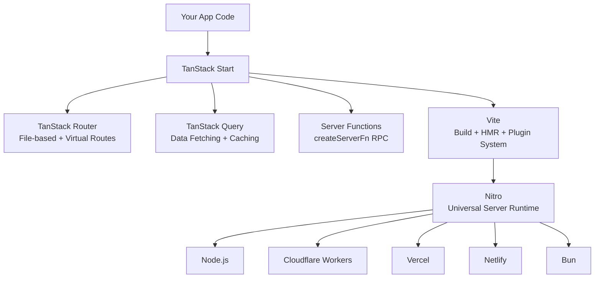
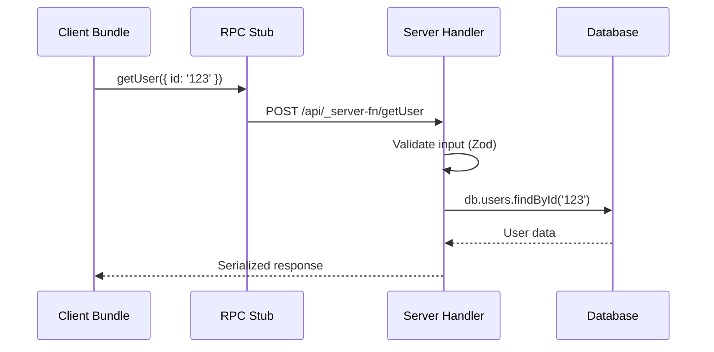
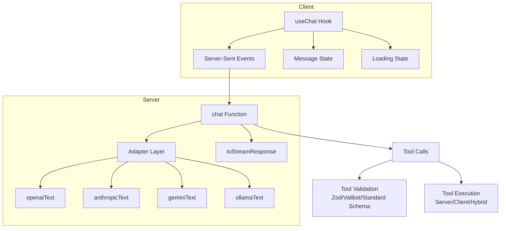
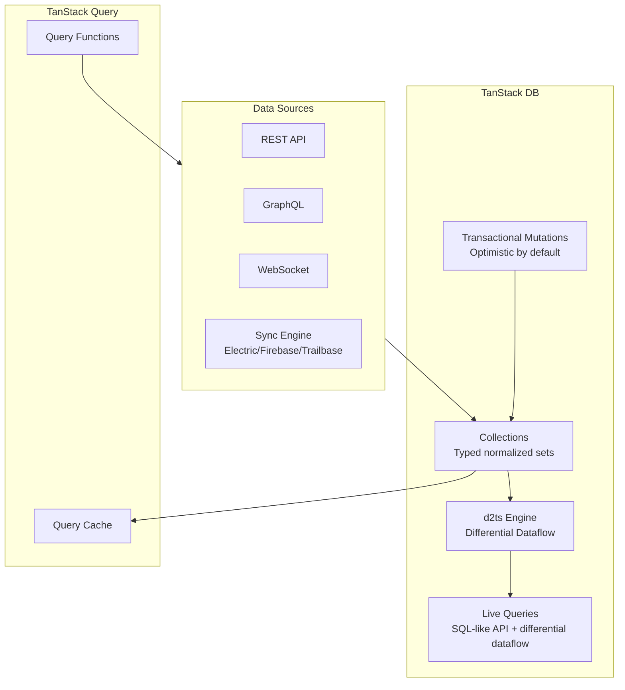
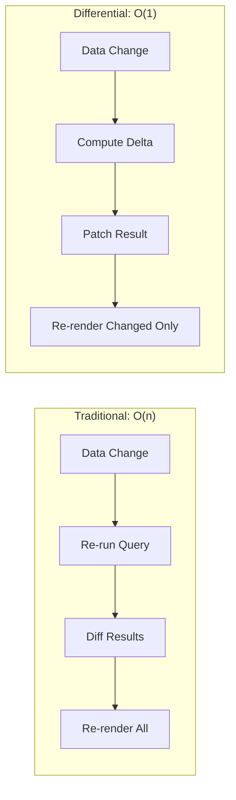
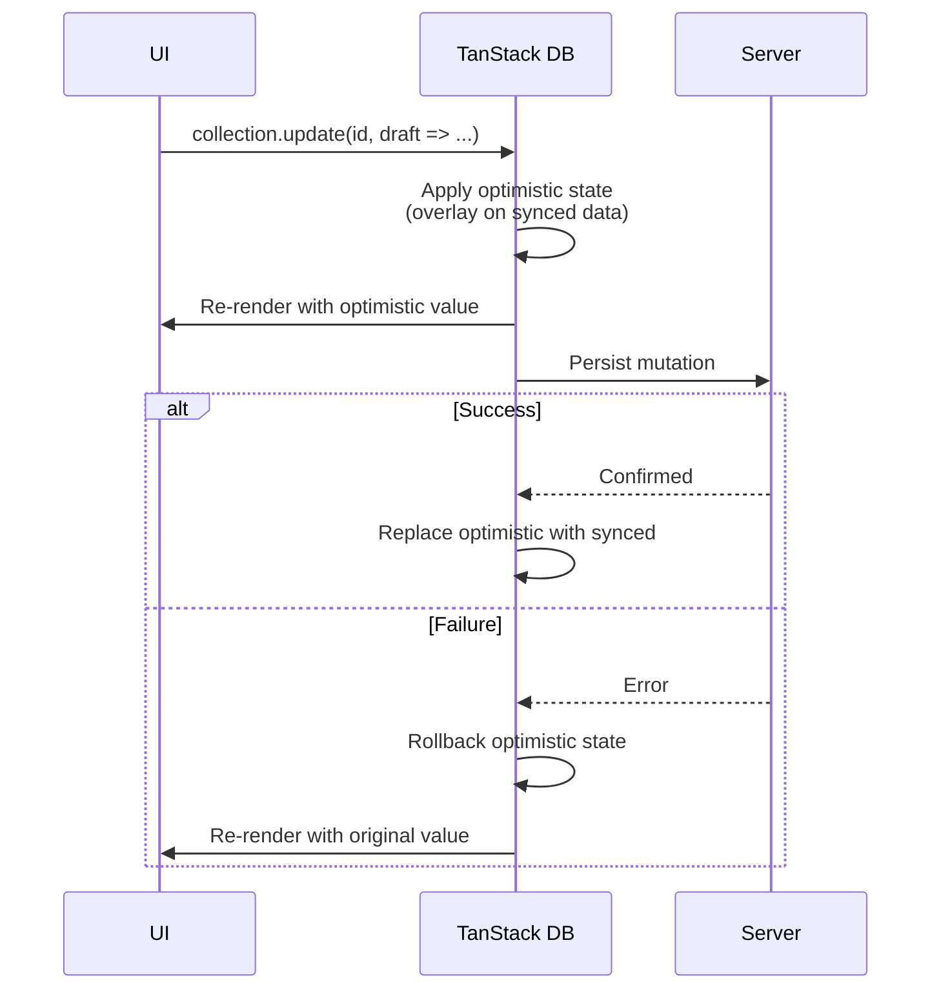
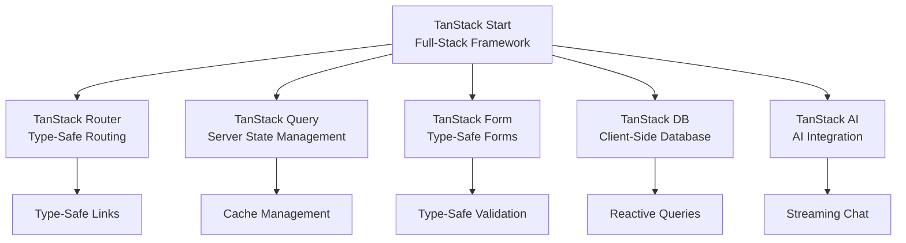

# TanStack Ecosystem Deep Analysis: Start, AI, Form, DB

## Executive Summary

TanStack has evolved from standalone React utilities (Query, Router, Table) into a **full-stack framework ecosystem** challenging Next.js, Vercel AI SDK, React Hook Form, and traditional client-server architectures. The core thesis: **explicit control over implicit magic**, with end-to-end type safety as the unifying thread.

| Product | Status | What It Replaces | Key Bet |
|---------|--------|-----------------|---------|
| **Start** | RC (v1 RC, Sep 2025) | Next.js, Remix | Client-first + opt-in SSR beats server-first |
| **AI** | Alpha 2 (Dec 2025) | Vercel AI SDK | Provider-agnostic + isomorphic tools |
| **Form** | Stable (v1) | React Hook Form, Formik | Type-safe paths + framework-agnostic |
| **DB** | Beta (v0.5) | Manual TanStack Query caching | Differential dataflow on client |

---

## 1. TanStack Start

### What They Built

A full-stack framework for React and Solid.js, built on **TanStack Router + TanStack Query + Vite + Nitro**. ~90% is TanStack Router, the remaining ~10% handles server functionality.

**Core architectural bet**: Client-first with opt-in server capabilities, not server-first with client escape hatches.

### Architecture Stack



### Server Functions / RPC Mechanism

The killer feature. `createServerFn` creates functions that:
- Execute on the server
- Are callable from client code as normal functions
- Get replaced with RPC stubs in client bundles at build time
- Maintain full type safety across the network boundary

```typescript
// This code ONLY runs on the server, but is callable from anywhere
const getUser = createServerFn({ method: 'GET' })
  .validator(z.object({ id: z.string() }))
  .handler(async ({ data }) => {
    // Has access to: database, env vars, file system
    return db.users.findById(data.id)
  })

// In a component — looks like a normal function call
const user = await getUser({ data: { id: '123' } })
```

**How it works under the hood:**

1. **Build time**: Vite plugin identifies `createServerFn` calls
2. **Client bundle**: Implementation replaced with lightweight RPC stub that makes HTTP request
3. **Server bundle**: Full implementation preserved with all dependencies
4. **Runtime**: Client stub sends HTTP request -> Server handler executes -> Response serialized back
5. **Type safety**: Input validator (Zod/Valibot) provides both runtime validation and TypeScript inference



**Middleware chaining:**

```typescript
const authMiddleware = createMiddleware()
  .server(async ({ next }) => {
    const session = await getSession()
    if (!session) throw new Error('Unauthorized')
    return next({ context: { user: session.user } })
  })

const getProfile = createServerFn({ method: 'GET' })
  .middleware([authMiddleware])
  .handler(async ({ context }) => {
    // context.user is fully typed from middleware
    return db.profiles.find(context.user.id)
  })
```

### SSR Strategy

TanStack Start offers **two SSR modes**:

**Full-Document SSR** (default for initial load):
1. Server executes route loaders following route hierarchy
2. Data serialized and embedded in HTML via `<script>` tags
3. Full HTML sent to client
4. Client hydrates with exact same component tree
5. Subsequent navigations are pure client-side SPA

**Streaming SSR** (opt-in):
- HTML sent incrementally as rendered on server
- Lower-priority content streams after initial paint
- Same request, progressive delivery

**Critical design decision**: Route loaders are **isomorphic** — they run on both server and client. On initial load, they execute server-side for SSR. On subsequent navigations, they execute client-side. This is fundamentally different from Next.js where server components only run on the server.

```typescript
// This loader runs on server during SSR, on client during navigation
export const Route = createFileRoute('/posts/$postId')({
  loader: async ({ params, context }) => {
    // Uses TanStack Query's ensureQueryData for smart caching
    return context.queryClient.ensureQueryData(
      postQueryOptions(params.postId)
    )
  },
  component: PostComponent,
})
```

**Selective SSR**: Per-route rendering mode control — server, client, or data-only.

### Deployment Model: Why Vite + Nitro

**The adapter problem**: Initially TanStack Start planned per-platform adapters (Vercel adapter, AWS adapter, etc.). This proved unsustainable:
- Dozens of adapters to maintain
- Each platform evolves independently
- Core framework work blocked by adapter maintenance

**The Nitro solution**: Instead of building adapters, delegate to Nitro (server toolkit by the Nuxt team):
- **H3**: HTTP framework that maintains lower-level platform adapters
- **Nitro presets**: One-line deployment target switching
- Single server code -> universal deployment

```typescript
// vite.config.ts — that's it for deployment config
export default defineConfig({
  plugins: [
    tanstackStart(),
    nitro({ preset: 'cloudflare-workers' }) // or 'vercel', 'netlify', 'bun', 'node'
  ]
})
```

**Migration history**: Started with Vinxi (opinionated Vite wrapper) -> migrated to direct Vite integration (v1.120) for more control and fewer dependencies. Vinxi was a stepping stone, not the destination.

### File Structure & Conventions

```
project/
  src/
    routes/
      __root.tsx        # Root layout (must exist, wraps all routes)
      index.tsx          # / route
      about.tsx          # /about route
      posts.tsx          # /posts layout
      posts/
        index.tsx        # /posts route
        $postId.tsx      # /posts/:postId dynamic route
    router.tsx           # Router configuration + getRouter export
    routeTree.gen.ts     # Auto-generated route tree (don't edit)
  app.config.ts          # TanStack Start configuration
  vite.config.ts         # Vite + Nitro configuration
```

**Route types**: Index, Dynamic (`$param`), Wildcard/Splat (`$`), Pathless Layout, Non-Nested, Grouped.

**Virtual routes** (alternative to file-based):
```typescript
route('/dashboard', 'dashboard/layout.tsx', [
  route('/posts', 'dashboard/posts/layout.tsx', [index(...)])
])
```

### Execution Model

All code is **isomorphic by default** — included in both server and client bundles unless explicitly constrained.

**Boundary control functions:**

| Function | Behavior |
|----------|----------|
| `createServerFn` | Server-only execution, callable from client via RPC |
| `createServerOnlyFn` | Crashes if called from client |
| `createClientOnlyFn` | Crashes if called from server |
| `createIsomorphicFn` | Different implementations per environment |

**No built-in `'use client'` directive** like Next.js. You can use `vite-env-only` plugin for import restrictions.

### TanStack Start vs Next.js vs Remix vs SvelteKit vs Nuxt

| Feature | TanStack Start | Next.js | Remix/React Router | SvelteKit | Nuxt |
|---------|---------------|---------|-------------------|-----------|------|
| **Philosophy** | Client-first, opt-in SSR | Server-first, RSC | Web standards | Compiled framework | Convention + flexibility |
| **Type safety** | End-to-end inferred | Bolted on (v15.5) | Partial | Good (Svelte 5) | Good |
| **SSR** | Full-doc + streaming | SSR/SSG/ISR/PPR | SSR + progressive | SSR + prerender | SSR/SSG/ISR |
| **RSC support** | No (planned) | Core architecture | Not yet | N/A | N/A |
| **Data fetching** | Isomorphic loaders + Query | Server Components + fetch | Loaders + Actions | load() functions | useFetch/useAsyncData |
| **Server functions** | createServerFn (RPC) | Server Actions ('use server') | Actions | Form actions + API | Server routes |
| **Build tool** | Vite | Turbopack/Webpack | Vite | Vite | Vite |
| **Deployment** | Nitro (universal) | Vercel-optimized | Universal (adapters) | Universal (adapters) | Nitro (universal) |
| **Vendor lock-in** | None | Vercel-centric | None | None | None |
| **Framework** | React + Solid | React only | React only | Svelte only | Vue only |
| **Bundle size** | Lean (no RSC overhead) | Heavier (RSC runtime) | Medium | Smallest (compiled) | Medium |
| **Maturity** | RC (pre-1.0) | Production (v15) | Production (v7) | Production (v2) | Production (v3) |

### What Problems TanStack Start Solves That Next.js Doesn't

1. **True end-to-end type safety**: No type gaps at client/server boundary. Server Actions in Next.js can receive mismatched data at runtime.
2. **No vendor lock-in**: Vite + Nitro -> deploy anywhere. Next.js advanced features degrade outside Vercel.
3. **Client-first mental model**: SPA by default with opt-in SSR. Better for interactive apps.
4. **No RSC complexity**: No `'use client'`/`'use server'` directives, no serialization boundary confusion.
5. **Isomorphic loaders**: Data fetching logic works identically on server and client.
6. **Multi-framework**: Works with React AND Solid.js.

### Current Status

- **Version**: v1 Release Candidate (announced Sep 22, 2025)
- **API stability**: Considered stable, light polish remaining
- **Production readiness**: Usable with pinned versions
- **1.0 release**: No specific date announced (still RC as of Feb 2026)
- **Solid.js support**: Full parity with React

---

## 2. TanStack AI

### What They Built

A lightweight, type-safe, provider-agnostic AI SDK for building chat, structured output, and tool-calling applications. Framework-agnostic core with React and Solid bindings.

### Architecture



### Core APIs

**Server-side: `chat()` function**

```typescript
import { chat, toStreamResponse } from '@tanstack/ai'
import { openaiText } from '@tanstack/ai-openai'

const stream = chat({
  adapter: openaiText('gpt-4o'),
  messages,
  temperature: 0.6,  // Flattened config (Alpha 2 change)
  tools: [searchInternet, getWeather],
})
return toStreamResponse(stream)
```

**Client-side: `useChat()` hook**

```typescript
import { useChat } from '@tanstack/ai-react'

const { messages, sendMessage, isLoading } = useChat({
  connection: fetchServerSentEvents('/api/chat'),
})
```

Returns:
- `messages`: Array of `{ id, role, parts }` with auto-updates
- `sendMessage`: Optimistically adds user message before server transmission
- `isLoading`: Boolean for UI states

### Multi-Provider Abstraction (Adapter Pattern)

**Alpha 1 problem**: Monolithic adapters with 7+ type generics, growing worse with each new modality.

**Alpha 2 solution**: Split into modality-specific adapters:

```typescript
// Before (Alpha 1): one giant adapter
import { openai } from '@tanstack/ai-openai'

// After (Alpha 2): modality-specific, tree-shakeable
import { openaiText } from '@tanstack/ai-openai'
import { openaiImage } from '@tanstack/ai-openai'
```

**Why**: Adding 6 new modalities (image, video, audio, transcription, TTS, structured output) to the monolithic adapter would have exploded complexity. Each focused adapter needs max 3 type generics.

**Supported modalities (Alpha 2)**: Text, Structured Output, Image Generation, Video Generation, Audio Generation, Transcription, Text-to-Speech.

**Provider-specific type safety:**
```typescript
// TypeScript catches invalid options at compile time
const stream = chat({
  adapter: openaiText('gpt-4o'),
  reasoning: { effort: 'medium', summary: 'detailed' }, // Only valid for reasoning models
})
```

### Isomorphic Tools

The defining innovation vs Vercel AI SDK. Define a tool once, execute it anywhere:

```typescript
// 1. Define schema (isomorphic)
const searchInternetDef = toolDefinition({
  name: 'search_internet',
  description: 'Search the internet for current information',
  inputSchema: z.object({
    query: z.string(),
    maxResults: z.number().optional(),
  }),
})

// 2. Server implementation
export const searchInternet = searchInternetDef.server(
  async ({ query, maxResults = 5 }) => {
    return await tavilySearch(query, maxResults)
  }
)

// 3. Client implementation (optional, for browser-side tools)
export const searchInternetClient = searchInternetDef.client(
  async ({ query }) => {
    return await localSearch(query)
  }
)
```

**Tool lifecycle states**: `awaiting-input` -> `input-streaming` -> `input-complete` -> `approval-requested` -> executed.

**Tool orchestration flow:**
1. Client sends message with available tool definitions
2. AI provider decides to call tool
3. Server validates arguments against schema
4. Function executes
5. Results return to AI model for enhanced response
6. Final answer streams to client

### TanStack AI vs Vercel AI SDK

| Aspect | TanStack AI | Vercel AI SDK |
|--------|------------|---------------|
| **Philosophy** | Open-source, no gateway | Vercel platform integration |
| **Type safety** | Deep -- provider-specific option validation at compile time | Flexible but loose -- invalid options pass silently |
| **Isomorphic tools** | Full: define once, run server/client/hybrid | Partial: isomorphic schemas only, not implementations |
| **Provider count** | 4 core (OpenAI, Anthropic, Gemini, Ollama) | 30+ providers |
| **Framework lock-in** | None (React, Solid, vanilla JS) | Next.js-centric |
| **DevTools** | Built-in stream/tool inspector | None |
| **Schema validation** | Standard Schema (Zod, Valibot, ArkType, Effect) | Zod primarily |
| **Maturity** | Alpha (Dec 2025) | Production |
| **Modalities** | 7 (text, image, video, audio, transcription, TTS, structured) | Text + image primarily |

**When to choose TanStack AI**: Multi-framework apps, need provider switching without refactoring, isomorphic tool definitions, strong type safety.

**When to choose Vercel AI SDK**: Need production stability now, heavy Next.js/Vercel integration, need 30+ providers.

### Current Status

- **Version**: Alpha 2 (Dec 2025)
- **NOT production-ready**: APIs will change
- **Strengths**: Architecture is excellent, type safety is best-in-class
- **Weakness**: 4 providers vs Vercel's 30+, early alpha
- **Roadmap**: Standard Schema (drop Zod dependency), middleware, AWS Bedrock, OpenRouter adapters

---

## 3. TanStack Form

### What They Built

A headless, framework-agnostic form state management library with extreme type safety. Supports React, Vue, Angular, Solid, Lit, and Svelte.

### Architecture: Core + Adapters

```mermaid
graph TD
    subgraph Core["@tanstack/form-core"]
        FA[FormApi] --> ST[Store<br/>@tanstack/store]
        FIA[FieldApi] --> ST
        FA --> FIA
        FA --> VS[Validation System]
        VS --> SS[Standard Schema<br/>Zod/Valibot/ArkType/Effect]
        VS --> CV[Custom Validators]
    end
    subgraph Adapters
        R["@tanstack/react-form<br/>useForm + Field"]
        V["@tanstack/vue-form<br/>useForm composable"]
        A["@tanstack/angular-form<br/>injectForm"]
        S["@tanstack/solid-form<br/>createForm"]
        L["@tanstack/lit-form<br/>TanStackFormController"]
        SV["@tanstack/svelte-form<br/>store APIs"]
    end
    Core --> R
    Core --> V
    Core --> A
    Core --> S
    Core --> L
    Core --> SV
```

**FormApi**: Primary controller managing overall form state -- values, errors, submission lifecycle, field registration, global validation.

**FieldApi**: Per-field controller -- value get/set, `dirty`/`touched`/`pristine`/`isValid`/`isValidating` flags, array operations (`pushValue`, `insertValue`, `removeValue`, `swapValues`, `moveValue`), event handlers (`handleChange`, `handleBlur`).

### Type-Safe Paths (The Key Innovation)

```typescript
type FormData = {
  user: {
    name: string
    addresses: Array<{
      street: string
      city: string
    }>
  }
}

// TypeScript catches typos at compile time
form.Field({ name: 'user.name' })           // OK
form.Field({ name: 'user.addresses[0].city' }) // OK
form.Field({ name: 'user.naem' })           // Compile error!
```

Every field path is type-checked through the entire nested object structure. The `errorMap` for each field has exactly the type returned by its corresponding validator.

### Validation System

**Timing options**: `onChange`, `onBlur`, `onMount`, `onSubmit`, `onDynamic`.

**Three validation approaches:**

```typescript
// 1. Synchronous inline
form.Field({
  name: 'email',
  validators: {
    onChange: ({ value }) =>
      !value.includes('@') ? 'Invalid email' : undefined,
  },
})

// 2. Async with debounce
form.Field({
  name: 'username',
  validators: {
    onChangeAsyncDebounceMs: 300,
    onChangeAsync: async ({ value }) => {
      const taken = await checkUsername(value)
      return taken ? 'Username taken' : undefined
    },
  },
})

// 3. Schema-based (Standard Schema)
form.Field({
  name: 'age',
  validators: {
    onChange: z.number().min(18, 'Must be 18+'),
  },
})
```

### createFormHook (Composition Pattern)

Factory function for creating pre-configured form hooks with bound components:

```typescript
const { useAppForm, withForm } = createFormHook({
  fieldComponents: {
    TextField: MyTextField,
    Select: MySelect,
    DatePicker: MyDatePicker,
  },
  formComponents: {
    SubmitButton: MySubmitButton,
  },
})

// Usage -- zero boilerplate, pre-bound to your design system
function ProfileForm() {
  const form = useAppForm({
    defaultValues: { name: '', age: 0 },
    onSubmit: async ({ value }) => saveProfile(value),
  })
  return (
    <form.AppForm>
      <form.TextField name="name" />
      <form.SubmitButton />
    </form.AppForm>
  )
}
```

### TanStack Form vs React Hook Form vs Formik

| Feature | TanStack Form | React Hook Form | Formik |
|---------|--------------|-----------------|--------|
| **Type safety** | Deep path inference, compile-time field validation | Runtime casting for nested arrays | Basic generics |
| **Performance** | Granular reactivity (only changed fields update) | Uncontrolled refs (no re-renders on input) | Re-renders on every change |
| **Framework** | React, Vue, Angular, Solid, Lit, Svelte | React only | React only |
| **Validation** | Standard Schema (Zod/Valibot/ArkType/Effect) + custom | Zod/Yup resolvers | Yup primarily |
| **Architecture** | Headless (FormApi + FieldApi) | Hook-based with register() | Context-based with Formik component |
| **Array fields** | Type-safe push/insert/remove/swap/move | useFieldArray hook | FieldArray component |
| **Server integration** | Works with TanStack Start server functions | useActionState (React 19+) | Manual |
| **Bundle size** | ~12KB | ~9KB | ~44KB |
| **Maturity** | Stable v1 | Very mature (v7) | Maintenance mode |

**When to choose TanStack Form**: Multi-framework projects, deep nested type safety requirements, large-scale apps with complex validation.

**When to choose React Hook Form**: React-only projects, maximum performance for huge forms (100+ inputs), simpler API, mature ecosystem.

### Current Status

- **Version**: Stable v1, production-ready
- **shadcn/ui integration**: Official form component available
- **Ecosystem**: Growing but smaller than RHF

---

## 4. TanStack DB

### What They Built

An embedded client-side database layer built on TanStack Query, using **differential dataflow** (via `d2ts` library) for sub-millisecond reactive queries across large datasets.

### The Problem It Solves

TanStack Query owns "how do I fetch?" -- TanStack DB owns "how do I keep everything coherent and lightning-fast once it's here?"

**Three approaches to data on the client:**

| Approach | How | Problem |
|----------|-----|---------|
| **A: View-specific APIs** | `/api/todos-by-project?id=5` | N endpoints for N views, slow backend iteration |
| **B: Client-side filtering** | Fetch all, `array.filter()` | O(n) per query, no reactivity, manual cache invalidation |
| **C: TanStack DB** | Normalized collections + differential dataflow | Sub-ms queries, automatic reactivity, optimistic mutations |

### Architecture



### Three Core Primitives

**1. Collections** -- Typed sets of objects, agnostic to data source:

```typescript
// Without sync engine (REST)
const todoCollection = createCollection(
  queryCollectionOptions({
    queryKey: ['todos'],
    queryFn: async () => fetch('/api/todos').then(r => r.json()),
    getKey: (item) => item.id,
  })
)

// With sync engine (ElectricSQL)
const todoCollection = createCollection(
  electricCollectionOptions({
    id: 'todos',
    shapeOptions: {
      url: '/api/electric/shape',
      params: { table: 'todos' },
    },
    schema: todoSchema,
  })
)
```

**2. Live Queries** -- SQL-like API that auto-updates when underlying data changes:

```typescript
const activeTodos = useQuery(
  todoCollection
    .query()
    .where('completed', '=', false)
    .orderBy('createdAt', 'desc')
)

// Cross-collection joins
const todosWithUsers = useQuery(
  todoCollection
    .query()
    .join(userCollection, 'userId', '=', 'id')
    .select(['todo.title', 'user.name'])
)
```

Performance: **0.7ms to update one row in a sorted 100K collection** (M1 Pro).

**3. Transactional Mutations** -- Optimistic by default with automatic rollback:

```typescript
// Immediate local update, syncs in background
todoCollection.update(todo.id, (draft) => {
  draft.completed = true
})
// If server rejects -> automatic rollback
// If server confirms -> synced state replaces optimistic state
```

### Differential Dataflow (The Secret Sauce)

Traditional approach: Data changes -> re-run entire query -> diff result -> re-render.

Differential dataflow: Data changes -> compute **only the delta** -> patch result -> re-render changed items only.



Built on `d2ts`, a TypeScript implementation of Materialize's differential dataflow research. The engine maintains a graph of query operations and incrementally propagates changes through it.

### Optimistic Mutation Architecture



**Uni-directional data flow**: Instant inner loop (optimistic state) -> superseded by slower outer loop (server sync -> updated synced state).

### Sync Engine Integration

TanStack DB is sync-engine agnostic:

| Engine | Status | Use Case |
|--------|--------|----------|
| **ElectricSQL** | Production | Postgres sync via HTTP shapes |
| **Firebase** | In development | Google Firestore real-time |
| **Trailbase** | Available | Lightweight sync |
| **Materialize** | Planned | Streaming database |
| **PowerSync** | Community | Offline-first with SQLite |

**Query-driven sync (v0.5)**: First query loads in ~100ms with targeted network request. Full dataset syncs in background. Once complete, all queries run sub-ms purely client-side.

**ElectricSQL integration pattern**: Collections map 1:1 with database tables. Electric syncs reads via HTTP shapes (filtered views on Postgres). Writes go through your existing API (REST/GraphQL/tRPC/server actions). Electric propagates changes to all clients.

### The "20MB Question"

Core thesis: "Your app would be dramatically faster if you just loaded 20MB of normalized data upfront" instead of hundreds of small API calls. Differential dataflow makes this practical.

This inverts the traditional "fetch only what you need" wisdom. For apps with complex filtering/joining needs, bulk-loading + client-side computation is faster than N network round-trips.

### Current Status

- **Version**: Beta (v0.5, query-driven sync)
- **NOT production-ready**: API may change
- **Framework support**: React, Vue, Solid, Svelte, VanillaJS
- **Incremental adoption**: Drop-in alongside existing TanStack Query code

---

## 5. The TanStack Ecosystem Strategy

### Vertical Integration

TanStack is building a full-stack toolkit where every layer shares the same type system:



Each library works standalone, but the combined stack provides end-to-end type inference from database -> server function -> router -> component -> form field.

### Key Design Decisions and WHY

| Decision | Why | Tradeoff |
|----------|-----|----------|
| **No RSC** (Start) | RSC adds serialization boundary complexity; isomorphic loaders achieve similar results simpler | No streaming server components, larger client bundles |
| **Vite over Webpack/Turbopack** (Start) | Faster HMR, ESM-first, huge plugin ecosystem, not vendor-locked | Lose Turbopack optimizations if they materialize |
| **Nitro over custom adapters** (Start) | Delegate platform abstraction to dedicated project, focus on framework | Depend on Nitro team's adapter quality |
| **Modality-specific adapters** (AI) | Monolithic adapter hit 7+ generics with 3 modalities; 9 modalities would be unmanageable | More imports, more packages |
| **Differential dataflow** (DB) | O(1) query updates vs O(n) re-computation; enables 100K+ item queries | Memory overhead of maintaining dataflow graph |
| **Standard Schema over Zod-only** (Form, AI) | Avoid Zod lock-in; support Valibot, ArkType, Effect | Users must choose a schema library |
| **Framework-agnostic core** (all) | React isn't the only framework; Solid, Vue, Angular matter | More maintenance, thinner per-framework features |

### Adoption and Community

| Metric | Value |
|--------|-------|
| Total ecosystem downloads | 4B+ lifetime |
| @tanstack/react-query weekly | ~7.5M |
| Companies using TanStack | 9,000+ active |
| GitHub stars (all repos) | 112,660+ |
| Core contributors | 36 |
| Discord members | 6,300+ |

**State of React 2025 survey**: TanStack Start at 15% usage already has ~50% positive sentiment. Next.js at 80% usage has 17% negative sentiment. TanStack Query has 1% negative sentiment (remarkable).

**Notable migrations**: Inngest (Next.js -> TanStack Start, 83% reduction in dev page loads), T3.chat (Theo Browne, public migration).

### Business Model

Partner-sponsored open source: 16 contracted partners, ~$12K/month max per GitHub Sponsors. Hosting partners (Netlify, Cloudflare, Railway) provide funding. No VC, no commercial product, no enterprise tier.

---

## 6. Stealable Patterns

### From TanStack Start
1. **Isomorphic loaders**: Write data fetching once, runs on server (SSR) and client (navigation). Eliminates "where does this code run?" confusion.
2. **RPC-via-build-transform**: `createServerFn` pattern -- define server logic inline, build tool extracts it. No manual API routes.
3. **Middleware-as-typed-context**: Middleware returns typed context consumed by handlers. No `req.user` casting.
4. **Nitro-as-deployment-layer**: Don't build platform adapters. Use Nitro presets. One config change = different platform.
5. **Virtual routes**: Combine file-based convenience with programmatic control when needed.

### From TanStack AI
6. **Modality-specific adapters**: When your abstraction hits 5+ generic params, split by use case, not by provider.
7. **Isomorphic tool definitions**: Define tool schema once, implement server/client separately. Schema is the contract.
8. **Tool lifecycle state machine**: `awaiting-input` -> `input-streaming` -> `input-complete` -> `approval-requested`. Clean progression for UIs.

### From TanStack Form
9. **Type-safe deep paths**: `form.Field({ name: 'user.addresses[0].city' })` with full TypeScript inference through nested objects.
10. **createFormHook factory**: Pre-bind components to a design system. Consumers get zero-boilerplate forms with full type safety.
11. **Standard Schema interface**: Accept any schema library (Zod, Valibot, ArkType) through a common validation interface.

### From TanStack DB
12. **Differential dataflow for UI**: Don't re-run queries; compute deltas. Sub-ms updates on 100K+ item collections.
13. **Optimistic-by-default mutations**: Apply locally, sync in background, auto-rollback on failure. Better UX with less code.
14. **Bulk-load + client-compute pattern**: Load 20MB of normalized data, query client-side in <1ms. Faster than N API calls.
15. **Collection abstraction**: Same interface for REST, GraphQL, WebSocket, and sync engines. Swap data source without changing queries.

### From The Ecosystem
16. **Core + thin adapters**: Build state machine once, wrap for React/Vue/Solid. TanStack Store pattern is replicable for any library.
17. **Progressive ecosystem adoption**: Query (standalone) -> Router (add routing) -> Start (full-stack). Let users adopt incrementally.

---

## References

- [TanStack Start Overview](https://tanstack.com/start/latest/docs/framework/react/overview)
- [TanStack Start Server Functions](https://tanstack.com/start/latest/docs/framework/react/guide/server-functions)
- [TanStack Start Execution Model](https://tanstack.com/start/latest/docs/framework/react/guide/execution-model)
- [TanStack Start Code Execution Patterns](https://tanstack.com/start/latest/docs/framework/react/guide/code-execution-patterns)
- [TanStack Start Selective SSR](https://tanstack.com/start/latest/docs/framework/react/guide/selective-ssr)
- [TanStack Start vs Next.js Comparison](https://tanstack.com/start/latest/docs/framework/react/comparison)
- [Why TanStack Start is Ditching Adapters](https://tanstack.com/blog/why-tanstack-start-is-ditching-adapters)
- [TanStack Start v1 RC Announcement](https://tanstack.com/blog/announcing-tanstack-start-v1)
- [TanStack Start Deep Dive - Pedro Martins](https://nikuscs.com/blog/06-tanstack-start-deep-dive/)
- [Migrating TanStack Start from Vinxi to Vite - LogRocket](https://blog.logrocket.com/migrating-tanstack-start-vinxi-vite/)
- [TanStack Start: A New Meta Framework - InfoQ](https://www.infoq.com/news/2025/11/tanstack-start-v1/)
- [Next.js vs TanStack Start 2026 - Better Stack](https://www.better-stack.ai/p/blog/nextjs-vs-tanstack-2026)
- [Why Developers Are Leaving Next.js for TanStack Start - Appwrite](https://appwrite.io/blog/post/why-developers-leaving-nextjs-tanstack-start)
- [TanStack Start Middleware - Frontend Masters](https://frontendmasters.com/blog/introducing-tanstack-start-middleware/)
- [Full-Stack App with TanStack Start - LogRocket](https://blog.logrocket.com/full-stack-app-with-tanstack-start/)
- [Cloudflare Workers TanStack Start Guide](https://developers.cloudflare.com/workers/framework-guides/web-apps/tanstack-start/)
- [TanStack AI Alpha 2 Blog Post](https://tanstack.com/blog/tanstack-ai-alpha-2)
- [TanStack AI Overview](https://tanstack.com/ai/latest/docs)
- [TanStack AI Tool Architecture](https://tanstack.com/ai/latest/docs/guides/tool-architecture)
- [TanStack AI Structured Outputs](https://tanstack.com/ai/latest/docs/guides/structured-outputs)
- [TanStack AI: Building Type-Safe AI Apps - Better Stack](https://betterstack.com/community/guides/ai/tanstack-ai/)
- [Vercel AI SDK vs TanStack AI 2026 - Better Stack](https://www.better-stack.ai/p/blog/vercel-ai-sdk-vs-tanstack-ai-2026-best-ai-sdk-for-developers)
- [TanStack AI vs Vercel AI SDK - LogRocket](https://blog.logrocket.com/tanstack-vs-vercel-ai-library-react/)
- [TanStack AI: The Switzerland of AI Tooling](https://www.nandann.com/blog/tanstack-ai-switzerland-of-ai-tooling)
- [TanStack AI GitHub](https://github.com/TanStack/ai)
- [TanStack Form Overview](https://tanstack.com/form/latest/docs/overview)
- [TanStack Form Validation Guide](https://tanstack.com/form/latest/docs/framework/react/guides/validation)
- [TanStack Form Composition](https://tanstack.com/form/latest/docs/framework/react/guides/form-composition)
- [TanStack Form createFormHook](https://tanstack.com/form/v1/docs/framework/react/reference/functions/createFormHook)
- [TanStack Form Comparison](https://tanstack.com/form/latest/docs/comparison)
- [TanStack Form Architecture - DeepWiki](https://deepwiki.com/TanStack/form/1-overview)
- [TanStack Form vs React Hook Form 2026 - Vocal Media](https://vocal.media/journal/tan-stack-form-vs-react-hook-form-in-2026)
- [TanStack Form vs React Hook Form - LogRocket](https://blog.logrocket.com/tanstack-form-vs-react-hook-form/)
- [Composable Form Handling 2025 - Makers Den](https://makersden.io/blog/composable-form-handling-in-2025-react-hook-form-tanstack-form-and-beyond)
- [TanStack Form - shadcn/ui](https://ui.shadcn.com/docs/forms/tanstack-form)
- [TanStack DB Overview](https://tanstack.com/db/latest/docs)
- [TanStack DB 0.1 Announcement](https://tanstack.com/blog/tanstack-db-0.1-the-embedded-client-database-for-tanstack-query)
- [TanStack DB 0.5 Query-Driven Sync](https://tanstack.com/blog/tanstack-db-0.5-query-driven-sync)
- [Interactive Guide to TanStack DB - Frontend at Scale](https://frontendatscale.com/blog/tanstack-db/)
- [TanStack DB Enters Beta - InfoQ](https://www.infoq.com/news/2025/08/tanstack-db-beta/)
- [Electric SQL + TanStack DB Integration](https://electric-sql.com/blog/2025/07/29/local-first-sync-with-tanstack-db)
- [TanStack DB with Sync - Neon](https://neon.com/blog/tanstack-db-and-electricsql)
- [TanStack DB GitHub](https://github.com/TanStack/db)
- [TanStack Ecosystem Guide 2026 - Code With Seb](https://www.codewithseb.com/blog/tanstack-ecosystem-complete-guide-2026)
- [TanStack Start on Bun](https://bun.com/docs/guides/ecosystem/tanstack-start)
