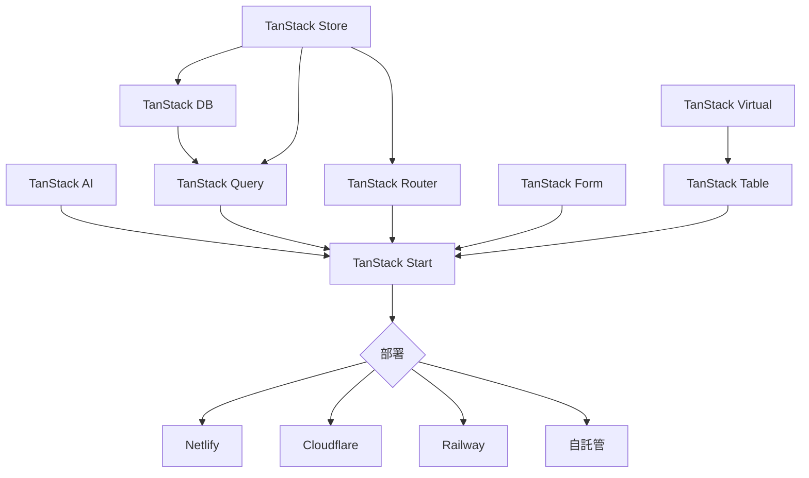

# TanStack 生態系統：策略、採用模式與框架無關的賭注

## 是什麼

TanStack 是 Tanner Linsley 創建的 13+ 個開源庫集合，涵蓋資料獲取、路由、表格、表單、狀態管理，以及現在的全端框架（TanStack Start）。整個生態系統累計下載量超過 40 億次，被 9,000+ 家公司使用，由 36 位核心貢獻者維護。在 2025-2026 年，TanStack 從「React Query 公司」擴展為完整的全端平台，推出 Start（元框架）、DB（響應式客戶端資料庫）、AI（框架無關 AI 工具包）和 Store（客戶端狀態）。

## 為什麼重要

TanStack 代表了 React 生態系統中對 Next.js/Vercel 主導地位最可信的替代方案。其框架無關、廠商中立的理念直接對抗了 React 開發與 Vercel 平台之間的緊密耦合。State of React 2025 調查顯示 Next.js 使用率 80% 但負面情緒達 17%，而 TanStack Start 僅 15% 使用率卻已在使用者中獲得約 50% 的正面評價。

---

## 1. Tanner Linsley 的願景與哲學

### 超越 UI 的「無頭」哲學

無頭概念起源於 React Table v7，Tanner 移除了所有渲染，透過 hooks 提供純邏輯。這一哲學現已擴展到整個生態系統：

| 庫 | 「無頭」的含義 |
|---|---|
| Table | 僅有狀態/邏輯，零標記 — 渲染由你掌控 |
| Form | 透過 hooks 提供驗證 + 狀態，無樣式組件 |
| Virtual | 僅有捲動計算，你來渲染項目 |
| Query | 快取 + 獲取邏輯，不強加資料層觀點 |
| Router | 型別安全的路由樹，渲染由你決定 |
| AI | LLM 編排原語，不強加 UI 觀點 |

核心洞見：**無頭不是關於 UI — 而是分離「做什麼」和「怎麼做」。** 每個庫提供狀態機和邏輯；你帶來渲染、樣式和框架適配器。

### 為什麼選擇框架無關？

Tanner 的理由，從多次訪談中提煉：

1. **超越框架的長壽**：React Table 在 2016 年發布。React 已經大幅改變；Vue、Solid、Svelte 崛起。框架無關的核心能夠在框架更迭中存活。
2. **業務靈活性**：被鎖定在 React-only 庫中的公司在遷移時面臨昂貴的重寫。框架無關 = 保險策略。
3. **維護經濟學**：一個核心 + 薄適配器比 N 個獨立實現更便宜。TanStack Store 作為通用狀態原語，帶有框架特定綁定（React hooks、Solid signals、Vue observables）。

### 信條（官方）

來自 TanStack 發布的信條頁面：
- 「我們為開放網路、開放標準以及自由組合、部署和創新而構建」
- 獨立運營，無控制性投資者
- 任何合作夥伴都不能將技術方向導向其平台
- 庫優先服務開發者；外部整合增強而非約束

### 對 Next.js、Vercel 和 React 生態政治的看法

Tanner 的批評是外交式的：

- **RSC 被「過度開立處方」**：「React Server Components 對特定用例很酷」但被推動為通用解決方案。他偏好的方法：將 RSC 視為「只是異步狀態」，TanStack Query 可以使用現有的快取/過期時間模式管理。
- **Next.js 是強制性的伺服器優先**：用 Next.js 構建純客戶端 SPA 是「困難的」和「痛苦的」。TanStack Start 反轉了這一點：客戶端優先，可選加入伺服器能力。
- **根級 RSC 是錯誤的抽象**：他偏好葉節點的細粒度、可組合 RSC，而非 Next.js 的頁面級伺服器組件（會導致過度失效）。
- **廠商鎖定擔憂**：在 React Summit 2025 上，Tanner 提議打包器應定義標準化 API，讓庫和託管服務遵循 — 消除框架特定部署的需要。

> 「TanStack Start 將客戶端優先模型置於前台和中心，在 TanStack Router 之上添加全端能力如 SSR、伺服器函數和 API 路由，而不強制伺服器優先模型。」

### 商業模式：贊助商資助的開源

TanStack 運行在**合作夥伴贊助模式**上 — 無風投，無商業產品（目前）：

| 收入來源 | 詳情 |
|---------|------|
| 合作夥伴 | 16 個簽約合作夥伴，GitHub Sponsors UI 中每月最高 $12K |
| 合作夥伴交付物 | 整合行銷/獲客活動 |
| Netlify 合作 | 官方部署夥伴（2025 年 3 月），提供資金 + 共同開發 |
| 託管夥伴 | Cloudflare、Netlify、Railway — 均提供資金 |
| 貢獻者補償 | 約 12 位核心貢獻者的月度贊助 + 3-5 份短期合約 |
| 儲備金 | 不斷增長的組織應急基金 |

所有合作關係都是私下簽約的。Tanner 表示：「知道[貢獻者]因其帶來的價值而獲得補償，我睡得更安穩。」

**永續性展望**：Tanner 承認「這種永續性方法的真正考驗將在 2026 年到來」— 兩年的全職 OSS 運作良好，但長期可行性仍是未知數。無 SaaS 產品，無企業版（目前），無風險投資。

---

## 2. 採用和實際使用

### 下載統計

| 套件 | 下載量（2024-2025 期間） | 每週（約） |
|------|------------------------|-----------|
| @tanstack/react-query | ~5.85 億（2024年6月-2025年12月） | ~750 萬/週 |
| @tanstack/vue-query | — | ~34 萬/週 |
| 整個生態（200+ 套件） | 40 億+ 累計 | — |

TanStack Query 單獨：7.44 億+ 總下載量，其中 2025 年 4-12 月為 3.73 億 — 表明加速增長。

### State of React 2025 調查結果

| 指標 | TanStack Query | TanStack Router | TanStack Start | Next.js |
|------|---------------|-----------------|----------------|---------|
| 使用率 | 68% | 年增 45% | 15% | 80% |
| 正面情緒 | 42% | — | ~50%（使用者中） | 27% |
| 負面情緒 | 1% | — | — | 17% |

關鍵要點：TanStack Query 是滿意度最高的資料載入庫。Next.js 使用最廣但批評日增。

### 生產環境中使用 TanStack 的公司

- **9,000+ 家公司**活躍使用中，**33,000+** 在評估/實驗中
- Tanner 聲稱「來自世界上一些最大、最知名的公司」的團隊，涵蓋科技、金融、電商、娛樂、硬體和醫療 — 但具體名稱未公開披露
- **Inngest**（開發者工具）：從 Next.js 遷移到 TanStack Start，開發頁面載入從 10-12 秒降至 2-3 秒，團隊情緒從「我恨這個」轉變為「我簡直不敢相信它有多快」
- **T3.chat**（Theo Browne 的聊天應用）：公開從 Next.js 遷移到 TanStack Start

### 社群規模

| 指標 | 數量 |
|------|------|
| Discord 成員 | 6,300+ |
| GitHub 貢獻者 | 2,790 |
| GitHub 星標（所有倉庫） | 112,660+ |
| 核心貢獻者 | 36 |
| 活躍專案 | 13 |

### 開發者喜歡什麼

- **型別安全**：「路由和參數在編譯時驗證」— 跨導航的自動完成
- **透明度**：「當我第一次嘗試時，我以為我遺漏了什麼，因為它太簡單了 — 它就是能用」
- **無魔法**：不像 Next.js 的慣例，一切都是顯式的 — 你選擇資料如何載入、在哪裡運行、渲染什麼
- **Query 的 DX**：快取失效、後台重新獲取、樂觀更新 —「處理伺服器狀態比任何其他方案都好」
- **更小的包體積**：TanStack Start 在基準測試中比 Next.js 小約 30-35%

### 開發者討厭什麼

- **TanStack Table 複雜度**：「為什麼這個庫這麼複雜？」— 過濾器範例同時引入太多概念（防抖、分頁、排序、大資料集）
- **Table 維護問題**：核心維護者（Kevin Van Cott）承認他「2025 年無法投入足夠時間」且「2026 年組織和交付將是挑戰」
- **Start 生態不成熟**：遷移指南缺少伺服器組件、佈局無路徑分組、opengraph、headers、重定向、404 頁面、中間件和 API 概念
- **DevTools 整合問題**：TanStack Router 和 Query 的 devtools「配合不好」— 面板重疊和衝突（正在透過統一 devtools 面板解決）
- **小社群**：Discord 僅 6.3K vs Next.js 龐大生態意味著更少的 Stack Overflow 答案、教程和範例

---

## 3. TanStack Start vs Next.js

### 哲學差異

```
Next.js:     伺服器優先 → 選擇加入客戶端互動性
TanStack:    客戶端優先 → 選擇加入伺服器能力
```

### 功能比較

| 功能 | TanStack Start | Next.js |
|------|---------------|---------|
| 建構工具 | Vite | Turbopack |
| 路由 | 檔案式，完全型別安全 | 檔案式，慣例驅動 |
| 資料載入 | 顯式 loaders + TanStack Query | RSC + Server Actions + fetch 快取 |
| SSR | 可選，全文檔 SSR | 預設，RSC 原生 |
| Server Components | 正在務實地添加 | 核心架構 |
| 串流 | 可選 | 內建 Suspense |
| 包體積 | 小約 30-35% | 較大（RSC 開銷） |
| 型別安全 | 端到端，編譯時路由 | 部分（需手動型別標註） |
| 部署 | Netlify、Cloudflare、Railway、Vercel、自託管 | Vercel 最佳化，支援其他 |
| 生態成熟度 | RC/1.0，成長中 | 7+ 年，龐大 |
| ISR/SSG | 無內建 | 內建 |
| 圖片最佳化 | 無內建 | next/image |
| DevTools | Router + Query devtools | 無內建 |
| 學習曲線 | 較陡（一切顯式） | 中等（慣例有幫助） |

### 何時選擇 TanStack Start

1. **互動式儀表板和 SPA**：客戶端優先模型擅長處理大部分工作在瀏覽器中進行的應用
2. **TypeScript 重度團隊**：跨路由、loaders、伺服器函數的端到端型別安全
3. **廠商獨立**：在任何地方部署，無 Vercel 最佳化鎖定
4. **現有 TanStack Query 使用者**：從 Query → Router → Start 的自然升級
5. **對 Next.js 複雜度不滿的團隊**：「太多概念」（RSC、Server Actions、快取層、重新驗證）

### 何時選擇 Next.js

1. **內容密集、SEO 關鍵的網站**：ISR、SSG、圖片最佳化成熟且經過實戰考驗
2. **擁有既定 Next.js 知識的大團隊**：生態成熟度、文檔深度、招聘池
3. **AI 生成應用**：2026 年 React + AI 技術棧預設為 Next.js
4. **需要開箱即用**：圖片最佳化、字體、中間件、i18n、分析 — 全部內建
5. **已有 Vercel 合約的企業**：緊密整合提供真正的部署優勢

### 遷移路徑：Next.js 到 TanStack Start

**官方資源**：
- TanStack 提供從 Next.js App Router 的逐步遷移指南
- CLI 工具存在：`next-to-tanstack`（社群構建）
- Jack Herrington（YouTube）發布了 LLM 輔助遷移教程

**真實數據**（Inngest 案例研究）：
- 策略：「暴力遷移」— 一次遷移所有路由，非漸進式
- 時間線：開發伺服器約 1 週，完整儀表板約 2 週（1 位工程師 + AI）
- 僅 2-3 天功能開發受阻
- 結果：本地開發載入時間減少 83%

**遷移指南的已知缺口**：伺服器組件、佈局無路徑分組、opengraph、headers、重定向、404 頁面、中間件、API。

---

## 4. 框架無關的賭注

### 框架支援矩陣（2026）

| 庫 | React | Vue | Solid | Svelte | Angular | Lit | Vanilla |
|----|-------|-----|-------|--------|---------|-----|---------|
| Query | 是 | 是 | 是 | 是 | 是 | — | — |
| Table | 是 | 是 | 是 | 是 | — | 是 | 是 |
| Form | 是 | 是 | 是 | 是 | 是 | 是 | — |
| Virtual | 是 | 是 | 是 | 是 | — | — | — |
| Router | 是 | — | 是 | — | — | — | — |
| Start | 是 | — | 是 | — | — | — | — |
| Store | 是 | 是 | 是 | 是 | 是 | — | 是 |
| DB | 是 | 是 | 是 | 是 | — | — | 是 |
| AI | 是 | — | 是 | — | — | — | 是 |

### React 是否是事實上的標準？

**是，壓倒性地。** @tanstack/react-query 每週約 750 萬下載量 vs @tanstack/vue-query 的約 34 萬 — **22:1 的比率**。React 是社群、教程、DevTools 和生產實戰測試集中的地方。

然而，框架無關的架構即使在 React 占主導地位的情況下也提供真正的價值：
1. **Vue 適配器有意義**：34 萬週下載量不可忽視 — 那是一個真實的社群
2. **Solid 適配器使 TanStack Start 成為可能**：Start 同時支援 Solid 和 React 是差異化因素
3. **未來保險**：如果新框架崛起，核心已準備就緒

### 架構：框架無關如何運作

```
              TanStack Store（通用狀態原語）
                        |
            +-----------+-----------+
            |           |           |
       React 適配器  Solid 適配器  Vue 適配器
       (hooks)      (signals)    (observables)
            |           |           |
       useQuery()  createQuery()  useQuery()
```

每個 TanStack 庫從一個提供者無關的核心開始，管理狀態、邏輯和副作用。框架適配器是薄包裝器：
- 使用框架原生原語訂閱狀態變更
- 暴露框架慣用 API（React 的 hooks，Solid 的 signals）
- 與核心共享 90%+ 的程式碼庫

### 維護負擔

適配器架構意味著：
- **Bug 修復在核心中一次完成**，傳播到所有框架
- **功能在所有框架中同時發布**（通常）
- **測試負擔線性增長**，非二次方 — 徹底測試核心，測試適配器的綁定正確性
- **重大適配器變更**（如最近從單體到模組化適配器的拆分）需要跨所有框架的協調

真正的成本不是適配器 — 是**文檔**。每個框架都需要自己的文檔、範例和指南。這是維護壓力的真正體現。

---

## 5. 開發者體驗和生態成熟度

### DevTools

| 工具 | 狀態 | 能力 |
|------|------|------|
| Query DevTools | 成熟，瀏覽器面板 + Chrome 擴展 | 即時檢查查詢、變更、快取狀態 |
| Router DevTools | 可用 | 路由樹視覺化、導航除錯 |
| 統一 DevTools | 新推出 | 單一面板容納所有 TanStack devtools + 自訂整合 |
| AI DevTools | Alpha | 同構 LLM 工作流除錯（伺服器 + 客戶端） |

**痛點**：同時使用 Router + Query 時，devtools 面板此前會衝突。統一 devtools 面板（2025 年推出）透過提供分頁容器解決了此問題。

### 文檔質量

**優勢**：
- 每個庫都有完整的 API 參考文檔
- 檔案式路由文檔配有視覺範例
- TanStack 自己的 npm 統計工具展示了 dogfooding
- 比較頁面（Start vs Next.js、Router vs React Router）詳盡

**劣勢**：
- 遷移指南有已知缺口（缺少概念）
- Table 範例因同時引入太多概念而受到批評
- 與 Next.js 生態相比第三方教程較少
- 社群反饋：「能有更好的[遷移]指南嗎？」表明文檔缺口

### 學習曲線

**TanStack Query**：低門檻 — 大多數開發者可以在一天內上手。心智模型（伺服器狀態 vs 客戶端狀態）一旦理解就很直覺。

**TanStack Router**：中等 — 檔案式路由「視覺上直覺且易於理解」，但高級型別安全使用了「非常複雜的型別」。當 TypeScript 錯誤出現時，可能很難解讀。

**TanStack Table**：陡峭 — 無頭方法意味著你自己構建一切。學習曲線是最常見的投訴。

**TanStack Start**：對 Next.js 遷移者來說中等偏陡 — 一切顯式意味著你需要理解 Next.js 自動做了什麼。

### 已知痛點

1. **Table 對簡單場景過於複雜**：構建基本表格需要理解無頭範式，對簡單資料展示而言是過度設計
2. **Router TypeScript 錯誤**：高級型別推斷產生深度嵌套的錯誤訊息
3. **Start 仍然年輕**：缺少 Next.js 使用者期望的功能（圖片最佳化、中間件、i18n）
4. **社群規模**：較小的生態意味著更少的現成解決方案
5. **貢獻者頻寬**：關鍵維護者（如 Table 的 Kevin Van Cott）時間受限

---

## 6. 2025-2026 路線圖與方向

### 當前庫狀態

| 庫 | 版本 | 成熟度 |
|----|------|--------|
| Query | v5 | 經過實戰檢驗，生產標準 |
| Router | v1 | 生產就緒 |
| Table | v8 | 經過實戰檢驗，維護受限 |
| Form | v1 | 穩定 |
| Virtual | v3 | 經過實戰檢驗 |
| Store | v0.x | 較新，生態基礎 |
| Start | RC → 1.0 | 候選發布，接近穩定 |
| DB | Beta | 響應式客戶端資料庫，差分資料流 |
| AI | Alpha | 框架無關 AI 工具包 |

### TanStack Start 1.0

- 目前處於候選發布 — 「此構建預計以 1.0 發布，等待最終反饋、文檔完善和幾個最後修復」
- RSC 支援正在最終確定：「務實的、快取感知的，將 RSC 視為另一種伺服器端狀態流」
- 與 React 並行的 Solid 框架支援

### TanStack DB（Beta）

Tanner 預告的「巨大新庫」— 響應式客戶端優先資料庫：

- **Collections（集合）**：記錄的正規化存儲（類似客戶端資料庫表）
- **Live queries（即時查詢）**：訂閱結果，隨底層資料變更而增量更新
- **差分資料流引擎**：僅重新計算受影響的查詢部分 — 即使對複雜 join 也能亞毫秒更新
- **樂觀更新**：即時本地變更，自動伺服器協調
- **基於 TanStack Query 構建**：擴展而非取代
- 適配器：React、Vue、Solid、Svelte、Vanilla JS

DB 代表 TanStack 最大的架構賭注：從「快取你的 API 回應」（Query）到「構建響應式客戶端資料層」（DB）。

### TanStack AI（Alpha）

定位為「AI 工具的瑞士」— 明確對抗 Vercel AI SDK：

| 功能 | TanStack AI | Vercel AI SDK |
|------|-------------|---------------|
| 哲學 | 框架無關，無鎖定 | Next.js 最佳化 |
| 伺服器語言 | JavaScript、Python、PHP | 僅 JavaScript |
| AI 提供者 | OpenAI、Anthropic、Gemini、Ollama | OpenAI、Anthropic 等 |
| 客戶端框架 | React、Solid、Vanilla（即將支援 Svelte） | React、Next.js |
| 工具系統 | 同構、型別安全、一次定義 | 框架特定 |
| 定價 | 免費，永遠開源 | 免費，開源 |
| DevTools | 同構（伺服器 + 客戶端） | 無內建 |

**路線圖**：無頭聊天機器人 UI 組件（Radix 風格 — 功能完整、無樣式），更多提供者（AWS Bedrock、OpenRouter）。

Tanner 的明確承諾：「我們不賣服務……不會有廠商鎖定在角落等著你。也永遠不會有。」

### 全端願景



策略很清晰：將現代 Web 應用的每一層構建為可組合、框架無關的原語，然後在 TanStack Start 中組裝它們。每個庫可獨立使用，但在生態系統中獲得協同效應。

### 2026 優先事項

1. **Start 1.0 穩定版發布**，完整 RSC 支援
2. **DB 正式版** — 最大的技術賭注
3. **AI 工具包擴展** — 更多提供者、無頭 UI 組件
4. **Router 改進**計劃於 2026 年
5. **一個「巨大的新庫」**將「為整個生態系統開啟新篇章」— 尚未公開

---

## 取捨

### TanStack 犧牲了什麼

1. **生態成熟度**：Start 沒有圖片最佳化、內建 i18n、分析或等效於 Next.js 的中間件
2. **社群規模**：Discord 6.3K vs Next.js 龐大生態 — 更少的現成答案、教程、組件庫
3. **企業採用證明**：無具名的世界 500 強客戶（vs Next.js 在 Netflix、TikTok 等）
4. **財務永續性**：合作夥伴贊助模式在規模上未經驗證 — Tanner 自己稱 2026 年為「真正的考驗」
5. **文檔完整性**：遷移指南有缺口，Table 文檔令人窒息
6. **貢獻者頻寬**：關鍵維護者時間受限（Table 維護者的 2025 年坦白）

### TanStack 獲得了什麼

1. **開發者信任**：Query 僅 1% 的負面情緒是非凡的 — 開發者真心喜愛 DX
2. **架構獨立**：無廠商鎖定，到處可部署
3. **型別安全領先**：沒有其他框架能匹配的端到端編譯時驗證
4. **漸進式採用**：單獨使用 Query，之後添加 Router，升級到 Start — 不是全有或全無
5. **框架生存力**：如果 React 衰落，核心庫繼續存在
6. **誠實工程**：無「魔法」慣例 — 一切顯式且可除錯

---

## 替代方案

### 資料獲取（vs TanStack Query）

| 替代方案 | 優勢 | 相比 Query 的劣勢 |
|---------|------|-----------------|
| SWR（Vercel） | 更簡單的 API，更輕量 | 快取功能較弱，無 mutations 管理 |
| Apollo Client | GraphQL 原生，正規化快取 | 笨重，僅限 GraphQL |
| tRPC | 與後端的端到端型別安全 | 需要 tRPC 後端，非框架無關 |
| RTK Query（Redux） | Redux 生態整合 | Redux 依賴，更多樣板程式碼 |

### 全端框架（vs TanStack Start）

| 替代方案 | 優勢 | 相比 Start 的劣勢 |
|---------|------|-----------------|
| Next.js | 成熟生態、RSC 原生、Vercel 最佳化 | 強制伺服器優先、廠商耦合、複雜度 |
| Remix/React Router v7 | Loader/action 模型、漸進增強 | 合併混亂、社群分裂 |
| Astro | 內容優先、島嶼架構 | 非 SPA 導向 |
| SolidStart | 真正的響應性、更小的包 | 比 React 更小的社群 |

---

## 可借鑒的模式

### 可重用的模式

1. **無頭架構**：分離邏輯/狀態與渲染。適用於任何可重用庫 — 不僅限於 UI 組件
2. **框架無關核心 + 薄適配器**：構建一次狀態機，為 React/Vue/Solid 包裝。TanStack Store 模式可複製
3. **漸進式生態採用**：Query（獨立） → Router（添加路由） → Start（全端）。讓使用者漸進採用，永不強制全有或全無
4. **型別安全的檔案路由**：檔案系統慣例 + 程式碼生成 = 零成本的路由型別安全
5. **客戶端優先，伺服器可選**：對互動式應用比伺服器優先框架更好的 DX
6. **贊助資助 OSS**：16 個合作夥伴，每個約 $12K/月 + 託管合作夥伴交易 = 無需風投或 SaaS 的永續發展
7. **RSC 作為異步狀態**：將伺服器組件視為 TanStack Query 管理的另一個快取層 — 統一心智模型

### 應避免的反模式

1. **不要為內容網站構建 TanStack Start**：Next.js 的 ISR/SSG/圖片最佳化對內容密集、SEO 關鍵的網站確實更好
2. **不要一次採用全部技術棧**：從 Query 開始，證明價值，然後擴展。生態系統在漸進式採用時效果最佳
3. **不要低估社群規模**：較小的生態意味著你會自己寫更多程式碼 — 為此預算

## References

- [The State of TanStack, Two Years of Full-Time OSS](https://tanstack.com/blog/tanstack-2-years) — Tanner 關於永續性、商業模式和增長的博文
- [TanStack Ethos](https://tanstack.com/ethos) — 官方哲學和價值觀
- [TanStack Start vs Next.js](https://tanstack.com/start/latest/docs/framework/react/start-vs-nextjs) — 官方比較
- [Feature Comparison: Start vs Next.js vs React Router](https://tanstack.com/start/latest/docs/framework/react/comparison) — 詳細功能矩陣
- [Why Developers Are Leaving Next.js for TanStack Start (Appwrite)](https://appwrite.io/blog/post/why-developers-leaving-nextjs-tanstack-start) — 開發者情緒分析
- [Reducing Local Dev Time by 83%: Why We Migrated Off Next.js (Inngest)](https://www.inngest.com/blog/migrating-off-nextjs-tanstack-start) — 生產遷移案例研究
- [Next Gen Fullstack React with TanStack — Syntax #833](https://syntax.fm/show/833/next-gen-fullstack-react-with-tanstack/transcript) — Tanner 訪談：RSC、哲學
- [Exploring TanStack Ecosystem with Tanner Linsley (Callstack)](https://www.callstack.com/podcasts/exploring-tanstack-ecosystem-with-tanner-linsley) — 無頭哲學深潛
- [TanStack AI Alpha: Your AI, Your Way](https://tanstack.com/blog/tanstack-ai-alpha-your-ai-your-way) — AI 工具包公告
- [TanStack Adds Framework-Agnostic AI Toolkit (The New Stack)](https://thenewstack.io/tanstack-adds-framework-agnostic-ai-toolkit/) — AI 工具包分析
- [TanStack in 2026: From Query to Full-Stack (Code With Seb)](https://www.codewithseb.com/blog/tanstack-ecosystem-complete-guide-2026) — 完整生態指南
- [React Survey Shows TanStack Gains (The Register)](https://www.theregister.com/2026/02/17/react_survey_shows_tanstack_gains/) — State of React 2025 結果
- [State of React 2025: Data Loading](https://2025.stateofreact.com/en-US/libraries/data-loading/) — 官方調查資料
- [Netlify Becomes Official Deployment Host for TanStack (DevClass)](https://devclass.com/2025/03/21/netlify-becomes-official-deployment-host-for-tanstack-as-alternative-to-next-js-and-vendor-lock-in/) — Netlify 合作
- [TanStack Start: A New Meta Framework Powered by React or SolidJS (InfoQ)](https://www.infoq.com/news/2025/11/tanstack-start-v1/) — Start 1.0 RC 公告
- [TanStack DB Enters Beta (InfoQ)](https://www.infoq.com/news/2025/08/tanstack-db-beta/) — DB beta 公告
- [Migrate from Next.js (TanStack Docs)](https://tanstack.com/start/latest/docs/framework/react/migrate-from-next-js) — 官方遷移指南
- [next-to-tanstack CLI](https://github.com/sidiDev/next-to-tanstack) — 社群遷移工具
- [TanStack NPM Stats](https://tanstack.com/stats/npm) — 官方下載統計工具
- [@tanstack/react-query (npm)](https://www.npmjs.com/package/@tanstack/react-query) — React Query 套件
- [@tanstack/vue-query (npm)](https://www.npmjs.com/package/@tanstack/vue-query) — Vue Query 套件（~34 萬/週）
- [T3.chat Moved from Next.js to TanStack Start](https://deepakness.com/raw/t3-from-nextjs-to-tanstack/) — Theo Browne 遷移
- [Tanner Linsley: Building Sustainable Open Source Projects (Scarf)](https://about.scarf.sh/post/tanner-linsley) — 商業模式討論
- [TanStack DB GitHub](https://github.com/TanStack/db) — DB 原始碼和版本
