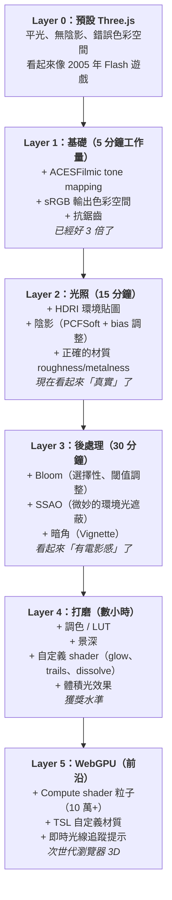

# Three.js 視覺設計：如何讓東西好看

## What — 這是什麼

一份實用的技術拆解，涵蓋讓 Three.js 場景看起來像電影般的所有技術——從光劍發光效果到照片級渲染。這不是理論——而是一本具體設定、shader 和後處理 pass 的配方書，把平淡的 3D 變成人們真正想看的東西。

核心洞察：**80% 的視覺品質來自 5 樣東西** — tone mapping、環境光照、bloom、色彩空間和陰影。把這些搞對，一切都好看。漏掉任何一個，一切都業餘。

## 「電影感」配方

### 第一步：渲染器基礎

這 4 行是「預設 Three.js」和「看起來專業」的區別：

```javascript
const renderer = new THREE.WebGLRenderer({ antialias: true });
renderer.toneMapping = THREE.ACESFilmicToneMapping;
renderer.toneMappingExposure = 1.8;
renderer.outputColorSpace = THREE.SRGBColorSpace;
```

| 設定 | 做什麼 | 為什麼重要 |
|------|--------|-----------|
| `ACESFilmicToneMapping` | 用電影業 ACES 標準壓縮 HDR 到顯示範圍 | 濃郁黑色、柔和高光、無裁切——「電影感」 |
| `toneMappingExposure` | 控制多少光進入（像相機曝光） | 太低 = 暗/渾濁，太高 = 泛白。從 1.0-2.0 開始 |
| `SRGBColorSpace` | 應用 gamma 校正適應人眼感知 | 沒有它色彩就不對——中間調太亮、暗部被壓 |
| `antialias` | 平滑鋸齒邊緣 | 免費的視覺升級，輕微性能開銷 |

**Tone mapping 對比：**

| 演算法 | 特性 | 最適合 |
|--------|------|--------|
| `NoToneMapping` | 原始 HDR 值，高光爆掉 | 永遠別用在正式場景 |
| `LinearToneMapping` | 平坦均勻曝光 | 技術視覺化 |
| `ReinhardToneMapping` | 柔和，略帶沖洗感 | 戶外場景 |
| `ACESFilmicToneMapping` | 豐富對比，電影感 | **大多數場景的預設選擇** |
| `AgXToneMapping` | 最精確的色彩保留 | 色彩保真度最重要時 |

### 第二步：環境光照（HDRI）

這是最大的單次視覺升級。一張 HDRI 貼圖取代幾十個手動燈光，讓一切看起來真實：

```javascript
import { RGBELoader } from 'three/examples/jsm/loaders/RGBELoader.js';

const rgbeLoader = new RGBELoader();
rgbeLoader.load('/studio.hdr', (texture) => {
  texture.mapping = THREE.EquirectangularReflectionMapping;
  scene.background = texture;    // 360° 背景
  scene.environment = texture;   // 照亮場景中的一切
});
```

**解析度指引：**
- 純光照（無可見反射）：256x256 就夠
- 有可見反射的金屬材質：至少 1024x1024
- 當作可見背景：2048x2048 或更高

**去哪找 HDRI：** [Poly Haven](https://polyhaven.com/) — 免費、高品質、CC0 授權。

**進階技巧：** 可以用低解析度 HDRI 做光照，高解析度做背景：
```javascript
scene.environment = lowResHDRI;    // 便宜的光照
scene.background = highResHDRI;    // 漂亮的背景
```

### 第三步：會對光反應的材質

預設材質看起來像塑膠。這些設定修正它：

**寫實金屬：**
```javascript
new THREE.MeshStandardMaterial({
  color: 0xcccccc,
  roughness: 0.2,    // 低 = 光亮, 高 = 霧面
  metalness: 1.0,    // 1 = 金屬, 0 = 非金屬
  envMapIntensity: 1.0
});
```

**玻璃/水晶：**
```javascript
new THREE.MeshPhysicalMaterial({
  roughness: 0,
  metalness: 0,
  transmission: 1,    // 1 = 完全透明
  ior: 1.5,          // 玻璃 = 1.5, 鑽石 = 2.42, 水 = 1.33
  thickness: 0.5     // 影響折射深度
});
```

**材質核心原則：**
- `roughness` 和 `metalness` 是兩個最重要的旋鈕——其他都是次要的
- 真實世界材質要嘛是金屬的（`metalness: 1`）要嘛是非金屬的（`metalness: 0`）——中間值很少見
- `MeshPhysicalMaterial` 擴展了 `MeshStandardMaterial`，加入清漆、透射、光澤——只在需要時用（更貴）

### 第四步：陰影

陰影讓物件「踩在地上」。沒有它們，一切都在飄：

```javascript
renderer.shadowMap.enabled = true;
renderer.shadowMap.type = THREE.PCFSoftShadowMap;

const light = new THREE.DirectionalLight(0xffffff, 1);
light.castShadow = true;
light.shadow.mapSize.set(2048, 2048);
light.shadow.bias = -0.0001;         // 修復陰影痘（shadow acne）
light.shadow.normalBias = 0.02;      // 修復 peter-panning

mesh.castShadow = true;
ground.receiveShadow = true;
```

**假接觸陰影（更便宜，通常更好看）：**
在物件下方放一個半透明平面配徑向漸層貼圖，假造接觸陰影而不需要任何 shadow map 計算。很多獲獎網站都用這招。

### 第五步：後處理

後處理就是 3D 的電影調色。它拿到渲染好的圖像然後增強它。

**基本設定：**
```javascript
import { EffectComposer } from 'three/examples/jsm/postprocessing/EffectComposer.js';
import { RenderPass } from 'three/examples/jsm/postprocessing/RenderPass.js';
import { UnrealBloomPass } from 'three/examples/jsm/postprocessing/UnrealBloomPass.js';
import { OutputPass } from 'three/examples/jsm/postprocessing/OutputPass.js';

const composer = new EffectComposer(renderer);
composer.addPass(new RenderPass(scene, camera));       // 1. 渲染場景
composer.addPass(new UnrealBloomPass(                  // 2. 加 bloom
  new THREE.Vector2(window.innerWidth, window.innerHeight),
  0.8,    // 強度 (0.5-2.0)
  0.5,    // 半徑 (0.5-1.0)
  0.85    // 亮度閾值 (0.8-1.0)
));
composer.addPass(new OutputPass());                     // 3. 色彩空間轉換

// 渲染迴圈中：composer.render() 代替 renderer.render()
```

**管線順序很重要：**
```
RenderPass → [Effect Passes] → OutputPass
     ↑              ↑               ↑
  渲染 3D      Bloom/SSAO 等    sRGB + tone map
```

## 光劍效果：完整拆解

這就是激發這次調研的東西——以下是確切做法：

### 劍刃發光

劍刃本身用**兩層**：

1. **核心：** 圓柱/膠囊 mesh + 明亮自發光材質（`emissive: 0xffffff, emissiveIntensity: 2`）
2. **外層光暈：** 相同幾何放大 1.2-1.5 倍 + 自定義 glow shader

**Glow shader 技巧：**
```javascript
// 頂點 shader 概念
// 光暈強度 = dot(視角方向, 表面法線) 的反值
// 邊緣背對攝影機 → 高光暈
// 中心面對攝影機 → 低光暈
float intensity = pow(1.0 - dot(viewDir, normal), 2.0);
```

原理是球體/圓柱的邊緣法線垂直於視角——所以 dot product 很低，而 `1 - 低 = 高`，邊緣光暈強。跟真實霓虹燈管邊緣最亮是同樣道理。

### 動態拖尾（揮劍軌跡）

**Polyboard 技術**：

1. 每幀追蹤劍尖位置 → 建立折線（3D 點列表）
2. 在每個點垂直於運動方向展開 → 建立有寬度的三角帶
3. 沿帶狀從 alpha 1.0（最新）衰減到 0.0（最舊）
4. 套用同樣的 glow shader + bloom 後處理
5. 每幀移除舊點保持拖尾長度恆定

**現成方案：** [TrailRendererJS](https://github.com/mkkellogg/TrailRendererJS) — 指定拖尾形狀和目標 Object3D 就能附加動態拖尾。

### 選擇性 Bloom（只讓該亮的亮）

問題：bloom 影響所有亮的東西。你只想讓光劍發光，不是白色地板。

**Layer 技術：**
```
1. 把發光物件分配到 Layer 1
2. Bloom composer：只渲染 Layer 1 物件 + bloom
3. Main composer：渲染完整場景
4. 合併：把 bloom 層合成到主渲染之上
```

在 bloom pass 期間，非發光物件暫時設為黑色材質避免貢獻 bloom。然後在最終渲染前恢復材質。

**替代方案：** 把 `UnrealBloomPass.threshold` 調高到只有自發光材質能觸發 bloom。更簡單但控制較少。

## 視覺效果配方書

### 體積光 / 上帝光線（God Rays）

**徑向模糊技術：**
1. 把光源渲染為白色、所有遮擋物渲染為黑色 → 遮擋紋理
2. 從光源位置向外套用徑向模糊 shader
3. 加法混合結果到正常場景渲染之上

**便宜替代：** 用 `ConeGeometry` + 加法混合 + 低透明度 → 從任何點光源即時產生「光束」。

### 大氣霧

```javascript
scene.fog = new THREE.FogExp2(0x000000, 0.02);  // 指數霧
// 或
scene.fog = new THREE.Fog(0x000000, 10, 100);    // 線性霧（近, 遠）
```

霧增加景深感、隱藏遠處 LOD 切換、營造氛圍。深色霧 = 神秘。淺色霧 = 夢幻。

### 溶解 / 碎裂效果

用噪聲紋理搭配自定義 shader：
1. 在每個 fragment 採樣噪聲
2. 把噪聲值和 `progress` uniform（0→1）做比較
3. 如果 noise < progress，`discard` 該 fragment
4. 在邊緣（noise ≈ progress）加上明亮自發光色 + bloom

### 調色 / LUT

要電影感色彩：
- **分離調色：** 陰影染藍/青，高光染橙/暖色 → 即刻「好萊塢」感
- **S 曲線對比：** 暗的更暗、亮的更亮 → 更豐富的圖像
- **3D LUT（.cube 檔）：** 從 DaVinci Resolve/Photoshop 輸出的專業調色，作為後處理套用

## 視覺品質的 5 層級

從「預設灰」到「獲獎級」：



## Tradeoffs — 取捨

| 技術 | 視覺衝擊 | 性能開銷 | 複雜度 |
|------|---------|---------|--------|
| Tone mapping | 高 | 零 | 1 行 |
| HDRI 環境光 | 非常高 | 低 | 5 行 |
| 陰影 | 高 | 中 | 需要調參 |
| Bloom | 高 | 中 | 用 pmndrs 很簡單 |
| SSAO | 中 | 中高 | 用 pmndrs 很簡單 |
| 選擇性 bloom | 高 | 高（2 次渲染） | 複雜 |
| 體積光 | 非常高 | 高 | 自定義 shader |
| 景深 DOF | 中 | 中 | 用 pmndrs 很簡單 |
| 動態拖尾 | 高（動作場景） | 低中 | TrailRendererJS |
| 調色/LUT | 中 | 低 | 需要設計眼光 |

## 最新動態 (2026)

### WebGPU 全面進入生產環境

自 2025 年以來，Three.js 視覺品質工具鏈最大的變化是 **WebGPU 瀏覽器全面支援**。2025 年 9 月，Apple 在 Safari 26（macOS、iOS、iPadOS、visionOS）中發布了 WebGPU 支援——最後一個主要阻礙消失了。加上 Chrome/Edge（自 v113，2023 年 5 月）和 Firefox（v139+，2025 年 6 月），你現在可以把 WebGPU 發布給所有用戶，並自動回退到 WebGL 2。自 Three.js r171 起，只需一行 import：

```javascript
import * as THREE from 'three/webgpu';
// 在舊瀏覽器上自動回退到 WebGL 2
```

draw-call 密集場景通常有 **2-10 倍**的性能提升，某些資料視覺化場景甚至達到 100 倍。這直接影響視覺品質：更多 GPU 預算意味著更多後處理 pass、更高的 shadow map 解析度、更密集的粒子系統，而不會掉幀。

### TSL（Three Shader Language）取代原始 GLSL

Three.js 引入了 **TSL** ——一個基於 JavaScript 的、節點式的 shader 編寫系統，從同一份程式碼編譯到 WGSL（WebGPU）和 GLSL（WebGL）。不再寫 shader 字串，而是組合有型別的 JavaScript 函數：

```javascript
import { uniform, sin, positionLocal } from 'three/tsl';

const time = uniform(0);
const material = new THREE.MeshStandardNodeMaterial();
material.colorNode = sin(time).mul(0.5).add(0.5);
material.positionNode = positionLocal.add(sin(time).mul(0.1));
```

TSL 徹底消除了 GLSL/WGSL 的分裂。編譯器自動處理臨時變數優化、uniform 重用和死碼消除。對視覺效果工作來說，這意味著自定義 glow shader、溶解效果和程序化材質只需寫一次就能在兩個渲染器上運行。一個不斷增長的 [TSL 紋理庫](https://github.com/boytchev/tsl-textures) 提供了現成的程序化噪聲、圖案和效果作為可組合節點。

### WebGPU 原生後處理（TSL 節點）

對於 WebGPU 專案，Three.js 現在提供**基於 TSL 節點的內建後處理**——在 WebGPU 上下文中取代 pmndrs/postprocessing 的需要。原生方案支援 compute shader 實現環境光遮蔽、bloom、降噪和景深等效果，全都只需幾行 TSL 定義。pmndrs/postprocessing 庫仍然是純 WebGL 專案的最佳選擇，但新的 WebGPU 工作建議使用原生 TSL 管線。

### 3D 高斯潑濺（Gaussian Splatting）整合

**高斯潑濺**——從點雲捕獲渲染照片級真實場景——已從研究好奇心走向生產就緒的 Three.js 整合。[Spark](https://sparkjs.dev/) 是目前積極維護的渲染器，支援多種檔案格式、與標準 Three.js mesh 的整合，以及在所有設備上的快速渲染。它讓傳統 3D 幾何體和攝影測量捕獲的環境混合成為可能，開啟了混合真實/合成視覺設計的新路徑。2025 年是 3DGS 從研究走向生產的一年；2026 年是它成為標準工具的拐點。

### React Three Fiber v9 + WebGPU

React Three Fiber（R3F）現在通過**非同步 `gl` prop 工廠**支援 WebGPU。`Canvas` 元件接受一個非同步函數來建立和初始化 `WebGPURenderer`，使 React 生態系統完全相容新的渲染管線。結合 TSL 節點材質，R3F 專案現在可以存取 compute shader、原生後處理和所有 WebGPU 性能優勢，而不需要離開 React 範式。

### 「Vibe Coding」與 AI 輔助 3D

2025 年 2 月，Andrej Karpathy 創造了 **「vibe coding」** 這個詞——用 AI 工具透過描述你想要什麼來生成代碼。Three.js 成為這個工作流程的理想庫：簡單設定（只需 JavaScript，無需伺服器）、即時視覺回饋、龐大的訓練語料庫。「Vibe coding」成為 Collins 字典 2025 年度詞彙，Three.js 是 AI 輔助 3D 開發的首選庫。這大幅降低了創建視覺上令人印象深刻的 3D 網頁體驗的門檻。

### Three.js 生態系統規模

Three.js 現在超過 **270 萬週 NPM 下載量**——是競爭 3D 網頁庫的 270 倍。生態系統已擴展到網站之外，涵蓋博物館裝置、零售展示、資料視覺化儀表板和實體互動場館。這個庫的主導地位意味著為 Three.js 開發的視覺技術實際上就是網頁 3D 的標準。

## Steal — 可直接復用的模式

### 1. 四行基礎
```javascript
renderer.toneMapping = THREE.ACESFilmicToneMapping;
renderer.toneMappingExposure = 1.5;
renderer.outputColorSpace = THREE.SRGBColorSpace;
renderer.shadowMap.enabled = true;
```
先做這個。永遠。沒得商量。

### 2. HDRI = 即刻真實感
一個 `.hdr` 檔取代一堆燈。用 Poly Haven。同時設為 `scene.background` 和 `scene.environment`。

### 3. 光劍技術棧
`自發光核心 mesh + 放大 glow shader mesh + bloom 後處理 + 動態拖尾（Polyboard）` = 完整武器發光效果。

### 4. 透過 Layer 做選擇性 Bloom
把自發光物件分到獨立 Layer。只在那個 layer 渲染 bloom pass。合成到主場景之上。這是每個發光物件 demo 都用的標準技術。

### 5. pmndrs 後處理棧
別自己搭 EffectComposer 鏈——用 `@react-three/postprocessing` 或 `pmndrs/postprocessing`。它們把效果合併到更少的 pass 中以獲得更好的性能。

### 6. 先假裝再做真的
- 假接觸陰影（漸層平面）> 真 shadow map（簡單場景）
- 假光暈（放大 mesh + glow shader）> 完整 bloom pass（單個物件）
- 假體積光（圓錐 + 加法混合）> 真 god rays（大多數情況）
- 烘焙光照貼圖 > 即時光源（靜態場景）

最好看的 Three.js 場景，通常是假裝最多東西的那些。

## References

### Lightsaber & Weapon Effects

- [WebGL Lightsaber — Polyboard trail technique breakdown](https://glampert.com/2015/06-07/webgl-lightsaber/)
- [Slow-Motion Sword Trail Effect in Three.js — 80.lv](https://80.lv/articles/slow-motion-sword-trail-effect-recreated-with-three-js)
- [TrailRendererJS — 3D motion trail library for Three.js](https://github.com/mkkellogg/TrailRendererJS)
- [Star Wars Blaster Demo — Three.js Forum](https://discourse.threejs.org/t/blaster-demo-inspired-by-star-wars-blaster/14190)
- [X-Wing Star Wars WebGL Game](https://amilajack.com/xwing/)
- [My Star Wars Game — Three.js Forum](https://discourse.threejs.org/t/my-starwars-game/61887)

### Glow & Bloom

- [Selective Unreal Bloom — Wael Yasmina](https://waelyasmina.net/articles/unreal-bloom-selective-threejs-post-processing/)
- [Three.js Official Selective Bloom Example](https://threejs.org/examples/webgl_postprocessing_unreal_bloom_selective.html)
- [UnrealBloomPass Docs](https://threejs.org/docs/pages/UnrealBloomPass.html)
- [SelectiveUnrealBloomPass Library — GitHub](https://github.com/VisualSource/selectiveUnrealBloomPass)
- [Fake Glow Material for Three.js — GitHub](https://github.com/ektogamat/fake-glow-material-threejs)
- [Geometric Glow Extension — GitHub](https://github.com/jeromeetienne/threex.geometricglow)
- [Shader Glow Demo — Lee Stemkoski](https://stemkoski.github.io/Three.js/Shader-Glow.html)
- [Best Way to Achieve Glow — Three.js Forum](https://discourse.threejs.org/t/whats-the-best-way-to-achieve-a-glow-effect/59724)

### Post-Processing

- [pmndrs/postprocessing Library — GitHub](https://github.com/pmndrs/postprocessing)
- [Post-Processing with Three.js — Wael Yasmina](https://waelyasmina.net/articles/post-processing-with-three-js-the-what-and-how/)
- [Post-Processing Tutorial — Sangil Lee](https://sangillee.com/2025-01-15-post-processing/)
- [SSAO Example — Three.js Official](https://threejs.org/examples/webgl_postprocessing_ssao.html)
- [Bloom — React Postprocessing Docs](https://react-postprocessing.docs.pmnd.rs/effects/bloom)
- [SSAO — React Postprocessing Docs](https://react-postprocessing.docs.pmnd.rs/effects/ssao)
- [Dissolve Effect with Shaders and Particles — Codrops](https://tympanus.net/codrops/2025/02/17/implementing-a-dissolve-effect-with-shaders-and-particles-in-three-js/)

### Lighting & Environment

- [How to Create Ultra-Realistic Scenes — Wael Yasmina](https://waelyasmina.net/articles/how-to-create-ultra-realistic-scenes-in-three.js/)
- [Realistic Render Lesson — Three.js Journey](https://threejs-journey.com/lessons/realistic-render)
- [Environment Map Lesson — Three.js Journey](https://threejs-journey.com/lessons/environment-map)
- [HDR Environment Mapping — Three.js Official Example](https://threejs.org/examples/webgl_materials_envmaps_hdr.html)
- [Live Envmaps for Realistic Studio Lighting — Three.js Forum](https://discourse.threejs.org/t/live-envmaps-and-getting-realistic-studio-lighting-almost-for-free/35627)
- [FastHDR Environment Maps — Needle](https://cloud.needle.tools/articles/fasthdr-environment-maps)
- [HDR Lighting in Three.js — PixelCapture](https://pixel-capture.com/tutorials/hdr-lighting-threejs-article)

### Tone Mapping & Color

- [Tone Mapping Overview — Three.js Forum](https://discourse.threejs.org/t/tone-mapping-overview/75204)
- [Tone Mapping Example — Three.js Official](https://threejs.org/examples/webgl_tonemapping.html)
- [Color Management in Three.js — Don McCurdy](https://www.donmccurdy.com/2020/06/17/color-management-in-threejs/)
- [Color Grading Techniques in Three.js — MoldStud](https://moldstud.com/articles/p-an-in-depth-look-at-color-grading-techniques-in-threejs-post-processing)
- [AgX Tone Mapping Support — GitHub Issue](https://github.com/mrdoob/three.js/issues/27362)

### Volumetric & Atmospheric Effects

- [Volumetric Light Rays — Codrops](https://tympanus.net/codrops/2022/06/27/volumetric-light-rays-with-three-js/)
- [Volumetric Lighting with Raymarching — Maxime Heckel](https://blog.maximeheckel.com/posts/shaping-light-volumetric-lighting-with-post-processing-and-raymarching/)
- [God Rays Post-Processing Tutorial — Red Stapler](https://redstapler.co/godrays-three-js-post-processing-tutorial/)
- [Volumetric Light Example — GitHub](https://github.com/netpraxis/volumetric_light_example)
- [Volumetric Lights with Radial Blur — TheFrontDev](https://www.thefrontdev.co.uk/creating-volumetric-lights-with-radial-blur-in-three.js-using-layers/)
- [God Rays Forum Discussion](https://discourse.threejs.org/t/help-with-persistent-volumetric-light-god-rays-light-shafts-sunbeam-sunburst-for-underground-cave-scene/79085)

### Trails & Particles

- [Particle Trail Effect — Three.js Forum](https://discourse.threejs.org/t/particle-trail-effect/31642)
- [Creating a Mouse Trail — Leanne Werner](https://medium.com/@leannewerner/creating-a-mouse-trail-in-three-js-fb15346ce784)
- [Three Ways to Create 3D Particle Effects — Varun Vachhar](https://varun.ca/three-js-particles/)
- [Interactive Particle Simulation — Three.js Forum](https://discourse.threejs.org/t/interactive-particle-simulation/67581)

### General Visual Quality & Best Practices

- [100 Three.js Best Practices (2026) — Utsubo](https://www.utsubo.com/blog/threejs-best-practices-100-tips)
- [Building Efficient Scenes: Quality + Performance — Codrops](https://tympanus.net/codrops/2025/02/11/building-efficient-three-js-scenes-optimize-performance-while-maintaining-quality/)
- [Design Fundamentals with Three.js — Zero to Mastery](https://zerotomastery.io/blog/design-fundamentals-with-threejs/)
- [How Can I Make This Scene More Beautiful — Three.js Forum](https://discourse.threejs.org/t/how-can-i-make-this-game-scene-more-beautiful/56620)
- [Building a Vaporwave Scene — Maxime Heckel](https://blog.maximeheckel.com/posts/vaporwave-3d-scene-with-threejs/)

### Learning Resources

- [Three.js Journey (Paid Course)](https://threejs-journey.com/)
- [Poly Haven — Free HDRIs, Textures, Models](https://polyhaven.com/)
- [Awwwards Three.js Websites — Inspiration](https://www.awwwards.com/websites/three-js/)
- [Codrops Three.js Demos](https://tympanus.net/codrops/hub/tag/three-js/)

### 2026 Updates Sources

- [What Changed in Three.js 2026? WebGPU, Vibe Coding & Beyond — Utsubo](https://www.utsubo.com/blog/threejs-2026-what-changed)
- [Migrate Three.js to WebGPU (2026) — The Complete Checklist — Utsubo](https://www.utsubo.com/blog/webgpu-threejs-migration-guide)
- [Field Guide to TSL and WebGPU — Maxime Heckel](https://blog.maximeheckel.com/posts/field-guide-to-tsl-and-webgpu/)
- [TSL: A Better Way to Write Shaders in Three.js — Three.js Roadmap](https://threejsroadmap.com/blog/tsl-a-better-way-to-write-shaders-in-threejs)
- [Three.js Shading Language Wiki — GitHub](https://github.com/mrdoob/three.js/wiki/Three.js-Shading-Language)
- [TSL Textures Collection — GitHub](https://github.com/boytchev/tsl-textures)
- [Spark — Advanced 3D Gaussian Splatting Renderer for Three.js](https://sparkjs.dev/)
- [GaussianSplats3D — Three.js Gaussian Splatting](https://github.com/mkkellogg/GaussianSplats3D)
- [3D Gaussian Splatting Complete Guide (2026) — Utsubo](https://www.utsubo.com/blog/gaussian-splatting-guide)
- [React Three Fiber v9 Migration Guide](https://r3f.docs.pmnd.rs/tutorials/v9-migration-guide)
- [R3F WebGPU Starter — Anderson Mancini](https://github.com/ektogamat/r3f-webgpu-starter)
- [Interactive Text Destruction with Three.js, WebGPU, and TSL — Codrops](https://tympanus.net/codrops/2025/07/22/interactive-text-destruction-with-three-js-webgpu-and-tsl/)
- [Three.js BatchedMesh and Post Processing with WebGPURenderer — Codrops](https://tympanus.net/codrops/2024/10/30/interactive-3d-with-three-js-batchedmesh-and-webgpurenderer/)
- [Three.js Releases — GitHub](https://github.com/mrdoob/three.js/releases)
