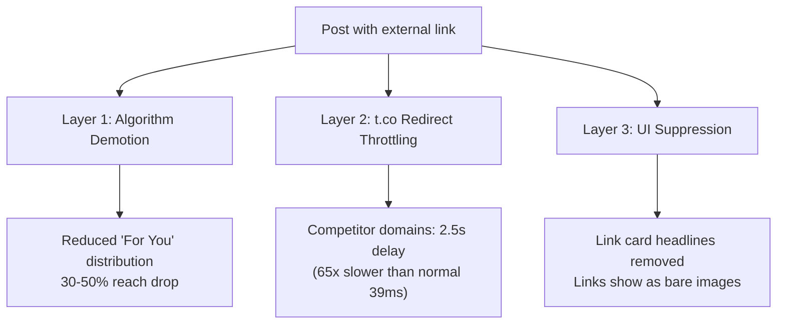

# X (Twitter) Articles & External Link Penalty Playbook

## X Articles Overview

X Articles launched March 8, 2024 — long-form rich-text posts directly on X. X's answer to Medium/Substack, distributed through X's social graph.

| Feature | Spec |
|---------|------|
| Limit | 100,000 chars (~15K-20K words) |
| Eligibility | Premium ($8/mo), Premium+ ($16/mo), Organizations |
| Formatting | Headings, bold, italic, lists, images, video, embeds |
| Distribution | Timelines, profile Articles tab, shareable URL, Google-indexed |

**Sweet spot: 1,000-2,500 words.** Medium's highest-engagement posts average 1,600 words. X's audience is even more attention-scarce.

## External Link Penalty: What It Actually Is

X algorithmically suppresses posts with external URLs. This is the single most important mechanic to understand on the platform.

### Three Layers of Punishment



**Layer 1 — Algorithm demotion**: Posts with links get fewer impressions in "For You" feed. Users click away → don't return to engage → algorithm reads it as low-quality → feedback loop.

**Layer 2 — t.co throttling** (competitor-specific): The Markup proved in Sept 2023 that Bluesky, Facebook, Instagram, Substack links get artificially delayed 2,544ms vs 39ms normal — **65x slower**.

**Layer 3 — UI suppression**: Since Aug 2023, link card headlines removed. Links appear as context-free images.

### What Counts as "External Link"

| Link Type | Penalty |
|-----------|---------|
| Any URL outside x.com | Base penalty (30-50% reach drop) |
| Competitor domains (Bluesky, FB, IG, Substack) | Base + t.co throttle (65x slower) |
| URL shorteners (bit.ly, tinyurl) | Base + extra ~10% spam penalty |
| X Articles, X Spaces (internal) | **No penalty** |

No whitelist exists. YouTube, Medium, news sites, personal blogs — all penalized equally.

### The Data

**Buffer study (18.8M posts, 71K accounts, Aug 2024-Aug 2025)** — the definitive dataset:

| Content Type | Free Account | Premium Account |
|-------------|-------------|-----------------|
| Text posts | 0.40% | 0.90% |
| Video posts | 0.25% | 0.85% |
| Image posts | 0.20% | 0.42% |
| **Link posts** | **0.00%** | **~0.28%** |

After March 2025, non-Premium link posts hit **absolute zero engagement**. Not low — zero. X has effectively paywalled link sharing.

Other studies confirming:
- Jesse Colombo A/B test (Oct 2024): **94% impression drop** for link posts
- Kucharski crossover trial: Substack links get **24% fewer likes** (p=0.02)
- HashMeta timeline: penalty escalated from 20-30% (2023) → 50% single / 70% multi-link (May 2025)

### Premium Makes a Massive Difference

| Tier | Avg Impressions/Post | Link Engagement | Link Penalty |
|------|---------------------|-----------------|-------------|
| Free | <100 | 0% | Total suppression |
| Premium ($8/mo) | ~600 | ~0.28% | Reduced but viable |
| Premium+ ($16/mo) | ~1,550 | Higher | Least penalized |

Premium gets ~10x reach. For links specifically, the gap is infinite.

### Why X Does This

1. **Time-on-platform** — every link click = user leaving X's ecosystem
2. **Native content moat** — push Articles, Spaces, long posts as alternatives
3. **Premium pressure** — free accounts can't share links effectively, driving subscriptions

Musk confirmed Nov 25, 2024 (responding to Paul Graham): *"Just write a description in the main post and put the link in the reply. This just stops lazy linking."*

### Workarounds (Ranked by Effectiveness)

| Strategy | Effectiveness | Notes |
|----------|-------------|-------|
| Link in reply | 3x impressions vs main post | Musk-endorsed, most common |
| Republish as X Article | No penalty at all | Requires Premium, only for your own content |
| Thread with delayed link | High | Put link in tweet 3-5, build engagement first |
| Quote tweet with hook | Medium-high | QT gets better distribution than original |
| Strong description + image | Medium | Musk: "interesting description/image will get distribution" |
| Screenshot + "link in bio" | Avoids penalty | Terrible UX |

**Things that make it worse**: URL shorteners (+10% penalty), multiple links in one post (70% vs 50%), breaking URL with spaces (still detected).

### Oct 2025: "Link Penalty Removed" — Reality Check

Nikita Bier (X Head of Product) announced link penalty removal in October 2025 with a new in-app browser. He claimed "Links are not deboosted" and early data showed 8x reach improvement.

**Reality as of early 2026**: Non-Premium accounts still get zero engagement on link posts. The "removal" appears incomplete or Premium-only.

## Algorithm Priorities (2026)

| Signal | Weight |
|--------|--------|
| Bookmarks | Highest |
| Replies | Very high |
| Quote tweets | High |
| Reposts | Medium |
| Likes | Low |

From the open-sourced algorithm (2023):

| Signal | Scoring Weight |
|--------|---------------|
| Likes | 1x |
| Bookmarks | 10x |
| Link clicks | 11x |
| Profile clicks | 12x |
| Replies | 13.5x |
| Retweets | 20x |

**Jan 2026**: xAI open-sourced a Grok-powered algorithm (Rust codebase, transformer model, no manual rules). Link penalties are now implicit in learned behavior, not explicit code.

## Writing High-Engagement Content

### The Hook (First 2 Lines = Everything)

| Hook Type | Example |
|-----------|---------|
| Bold declarative | "Most startup advice is designed to make VCs rich, not founders." |
| Curiosity gap | "What if the best developers are actually 19% slower with AI tools?" |
| Controversial | "React is a tax on your users that we all pretend is fine." |
| Transformation | "In 2010, I was broke. In 2024, I retired at 40." |
| Vulnerable | "I got fired from my first dev job in 3 weeks." |
| Data-backed | "I analyzed 5,000 startup pitches. 83% failed for the same reason." |

**Formula**: Specific number + unexpected outcome + implied value.

### Structure for Scanners

80% of X users scan, not read:
- Headers every 200-300 words
- Bold key phrases (scannable takeaways)
- Tables over paragraphs (2x engagement)
- Short paragraphs (2-3 sentences max)
- Numbered lists for rankings, bullets for comparisons

### Content Types by Engagement

| Type | Level |
|------|-------|
| Contrarian insight + data | Highest |
| Personal failure → lesson | Very high |
| Step-by-step tutorial | High |
| Curated comparison ("I tested 7 tools") | High |
| Industry analysis | Medium-high |
| Opinion/commentary | Medium |

### Articles vs Threads

| Factor | Thread | Article |
|--------|--------|---------|
| Structure | Listicle, numbered tips | Essay, deep analysis |
| Discovery | 3x engagement vs single tweet | Google/X search indexed |
| Length | 4-8 tweets | 1,000-2,500 words |
| Audience | Casual scrollers | Intentional readers |
| Shelf life | 2-hour window | Long (searchable URL) |
| SEO | Rarely indexed | Indexed |

**Decision rule**: Numbered points → Thread. Cohesive essay → Article.

## Distribution Strategy

| Factor | Best Practice |
|--------|--------------|
| Best days (B2B) | Tue-Thu |
| Best time | 9-11 AM target timezone |
| Critical window | First 2 hours (80%+ engagement drop after) |
| Time split | 70% engaging others, 30% creating |
| Hashtags | 1-2 max (3+ hurts) |
| Posting frequency | 3-5 tweets/day |

### Content Pipeline

```
Thread (test idea) → Article (expand winner) → Excerpt tweets (recycle)
Article → Substack newsletter → LinkedIn Article (cross-platform)
```

## Steal-Worthy Patterns

1. **"I tested X so you don't have to"** — curated comparisons with clear verdicts always win
2. **Data-backed contrarian takes** — "Everyone says X, but I found Z" = highest engagement format
3. **Thread → Article pipeline** — test as thread, expand winners
4. **Reply-first growth** — 70/30 engage/create ratio
5. **Bookmark bait** — tutorials, checklists, frameworks get highest algorithm weight
6. **Zero-link strategy** — everything on-platform, links in replies only
7. **Get Premium** — free accounts posting links are invisible

## References

### X Articles & Content Strategy
- [X Help Center — About Articles](https://help.x.com/en/using-x/articles)
- [TechCrunch — X allows Premium+ users to publish articles](https://techcrunch.com/2024/03/08/x-allows-premium-users-and-organizations-to-publish-articles/)
- [Hootsuite — Do Long-Form X Posts Give You More Reach?](https://blog.hootsuite.com/experiment-x-threads-vs-longform-posts/)
- [Ship30for30 — How to Write Twitter Thread Hooks](https://www.ship30for30.com/post/how-to-write-viral-twitter-thread-hooks-with-6-clear-examples)
- [Buffer — How I Went Viral on X](https://buffer.com/resources/viral-on-x-twitter/)
- [1PercentBetter — My Formula for Viral X Posts](https://www.1percentbetter.io/p/formula-viral-x-posts)

### External Link Penalty Research
- [Buffer — Do Posts with Links Affect Performance on X?](https://buffer.com/resources/links-on-x/) — 18.8M post study
- [Buffer — Does X Premium Really Boost Your Reach?](https://buffer.com/resources/x-premium-review/)
- [The Markup — Twitter Is Still Throttling Competitors' Links](https://themarkup.org/investigations/2023/09/15/twitter-is-still-throttling-competitors-links-check-for-yourself) — t.co throttling proof
- [Washington Post — Musk's Twitter throttles links](https://www.washingtonpost.com/technology/2023/08/15/twitter-x-links-delayed/)
- [BusinessToday — Musk confirms X deprioritises link posts](https://www.businesstoday.in/technology/news/story/elon-musk-confirms-that-x-deprioritises-posts-with-links-to-discourage-lazy-linking-455115-2024-11-26)
- [Adam Kucharski — How much does X suppress Substack links?](https://kucharski.substack.com/p/how-much-does-x-suppress-substack)
- [Jesse Colombo — Link penalty A/B test](https://x.com/TheBubbleBubble/status/1849818873018610090)
- [Nieman Lab — X makes overtures to journalists](https://www.niemanlab.org/2025/10/x-makes-overtures-to-journalists-with-new-feature-designed-to-improve-reach-for-links/)

### Algorithm & Platform Data
- [SocialBee — How the X Algorithm Works in 2026](https://socialbee.com/blog/twitter-algorithm/)
- [HashMeta — Major Twitter Algorithm Changes 2025](https://hashmeta.com/insights/twitter-algorithm-changes-2025)
- [Sprout Social — How the Twitter Algorithm Works in 2026](https://sproutsocial.com/insights/twitter-algorithm/)
- [WebFX — X Marketing Benchmarks 2026](https://www.webfx.com/blog/social-media/x-twitter-marketing-benchmarks/)
- [SocialRails — How to Grow on Twitter/X 2026](https://socialrails.com/blog/how-to-grow-on-twitter-x-complete-guide)
- [Avenue Z — 2025/2026 X Organic Social Media Guide](https://avenuez.com/blog/2025-2026-x-twitter-organic-social-media-guide-for-brands/)
- [Influencer Marketing Hub — X Premium Users Get 10x More Reach](https://influencermarketinghub.com/x-premium-users-get-10x-more-reach-report/)
- [GitHub: twitter/the-algorithm](https://github.com/twitter/the-algorithm)
