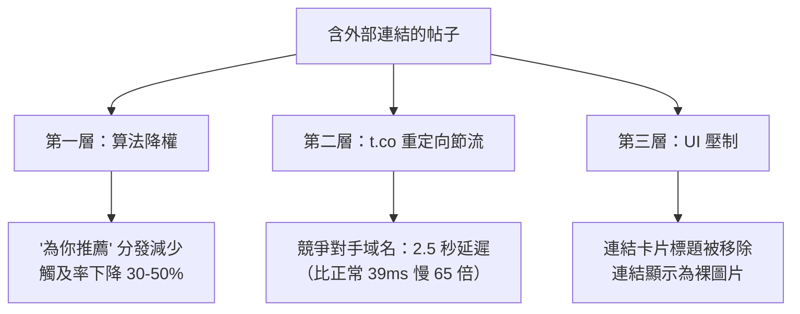

# X (Twitter) Articles 與外部連結懲罰完全手冊

## X Articles 概覽

X Articles 於 2024 年 3 月 8 日上線 — 直接在 X 平台發佈富文本長文。X 對 Medium/Substack 的回應，通過 X 的社交圖譜分發。

| 特性 | 規格 |
|------|------|
| 上限 | 100,000 字符（約 15K-20K 英文詞） |
| 資格 | Premium ($8/月)、Premium+ ($16/月)、Organizations |
| 格式 | 標題、粗體、斜體、列表、圖片、影片、嵌入 |
| 分發 | 時間線、個人資料 Articles 標籤、可分享 URL、Google 索引 |

**最佳長度：1,000-2,500 字。** Medium 互動最高的文章平均 1,600 字。X 的用戶注意力更稀缺。

## 外部連結懲罰：到底是什麼

X 通過算法壓制含外部 URL 的帖子。這是平台上最重要的機制。

### 三層懲罰



**第一層 — 算法降權**：含連結帖子在「為你推薦」中曝光更少。用戶點擊離開 → 不返回互動 → 算法判定為低品質 → 反饋循環。

**第二層 — t.co 節流**（針對競爭對手）：The Markup 2023 年 9 月證實 Bluesky、Facebook、Instagram、Substack 連結被人為延遲 2,544ms vs 正常 39ms — **慢 65 倍**。

**第三層 — UI 壓制**：2023 年 8 月起，連結卡片標題被移除。連結顯示為無上下文的圖片。

### 什麼算「外部連結」

| 連結類型 | 懲罰 |
|---------|------|
| 任何 x.com 外的 URL | 基礎懲罰（觸及率下降 30-50%） |
| 競爭對手域名（Bluesky、FB、IG、Substack） | 基礎 + t.co 節流（慢 65 倍） |
| 網址縮短器（bit.ly、tinyurl） | 基礎 + 額外 ~10% 垃圾訊息懲罰 |
| X Articles、X Spaces（內部） | **無懲罰** |

不存在白名單。YouTube、Medium、新聞網站、個人部落格 — 一律懲罰。

### 數據

**Buffer 研究（1,880 萬帖子，71K 帳戶，2024 年 8 月-2025 年 8 月）**— 決定性數據集：

| 內容類型 | 免費帳戶 | Premium 帳戶 |
|---------|---------|-------------|
| 文字帖子 | 0.40% | 0.90% |
| 影片帖子 | 0.25% | 0.85% |
| 圖片帖子 | 0.20% | 0.42% |
| **連結帖子** | **0.00%** | **~0.28%** |

2025 年 3 月後，非 Premium 連結帖子互動率為**絕對零**。不是低 — 是零。X 實質上將連結分享置於付費牆之後。

其他確認研究：
- Jesse Colombo A/B 測試（2024 年 10 月）：連結帖子**曝光量下降 94%**
- Kucharski 交叉試驗：Substack 連結**少 24% 點讚**（p=0.02）
- HashMeta 時間線：懲罰從 20-30%（2023）→ 50% 單連結 / 70% 多連結（2025 年 5 月）

### Premium 的巨大差異

| 等級 | 平均曝光/帖子 | 連結互動率 | 連結懲罰 |
|------|-------------|-----------|---------|
| 免費 | <100 | 0% | 完全壓制 |
| Premium ($8/月) | ~600 | ~0.28% | 減少但可行 |
| Premium+ ($16/月) | ~1,550 | 更高 | 懲罰最輕 |

Premium 獲得約 10 倍觸及率。連結方面，差距是無限的。

### 為什麼 X 要這樣做

1. **平台停留時間** — 每次連結點擊 = 用戶離開 X 生態
2. **原生內容護城河** — 推動 Articles、Spaces、長文作為替代
3. **Premium 壓力** — 免費帳戶無法有效分享連結，推動訂閱

Musk 2024 年 11 月 25 日確認（回應 Paul Graham）：*「只要在主帖寫描述，把連結放在回覆裡。這只是阻止懶人貼連結。」*

### 變通方法（按效果排名）

| 策略 | 效果 | 備註 |
|------|------|------|
| 連結放回覆中 | 曝光高 3 倍 | Musk 認可，最常用 |
| 作為 X Article 重發 | 無懲罰 | 需 Premium，僅限自有內容 |
| Thread 延遲連結 | 高 | 連結放第 3-5 條推文，先建立互動 |
| 引用推文 + Hook | 中高 | QT 分發優於原帖 |
| 強描述 + 圖片 | 中 | Musk：「有趣描述/圖片會獲得分發」|
| 截圖 +「連結在 bio」 | 避免懲罰 | 用戶體驗差 |

**會更糟的做法**：網址縮短器（+10% 懲罰）、一帖多連結（70% vs 50%）、空格打斷 URL（仍被檢測）。

### 2025 年 10 月：「連結懲罰移除」— 現實檢驗

Nikita Bier（X 產品負責人）宣布移除連結懲罰，推出應用內瀏覽器。聲稱「連結沒有被降權」，早期數據顯示 8 倍觸及增長。

**2026 年初的現實**：非 Premium 帳戶發連結仍然零互動。「移除」似乎不完整或僅限 Premium。

## 算法權重（2026）

| 信號 | 權重 |
|------|------|
| 收藏（Bookmark） | 最高 |
| 回覆 | 非常高 |
| 引用推文 | 高 |
| 轉發 | 中 |
| 點讚 | 低 |

開源算法（2023）的評分：

| 信號 | 評分權重 |
|------|---------|
| 點讚 | 1 倍 |
| 收藏 | 10 倍 |
| 連結點擊 | 11 倍 |
| 個人資料點擊 | 12 倍 |
| 回覆 | 13.5 倍 |
| 轉推 | 20 倍 |

**2026 年 1 月**：xAI 開源 Grok 驅動的算法（Rust 代碼庫，transformer 模型，無手動規則）。連結懲罰現在隱含在學習行為中，不在顯式代碼裡。

## 寫出高互動內容

### Hook（前 2 行 = 一切）

| Hook 類型 | 範例 |
|-----------|------|
| 大膽斷言 | 「大多數創業建議是為了讓 VC 賺錢，不是創辦人。」 |
| 好奇心缺口 | 「如果最好的開發者用 AI 工具反而慢了 19% 呢？」 |
| 爭議性 | 「React 是我們都假裝沒問題的用戶稅。」 |
| 轉變故事 | 「2010 年我破產了。2024 年我 40 歲退休了。」 |
| 脆弱坦白 | 「我第一份開發者工作 3 週就被開除了。」 |
| 數據支撐 | 「我分析了 5,000 份創業 pitch。83% 因同一原因失敗。」 |

**公式**：具體數字 + 意外結果 + 暗示價值。

### 為掃描者設計結構

80% 的 X 用戶掃描，不閱讀：
- 每 200-300 字一個標題
- 加粗關鍵語句（可掃描的 takeaway）
- 表格代替段落（互動高 2 倍）
- 短段落（最多 2-3 句）
- 編號列表用於排名，項目符號用於對比

### 按互動排名的內容類型

| 類型 | 程度 |
|------|------|
| 有數據的反直覺洞察 | 最高 |
| 個人失敗 → 教訓 | 非常高 |
| 步驟教學 | 高 |
| 策展型對比（「我測試了 7 個工具」） | 高 |
| 行業分析 | 中高 |
| 觀點/評論 | 中 |

### Articles vs Threads

| 因素 | Thread | Article |
|------|--------|---------|
| 結構 | 列表、編號技巧 | 文章、深度分析 |
| 被發現性 | 比單推高 3 倍互動 | Google/X 搜索索引 |
| 長度 | 4-8 則推文 | 1,000-2,500 字 |
| 受眾 | 隨意瀏覽者 | 有意圖的讀者 |
| 保質期 | 2 小時窗口 | 長（可搜索 URL） |
| SEO | 很少被索引 | 被索引 |

**決策規則**：有編號要點 → Thread。連貫文章 → Article。

## 分發策略

| 因素 | 最佳做法 |
|------|----------|
| 最佳日（B2B） | 週二至週四 |
| 最佳時間 | 目標時區上午 9-11 點 |
| 關鍵窗口 | 前 2 小時（之後互動下降 80%+） |
| 時間分配 | 70% 互動別人，30% 創作 |
| Hashtags | 最多 1-2 個（3+ 有害） |
| 發文頻率 | 每天 3-5 則 |

### 內容管線

```
Thread（測試想法）→ Article（擴展贏家）→ 摘錄推文（回收）
Article → Substack 電子報 → LinkedIn Article（跨平台）
```

## 可偷走的模式

1. **「我測試了 X 所以你不用」格式** — 有明確結論的策展對比永遠贏
2. **有數據的反直覺觀點** — 「大家都說 X，但我發現 Z」= 最高互動格式
3. **Thread → Article 管線** — Thread 測試，擴展贏家
4. **回覆優先增長** — 70/30 互動/創作比例
5. **收藏誘餌** — 教學、清單、框架獲最高算法權重
6. **零連結策略** — 一切留平台內，連結只放回覆
7. **買 Premium** — 免費帳戶發連結等於隱形

## References

### X Articles 與內容策略
- [X Help Center — About Articles](https://help.x.com/en/using-x/articles)
- [TechCrunch — X allows Premium+ users to publish articles](https://techcrunch.com/2024/03/08/x-allows-premium-users-and-organizations-to-publish-articles/)
- [Hootsuite — Do Long-Form X Posts Give You More Reach?](https://blog.hootsuite.com/experiment-x-threads-vs-longform-posts/)
- [Ship30for30 — How to Write Twitter Thread Hooks](https://www.ship30for30.com/post/how-to-write-viral-twitter-thread-hooks-with-6-clear-examples)
- [Buffer — How I Went Viral on X](https://buffer.com/resources/viral-on-x-twitter/)
- [1PercentBetter — My Formula for Viral X Posts](https://www.1percentbetter.io/p/formula-viral-x-posts)

### 外部連結懲罰研究
- [Buffer — Do Posts with Links Affect Performance on X?](https://buffer.com/resources/links-on-x/) — 1,880 萬帖子研究
- [Buffer — Does X Premium Really Boost Your Reach?](https://buffer.com/resources/x-premium-review/)
- [The Markup — Twitter Is Still Throttling Competitors' Links](https://themarkup.org/investigations/2023/09/15/twitter-is-still-throttling-competitors-links-check-for-yourself) — t.co 節流證據
- [Washington Post — Musk's Twitter throttles links](https://www.washingtonpost.com/technology/2023/08/15/twitter-x-links-delayed/)
- [BusinessToday — Musk confirms X deprioritises link posts](https://www.businesstoday.in/technology/news/story/elon-musk-confirms-that-x-deprioritises-posts-with-links-to-discourage-lazy-linking-455115-2024-11-26)
- [Adam Kucharski — How much does X suppress Substack links?](https://kucharski.substack.com/p/how-much-does-x-suppress-substack)
- [Jesse Colombo — Link penalty A/B test](https://x.com/TheBubbleBubble/status/1849818873018610090)
- [Nieman Lab — X makes overtures to journalists](https://www.niemanlab.org/2025/10/x-makes-overtures-to-journalists-with-new-feature-designed-to-improve-reach-for-links/)

### 算法與平台數據
- [SocialBee — How the X Algorithm Works in 2026](https://socialbee.com/blog/twitter-algorithm/)
- [HashMeta — Major Twitter Algorithm Changes 2025](https://hashmeta.com/insights/twitter-algorithm-changes-2025)
- [Sprout Social — How the Twitter Algorithm Works in 2026](https://sproutsocial.com/insights/twitter-algorithm/)
- [WebFX — X Marketing Benchmarks 2026](https://www.webfx.com/blog/social-media/x-twitter-marketing-benchmarks/)
- [SocialRails — How to Grow on Twitter/X 2026](https://socialrails.com/blog/how-to-grow-on-twitter-x-complete-guide)
- [Avenue Z — 2025/2026 X Organic Social Media Guide](https://avenuez.com/blog/2025-2026-x-twitter-organic-social-media-guide-for-brands/)
- [Influencer Marketing Hub — X Premium Users Get 10x More Reach](https://influencermarketinghub.com/x-premium-users-get-10x-more-reach-report/)
- [GitHub: twitter/the-algorithm](https://github.com/twitter/the-algorithm)
