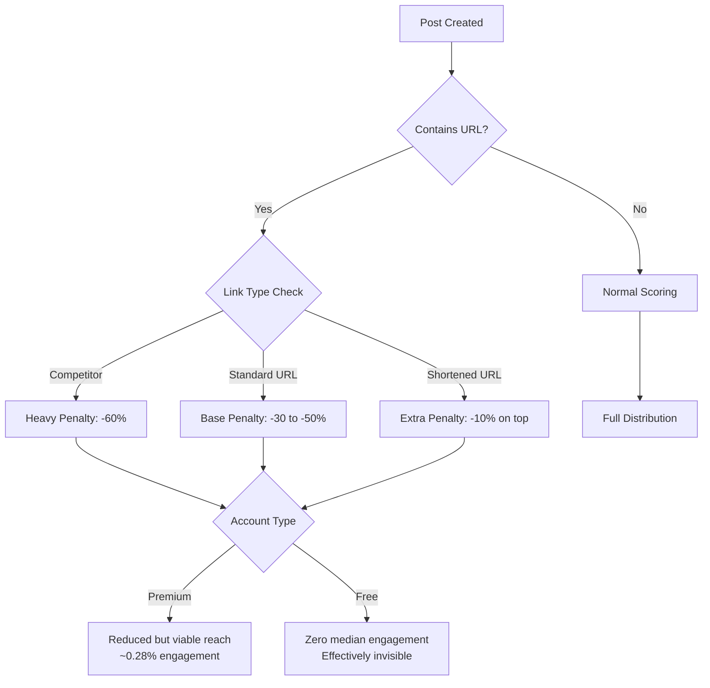
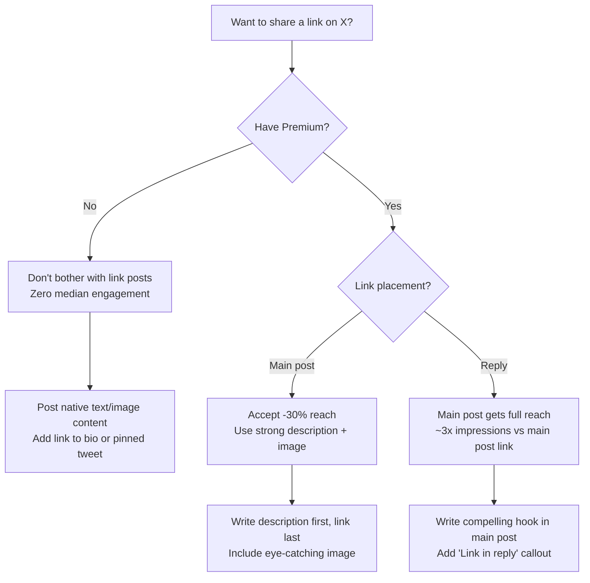

# X (Twitter) External Link Penalty: Complete Mechanism & Data Deep Analysis

## What: The Three-Layer Penalty System

X (formerly Twitter) has implemented the most aggressive external link suppression system of any major social platform. Between 2023 and October 2025, posts containing external URLs were systematically buried through a three-layer mechanism:

1. **Algorithmic downranking** -- 30-50% reach reduction in the recommendation algorithm
2. **t.co redirect throttling** -- competitor links artificially delayed by 65x (2,544ms vs 39ms)
3. **UI suppression** -- link card titles/descriptions stripped, leaving only an image

In October 2025, X officially "removed" the link penalty. But as of March 2026, non-Premium accounts posting links still receive **zero median engagement** -- the penalty's structural effects persist through the pay-to-play tier system.

## Why: The Business Logic Behind Link Suppression

### The Core Tension

Social platforms monetize attention. Every click on an external link is a user leaving the platform -- reducing ad impressions, session time, and engagement metrics that drive revenue.

Musk made this explicit in October 2023:

> "Our algorithm tries to optimize time spent on X, so links don't get as much attention, because there is less time spent if people click away."

### The Three Strategic Goals

| Goal | Mechanism | Result |
|------|-----------|--------|
| Maximize session time | Suppress outbound links | Users stay on-platform |
| Drive Premium revenue | Free accounts get zero link reach | Creators forced to subscribe |
| Weaken competitors | Throttle rival platform links | Facebook/Bluesky/Substack access degraded |

### The "Lazy Linking" Justification

In November 2024, Paul Graham (2M followers) complained publicly that "Twitter's biggest flaw" was link deprioritization. Musk responded:

> "Just write a description in the main post and put the link in the reply. This just stops lazy linking."

Graham's retort captured the absurdity: "If I write a new essay and tweet a link to it, that's 'lazy linking.' But if I tweet that I've written a new essay and then put the link in a reply, that's somehow better?"

The term "lazy linking" is Musk's own invention -- it is not standard social media terminology.

## How: Technical Architecture of Link Suppression

### Layer 1: Algorithmic Downranking

**Penalty escalation timeline (from open-sourced algorithm data):**

| Period | Single Link Penalty | Multiple Links | Competitor Links | Shortened URLs |
|--------|-------------------|----------------|-----------------|----------------|
| Mar 2024 | -20 to -30% | -40% | -60% | +0% extra |
| May 2025 (peak) | -30 to -50% | -70% | -60% | +10% extra |
| Oct 2025 (announced removal) | Officially 0% | Officially 0% | Officially 0% | Officially 0% |
| Mar 2026 (actual) | 0% for Premium, still zero engagement for free | Same pattern | Unknown | Unknown |

### Layer 2: t.co Redirect Throttling

The Markup's investigation (September 2023) revealed that X weaponized its mandatory link shortener (t.co) to artificially delay access to competitor platforms.

**Methodology:** Researchers tested 20 suspected throttled domains against a control group of 59 random sites (news outlets, nonprofits, Fortune 500 companies). Testing ran over four days with hourly measurements across three U.S. cities (New York, Detroit, Los Angeles).

| Metric | Competitor Links | Control Group | Bit.ly (Same Links) |
|--------|-----------------|---------------|---------------------|
| Average redirect time | 2,544 ms | 39 ms | 50 ms |
| Ratio vs control | **65x slower** | 1x (baseline) | 1.3x |

**Throttled domains confirmed:** Bluesky, Facebook, Instagram, Substack, Patreon, WhatsApp, Messenger.

The delay was consistent at all hours and across all geographic locations tested, ruling out infrastructure issues. Bit.ly redirected the same competitor links in ~50ms, proving the delay was intentional on X's side.

An antitrust researcher concluded: "It seems rather clear that this is an anti-competitive tactic designed to undermine X's rivals and keep users on its platform."

### Layer 3: UI Suppression (Link Card Stripping)

In October 2023, X removed headlines and descriptions from link preview cards on iOS and web. Posts linking to articles showed only the thumbnail image with no title, description, or source attribution.

**Before:** Full Twitter Card with headline, description, source domain, and image
**After:** A bare image that users had to click blindly, with no context about the destination

This was partially reversed in late 2023 when Musk announced title overlays on card images, but the format never returned to the original rich card display.

## Evidence: The Data

### Buffer Research (18.8M Posts, 71K Accounts)

The most comprehensive study, conducted by Buffer data scientist Julian Winternheimer, analyzed 18.8 million posts from 71,000 X accounts (August 2024 - August 2025).

**Engagement rates by content type and account tier:**

| Content Type | Free Account | Premium Account |
|-------------|-------------|-----------------|
| Text posts | ~0.40% | ~0.90% |
| Video posts | ~0.25% | ~0.85% |
| Image posts | ~0.20% | ~0.42% |
| Link posts | **0.00%** | ~0.28% |

Text posts outperformed: +30% vs video, +37% vs images, +53% vs link posts, +113% vs retweets.

**The pay-to-play gap:**

| Account Tier | Median Impressions/Post | Median Engagement Rate |
|-------------|----------------------|----------------------|
| Free | <100 | 0.00% (since Mar 2025) |
| Premium Basic | Slightly above free | ~0.55% |
| Premium | ~600 | ~0.49% |
| Premium+ | ~1,550 | ~0.53% |

Premium accounts receive a **4x visibility boost** for in-network content and **2x boost** for out-of-network content. The reach multiplier is approximately **10x for Premium** and **15x for Premium+** compared to free accounts.

### Jesse Colombo A/B Test

Financial commentator Jesse Colombo ([@TheBubbleBubble](https://x.com/TheBubbleBubble/status/1849818873018610090)) conducted a controlled test. Removing the external link from an otherwise identical post resulted in a **1,700% increase in views** (65,400 views, 74 comments, 258 reposts, 873 favorites, 97 bookmarks). The inverse: including a link caused approximately a **94% drop in impressions**.

### Platform-Wide Engagement Decline

Overall reach declined across X, dropping from ~1,000 median impressions in August 2024 to under 750 by August 2025. But the decline hit free accounts disproportionately -- Premium engagement climbed from 0.3% to 0.4% in the same period, while regular accounts fell from 0.15% to 0.0%.

## The October 2025 "Removal": What Actually Happened

### The Announcement

On October 14, 2025, X announced the removal of algorithmic penalties on posts with external links. Early data showed promising results:

- ~8x increase in link post reach
- ~13x increase in follower growth for content curators
- Significant click-through rate improvements

### The New In-App Browser

Nikita Bier, X's head of product, announced a new "link experience" on iOS designed to solve the underlying tension:

> "A common complaint is that posts with links tend to get lower reach. This is because the web browser covers the post and people forget to Like or Reply, so X doesn't get a clear signal whether the content is any good."

The solution: posts collapse to the bottom of the page while users browse the linked content, allowing them to react (like, reply) while reading. This keeps engagement signals flowing even when users consume external content.

Bier explicitly claimed: "Posts with links are not being deboosted." This contradicted years of documented evidence and Musk's own prior admissions.

### The Reality Check (March 2026)

Despite the announced removal, Buffer's ongoing data shows non-Premium accounts posting links still receive **zero median engagement** as of March 2026. The most likely explanations:

1. The algorithmic penalty was removed but the **Premium boost gap** is so large that free accounts remain invisible regardless
2. The algorithm learned to suppress link-heavy accounts during the penalty era, and those behavioral patterns persist in the Grok-based transformer model
3. The penalty removal applies only to Premium accounts

### The January 2026 Open-Source Algorithm

On January 20, 2026, X open-sourced its Grok-powered recommendation algorithm (GitHub: `xai-org/x-algorithm`). The new system uses a transformer architecture that learns from user behavior, removing all manual rules and hand-crafted features.

**Published engagement scoring weights:**

| Signal | Weight |
|--------|--------|
| Reply that gets author reply | 75x |
| Reply | 13.5x |
| Profile click + engagement | 12x |
| Link click | 11x |
| Dwell time (2+ min) | 10x |
| Bookmark | 10x |
| Retweet | 1x |
| Like | 0.5x (baseline) |

Notably, **link clicks carry an 11x weight** -- suggesting X now values link engagement rather than penalizing it. But the scoring formula only matters if the post gets distributed in the first place, which remains gated by account tier.

## Tradeoffs: What X Sacrificed

### Costs to X

| What X Lost | Evidence |
|------------|---------|
| Journalist exodus | Major outlets reduced or abandoned X presence |
| News credibility | Without link-shared articles, misinformation fills the vacuum |
| Creator trust | "Two-tier system" perception damages platform loyalty |
| Traffic referral value | Publishers stopped treating X as a distribution channel |
| Antitrust risk | The Markup's throttling evidence could support regulatory action |

### What X Gained

| What X Gained | Evidence |
|-------------|---------|
| Longer sessions | Users can't click away as easily |
| Premium revenue | Creators forced to subscribe for link visibility |
| Native content | X Articles and long-form posts grew as alternatives |
| Platform lock-in | Content stays on X instead of linking out |

### The Fundamental Contradiction

X wants to be a "town square" for information sharing, but its algorithm punishes the primary mechanism of information sharing on the internet: links. This creates a platform optimized for hot takes and engagement bait over substantive sourced content.

## Alternatives: What Other Platforms Do

| Platform | External Link Policy | Link Post Reach |
|----------|---------------------|-----------------|
| X (free) | Severe suppression | 0% median engagement |
| X (Premium) | Mild suppression | ~0.28% engagement |
| LinkedIn | Slight penalty (~15%) | Still viable for traffic |
| Bluesky | No penalty | Full distribution |
| Threads | No explicit penalty | Algorithm favors native content |
| Mastodon | No algorithm | Chronological, no penalty |
| Reddit | Links are first-class content | Full distribution |

X is the only major platform where free accounts get **zero** link post engagement. LinkedIn applies a mild penalty but links remain functional for all users.

## Steal: Actionable Content Strategy for X

### If You Must Use X for Link Distribution

### The Workaround Hierarchy (Ranked by Effectiveness)

| Strategy | Reach Impact | Best For |
|----------|-------------|----------|
| 1. Link in first reply | ~3x vs main post link | Blog posts, articles, products |
| 2. X Articles (native long-form) | No penalty (native content) | Deep analysis, newsletters |
| 3. Strong description + image (Premium only) | -30% but viable | News, product launches |
| 4. Quote-tweet a link post | Penalty on original, fresh reach on QT | Curated content |
| 5. Pinned tweet with link | No feed penalty, profile visitors see it | Landing pages, portfolios |
| 6. Link in bio | Zero penalty | Single most important link |

### What NOT to Do

| Anti-Pattern | Why It Fails |
|-------------|-------------|
| URL shorteners (bit.ly, etc.) | +10% extra penalty on top of base penalty |
| Multiple links in one post | -70% reach (peak penalty) |
| Bare link with no description | Musk: "weak distribution" for no-context links |
| Competitor platform links | -60% reach (Facebook, Instagram, etc.) |
| Link-only posts from free accounts | Literally zero engagement since March 2025 |

### The Meta-Strategy

The most effective approach on X in 2026:

1. **Get Premium** -- the 10x reach multiplier makes it the single highest-ROI investment for X presence
2. **Lead with native content** -- write the insight directly in the post, make the link supplementary
3. **Links go in replies** -- train your audience to check replies for sources
4. **Use X Articles for long-form** -- zero link penalty since content stays on-platform
5. **Accept X is not a traffic driver** -- treat X as an audience-building channel, not a click funnel

The open-sourced algorithm shows that a **reply that gets an author reply is worth 150x a like**. This means the most powerful strategy is creating conversation, not distributing links. Build engagement loops on-platform, and reserve link sharing for the reply thread where interested users will find it.

## References

- [Buffer: Do Posts with Links Affect Content Performance on X?](https://buffer.com/resources/links-on-x/) -- 18.8M post analysis of link penalty impact
- [Buffer: Does X Premium Really Boost Your Reach?](https://buffer.com/resources/x-premium-review/) -- Premium vs free account reach comparison (18.8M posts, 71K accounts)
- [The Markup: Twitter Is Still Throttling Competitors' Links](https://themarkup.org/investigations/2023/09/15/twitter-is-still-throttling-competitors-links-check-for-yourself) -- t.co redirect throttling investigation
- [The Markup: Twitter Is Throttling Patreon Links](https://themarkup.org/news/2023/10/16/twitter-is-throttling-patreon-links-creators-say-it-undermines-their-livelihood) -- Extended throttling to Patreon
- [Jesse Colombo: X is Severely Punishing Posts With Links](https://x.com/TheBubbleBubble/status/1849818873018610090) -- A/B test showing 1,700% view increase without links
- [BusinessToday: Musk confirms X deprioritises posts with links](https://www.businesstoday.in/technology/news/story/elon-musk-confirms-that-x-deprioritises-posts-with-links-to-discourage-lazy-linking-455115-2024-11-26) -- Musk "lazy linking" admission
- [Nieman Lab: X makes overtures to journalists with new link feature](https://www.niemanlab.org/2025/10/x-makes-overtures-to-journalists-with-new-feature-designed-to-improve-reach-for-links/) -- October 2025 penalty removal and in-app browser
- [Nikita Bier: New link experience announcement](https://x.com/nikitabier/status/1979994223224209709) -- In-app browser testing on iOS
- [TechCrunch: X open sources its algorithm](https://techcrunch.com/2026/01/20/x-open-sources-its-algorithm-while-facing-a-transparency-fine-and-grok-controversies/) -- January 2026 Grok-powered algorithm open source
- [GitHub: xai-org/x-algorithm](https://github.com/xai-org/x-algorithm) -- Open-sourced recommendation algorithm code
- [Slate: How the plan to throttle links on X is dumber than you think](https://slate.com/technology/2024/11/elon-musk-x-twitter-throttle-links-internet.html) -- Analysis of Musk's link throttling rationale
- [TechCrunch: X cuts headlines from link previews](https://techcrunch.com/2023/10/05/x-cuts-headlines-from-link-previews-as-musk-wants-users-posting-directly-on-the-platform/) -- Link card title removal
- [Success On X: Algorithm Changes Timeline (2024-2026)](https://www.successonx.com/algorithm-changes) -- Comprehensive penalty escalation timeline
- [HashMeta: Major Twitter Algorithm Changes in 2025](https://hashmeta.com/insights/twitter-algorithm-changes-2025) -- Penalty structure and workaround strategies
- [Tomorrow's Publisher: X softens stance on external links](https://tomorrowspublisher.today/content-creation/x-softens-stance-on-external-links/) -- October 2025 policy reversal analysis
- [PostEverywhere: How the X Algorithm Works in 2026](https://posteverywhere.ai/blog/how-the-x-twitter-algorithm-works) -- 2026 algorithm engagement weights
