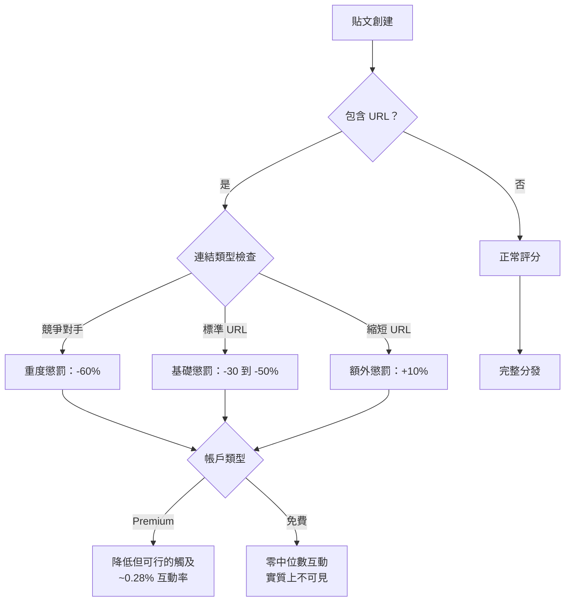
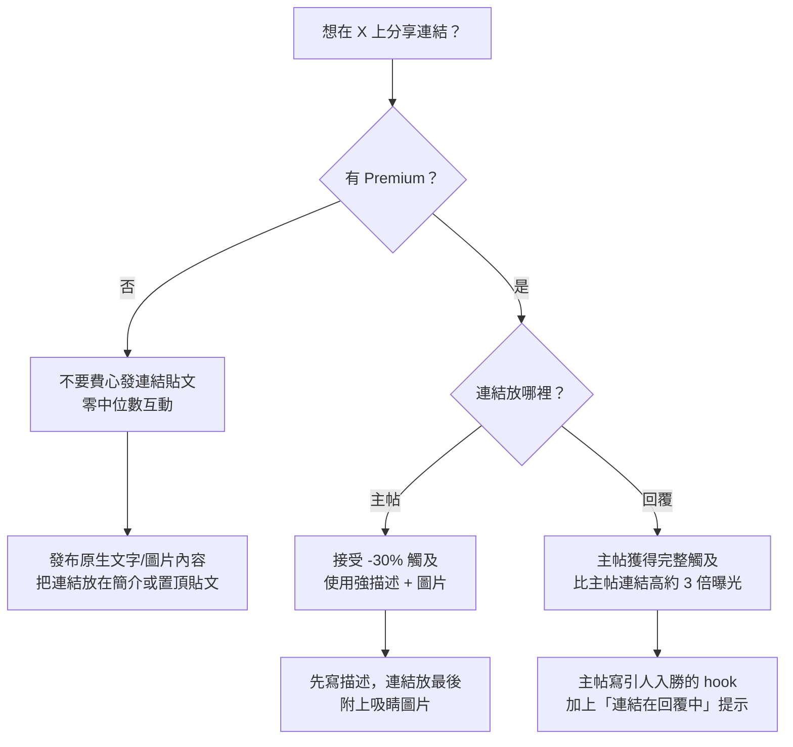

# X (Twitter) 外部連結懲罰：完整機制與數據深度分析

## What：三層懲罰體系

X（前 Twitter）實施了所有主流社交平台中最激進的外部連結壓制系統。從 2023 年到 2025 年 10 月，包含外部 URL 的貼文被通過三層機制系統性地埋沒：

1. **演算法降權** -- 推薦演算法中減少 30-50% 觸及率
2. **t.co 重定向節流** -- 競爭對手連結被人為延遲 65 倍（2,544ms vs 39ms）
3. **UI 壓制** -- 連結卡片標題/描述被移除，僅留一張圖片

2025 年 10 月，X 官方宣布「移除」了連結懲罰。但截至 2026 年 3 月，非 Premium 帳戶發布連結帖仍然收到**零中位數互動** -- 懲罰的結構性效果通過付費分級系統持續存在。

## Why：連結壓制背後的商業邏輯

### 核心矛盾

社交平台靠注意力變現。每次點擊外部連結都是用戶離開平台 -- 減少廣告曝光、停留時間和驅動收入的互動指標。

Musk 在 2023 年 10 月直接說明了這一點：

> "Our algorithm tries to optimize time spent on X, so links don't get as much attention, because there is less time spent if people click away."
>
> 「我們的演算法試圖最大化用戶在 X 上的停留時間，所以連結得不到那麼多關注，因為如果人們點擊離開，停留時間就會減少。」

### 三大戰略目標

| 目標 | 機制 | 結果 |
|------|------|------|
| 最大化停留時間 | 壓制外部連結 | 用戶留在平台內 |
| 驅動 Premium 收入 | 免費帳戶連結觸及為零 | 創作者被迫訂閱 |
| 削弱競爭對手 | 節流競爭平台連結 | Facebook/Bluesky/Substack 存取被降級 |

### 「懶人連結」的說辭

2024 年 11 月，Paul Graham（200 萬粉絲）公開抱怨「Twitter 最大的缺陷」是連結降權。Musk 回應：

> "Just write a description in the main post and put the link in the reply. This just stops lazy linking."
>
> 「在主帖中寫描述，把連結放在回覆裡。這只是阻止懶人連結。」

Graham 的反駁精準捕捉了這個荒謬：「如果我寫了一篇新文章然後發推連結，這就是『懶人連結』。但如果我發推說我寫了一篇新文章，然後把連結放在回覆裡，這就更好了？」

「lazy linking（懶人連結）」是 Musk 自創的術語 -- 不是標準的社交媒體用語。

## How：連結壓制的技術架構

### 第一層：演算法降權

**懲罰升級時間線（根據開源演算法數據）：**

| 時期 | 單連結懲罰 | 多連結 | 競爭對手連結 | 縮短 URL |
|------|-----------|--------|------------|---------|
| 2024 年 3 月 | -20 到 -30% | -40% | -60% | +0% 額外 |
| 2025 年 5 月（峰值）| -30 到 -50% | -70% | -60% | +10% 額外 |
| 2025 年 10 月（宣布移除）| 官方 0% | 官方 0% | 官方 0% | 官方 0% |
| 2026 年 3 月（實際）| Premium 為 0%，免費仍零互動 | 同樣模式 | 未知 | 未知 |

### 第二層：t.co 重定向節流

The Markup 的調查（2023 年 9 月）揭露 X 將其強制連結縮短器（t.co）武器化，人為延遲存取競爭對手平台。

**方法論：** 研究者測試了 20 個疑似被節流的域名，對照組為 59 個隨機網站（新聞媒體、非營利組織、Fortune 500 公司）。測試在四天內進行，跨越美國三個城市（紐約、底特律、洛杉磯）每小時測量。

| 指標 | 競爭對手連結 | 對照組 | Bit.ly（相同連結）|
|------|------------|--------|-----------------|
| 平均重定向時間 | 2,544 ms | 39 ms | 50 ms |
| 與對照組比率 | **慢 65 倍** | 1x（基線）| 1.3x |

**已確認被節流的域名：** Bluesky、Facebook、Instagram、Substack、Patreon、WhatsApp、Messenger。

延遲在所有時段和所有測試地理位置都保持一致，排除了基礎設施問題。Bit.ly 以約 50ms 重定向相同的競爭對手連結，證明延遲是 X 故意為之。

反壟斷研究員總結：「很明顯，這是一種旨在破壞 X 競爭對手、將用戶留在平台上的反競爭策略。」

### 第三層：UI 壓制（連結卡片剝離）

2023 年 10 月，X 在 iOS 和網頁版移除了連結預覽卡片的標題和描述。連結到文章的貼文僅顯示縮略圖，沒有標題、描述或來源歸屬。

**之前：** 完整的 Twitter Card，包含標題、描述、來源域名和圖片
**之後：** 一張裸圖，用戶必須盲目點擊，沒有任何關於目標頁面的上下文

這在 2023 年底部分恢復，Musk 宣布會在卡片圖片上疊加標題，但格式從未恢復到原來的豐富卡片展示。

## 證據：數據

### Buffer 研究（1,880 萬貼文、71,000 帳戶）

最全面的研究，由 Buffer 數據科學家 Julian Winternheimer 進行，分析了 71,000 個 X 帳戶的 1,880 萬貼文（2024 年 8 月 - 2025 年 8 月）。

**各內容類型和帳戶層級的互動率：**

| 內容類型 | 免費帳戶 | Premium 帳戶 |
|---------|---------|------------|
| 文字貼文 | ~0.40% | ~0.90% |
| 影片貼文 | ~0.25% | ~0.85% |
| 圖片貼文 | ~0.20% | ~0.42% |
| 連結貼文 | **0.00%** | ~0.28% |

文字貼文表現最佳：比影片高 +30%、比圖片高 +37%、比連結貼文高 +53%、比轉推高 +113%。

**付費差距：**

| 帳戶層級 | 中位數曝光/貼文 | 中位數互動率 |
|---------|---------------|------------|
| 免費 | <100 | 0.00%（自 2025 年 3 月起）|
| Premium Basic | 略高於免費 | ~0.55% |
| Premium | ~600 | ~0.49% |
| Premium+ | ~1,550 | ~0.53% |

Premium 帳戶獲得 **4 倍的站內內容可見度提升** 和 **2 倍的站外內容提升**。與免費帳戶相比，觸及倍率約為 **Premium 10 倍**、**Premium+ 15 倍**。

### Jesse Colombo A/B 測試

金融評論員 Jesse Colombo ([@TheBubbleBubble](https://x.com/TheBubbleBubble/status/1849818873018610090)) 進行了受控測試。從其他條件相同的貼文中移除外部連結，導致**觀看次數增加 1,700%**（65,400 次觀看、74 則留言、258 次轉推、873 次收藏、97 次書籤）。反過來說：包含連結導致曝光下降約 **94%**。

### 全平台互動下降

X 整體觸及率下降，從 2024 年 8 月的約 1,000 次中位數曝光降至 2025 年 8 月的不到 750 次。但下降對免費帳戶的打擊不成比例 -- 同期 Premium 互動率從 0.3% 上升到 0.4%，而普通帳戶從 0.15% 降至 0.0%。

## 2025 年 10 月的「移除」：實際發生了什麼

### 公告

2025 年 10 月 14 日，X 宣布移除對外部連結貼文的演算法懲罰。早期數據顯示了有希望的結果：

- 連結貼文觸及率增加約 8 倍
- 內容策展者的粉絲增長增加約 13 倍
- 點擊率顯著改善

### 新的應用內瀏覽器

X 產品負責人 Nikita Bier 宣布在 iOS 上測試新的「連結體驗」，旨在解決根本矛盾：

> "A common complaint is that posts with links tend to get lower reach. This is because the web browser covers the post and people forget to Like or Reply, so X doesn't get a clear signal whether the content is any good."
>
> 「常見的抱怨是帶連結的貼文觸及率較低。這是因為網頁瀏覽器覆蓋了貼文，人們忘記按讚或回覆，所以 X 無法得到內容好壞的清晰信號。」

解決方案：用戶瀏覽連結內容時，貼文會收合到頁面底部，讓他們在閱讀時仍能互動（按讚、回覆）。即使用戶消費外部內容，互動信號仍然持續流入。

Bier 明確聲稱：「帶連結的貼文並沒有被降權。」這與多年的文檔證據和 Musk 自己先前的承認相矛盾。

### 現實檢驗（2026 年 3 月）

儘管宣布了移除，Buffer 的持續數據顯示，截至 2026 年 3 月，非 Premium 帳戶發布連結貼文仍然收到**零中位數互動**。最可能的解釋：

1. 演算法懲罰被移除，但 **Premium 提升差距** 太大，免費帳戶無論如何都不可見
2. 演算法在懲罰期間學會了壓制重度連結帳戶，這些行為模式在 Grok 基於 transformer 的模型中持續存在
3. 懲罰移除僅適用於 Premium 帳戶

### 2026 年 1 月開源演算法

2026 年 1 月 20 日，X 開源了其 Grok 驅動的推薦演算法（GitHub: `xai-org/x-algorithm`）。新系統使用 transformer 架構從用戶行為中學習，移除了所有手動規則和手工特徵。

**公布的互動評分權重：**

| 信號 | 權重 |
|------|------|
| 獲得作者回覆的回覆 | 75x |
| 回覆 | 13.5x |
| 個人檔案點擊 + 互動 | 12x |
| 連結點擊 | 11x |
| 停留時間（2+ 分鐘）| 10x |
| 書籤 | 10x |
| 轉推 | 1x |
| 按讚 | 0.5x（基線）|

值得注意的是，**連結點擊帶有 11 倍權重** -- 表明 X 現在重視連結互動而非懲罰它。但評分公式只有在貼文首先被分發的情況下才有意義，而這仍然受帳戶層級限制。

## Tradeoffs：X 犧牲了什麼

### X 的代價

| X 失去了什麼 | 證據 |
|-------------|------|
| 記者出走 | 主要媒體減少或放棄 X 平台 |
| 新聞可信度 | 沒有連結分享的文章，假資訊填補了真空 |
| 創作者信任 | 「雙層系統」的觀感損害了平台忠誠度 |
| 流量引薦價值 | 出版商不再將 X 視為分發渠道 |
| 反壟斷風險 | The Markup 的節流證據可能支持監管行動 |

### X 獲得了什麼

| X 得到了什麼 | 證據 |
|-------------|------|
| 更長的會話 | 用戶無法輕易點擊離開 |
| Premium 收入 | 創作者被迫訂閱以獲得連結可見度 |
| 原生內容 | X Articles 和長文貼文作為替代方案成長 |
| 平台鎖定 | 內容留在 X 而非連結外出 |

### 根本矛盾

X 想成為資訊分享的「公共廣場」，但其演算法懲罰了網路上資訊分享的主要機制：連結。這創造了一個為熱門短評和互動釣魚優化的平台，而非實質性的有來源內容。

## Alternatives：其他平台怎麼做

| 平台 | 外部連結政策 | 連結貼文觸及率 |
|------|------------|--------------|
| X（免費）| 嚴重壓制 | 0% 中位數互動 |
| X（Premium）| 輕度壓制 | ~0.28% 互動率 |
| LinkedIn | 輕微懲罰（~15%）| 流量仍然可行 |
| Bluesky | 無懲罰 | 完整分發 |
| Threads | 無明確懲罰 | 演算法偏好原生內容 |
| Mastodon | 無演算法 | 時間序，無懲罰 |
| Reddit | 連結是一等公民 | 完整分發 |

X 是唯一一個免費帳戶連結貼文互動為**零**的主流平台。LinkedIn 施加輕微懲罰，但連結對所有用戶仍然有效。

## Steal：X 上的可執行內容策略

### 如果你必須在 X 上分發連結

### 變通方法排名（按效果排序）

| 策略 | 觸及影響 | 最適用場景 |
|------|---------|----------|
| 1. 連結放在第一則回覆 | 比主帖連結高約 3 倍 | 部落格文章、產品頁面 |
| 2. X Articles（原生長文）| 無懲罰（原生內容）| 深度分析、電子報 |
| 3. 強描述 + 圖片（僅限 Premium）| -30% 但可行 | 新聞、產品發布 |
| 4. 引用推文連結帖 | 原帖受罰，引用推文獲新觸及 | 策展內容 |
| 5. 置頂帶連結貼文 | 不影響動態牆，個人檔案訪客可見 | 落地頁、作品集 |
| 6. 連結放簡介 | 零懲罰 | 最重要的單一連結 |

### 絕對不要做的事

| 反模式 | 為什麼失敗 |
|--------|----------|
| URL 縮短器（bit.ly 等）| 在基礎懲罰上額外 +10% |
| 一則貼文多個連結 | -70% 觸及率（峰值懲罰）|
| 無描述的裸連結 | Musk：對沒有上下文的連結「弱分發」|
| 競爭平台連結 | -60% 觸及率（Facebook、Instagram 等）|
| 免費帳戶的純連結帖 | 自 2025 年 3 月起確確實實零互動 |

### 元策略

2026 年在 X 上最有效的方法：

1. **訂閱 Premium** -- 10 倍觸及倍率使其成為 X 平台存在感的最高 ROI 投資
2. **以原生內容為先** -- 直接在貼文中寫洞見，讓連結成為補充
3. **連結放回覆中** -- 培養受眾去回覆中查看來源的習慣
4. **使用 X Articles 寫長文** -- 內容留在平台內，零連結懲罰
5. **接受 X 不是流量導引器** -- 將 X 視為受眾建設渠道，而非點擊漏斗

開源演算法顯示，**獲得作者回覆的回覆價值相當於按讚的 150 倍**。這意味著最強大的策略是創造對話，而非分發連結。在平台內建立互動迴路，把連結分享留在回覆串中，讓感興趣的用戶自行發現。

## References

- [Buffer: Do Posts with Links Affect Content Performance on X?](https://buffer.com/resources/links-on-x/) -- 1,880 萬貼文的連結懲罰影響分析
- [Buffer: Does X Premium Really Boost Your Reach?](https://buffer.com/resources/x-premium-review/) -- Premium vs 免費帳戶觸及比較（1,880 萬貼文、71,000 帳戶）
- [The Markup: Twitter Is Still Throttling Competitors' Links](https://themarkup.org/investigations/2023/09/15/twitter-is-still-throttling-competitors-links-check-for-yourself) -- t.co 重定向節流調查
- [The Markup: Twitter Is Throttling Patreon Links](https://themarkup.org/news/2023/10/16/twitter-is-throttling-patreon-links-creators-say-it-undermines-their-livelihood) -- 節流擴展至 Patreon
- [Jesse Colombo: X is Severely Punishing Posts With Links](https://x.com/TheBubbleBubble/status/1849818873018610090) -- A/B 測試顯示無連結觀看增加 1,700%
- [BusinessToday: Musk confirms X deprioritises posts with links](https://www.businesstoday.in/technology/news/story/elon-musk-confirms-that-x-deprioritises-posts-with-links-to-discourage-lazy-linking-455115-2024-11-26) -- Musk「懶人連結」承認
- [Nieman Lab: X makes overtures to journalists with new link feature](https://www.niemanlab.org/2025/10/x-makes-overtures-to-journalists-with-new-feature-designed-to-improve-reach-for-links/) -- 2025 年 10 月懲罰移除和應用內瀏覽器
- [Nikita Bier: New link experience announcement](https://x.com/nikitabier/status/1979994223224209709) -- iOS 應用內瀏覽器測試
- [TechCrunch: X open sources its algorithm](https://techcrunch.com/2026/01/20/x-open-sources-its-algorithm-while-facing-a-transparency-fine-and-grok-controversies/) -- 2026 年 1 月 Grok 驅動演算法開源
- [GitHub: xai-org/x-algorithm](https://github.com/xai-org/x-algorithm) -- 開源推薦演算法代碼
- [Slate: How the plan to throttle links on X is dumber than you think](https://slate.com/technology/2024/11/elon-musk-x-twitter-throttle-links-internet.html) -- Musk 連結節流理由分析
- [TechCrunch: X cuts headlines from link previews](https://techcrunch.com/2023/10/05/x-cuts-headlines-from-link-previews-as-musk-wants-users-posting-directly-on-the-platform/) -- 連結卡片標題移除
- [Success On X: Algorithm Changes Timeline (2024-2026)](https://www.successonx.com/algorithm-changes) -- 完整懲罰升級時間線
- [HashMeta: Major Twitter Algorithm Changes in 2025](https://hashmeta.com/insights/twitter-algorithm-changes-2025) -- 懲罰結構和變通策略
- [Tomorrow's Publisher: X softens stance on external links](https://tomorrowspublisher.today/content-creation/x-softens-stance-on-external-links/) -- 2025 年 10 月政策逆轉分析
- [PostEverywhere: How the X Algorithm Works in 2026](https://posteverywhere.ai/blog/how-the-x-twitter-algorithm-works) -- 2026 演算法互動權重
